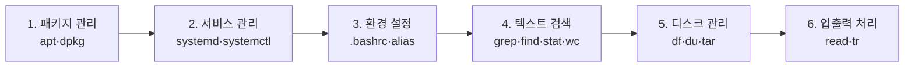
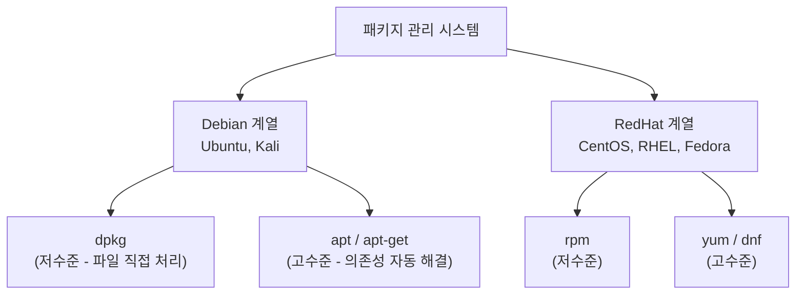
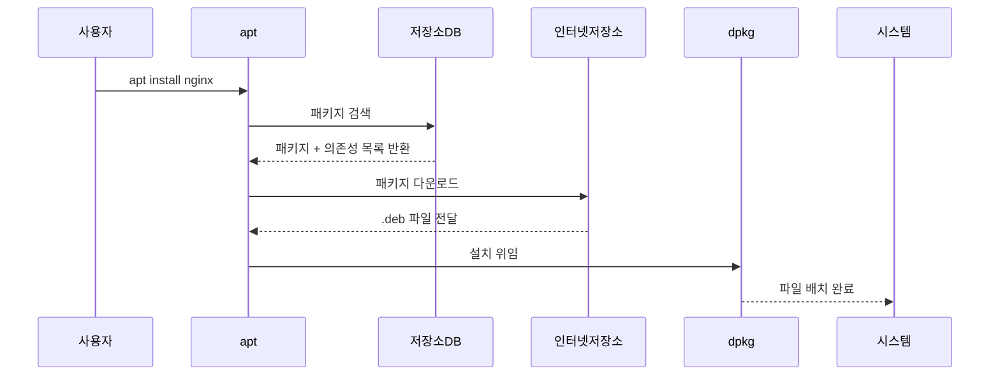
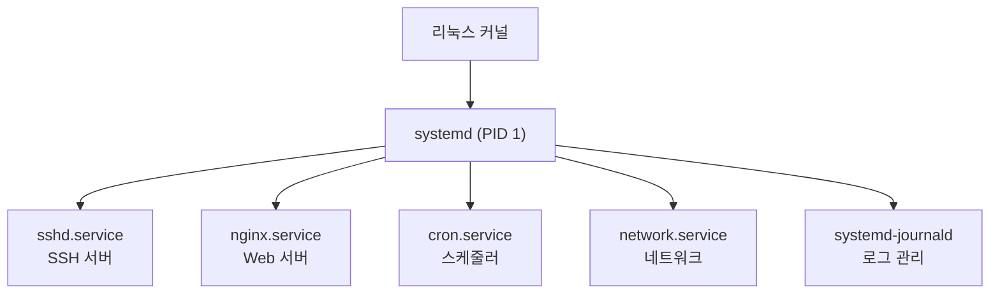
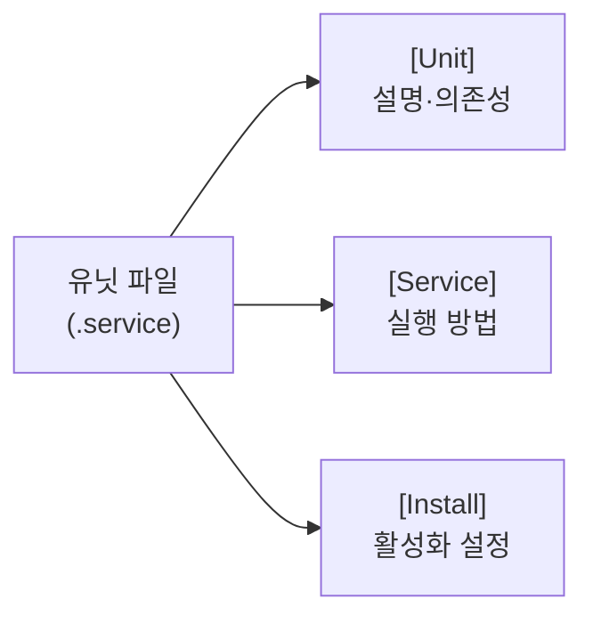
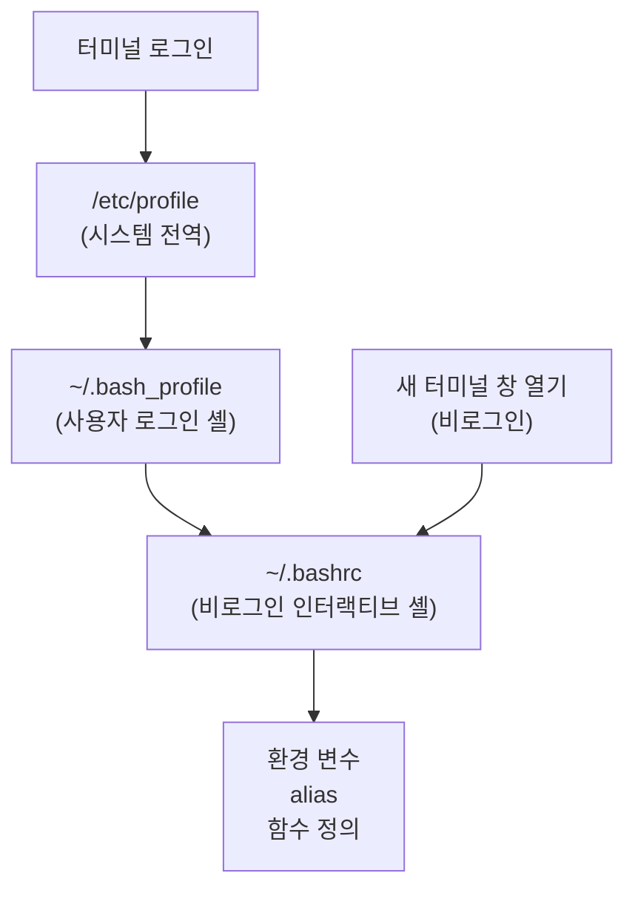
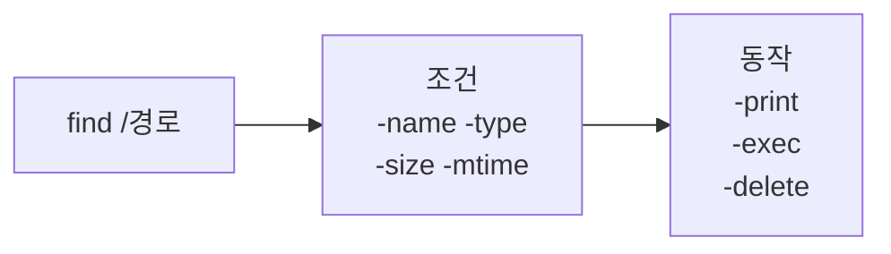
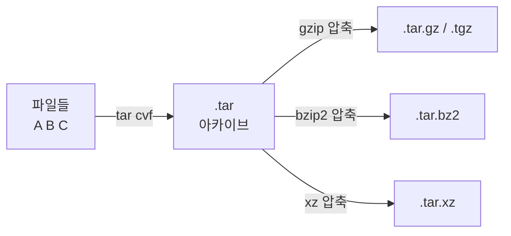
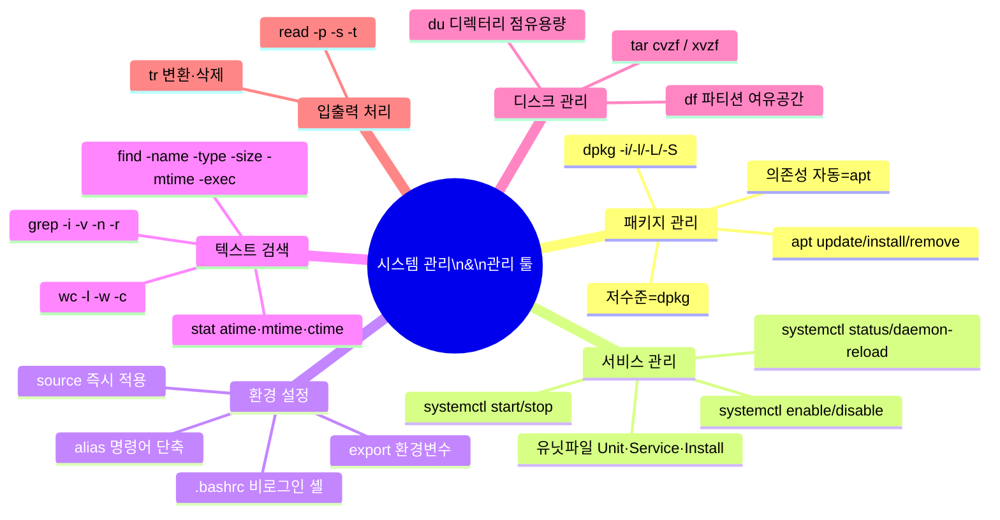

## 강의 개요

리눅스 시스템을 **실제로 운영**하려면 두 가지 능력이 필요함. 첫째는 시스템 자체를 관리하는 능력(패키지 설치·서비스 관리·환경 설정), 둘째는 데이터를 다루는 도구들을 능숙하게 사용하는 능력임. 이번 주차는 그 두 영역을 함께 다룸.



---

# 1. 패키지 관리

---

## 1.1 패키지(Package)란

**패키지(Package)**는 소프트웨어를 설치·제거·업데이트하기 편하도록 묶어 놓은 파일 묶음임. 실행 파일, 설정 파일, 문서, 의존성 정보가 하나의 패키지 안에 포함됨.

**패키지 관리 시스템(PMS, Package Management System)**은 패키지를 체계적으로 관리하는 도구 모음임. 의존성(다른 패키지가 필요한 관계) 해결을 자동으로 처리해 줌.



> 시험에서 Ubuntu/Kali 기반이면 `apt`, CentOS/RHEL 기반이면 `yum` 또는 `dnf`를 떠올리면 됨.
{: .prompt-tip }

---

## 1.2 apt (Advanced Package Tool)

**apt(Advanced Package Tool)**는 Debian 계열 리눅스에서 패키지를 관리하는 고수준 도구임. 내부적으로 `dpkg`를 사용하지만, **인터넷의 저장소(Repository)에서 패키지를 검색·다운로드·의존성 자동 해결**까지 처리함.

apt는 `/etc/apt/sources.list`와 `/etc/apt/sources.list.d/` 디렉터리에 저장된 저장소 목록을 참조해서 패키지를 찾음.



**주요 apt 명령어:**

| 명령어 | 설명 |
|---|---|
| `apt update` | 저장소 패키지 목록 갱신 (설치 아님) |
| `apt upgrade` | 설치된 패키지 전체 업그레이드 |
| `apt install <패키지>` | 패키지 설치 |
| `apt remove <패키지>` | 패키지 제거 (설정 파일 유지) |
| `apt purge <패키지>` | 패키지 + 설정 파일 완전 제거 |
| `apt autoremove` | 불필요한 의존성 패키지 자동 제거 |
| `apt search <키워드>` | 패키지 검색 |
| `apt show <패키지>` | 패키지 상세 정보 확인 |
| `apt list --installed` | 설치된 패키지 목록 확인 |

```bash
# 패키지 목록 갱신 후 nginx 설치
sudo apt update
sudo apt install nginx

# 패키지 제거 (설정 파일 포함)
sudo apt purge nginx

# 사용하지 않는 패키지 정리
sudo apt autoremove

# 패키지 정보 확인
apt show nginx
```

> `apt update`는 실제 업그레이드가 아님. 저장소에서 최신 패키지 목록을 가져오는 것임. 반드시 `install`이나 `upgrade` 전에 먼저 실행해야 함.
{: .prompt-warning }

---

## 1.3 dpkg — 저수준 패키지 관리

`dpkg`는 `.deb` 파일을 직접 설치·제거하는 저수준 도구임. **의존성 자동 해결 기능이 없어** 의존 패키지가 없으면 오류가 발생함.

```bash
dpkg -i package.deb      # .deb 파일 직접 설치
dpkg -r package          # 패키지 제거 (설정 파일 유지)
dpkg -P package          # 패키지 + 설정 파일 완전 제거 (purge)
dpkg -l                  # 설치된 패키지 목록
dpkg -l | grep nginx     # 특정 패키지 설치 여부 확인
dpkg -L nginx            # 패키지가 설치한 파일 목록
dpkg -S /usr/bin/ls      # 특정 파일이 어느 패키지에서 왔는지 확인
```

| 구분 | apt | dpkg |
|---|---|---|
| 의존성 | 자동 해결 | 수동 처리 필요 |
| 패키지 출처 | 인터넷 저장소 | 로컬 .deb 파일 |
| 사용 시점 | 일반적인 설치/제거 | 특수 상황 (오프라인 설치 등) |

---

# 2. systemd 서비스 관리

---

## 2.1 데몬(Daemon)과 systemd

**데몬(Daemon)**은 백그라운드에서 지속적으로 실행되며 시스템 서비스를 제공하는 프로세스임. 이름이 `d`로 끝나는 경우가 많음 (sshd, httpd, crond 등).

**systemd**는 리눅스 부팅 후 가장 먼저 실행되는 PID 1 프로세스이자, 모든 서비스·마운트·소켓을 통합 관리하는 시스템 관리자임. Ubuntu 15.04+, RHEL 7+ 이후 표준으로 채택됨.



**유닛 파일(Unit File)**은 systemd가 서비스를 어떻게 실행할지 정의하는 설정 파일임.

| 유닛 파일 위치 | 설명 |
|---|---|
| `/usr/lib/systemd/system/` | 패키지가 설치한 기본 유닛 파일 (수정 금지) |
| `/etc/systemd/system/` | 관리자가 직접 만들거나 수정한 유닛 파일 (우선순위 높음) |

---

## 2.2 systemctl 명령어

`systemctl`은 systemd를 제어하는 핵심 명령어임. 서비스의 시작·중지·활성화·상태 확인 등 모든 제어를 담당함.

```bash
# 서비스 상태 확인
systemctl status nginx

# 서비스 시작 / 중지 / 재시작
systemctl start nginx
systemctl stop nginx
systemctl restart nginx

# 서비스 재로드 (설정 파일만 다시 읽기, 프로세스 유지)
systemctl reload nginx

# 부팅 시 자동 시작 활성화 / 비활성화
systemctl enable nginx
systemctl disable nginx

# 유닛 파일 내용 확인
systemctl cat nginx

# 전체 유닛 목록 확인
systemctl list-units

# 실행 중인 서비스만 확인
systemctl list-units --type=service --state=running

# systemd 설정 재로드 (유닛 파일 수정 후 반드시 실행)
systemctl daemon-reload
```

> `restart`는 프로세스를 완전히 종료 후 재시작함. `reload`는 프로세스를 유지한 채 설정 파일만 다시 읽음. nginx처럼 reload를 지원하는 서비스는 reload가 무중단 배포에 유리함.
{: .prompt-info }

---

## 2.3 유닛 파일(Unit File) 구조

유닛 파일은 크게 `[Unit]`, `[Service]`, `[Install]` 세 섹션으로 구성됨.



**[Unit] 섹션 — 서비스 설명 및 의존성:**

| 옵션 | 설명 |
|---|---|
| `Description=` | 서비스 설명 |
| `After=` | 이 서비스 이후에 시작할 유닛 지정 (순서만 정의) |
| `Requires=` | 반드시 필요한 유닛 (없으면 이 서비스도 실패) |
| `Wants=` | 선호하는 유닛 (없어도 이 서비스는 시작) |

**[Service] 섹션 — 실행 방식:**

| 옵션 | 설명 |
|---|---|
| `Type=` | 서비스 타입 (simple, forking, oneshot 등) |
| `ExecStart=` | 서비스 시작 명령어 |
| `ExecStop=` | 서비스 중지 명령어 |
| `ExecReload=` | reload 명령어 |
| `Restart=` | 재시작 정책 (on-failure, always 등) |
| `User=` | 실행할 사용자 |
| `Environment=` | 환경 변수 설정 |

**[Install] 섹션 — 활성화 설정:**

| 옵션 | 설명 |
|---|---|
| `WantedBy=` | `enable` 시 어느 타겟에 링크할지 (보통 `multi-user.target`) |
| `Alias=` | 서비스의 별칭 |
| `Also=` | 함께 활성화할 유닛 |

```ini
# /etc/systemd/system/myapp.service 예시
[Unit]
Description=My Application Service
After=network.target

[Service]
Type=simple
User=myuser
ExecStart=/usr/bin/myapp --config /etc/myapp/config.yaml
Restart=on-failure
RestartSec=5

[Install]
WantedBy=multi-user.target
```

> 유닛 파일을 새로 만들거나 수정한 후에는 반드시 `systemctl daemon-reload`를 실행해야 systemd가 변경 사항을 인식함.
{: .prompt-danger }

---

## 2.4 서비스 타입(Type)

`[Service]` 섹션의 `Type=` 옵션은 프로세스가 어떻게 시작되는지를 정의함.

| Type | 설명 | 예시 |
|---|---|---|
| `simple` | ExecStart 프로세스 자체가 메인 프로세스 (기본값) | 단순 데몬 |
| `forking` | ExecStart가 fork()해서 부모는 종료, 자식이 메인으로 동작 | httpd, nginx |
| `oneshot` | 짧게 실행하고 종료하는 스크립트 | 초기화 스크립트 |
| `notify` | 준비 완료 시 systemd에 알림을 보내는 방식 | 고급 데몬 |

---

## 2.5 preset — 기본 활성화 상태

**preset**은 패키지 설치 시 서비스의 기본 활성화 상태를 정의하는 systemd 정책임. 배포판마다 preset 정책이 달라서, 일부는 설치 시 자동으로 enable 되고 일부는 수동으로 enable 해야 함.

```bash
# 배포판의 preset 정책 확인
systemctl get-default
systemctl list-unit-files --type=service | grep enabled
```

---

# 3. .bashrc와 환경 설정

---

## 3.1 .bashrc란

**`.bashrc`**는 Bash 셸이 **비로그인 인터랙티브 셸**로 시작할 때마다 자동으로 실행되는 사용자 설정 파일임. 홈 디렉터리(`~`)에 위치하며, 환경 변수·alias·함수 등을 정의함.



| 파일 | 실행 시점 | 역할 |
|---|---|---|
| `/etc/profile` | 모든 사용자, 로그인 셸 | 시스템 전역 환경 변수 |
| `~/.bash_profile` | 해당 사용자, 로그인 셸 | 사용자별 로그인 설정 |
| `~/.bashrc` | 해당 사용자, 비로그인 인터랙티브 셸 | 사용자별 셸 환경 설정 |
| `~/.bash_logout` | 로그아웃 시 | 로그아웃 처리 스크립트 |

```bash
# .bashrc 수정 후 현재 셸에 바로 적용
source ~/.bashrc
# 또는
. ~/.bashrc
```

> `.bashrc`를 수정해도 현재 열린 셸에는 자동으로 적용되지 않음. `source` 명령으로 강제 재로드해야 함.
{: .prompt-warning }

---

## 3.2 환경 변수 설정

`.bashrc`에 환경 변수를 정의하면 해당 사용자의 모든 셸 세션에서 사용 가능함.

```bash
# ~/.bashrc에 추가하는 예시

# 환경 변수 설정
export JAVA_HOME=/usr/lib/jvm/java-17-openjdk-amd64
export PATH=$PATH:$JAVA_HOME/bin

# 프롬프트 색상 변경 (PS1)
export PS1="\[\033[01;32m\]\u@\h\[\033[00m\]:\[\033[01;34m\]\w\[\033[00m\]\$ "
```

**주요 환경 변수:**

| 변수 | 의미 |
|---|---|
| `$PATH` | 명령어 탐색 경로 목록 (`:` 으로 구분) |
| `$HOME` | 현재 사용자의 홈 디렉터리 |
| `$USER` | 현재 로그인한 사용자명 |
| `$SHELL` | 로그인 셸 경로 |
| `$PS1` | 셸 프롬프트 문자열 |
| `$LANG` | 시스템 언어 설정 |

---

## 3.3 alias — 명령어 단축키

**alias**는 긴 명령어나 자주 쓰는 명령어에 짧은 이름을 붙이는 기능임.

```bash
# alias 정의 (임시 — 현재 셸에서만 유효)
alias ll='ls -alF'
alias la='ls -A'
alias grep='grep --color=auto'
alias ..='cd ..'
alias ...='cd ../..'

# alias 확인
alias
alias ll

# alias 해제
unalias ll

# alias를 우회하여 원래 명령어 실행
\ls        # \ 를 앞에 붙임
command ls # command 를 앞에 붙임
```

> alias를 영구적으로 적용하려면 `~/.bashrc`에 정의해야 함. 터미널에서 임시로 정의하면 셸을 닫을 때 사라짐.
{: .prompt-info }

---

# 4. grep — 텍스트 검색

---

## 4.1 grep 개요

**grep(Global Regular Expression Print)**은 파일이나 표준 입력에서 **패턴에 일치하는 줄을 검색**해 출력하는 명령어임. 리눅스에서 가장 많이 사용하는 필터 명령어 중 하나임.

```bash
grep [옵션] <패턴> <파일>
```

**주요 옵션:**

| 옵션 | 설명 |
|---|---|
| `-i` | 대소문자 무시 (case-Insensitive) |
| `-v` | 패턴에 **불일치**하는 줄 출력 (inVert) |
| `-n` | 줄 번호 함께 출력 (Number) |
| `-c` | 일치하는 줄 수만 출력 (Count) |
| `-l` | 일치하는 파일 이름만 출력 (List) |
| `-r` | 디렉터리 재귀 검색 (Recursive) |
| `-E` | 확장 정규식 사용 (`egrep`과 동일) |
| `-o` | 일치하는 부분만 출력 |
| `-A n` | 일치 줄 이후 n줄 추가 출력 (After) |
| `-B n` | 일치 줄 이전 n줄 추가 출력 (Before) |

```bash
# 기본 사용
grep "root" /etc/passwd

# 대소문자 무시
grep -i "ROOT" /etc/passwd

# 줄 번호 포함
grep -n "bash" /etc/passwd

# 역방향 (일치하지 않는 줄)
grep -v "nologin" /etc/passwd

# 재귀 검색 (디렉터리 전체)
grep -r "error" /var/log/

# 파이프와 함께 사용
ps aux | grep nginx
cat /etc/passwd | grep -c bash

# 확장 정규식 (| 로 OR 검색)
grep -E "bash|sh" /etc/passwd
```

> `grep`은 파이프(`|`)와 조합해서 다른 명령어의 출력을 필터링할 때 매우 강력함. `ps aux | grep <프로세스명>` 패턴을 반드시 익혀야 함.
{: .prompt-tip }

---

# 5. find — 파일 탐색

---

## 5.1 find 개요

**find**는 지정한 디렉터리 아래에서 **다양한 조건으로 파일을 탐색**하는 명령어임. 파일명, 크기, 수정 시간, 권한, 타입 등 다양한 조건을 조합할 수 있음.

```bash
find <탐색경로> [조건] [동작]
```

**주요 조건 옵션:**

| 옵션 | 설명 | 예시 |
|---|---|---|
| `-name <패턴>` | 파일 이름으로 검색 (대소문자 구분) | `-name "*.sh"` |
| `-iname <패턴>` | 파일 이름으로 검색 (대소문자 무시) | `-iname "*.txt"` |
| `-type <타입>` | 파일 타입 (`f`=파일, `d`=디렉터리, `l`=심볼릭링크) | `-type f` |
| `-size <크기>` | 파일 크기 (k, M, G 단위, +는 초과, -는 미만) | `-size +10M` |
| `-mtime <n>` | 수정 시간 기준 (n일 전, +n은 n일 이상 전) | `-mtime -7` |
| `-user <사용자>` | 소유자 기준 | `-user root` |
| `-perm <권한>` | 권한 기준 | `-perm 644` |
| `-empty` | 빈 파일 또는 빈 디렉터리 | `-empty` |

**동작 옵션:**

| 옵션 | 설명 |
|---|---|
| `-print` | 결과 출력 (기본 동작) |
| `-delete` | 찾은 파일 삭제 |
| `-exec <명령> {} \;` | 찾은 파일에 명령어 실행 (`{}`는 파일 경로 자리) |

```bash
# 현재 디렉터리 이하에서 .sh 파일 찾기
find . -name "*.sh"

# /home 아래 일반 파일만 (심볼릭링크 제외)
find /home -type f

# 10MB 이상 파일 찾기
find /var -size +10M

# 7일 이내에 수정된 파일
find /etc -mtime -7

# root 소유 SUID 파일 찾기 (보안 점검)
find / -user root -perm -4000 2>/dev/null

# 찾은 파일에 명령 실행 (-exec 활용)
find /tmp -name "*.tmp" -exec rm {} \;

# 빈 파일 모두 삭제
find . -type f -empty -delete
```



---

# 6. stat — 파일 상세 정보

---

## 6.1 stat 개요

**stat**은 파일이나 디렉터리의 **상세 메타데이터(inode 정보)**를 출력하는 명령어임. `ls -l`보다 훨씬 자세한 정보를 보여줌.

```bash
stat [파일명]
```

```bash
stat /etc/passwd
```

**출력 항목 설명:**

| 항목 | 설명 |
|---|---|
| File | 파일 이름 |
| Size | 파일 크기 (바이트) |
| Blocks | 디스크 블록 수 |
| Inode | inode 번호 |
| Links | 하드링크 개수 |
| Access (atime) | 마지막 접근 시각 |
| Modify (mtime) | 마지막 내용 수정 시각 |
| Change (ctime) | 마지막 메타데이터(권한 등) 변경 시각 |

> `mtime`(수정 시각)과 `ctime`(변경 시각)의 차이를 기억해야 함. 파일 내용을 수정하면 mtime+ctime 모두 갱신되지만, 권한만 바꾸면 ctime만 갱신됨.
{: .prompt-warning }

---

# 7. wc — 단어/줄 수 계산

---

## 7.1 wc 개요

**wc(Word Count)**는 파일 또는 표준 입력의 **줄 수, 단어 수, 바이트 수**를 계산하는 명령어임.

```bash
wc [옵션] <파일>
```

| 옵션 | 설명 |
|---|---|
| `-l` | 줄 수(Line) |
| `-w` | 단어 수(Word) |
| `-c` | 바이트 수(Character/byte) |
| `-m` | 문자 수 (멀티바이트 포함) |

```bash
# 기본 (줄/단어/바이트 순)
wc /etc/passwd

# 줄 수만
wc -l /etc/passwd

# 파이프와 조합 — 프로세스 개수 세기
ps aux | wc -l

# 파일 개수 세기
ls /etc | wc -l
```

---

# 8. df — 디스크 여유 공간

---

## 8.1 df 개요

**df(Disk Free)**는 파일 시스템별로 **마운트된 디스크의 전체/사용/여유 공간**을 확인하는 명령어임.

```bash
df [옵션]
```

| 옵션 | 설명 |
|---|---|
| `-h` | Human-readable (KB/MB/GB 단위) |
| `-H` | 1000 기준으로 단위 표시 |
| `-T` | 파일 시스템 타입 함께 출력 |
| `-i` | inode 사용량 확인 |

```bash
# 전체 디스크 사용량 (읽기 쉬운 단위)
df -h

# 파일 시스템 타입 포함
df -hT

# inode 사용량 확인
df -i

# 특정 경로의 파일 시스템만
df -h /home
```

---

# 9. du — 디렉터리 용량

---

## 9.1 du 개요

**du(Disk Usage)**는 지정한 디렉터리 또는 파일이 **실제로 차지하는 디스크 용량**을 측정하는 명령어임. `df`가 파티션 단위라면 `du`는 디렉터리/파일 단위임.

```bash
du [옵션] <경로>
```

| 옵션 | 설명 |
|---|---|
| `-h` | Human-readable 단위 |
| `-s` | 요약(Summary) — 하위 디렉터리 합산한 총합만 출력 |
| `-a` | 파일도 개별로 출력 |
| `--max-depth=n` | 탐색 깊이 제한 |
| `-c` | 합계(total) 줄 추가 |

```bash
# 현재 디렉터리 용량
du -sh .

# 홈 디렉터리 용량 확인
du -sh ~

# 1단계 깊이로 하위 디렉터리별 용량
du -h --max-depth=1 /var

# 용량 큰 순서로 정렬
du -sh /var/* | sort -rh | head -10
```


> `df`는 파티션 전체 상황, `du`는 어떤 디렉터리가 공간을 많이 쓰는지 파악할 때 사용함. 디스크 풀(full) 상황에서 `du -sh /* | sort -rh`로 범인을 찾는 게 일반적인 접근임.
{: .prompt-tip }

---

# 10. tar — 파일 묶기·압축

---

## 10.1 tar 개요

**tar(Tape Archive)**는 여러 파일을 **하나의 아카이브(archive) 파일로 묶거나**, 압축 도구와 결합해 묶기+압축을 동시에 수행하는 명령어임.

- **아카이브(archive)**: 여러 파일을 하나로 묶은 것 (압축과 별개 개념)
- **압축(compress)**: 데이터 크기를 줄이는 것



**tar 주요 옵션:**

| 옵션 | 설명 |
|---|---|
| `c` | 아카이브 생성 (Create) |
| `x` | 아카이브 압축 해제 (eXtract) |
| `v` | 처리 과정 출력 (Verbose) |
| `f` | 파일 이름 지정 (File) — 반드시 마지막에 |
| `z` | gzip 압축/해제 |
| `j` | bzip2 압축/해제 |
| `J` | xz 압축/해제 |
| `t` | 아카이브 내용 목록 확인 (lisT) |
| `C` | 압축 해제 경로 지정 |

```bash
# 묶기 (압축 없음)
tar cvf archive.tar dir/

# 묶기 + gzip 압축
tar cvzf archive.tar.gz dir/

# 묶기 + bzip2 압축
tar cvjf archive.tar.bz2 dir/

# 압축 해제
tar xvf archive.tar
tar xvzf archive.tar.gz
tar xvjf archive.tar.bz2

# 내용 확인 (압축 해제 없이)
tar tvf archive.tar.gz

# 특정 디렉터리에 압축 해제
tar xvzf archive.tar.gz -C /tmp/
```

> tar 옵션에서 `-f`는 반드시 파일 이름 바로 앞에 와야 함. `tar cvzf backup.tar.gz` 처럼 `f`가 마지막 옵션이어야 함. `tar cvfz`로 쓰면 `z`가 파일 이름으로 인식되어 오류 발생.
{: .prompt-danger }

---

# 11. read — 사용자 입력 읽기

---

## 11.1 read 개요

**read**는 Bash 내장 명령어(built-in command)로, **표준 입력(stdin)에서 한 줄을 읽어 변수에 저장**하는 명령어임. 쉘 스크립트에서 사용자 입력을 받을 때 주로 사용함.

```bash
read [옵션] <변수명>
```

| 옵션 | 설명 |
|---|---|
| `-p <메시지>` | 입력 전 메시지 출력 (Prompt) |
| `-s` | 입력 내용 화면에 표시 안 함 (Silent, 패스워드 입력) |
| `-t <초>` | 입력 대기 시간 제한 (Timeout) |
| `-n <n>` | n글자만 읽고 바로 종료 |
| `-a <배열>` | 공백으로 구분하여 배열에 저장 |

```bash
# 기본 입력
read name
echo "입력한 값: $name"

# 프롬프트와 함께
read -p "이름을 입력하세요: " name
echo "안녕하세요, $name!"

# 비밀번호 입력 (화면 숨김)
read -s -p "패스워드: " pass
echo ""
echo "입력 완료"

# 타임아웃 설정
read -t 5 -p "5초 내 입력: " input
```

---

# 12. tr — 문자 변환/삭제

---

## 12.1 tr 개요

**tr(translate)**는 표준 입력에서 **특정 문자를 다른 문자로 변환하거나 삭제**하는 명령어임. 파일을 직접 처리하지 않고 **파이프와 리다이렉션**과 함께 사용함.

```bash
tr [옵션] <SET1> [SET2]
```

- `SET1`의 각 문자를 `SET2`의 대응하는 문자로 변환함
- `SET2`가 없으면 `SET1`에 해당하는 문자를 삭제(`-d` 옵션과 함께)

| 옵션 | 설명 |
|---|---|
| `-d` | SET1에 해당하는 문자 삭제 (Delete) |
| `-s` | 연속된 동일 문자를 하나로 압축 (Squeeze) |
| `-c` | SET1의 **보수(Complement)** — SET1에 없는 문자에 적용 |

```bash
# 소문자를 대문자로 변환
echo "hello world" | tr 'a-z' 'A-Z'
# 출력: HELLO WORLD

# 대문자를 소문자로
echo "HELLO" | tr 'A-Z' 'a-z'

# 특정 문자 삭제
echo "hello 123 world" | tr -d '0-9'
# 출력: hello  world

# 공백을 밑줄로 변환
echo "hello world" | tr ' ' '_'
# 출력: hello_world

# 파일에서 줄바꿈(\n) 제거 (한 줄로 합치기)
cat file.txt | tr -d '\n'

# 연속된 공백을 하나로 압축
echo "hello    world" | tr -s ' '
# 출력: hello world
```


> `tr`은 파일을 직접 인자로 받지 않음. 반드시 파이프(`|`) 또는 입력 리다이렉션(`<`)으로 데이터를 넘겨야 함.
{: .prompt-warning }

---

# 핵심 요약



| 구분 | 명령어 | 핵심 포인트 |
|---|---|---|
| 패키지 | `apt`, `dpkg` | apt=의존성 자동, dpkg=저수준 |
| 서비스 | `systemctl` | enable=부팅자동, daemon-reload=수정후 |
| 환경 | `.bashrc`, `alias` | source로 즉시 적용 |
| 검색 | `grep`, `find` | grep=내용검색, find=파일검색 |
| 디스크 | `df`, `du`, `tar` | df=파티션, du=디렉터리, tar f 마지막 |
| 입출력 | `read`, `tr` | read=stdin입력, tr=문자변환 |

> 다음 파일(6-2)에서 이 내용을 직접 실습하면서 확인함.
{: .prompt-info }
