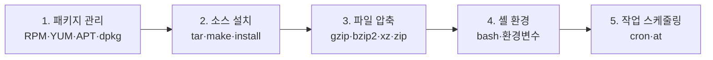
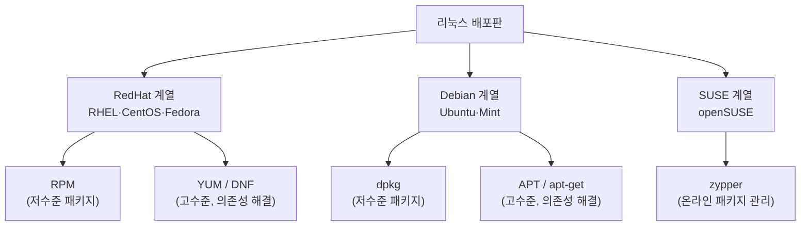
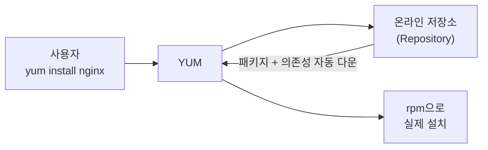
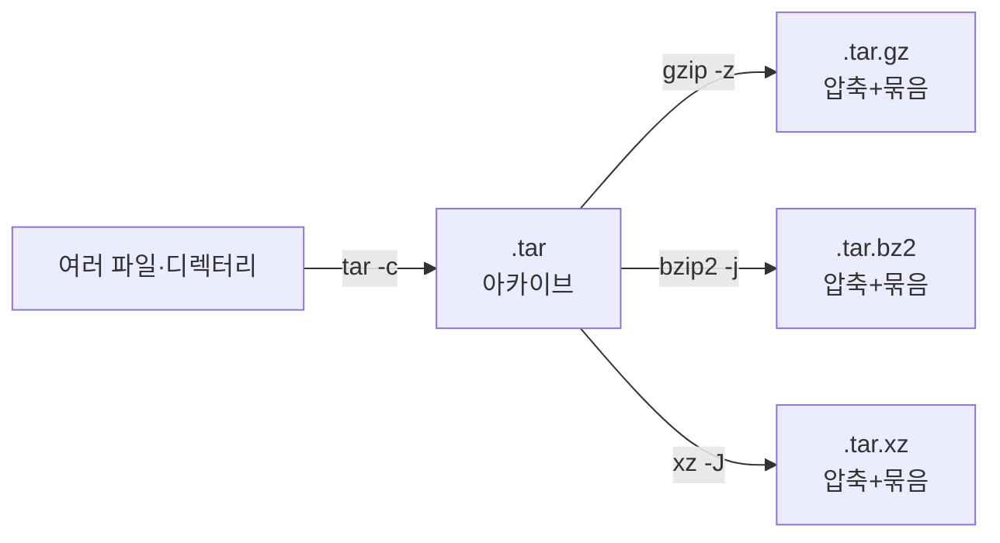
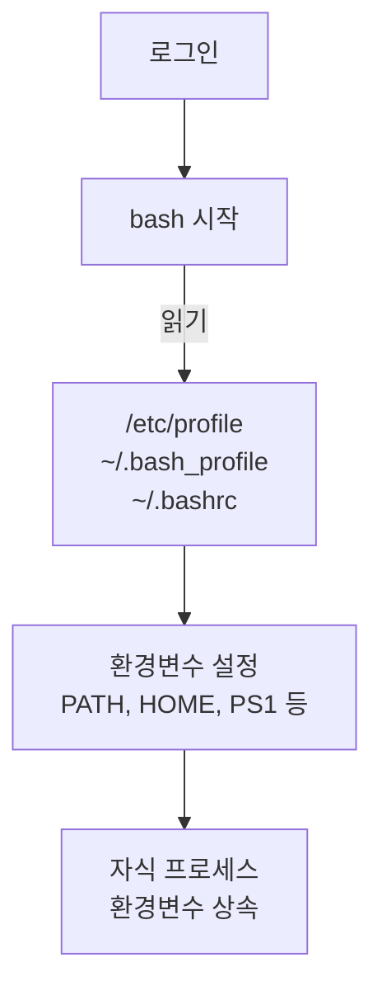
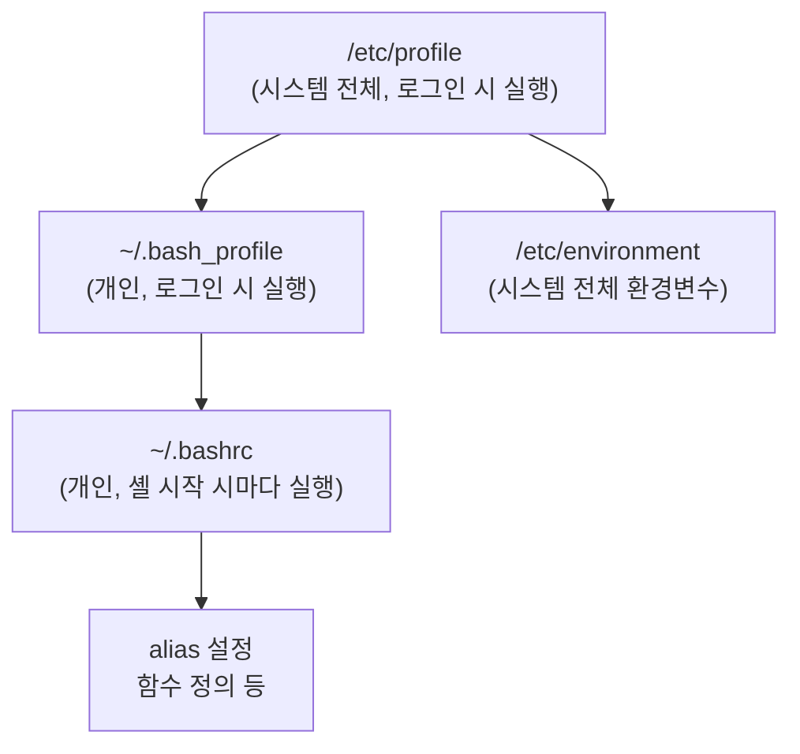
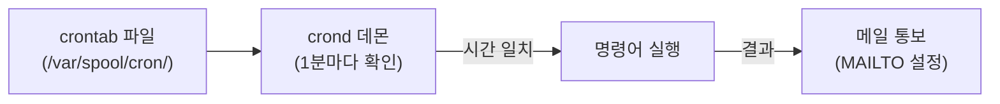
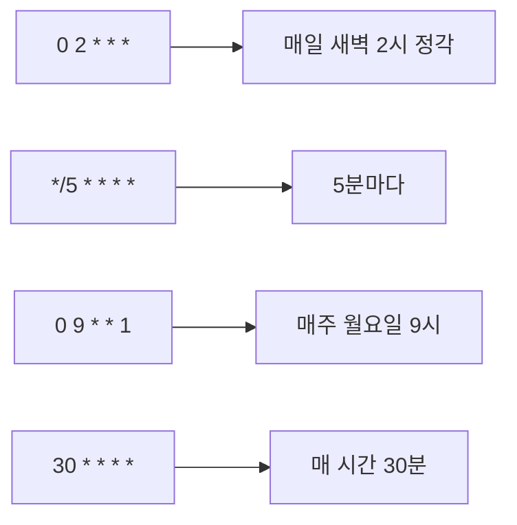
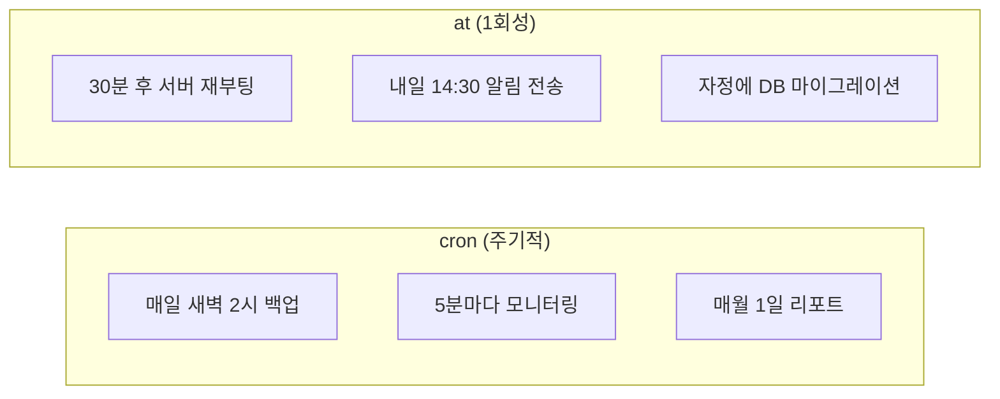
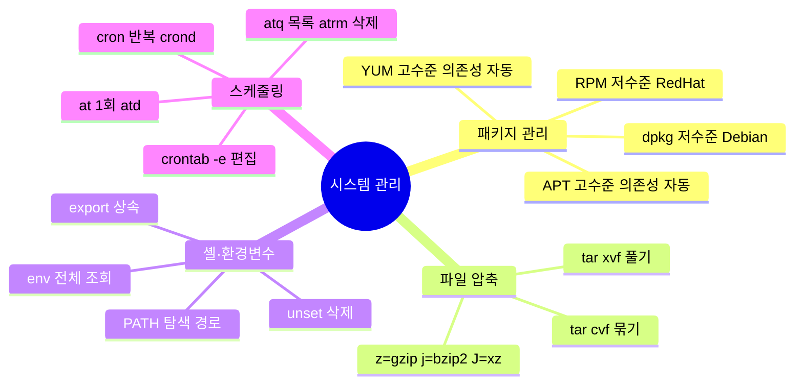

## 강의 개요

시스템 관리자가 매일 사용하는 **필수 관리 도구들**을 다룸. 소프트웨어를 어떻게 설치·관리하는지, 파일을 어떻게 압축·백업하는지, 반복 작업을 어떻게 자동화하는지가 핵심임.



---

# 1. 패키지 관리

---

## 1.1 리눅스 배포판과 패키지 관리 체계

리눅스는 배포판(Distribution)에 따라 패키지 형식과 관리 도구가 다름. 시험에서 어느 배포판에 어느 도구를 쓰는지 반드시 구별해야 함.



> 저수준(RPM, dpkg)은 의존성을 직접 해결해야 함. 고수준(YUM, APT)은 의존성을 자동으로 처리함.
{: .prompt-info }

---

## 1.2 RPM (RedHat Package Manager)

**RPM**은 레드햇 계열 배포판의 기본 패키지 관리 도구임. `.rpm` 확장자를 가진 패키지 파일을 직접 설치·조회·삭제함.

### RPM 패키지 파일 이름 구조

```
sendmail-8.14.3-5.fc11.i586.rpm
   ①       ②   ③   ④    ⑤   ⑥
```

| 위치 | 의미 | 예시 |
|---|---|---|
| ① 패키지명 | 소프트웨어 이름 | `sendmail` |
| ② 버전 | 소프트웨어 버전 | `8.14.3` |
| ③ 릴리즈 번호 | 패키지 빌드 횟수 | `5` |
| ④ 배포판 | 대상 배포판 | `fc11` (Fedora Core 11) |
| ⑤ 아키텍처 | CPU 아키텍처 | `i586` (32비트), `x86_64` (64비트) |
| ⑥ 확장자 | 항상 `.rpm` | `.rpm` |

> `noarch`는 아키텍처 무관(스크립트, 문서 패키지)를 의미함.
{: .prompt-tip }

### RPM 주요 옵션

```bash
# 설치 (install)
rpm -ivh 패키지.rpm          # 설치 + 해시(#) 표시 + 상세 출력
rpm -Uvh 패키지.rpm          # 업그레이드 (없으면 설치)
rpm -Fvh 패키지.rpm          # 이미 설치된 경우만 업그레이드 (freshen)

# 삭제 (erase)
rpm -e 패키지명              # 패키지 삭제
rpm -e --nodeps 패키지명     # 의존성 무시하고 삭제

# 조회 (query) — 가장 많이 출제됨
rpm -q 패키지명              # 설치 여부 확인
rpm -qi 패키지명             # 패키지 상세 정보 (information)
rpm -ql 패키지명             # 패키지 파일 목록 (list)
rpm -qa                     # 시스템의 모든 패키지 출력 (all)
rpm -qf /usr/bin/vim        # 특정 파일이 속한 패키지 확인 (file)

# 검증 (verify)
rpm -V 패키지명              # 파일 변조 여부 검사
```

**rpm -V 출력 코드:**

| 코드 | 의미 |
|---|---|
| `S` | 파일 크기(Size) 변경 |
| `M` | 파일 권한(Mode) 변경 |
| `5` | MD5 체크섬 불일치 |
| `T` | 수정 시간(mTime) 변경 |

```bash
# 예시 — vim 패키지 조회
rpm -qi vim-common
rpm -ql vim-common | head -5    # 설치 파일 목록 중 5개
rpm -qf /usr/bin/vim            # vim이 어느 패키지 소속인지
```

> rpm -q**i** = information(정보), rpm -q**l** = list(목록), rpm -q**a** = all(전체), rpm -q**f** = file(파일). 이 4가지를 반드시 구분해야 함.
{: .prompt-warning }

---

## 1.3 YUM (Yellowdog Updater Modified)

**YUM**은 RPM의 의존성 문제를 자동으로 해결하는 고수준 패키지 관리 도구임. 온라인 저장소(Repository)에서 패키지와 의존성 파일을 자동으로 내려받음.



```bash
# 설치
yum install 패키지명          # 의존성 포함하여 설치
yum groupinstall 그룹명       # 패키지 그룹 설치

# 삭제
yum remove 패키지명           # 패키지 제거
yum groupremove 그룹명        # 패키지 그룹 제거

# 업데이트
yum update                   # 전체 패키지 업데이트
yum update 패키지명           # 특정 패키지만 업데이트

# 조회
yum list                     # 전체 패키지 목록
yum list installed           # 설치된 패키지 목록
yum list updates             # 업데이트 가능한 패키지 목록
yum search 검색어            # 패키지 검색
yum info 패키지명            # 패키지 정보 출력
```

> Fedora 22 이후부터는 YUM 대신 **DNF(Dandified YUM)**를 사용함. 명령어 형식은 거의 동일함.
{: .prompt-info }

---

## 1.4 dpkg

**dpkg**는 데비안 계열의 저수준 패키지 관리 도구임. `.deb` 확장자 패키지를 직접 관리함.

**dpkg 파일 이름 구조:**
```
패키지이름_버전_릴리즈번호_아키텍처.deb
```

```bash
# 설치
dpkg -i 패키지.deb           # 패키지 설치 (install)

# 삭제
dpkg -r 패키지명             # 패키지 삭제 (설정파일 유지)
dpkg -P 패키지명             # 설정파일 포함 완전 삭제 (purge)

# 조회
dpkg -s 패키지명             # 패키지 상태·버전·관리자 정보 출력 (status)
dpkg -l                     # 설치된 패키지 간략 목록
dpkg -L 패키지명             # 설치된 패키지의 파일 목록 (List)
dpkg -S /usr/bin/vim        # 특정 파일 소속 패키지 검색 (Search)
```

> dpkg -**r** = remove(설정유지), dpkg -**P** = Purge(완전삭제). 대소문자 구별에 주의해야 함.
{: .prompt-warning }

---

## 1.5 APT (Advanced Packaging Tool)

**APT**는 데비안 계열의 고수준 패키지 관리 도구임. `/etc/apt/sources.list`에 저장된 저장소 목록을 참조하여 의존성과 충돌을 자동으로 해결함.

```bash
# 저장소 목록 업데이트 (설치 전 반드시 실행)
apt-get update

# 설치
apt-get install 패키지명

# 삭제
apt-get remove 패키지명       # 패키지만 삭제 (설정파일 유지)
apt-get purge 패키지명        # 설정파일 포함 완전 삭제

# 업그레이드
apt-get upgrade              # 전체 업그레이드

# 검색·정보
apt-cache search 검색어      # 패키지 검색
apt-cache show 패키지명      # 패키지 상세 정보
```

**패키지 관리 도구 비교 요약:**

| 도구 | 배포판 | 수준 | 의존성 자동처리 |
|---|---|---|---|
| RPM | RedHat 계열 | 저수준 | ❌ |
| YUM / DNF | RedHat 계열 | 고수준 | ✅ |
| dpkg | Debian 계열 | 저수준 | ❌ |
| apt-get | Debian 계열 | 고수준 | ✅ |
| aptitude | Ubuntu | 고수준 | ✅ |
| zypper | SUSE | 고수준 | ✅ |

---

# 2. 소스 파일 설치

---

## 2.1 소스 설치 흐름

패키지 저장소에 없는 소프트웨어는 소스 코드(Source Code)를 직접 내려받아 컴파일하여 설치함.


```bash
# 소스 설치 표준 절차
tar xvf nginx-1.24.0.tar.gz       # 압축 해제
cd nginx-1.24.0                   # 디렉터리 이동
./configure --prefix=/usr/local   # 빌드 환경 설정
make                               # 컴파일 (소스 → 실행파일)
make install                       # 파일을 지정 경로에 복사
```

> `./configure`는 시스템 환경을 검사하고 `Makefile`을 생성함. `make`는 `Makefile`을 읽어 컴파일을 실행함. 이 순서는 절대 바뀌지 않음.
{: .prompt-tip }

---

# 3. 파일 압축과 아카이브

---

## 3.1 tar — 파일 묶기 (아카이브)

**tar(Tape ARchive)**는 여러 파일과 디렉터리를 하나의 아카이브 파일(`.tar`)로 묶는 도구임. 압축 기능은 없지만 압축 도구(`gzip`, `bzip2` 등)와 함께 사용함.



**tar 주요 옵션:**

| 옵션 | 의미 | 용도 |
|---|---|---|
| `c` | create | 아카이브 생성 |
| `x` | extract | 아카이브 해제 |
| `t` | list | 아카이브 내용 목록 출력 |
| `v` | verbose | 처리 파일명 화면 출력 |
| `f` | file | 아카이브 파일명 지정 (항상 필요) |
| `z` | gzip | gzip 압축 적용 (`.tar.gz`) |
| `j` | bzip2 | bzip2 압축 적용 (`.tar.bz2`) |
| `J` | xz | xz 압축 적용 (`.tar.xz`) |
| `r` | append | 기존 아카이브에 파일 추가 |
| `C` | change dir | 지정 디렉터리로 이동 후 작업 |
| `P` | absolute | 절대 경로로 저장 |

```bash
# 자주 사용하는 패턴

# 묶기 (압축 없음)
tar cvf backup.tar /home/user/

# 묶기 + gzip 압축
tar cvzf backup.tar.gz /home/user/
tar cvzf backup.tar.gz *.c          # 현재 디렉터리 C 파일만

# 묶기 + bzip2 압축 (gzip보다 압축률 높음)
tar cvjf backup.tar.bz2 /home/user/

# 묶기 + xz 압축 (가장 높은 압축률)
tar cvJf backup.tar.xz /home/user/

# 풀기
tar xvf backup.tar                  # 압축 없는 tar
tar xvzf backup.tar.gz              # gzip 압축 해제
tar xvjf backup.tar.bz2             # bzip2 압축 해제
tar xvJf backup.tar.xz              # xz 압축 해제

# 내용 확인 (풀지 않고)
tar tvf backup.tar
tar tvzf backup.tar.gz

# 특정 디렉터리에 풀기
tar xvzf backup.tar.gz -C /tmp/restore/
```

> tar 옵션에서 `-f` 는 반드시 파일명 바로 앞에 위치해야 함. `tar -cvfz`가 아닌 `tar -cvzf`임.
{: .prompt-danger }

---

## 3.2 압축 명령어 종류

리눅스에서 사용하는 압축 도구는 형식마다 다름.

| 압축 명령 | 해제 명령 | 확장자 | 특징 |
|---|---|---|---|
| `compress` | `uncompress` | `.Z` | 구식, 거의 사용 안 함 |
| `gzip` | `gunzip` | `.gz` | 가장 많이 사용, 속도 빠름 |
| `bzip2` | `bunzip2` | `.bz2` | gzip보다 압축률 높음 |
| `xz` | `unxz` | `.xz` | 압축률 가장 높음, 속도 느림 |
| `zip` | `unzip` | `.zip` | 윈도우와 호환 |

```bash
# gzip
gzip file.txt              # file.txt → file.txt.gz (원본 삭제)
gzip -k file.txt           # 원본 유지하며 압축
gzip -d file.txt.gz        # 압축 해제 (= gunzip)
gunzip file.txt.gz         # 압축 해제
zcat file.txt.gz           # 압축 풀지 않고 내용 출력

# bzip2
bzip2 file.txt             # file.txt → file.txt.bz2
bzip2 -d file.txt.bz2      # 압축 해제 (= bunzip2)
bunzip2 file.txt.bz2

# xz
xz file.txt                # file.txt → file.txt.xz
xz -d file.txt.xz          # 압축 해제 (= unxz)

# zip (디렉터리 포함)
zip -r archive.zip /home/user/   # 재귀적으로 압축
unzip archive.zip
unzip archive.zip -d /tmp/       # 특정 디렉터리에 해제
```

> `gzip`은 **원본 파일을 삭제**하고 `.gz` 파일을 생성함. 원본을 유지하려면 `-k` 옵션을 사용해야 함.
{: .prompt-warning }

---

# 4. 셸(Shell) 환경

---

## 4.1 셸이란

**셸(Shell)**은 사용자와 커널(Kernel) 사이의 인터페이스 프로그램임. 사용자가 입력한 명령어를 해석하여 커널에 전달하고, 커널의 결과를 사용자에게 보여줌.


### 셸의 종류

| 셸 | 경로 | 특징 |
|---|---|---|
| **bash** (Bourne-Again Shell) | `/bin/bash` | 리눅스 기본 셸, sh 호환 |
| sh (Bourne Shell) | `/bin/sh` | 유닉스 원조 셸 |
| csh (C Shell) | `/bin/csh` | C 언어 문법, 히스토리 기능 |
| ksh (Korn Shell) | `/bin/ksh` | sh + csh 기능 통합 |
| tcsh | `/bin/tcsh` | csh 개선판, 자동완성 강화 |
| zsh | `/bin/zsh` | 현재 macOS 기본 셸 |

```bash
# 현재 셸 확인
echo $SHELL              # 로그인 셸 확인
echo $0                  # 현재 실행 중인 셸
cat /etc/shells          # 시스템에 설치된 셸 목록
```

---

## 4.2 환경변수 (Environment Variable)

**환경변수(Environment Variable)**는 셸과 프로세스가 참조하는 키=값 형태의 설정 정보임. 프로세스는 부모로부터 환경변수를 상속받음.



### 주요 환경변수

| 변수명 | 의미 | 예시 값 |
|---|---|---|
| `PATH` | 명령어 탐색 경로 | `/usr/local/bin:/usr/bin:/bin` |
| `HOME` | 홈 디렉터리 경로 | `/home/alice` |
| `USER` | 현재 사용자명 | `alice` |
| `SHELL` | 로그인 셸 경로 | `/bin/bash` |
| `PWD` | 현재 작업 디렉터리 | `/home/alice/project` |
| `LANG` | 언어·로케일 설정 | `ko_KR.UTF-8` |
| `PS1` | 프롬프트 형식 | `[\u@\h \W]\$` |
| `HISTSIZE` | 히스토리 저장 개수 | `1000` |
| `TERM` | 터미널 종류 | `xterm-256color` |

### 환경변수 관리 명령어

```bash
# 조회
env                          # 모든 환경변수 출력
printenv                     # 모든 환경변수 출력 (env와 동일)
printenv PATH                # 특정 변수 값 출력
echo $PATH                   # 변수 참조

# 설정
export MY_VAR="hello"        # 환경변수 선언 (자식 프로세스에 상속)
MY_VAR="hello"               # 셸 변수 선언 (자식에게 상속 안 됨)

# 삭제
unset MY_VAR                 # 변수 삭제

# 임시 설정 (해당 명령어 실행 시에만)
LANG=C ls --help             # ls 실행 시에만 LANG=C 적용
```

> `export`가 있어야 자식 프로세스에 상속됨. `set`은 셸 변수(지역)·함수까지 포함하여 출력하며, `env`는 환경변수만 출력함.
{: .prompt-info }

### 주요 설정 파일



| 파일 | 실행 시점 | 용도 |
|---|---|---|
| `/etc/profile` | 모든 사용자 로그인 시 | 시스템 전체 환경 설정 |
| `~/.bash_profile` | 사용자 로그인 시 | 개인 환경 설정 |
| `~/.bashrc` | bash 셸 시작 시마다 | alias, 함수 정의 |
| `~/.bash_logout` | 로그아웃 시 | 로그아웃 처리 |
| `/etc/bashrc` | 모든 사용자 셸 시작 시 | 시스템 전체 alias 등 |

---

## 4.3 PATH 환경변수

**PATH**는 명령어를 찾을 디렉터리 목록을 `:` 으로 구분하여 저장한 변수임. `ls` 를 입력하면 PATH의 각 디렉터리를 순서대로 탐색하여 실행 파일을 찾음.

```bash
echo $PATH
# /usr/local/sbin:/usr/local/bin:/usr/sbin:/usr/bin:/sbin:/bin

# PATH에 디렉터리 추가
export PATH=$PATH:/usr/local/myapp/bin
export PATH=/usr/local/myapp/bin:$PATH   # 최우선 탐색

# 영구적으로 추가 (파일에 기록)
echo 'export PATH=$PATH:/usr/local/myapp/bin' >> ~/.bashrc
source ~/.bashrc    # 즉시 적용
```

> PATH에 `.`(현재 디렉터리)를 포함시키는 것은 **보안상 위험**함. 공격자가 악성 파일을 현재 디렉터리에 두고 `ls` 같은 이름으로 실행시킬 수 있기 때문임.
{: .prompt-danger }

---

## 4.4 alias — 명령어 별칭

**alias(앨리어스)**는 긴 명령어에 짧은 이름을 붙이는 기능임.

```bash
# alias 설정
alias ll='ls -alF'
alias la='ls -A'
alias rm='rm -i'        # 실수 방지: 삭제 전 확인 요청
alias grep='grep --color=auto'

# alias 목록 확인
alias
alias ll                # 특정 alias만 확인

# alias 해제
unalias ll
unalias -a              # 모든 alias 해제
```

---

# 5. 작업 스케줄링

---

## 5.1 cron — 주기적 반복 작업

**cron**은 지정된 시간에 주기적으로 명령어를 실행하는 데몬(daemon)임. 서버 백업, 로그 정리, 모니터링 등 반복 작업을 자동화하는 데 사용함.



### crontab 파일 형식

```
분   시   일   월   요일   명령어
*    *    *    *    *      command
```

| 필드 | 의미 | 허용 범위 |
|---|---|---|
| 분 (Minute) | 0~59 분 | 0–59 |
| 시 (Hour) | 0~23 시 | 0–23 |
| 일 (Day) | 1~31 일 | 1–31 |
| 월 (Month) | 1~12 월 | 1–12 |
| 요일 (Weekday) | 0~7 (0과 7 모두 일요일) | 0–7 |

**특수 기호:**

| 기호 | 의미 | 예시 |
|---|---|---|
| `*` | 모든 값 (매번) | `* * * * *` = 매 1분 |
| `,` | 여러 값 나열 | `1,15,30` = 1분, 15분, 30분 |
| `-` | 범위 지정 | `1-5` = 1분~5분 |
| `/` | 간격 지정 | `*/5` = 5분마다 |

```bash
# crontab 관리
crontab -e              # 현재 사용자의 crontab 편집
crontab -l              # 현재 사용자의 crontab 목록 출력
crontab -r              # 현재 사용자의 crontab 삭제
crontab -u alice -l     # alice 사용자의 crontab 목록 (root만)

# crontab 작성 예시
# 매일 새벽 2시에 백업 스크립트 실행
0 2 * * * /home/user/backup.sh

# 매주 월요일 오전 9시에 리포트 생성
0 9 * * 1 /usr/local/bin/weekly_report.sh

# 매시간 30분에 디스크 사용량 체크
30 * * * * df -h >> /var/log/disk_usage.log

# 5분마다 서비스 상태 확인
*/5 * * * * systemctl status nginx >> /var/log/nginx_status.log

# 1월 1일 자정에 연간 리포트
0 0 1 1 * /usr/local/bin/annual_report.sh

# 평일(월~금) 오전 8시~18시, 매 30분마다 모니터링
*/30 8-18 * * 1-5 /usr/local/bin/monitor.sh
```



> cron은 **요일 필드에서 0과 7이 모두 일요일**임. `1`이 월요일, `6`이 토요일임. 시험에서 자주 출제되는 포인트임.
{: .prompt-warning }

---

## 5.2 cron 접근 제어 파일

```bash
/etc/cron.allow     # 이 파일이 있으면, 여기 있는 사용자만 crontab 사용 가능
/etc/cron.deny      # 이 파일이 있으면, 여기 있는 사용자는 crontab 사용 불가

# 우선순위:
# 1. cron.allow 존재 → allow에 없으면 거부
# 2. cron.allow 없고 cron.deny 존재 → deny에 있으면 거부
# 3. 둘 다 없음 → root만 사용 가능
```

---

## 5.3 at — 1회성 예약 작업

**at**은 지정한 시간에 **한 번만** 명령어를 실행하는 도구임. cron이 반복 작업용이라면 at은 단발성 예약 실행용임.

```bash
# 기본 사용
at 14:30                 # 오늘 14:30에 실행할 명령 입력 (프롬프트 대기)
at 14:30 tomorrow        # 내일 14:30
at 2:30 PM              # 오후 2:30
at now + 1 hour          # 1시간 후
at now + 2 days          # 2일 후
at midnight              # 자정
at noon                  # 정오

# 파일로 명령 지정
at 14:30 < /home/user/commands.txt

# 예약 작업 목록 확인
atq
at -l                    # atq와 동일

# 예약 작업 삭제
atrm 작업번호
at -d 작업번호            # atrm과 동일
```

```bash
# 사용 예시
$ at now + 10 minutes
at> echo "10분 경과" >> /tmp/test.log
at> <Ctrl+D>            # Ctrl+D로 입력 종료
```

**at 접근 제어:**

| 파일 | 기능 |
|---|---|
| `/etc/at.allow` | 여기 있는 사용자만 at 사용 가능 |
| `/etc/at.deny` | 여기 있는 사용자는 at 사용 불가 |

> `at`은 명령 입력이 끝나면 **Ctrl+D**로 종료함. 결과는 기본적으로 이메일로 통보됨.
{: .prompt-tip }

---

## 5.4 cron vs at 비교



| 구분 | cron | at |
|---|---|---|
| 실행 횟수 | 반복 | 1회 |
| 설정 방법 | `crontab -e` | `at 시간` |
| 작업 목록 확인 | `crontab -l` | `atq` |
| 작업 삭제 | `crontab -r` | `atrm 번호` |
| 데몬 | `crond` | `atd` |

---

# 핵심 요약



| 구분 | 명령어 | 핵심 |
|---|---|---|
| 패키지 설치 | `rpm -ivh`, `yum install`, `apt-get install` | 배포판별 구분 |
| 패키지 조회 | `rpm -qi`, `rpm -ql`, `rpm -qa`, `rpm -qf` | i·l·a·f 구별 |
| 아카이브 | `tar cvf`, `tar xvf` | c=생성, x=해제, f=파일명 |
| 압축 | `gzip`, `bzip2`, `xz` | gz, bz2, xz 확장자 |
| 환경변수 | `export`, `env`, `unset` | export 없으면 자식 미상속 |
| 반복 스케줄 | `crontab -e` → `분 시 일 월 요일 명령` | 0/7 = 일요일 |
| 1회 스케줄 | `at 시간`, `atq`, `atrm` | Ctrl+D로 입력 종료 |

> 다음 파일(6-2)에서 이 내용을 직접 실습하면서 확인함.
{: .prompt-info }
