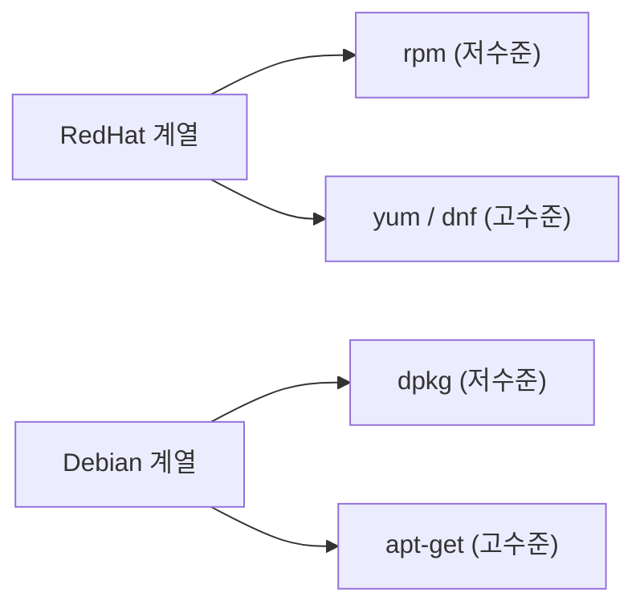
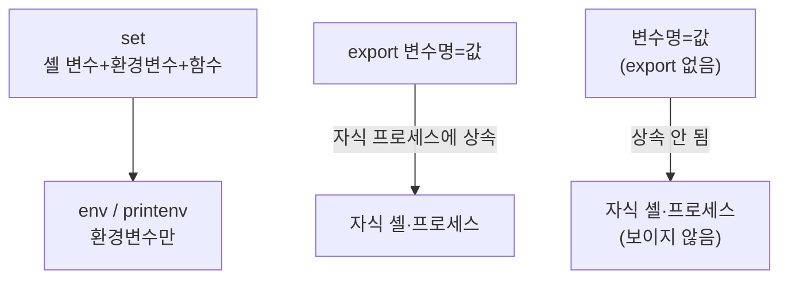
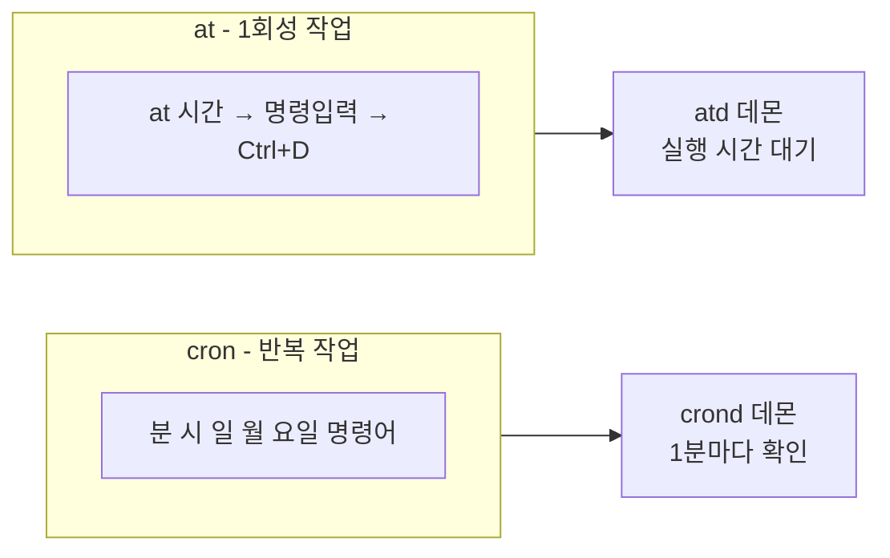

## 실습 개요

이론에서 배운 내용을 **직접 명령어로 입력하고 출력을 눈으로 확인**하는 것이 목표임. 각 실습은 이론 복습 → 명령어 실행 → 출력 해석 순서로 진행됨.


> 모든 실습은 Ubuntu/Debian 계열 기준임. RPM/YUM 명령어는 CentOS/RHEL 환경에서 실행해야 함.
{: .prompt-info }

---

# 실습 1. 패키지 관리

---

## 1.1 이론 복습



- **저수준**: 의존성 직접 해결 필요 → rpm, dpkg
- **고수준**: 의존성 자동 해결 → yum, apt-get

---

## 1.2 dpkg 실습 (Debian/Ubuntu)

```bash
# [실습 1-1] 패키지 상태 확인
dpkg -s curl

# 예상 출력 (발췌):
# Package: curl
# Status: install ok installed
# Priority: optional
# Version: 7.81.0-1ubuntu1.15
# Description: command line tool for transferring data with URL syntax
```

```bash
# [실습 1-2] 패키지가 설치한 파일 목록
dpkg -L curl

# 예상 출력 (발췌):
# /.
# /usr
# /usr/bin
# /usr/bin/curl
# /usr/share/doc/curl
```

```bash
# [실습 1-3] 특정 파일이 어느 패키지 소속인지 확인
dpkg -S /usr/bin/curl

# 예상 출력:
# curl: /usr/bin/curl
```

```bash
# [실습 1-4] 설치된 패키지 목록 전체 확인
dpkg -l | head -20

# 예상 출력 (발췌):
# Desired=Unknown/Install/Remove/Purge/Hold
# | Status=Not/Inst/Conf-files/Unpacked/halF-conf/Half-inst/trig-aWait/Trig-pend
# |/ Err?=(none)/Reinst-required (Status,Err: uppercase=bad)
# ||/ Name         Version      Architecture Description
# +++-============-============-============-=================================
# ii  adduser      3.118ubuntu5 all          add and remove users and groups
# ii  apt          2.4.12       amd64        commandline package manager
```

> 출력의 `ii` 는 "desired=install, status=installed"를 의미함. `rc`는 "삭제됐지만 설정파일 남음"을 의미함.
{: .prompt-tip }

---

## 1.3 apt-get 실습

```bash
# [실습 1-5] 저장소 목록 업데이트
sudo apt-get update

# 예상 출력 (발췌):
# Hit:1 http://archive.ubuntu.com/ubuntu jammy InRelease
# Get:2 http://security.ubuntu.com/ubuntu jammy-security InRelease [110 kB]
# Fetched 3,142 kB in 3s (1,047 kB/s)
# Reading package lists... Done
```

```bash
# [실습 1-6] 패키지 검색
apt-cache search vim | grep "^vim"

# 예상 출력 (발췌):
# vim - Vi IMproved - enhanced vi editor
# vim-common - Vi IMproved - Common files
# vim-tiny - Vi IMproved - enhanced vi editor - compact version
```

```bash
# [실습 1-7] 패키지 상세 정보
apt-cache show curl | head -20

# 예상 출력 (발췌):
# Package: curl
# Architecture: amd64
# Version: 7.81.0-1ubuntu1.15
# Priority: optional
# Depends: libc6 (>= 2.17), libcurl4 (= 7.81.0-1ubuntu1.15), ...
```

```bash
# [실습 1-8] 설치된 패키지 확인
apt list --installed 2>/dev/null | grep curl

# 예상 출력:
# curl/jammy-updates,jammy-security,now 7.81.0-1ubuntu1.15 amd64 [installed]
```

---

## 1.4 RPM 명령어 형식 정리 (CentOS/RHEL 환경)

실습 환경이 Ubuntu이므로 rpm 명령어는 **형식만 확인**하고, 실제 출력 예시를 함께 익힘.

```bash
# [참고] CentOS/RHEL에서의 rpm 사용 예시

# 패키지 정보 조회
rpm -qi bash
# Name        : bash
# Version     : 5.1.8
# Release     : 6.el9
# Architecture: x86_64
# Install Date: Wed 12 Jan 2022 ...
# Group       : System Environment/Shells
# Size        : 7291729
# License     : GPLv3+

# 패키지 파일 목록
rpm -ql bash | head -5
# /etc/skel/.bash_logout
# /etc/skel/.bash_profile
# /etc/skel/.bashrc
# /usr/bin/bash
# /usr/bin/sh

# 파일 → 패키지 역추적
rpm -qf /usr/bin/bash
# bash-5.1.8-6.el9.x86_64

# 전체 패키지 목록
rpm -qa | wc -l
# 예: 1245 (설치된 패키지 수)
```

---

# 실습 2. 파일 압축과 아카이브

---

## 2.1 이론 복습

| 명령 | 확장자 | 특징 |
|---|---|---|
| `gzip` / `gunzip` | `.gz` | 속도 빠름, 가장 많이 사용 |
| `bzip2` / `bunzip2` | `.bz2` | gzip보다 압축률 높음 |
| `xz` / `unxz` | `.xz` | 압축률 가장 높음 |
| `tar -z` | `.tar.gz` | tar + gzip |
| `tar -j` | `.tar.bz2` | tar + bzip2 |

---

## 2.2 실습 디렉터리 준비

```bash
# [실습 2-1] 실습용 파일 생성
mkdir -p /tmp/tartest/subdir
echo "파일1 내용" > /tmp/tartest/file1.txt
echo "파일2 내용" > /tmp/tartest/file2.txt
echo "서브파일" > /tmp/tartest/subdir/file3.txt
ls -R /tmp/tartest/

# 예상 출력:
# /tmp/tartest/:
# file1.txt  file2.txt  subdir
#
# /tmp/tartest/subdir:
# file3.txt
```

---

## 2.3 tar 실습

```bash
# [실습 2-2] 아카이브 생성 (압축 없음)
cd /tmp
tar cvf mybackup.tar tartest/

# 예상 출력:
# tartest/
# tartest/file1.txt
# tartest/file2.txt
# tartest/subdir/
# tartest/subdir/file3.txt
```

```bash
# [실습 2-3] 아카이브 내용 확인 (풀지 않고)
tar tvf mybackup.tar

# 예상 출력:
# drwxr-xr-x user/user         0 2026-03-08 09:00 tartest/
# -rw-r--r-- user/user        16 2026-03-08 09:00 tartest/file1.txt
# -rw-r--r-- user/user        16 2026-03-08 09:00 tartest/file2.txt
# drwxr-xr-x user/user         0 2026-03-08 09:00 tartest/subdir/
# -rw-r--r-- user/user        13 2026-03-08 09:00 tartest/subdir/file3.txt
```

```bash
# [실습 2-4] gzip 압축 아카이브 생성
tar cvzf mybackup.tar.gz tartest/
ls -lh mybackup.tar mybackup.tar.gz

# 예상 출력 (크기 비교):
# -rw-r--r-- 1 user user 10240 Mar  8 09:00 mybackup.tar
# -rw-r--r-- 1 user user   285 Mar  8 09:00 mybackup.tar.gz
```

```bash
# [실습 2-5] bzip2 압축 아카이브 생성
tar cvjf mybackup.tar.bz2 tartest/
ls -lh mybackup.tar.gz mybackup.tar.bz2

# 예상 출력 (bzip2가 더 작음):
# -rw-r--r-- 1 user user 285 Mar  8 09:00 mybackup.tar.gz
# -rw-r--r-- 1 user user 271 Mar  8 09:00 mybackup.tar.bz2
```

```bash
# [실습 2-6] 특정 디렉터리에 압축 해제
mkdir -p /tmp/restore
tar xvzf mybackup.tar.gz -C /tmp/restore/
ls /tmp/restore/tartest/

# 예상 출력:
# file1.txt  file2.txt  subdir
```

> **tar 옵션 순서 주의**: `-f`는 파일명 바로 앞에 와야 함. `tar cvfz`는 틀린 순서임. `tar cvzf backup.tar.gz`가 올바름.
{: .prompt-danger }

---

## 2.4 gzip 단독 실습

```bash
# [실습 2-7] 파일 압축
cp /tmp/tartest/file1.txt /tmp/gzip_test.txt
gzip /tmp/gzip_test.txt
ls /tmp/gzip_test*

# 예상 출력:
# /tmp/gzip_test.txt.gz
# (원본 file1.txt는 삭제됨)
```

```bash
# [실습 2-8] 압축 해제
gunzip /tmp/gzip_test.txt.gz
ls /tmp/gzip_test*

# 예상 출력:
# /tmp/gzip_test.txt
```

```bash
# [실습 2-9] 원본 유지하며 압축
gzip -k /tmp/gzip_test.txt
ls /tmp/gzip_test*

# 예상 출력:
# /tmp/gzip_test.txt
# /tmp/gzip_test.txt.gz
# (원본과 압축 파일 모두 존재)
```

```bash
# [실습 2-10] 압축 해제 없이 내용 출력
zcat /tmp/gzip_test.txt.gz

# 예상 출력:
# 파일1 내용
```

---

# 실습 3. 셸 환경 및 환경변수

---

## 3.1 이론 복습



---

## 3.2 환경변수 조회 실습

```bash
# [실습 3-1] 주요 환경변수 확인
echo $HOME
echo $USER
echo $SHELL
echo $PWD
echo $PATH

# 예상 출력 (예시):
# /root
# root
# /bin/bash
# /tmp
# /usr/local/sbin:/usr/local/bin:/usr/sbin:/usr/bin:/sbin:/bin
```

```bash
# [실습 3-2] 모든 환경변수 출력
env | sort | head -15

# 예상 출력 (발췌):
# HOME=/root
# HOSTNAME=myserver
# LANG=ko_KR.UTF-8
# LOGNAME=root
# PATH=/usr/local/sbin:/usr/local/bin:/usr/sbin:/usr/bin:/sbin:/bin
# PWD=/tmp
# SHELL=/bin/bash
# TERM=xterm-256color
# USER=root
```

```bash
# [실습 3-3] printenv로 특정 변수 출력
printenv PATH
printenv HOME USER SHELL

# 예상 출력:
# /usr/local/sbin:/usr/local/bin:/usr/sbin:/usr/bin:/sbin:/bin
# /root
# root
# /bin/bash
```

---

## 3.3 환경변수 설정·상속 실습

```bash
# [실습 3-4] 셸 변수(지역) vs 환경변수(export) 차이 확인
MY_LOCAL="지역변수"
export MY_EXPORT="환경변수"

# 자식 셸에서 확인
bash -c 'echo "LOCAL: $MY_LOCAL"; echo "EXPORT: $MY_EXPORT"'

# 예상 출력:
# LOCAL:              (빈값 — 상속 안 됨)
# EXPORT: 환경변수   (상속됨)
```

```bash
# [실습 3-5] 변수 삭제
export TESTVAR="삭제테스트"
echo $TESTVAR
unset TESTVAR
echo $TESTVAR

# 예상 출력:
# 삭제테스트
#              (빈값 — 삭제됨)
```

```bash
# [실습 3-6] PATH에 경로 추가
echo $PATH
export PATH=$PATH:/tmp/mybin
echo $PATH

# 예상 출력:
# /usr/local/sbin:/usr/local/bin:/usr/sbin:/usr/bin:/sbin:/bin
# /usr/local/sbin:/usr/local/bin:/usr/sbin:/usr/bin:/sbin:/bin:/tmp/mybin
```

---

## 3.4 alias 실습

```bash
# [실습 3-7] alias 설정
alias ll='ls -alF'
alias la='ls -A'
alias mydate='date "+%Y-%m-%d %H:%M:%S"'

# 설정 확인
alias

# 예상 출력 (발췌):
# alias la='ls -A'
# alias ll='ls -alF'
# alias mydate='date "+%Y-%m-%d %H:%M:%S"'
```

```bash
# [실습 3-8] alias 실행
mydate

# 예상 출력:
# 2026-03-08 09:30:00
```

```bash
# [실습 3-9] alias 해제
unalias mydate
alias mydate

# 예상 출력:
# bash: alias: mydate: not found
```

---

## 3.5 셸 설정 파일 실습

```bash
# [실습 3-10] 설정 파일 목록 확인
ls -la ~/  | grep bash

# 예상 출력:
# -rw-r--r-- 1 user user  220 Mar  8 09:00 .bash_logout
# -rw-r--r-- 1 user user 3526 Mar  8 09:00 .bashrc
# -rw-r--r-- 1 user user  807 Mar  8 09:00 .profile
```

```bash
# [실습 3-11] .bashrc에 alias 영구 등록
echo "alias ll='ls -alF'" >> ~/.bashrc
echo "alias mygrep='grep --color=auto'" >> ~/.bashrc

# 즉시 적용
source ~/.bashrc
# 또는
. ~/.bashrc

# 확인
alias ll
```

---

# 실습 4. 작업 스케줄링

---

## 4.1 이론 복습



---

## 4.2 crontab 실습

```bash
# [실습 4-1] crontab 현재 내용 확인
crontab -l

# 예상 출력 (없으면):
# no crontab for root
```

```bash
# [실습 4-2] crontab 작성 (편집기 열림)
# crontab -e 실행 후 아래 내용 추가:

# 매분 시스템 시간을 로그에 기록
* * * * * date >> /tmp/cron_test.log

# 저장 후 1-2분 기다린 후 로그 확인
sleep 70
cat /tmp/cron_test.log
```

```bash
# 예상 출력 (1분마다 한 줄씩 추가됨):
# Sun Mar  8 09:01:00 KST 2026
# Sun Mar  8 09:02:00 KST 2026
```

```bash
# [실습 4-3] crontab 패턴 연습 — 아래 crontab 설명을 완성해 보기
# 
# 0 2 * * *    → 매일 새벽 2시
# */5 * * * *  → 5분마다
# 0 9 * * 1   → 매주 월요일 오전 9시
# 30 18 * * 5 → 매주 금요일 오후 6시 30분
# 0 0 1 * *   → 매월 1일 자정
# 0 0 1 1 *   → 매년 1월 1일 자정
```

```bash
# [실습 4-4] crontab 삭제
crontab -r

# 확인
crontab -l
# 예상 출력:
# no crontab for root
```

---

## 4.3 at 실습

```bash
# [실습 4-5] at 설치 확인 및 설치
which at || apt-get install -y at
systemctl start atd 2>/dev/null || service atd start 2>/dev/null
echo "atd 서비스 상태 확인 완료"
```

```bash
# [실습 4-6] 1분 후 실행 예약
at now + 1 minute << 'EOF'
echo "at 작업 실행: $(date)" >> /tmp/at_test.log
EOF

# 예상 출력:
# warning: commands will be executed using /bin/sh
# job 1 at Sun Mar  8 09:30:00 2026
```

```bash
# [실습 4-7] 예약 목록 확인
atq

# 예상 출력:
# 1	Sun Mar  8 09:30:00 2026 a root
```

```bash
# [실습 4-8] 예약 작업 삭제
atq                  # 번호 확인
atrm 1               # 1번 작업 삭제
atq                  # 삭제 확인 (빈 출력)
```

```bash
# [실습 4-9] 자정에 실행 예약 (형식 연습)
# at midnight << 'EOF'
# /usr/local/bin/daily_backup.sh
# EOF

# 자정 대신 테스트용으로 5분 후
at now + 5 minutes << 'EOF'
echo "테스트 완료: $(date)" >> /tmp/at_test.log
EOF

# 1-2분 기다린 후 결과 확인
# cat /tmp/at_test.log
```

---

## 4.4 종합 실습 — 로그 정리 스크립트 + cron 등록

```bash
# [실습 4-10] 로그 정리 스크립트 작성
cat > /tmp/cleanup.sh << 'SCRIPT'
#!/bin/bash
# 7일 이상 된 /tmp 파일 삭제
find /tmp -type f -mtime +7 -delete 2>/dev/null
echo "$(date) - 임시파일 정리 완료" >> /var/log/cleanup.log
SCRIPT

chmod +x /tmp/cleanup.sh

# 스크립트 내용 확인
cat /tmp/cleanup.sh
```

```bash
# 매일 새벽 3시에 실행하는 crontab 등록
# (실제로는 crontab -e 로 편집하지만, 여기서는 형식만 확인)

echo "다음 내용을 crontab -e 에 추가:"
echo "0 3 * * * /tmp/cleanup.sh"
echo ""
echo "crontab 형식 분석:"
echo "  분=0, 시=3, 일=*, 월=*, 요일=* → 매일 새벽 3시 정각"
```

---

# 실습 5. 종합 확인 문제

아래 명령어를 보고 출력을 예측해 보기.

**문제 1.** 다음 명령어의 출력 결과는?
```bash
export MYTEST="hello"
bash -c 'echo $MYTEST'
```

**문제 2.** 다음 crontab 항목이 실행되는 시점은?
```
30 8 * * 1-5  /usr/local/bin/monitor.sh
```

**문제 3.** 아래 tar 명령어의 의미는?
```bash
tar cvjf backup_$(date +%Y%m%d).tar.bz2 /home/user/
```

**문제 4.** 다음 중 설치된 패키지의 파일 목록을 출력하는 rpm 명령어는?
- ① `rpm -qi 패키지명`
- ② `rpm -ql 패키지명`
- ③ `rpm -qa 패키지명`
- ④ `rpm -qf 파일경로`

---

## 정답

> **문제 1 정답**: `hello` — export로 선언했으므로 자식 셸(bash -c)에 상속됨.
{: .prompt-tip }

> **문제 2 정답**: 평일(월~금, 1-5)마다 오전 8시 30분에 실행됨.
{: .prompt-tip }

> **문제 3 정답**: /home/user/ 디렉터리를 bzip2 압축(j)으로 묶어 오늘 날짜(date +%Y%m%d)를 파일명에 포함한 .tar.bz2 파일로 생성함. c=생성, v=상세출력, j=bzip2, f=파일명.
{: .prompt-tip }

> **문제 4 정답**: ② `rpm -ql 패키지명` — l은 list(목록). qi=정보, qa=전체목록, qf=파일역추적.
{: .prompt-tip }
