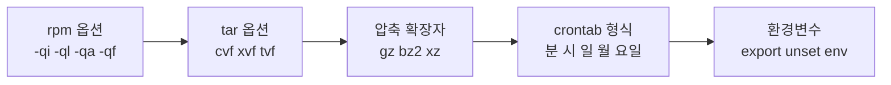
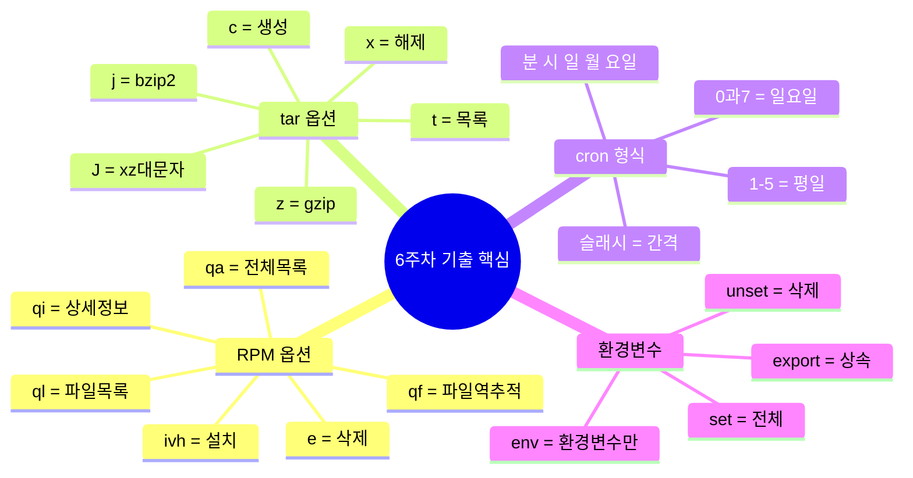

## 출제 경향

6주차 주제는 리눅스마스터 2급 시험에서 **매 회차마다 2~4문항** 출제되는 고빈도 영역임.



> 아래 문제는 리눅스마스터 2급 기출 및 유형 문제임. 문제 → 정답 → 풀이 순서로 정리함.
{: .prompt-info }

---

# 문제

---

## [1번] RPM 패키지 파일명 구조

다음 RPM 패키지 파일 이름의 각 구성 요소를 설명하시오.

```
sendmail-8.14.3-5.fc11.i586.rpm
```

① `sendmail`이 의미하는 것은?  
② `8.14.3`이 의미하는 것은?  
③ `5`가 의미하는 것은?  
④ `fc11`이 의미하는 것은?  
⑤ `i586`이 의미하는 것은?

---

## [2번] RPM 조회 옵션

다음 중 설명에 맞는 `rpm` 명령어를 고르시오.

| 번호 | 설명 |
|---|---|
| (가) | 설치된 패키지의 이름, 버전, 크기, 설명 등 상세 정보를 출력 |
| (나) | 시스템에 설치된 모든 패키지 목록을 출력 |
| (다) | 특정 파일이 어느 패키지에 포함되어 있는지 확인 |
| (라) | 설치된 패키지가 설치한 파일 목록을 출력 |

① `rpm -qi 패키지명`  
② `rpm -qa`  
③ `rpm -qf 파일경로`  
④ `rpm -ql 패키지명`

---

## [3번] YUM과 APT 비교

다음 명령어 쌍 중 **같은 기능**을 수행하는 것끼리 연결하시오.

| YUM (RedHat 계열) | APT (Debian 계열) |
|---|---|
| `yum install 패키지명` | (ㄱ) |
| `yum remove 패키지명` | (ㄴ) |
| `yum search 검색어` | (ㄷ) |
| `yum update` | (ㄹ) |

보기: `apt-get install`, `apt-get remove`, `apt-get upgrade`, `apt-cache search`

---

## [4번] tar 옵션

다음 `tar` 명령어 옵션에 대한 설명으로 **틀린** 것을 고르시오.

① `-c` : 새로운 아카이브 파일을 생성한다.  
② `-x` : 아카이브 파일을 풀어낸다.  
③ `-f` : 아카이브 파일명을 지정한다.  
④ `-z` : bzip2 압축을 적용한다.  
⑤ `-j` : bzip2 압축을 적용한다.

---

## [5번] tar 명령어 해석

다음 명령어의 동작을 설명하시오.

```bash
tar cvzf source.tar.gz *.c
```

---

## [6번] 압축 명령어와 확장자 매핑

다음 표를 완성하시오.

| 압축 명령 | 해제 명령 | 확장자 |
|---|---|---|
| `gzip` | (A) | `.gz` |
| (B) | `bunzip2` | `.bz2` |
| `compress` | `uncompress` | (C) |
| `xz` | (D) | `.xz` |

---

## [7번] 환경변수 선언과 상속

다음 코드 실행 결과를 예측하시오.

```bash
MY_VAR1="local"
export MY_VAR2="exported"
bash -c 'echo "VAR1=$MY_VAR1, VAR2=$MY_VAR2"'
```

---

## [8번] 환경변수 조회 명령어

다음 중 **현재 셸의 환경변수만** 출력하는 명령어를 모두 고르시오.

① `env`  
② `set`  
③ `printenv`  
④ `export`  
⑤ `declare`

---

## [9번] crontab 형식 분석

다음 crontab 항목이 실행되는 시점을 설명하시오.

```
30 2 * * 0    /usr/local/bin/weekly_backup.sh
```

---

## [10번] crontab 작성

다음 조건에 맞는 crontab 항목을 작성하시오.

**조건:** 매주 월요일부터 금요일까지, 오전 9시부터 오후 6시까지, 30분 간격으로 `/usr/local/bin/monitor.sh`를 실행

---

## [11번] cron 접근 제어

리눅스 시스템에서 `alice`라는 사용자가 `crontab -e` 명령을 실행했을 때 **거부**되는 상황을 만들려면 어떤 파일에 어떻게 설정해야 하는지 설명하시오. (단, `cron.allow` 파일은 존재하지 않음)

---

## [12번] at 명령어

다음 중 `at` 명령어에 대한 설명으로 **옳은** 것을 모두 고르시오.

① `at now + 1 hour`는 1시간 후에 한 번 실행한다.  
② `atq` 명령어로 대기 중인 작업 목록을 확인할 수 있다.  
③ `at`의 입력은 `Ctrl+C`로 종료한다.  
④ `atrm 번호`로 예약된 작업을 삭제할 수 있다.  
⑤ `at`은 반복 실행 작업에 주로 사용한다.

---

## [13번] dpkg 옵션

다음 중 설치된 패키지의 **설정 파일을 포함하여 완전히 삭제**하는 dpkg 명령어는?

① `dpkg -r 패키지명`  
② `dpkg -P 패키지명`  
③ `dpkg -d 패키지명`  
④ `dpkg -e 패키지명`

---

## [14번] 종합 응용

시스템 관리자가 다음 작업을 수행하려 함. 각 작업에 맞는 명령어를 작성하시오.

(가) `/home/user` 디렉터리 전체를 bzip2로 압축하여 `backup_20260308.tar.bz2` 파일로 저장  
(나) 위 파일의 내용 목록을 압축 해제 없이 확인  
(다) 위 파일을 `/tmp/restore` 디렉터리에 압축 해제

---

# 정답

---

## [1번] 정답

| 구성 | 의미 |
|---|---|
| ① `sendmail` | **패키지명** (소프트웨어 이름) |
| ② `8.14.3` | **버전** (소프트웨어 버전 번호) |
| ③ `5` | **릴리즈 번호** (패키지 빌드 횟수) |
| ④ `fc11` | **배포판** (Fedora Core 11 대상) |
| ⑤ `i586` | **아키텍처** (32비트 Intel CPU) |

---

## [2번] 정답

| 번호 | 정답 | 설명 |
|---|---|---|
| (가) | ① `rpm -qi` | **i**nformation — 상세 정보 |
| (나) | ② `rpm -qa` | **a**ll — 전체 목록 |
| (다) | ③ `rpm -qf` | **f**ile — 파일 → 패키지 역추적 |
| (라) | ④ `rpm -ql` | **l**ist — 설치 파일 목록 |

> rpm 조회 옵션: **i**nfo(상세) / **l**ist(목록) / **a**ll(전체) / **f**ile(파일역추적) — 이 4가지가 핵심임.
{: .prompt-warning }

---

## [3번] 정답

| YUM | APT |
|---|---|
| `yum install` | `apt-get install` — (ㄱ) |
| `yum remove` | `apt-get remove` — (ㄴ) |
| `yum search` | `apt-cache search` — (ㄷ) |
| `yum update` | `apt-get upgrade` — (ㄹ) |

> `yum update`와 `apt-get upgrade`는 기능이 같음. `apt-get update`는 저장소 목록을 갱신하는 명령으로 `yum makecache`에 해당함.
{: .prompt-info }

---

## [4번] 정답

**④번이 틀림.**

`-z` 옵션은 **gzip** 압축을 적용함. bzip2는 `-j` 옵션임.

| 옵션 | 압축 도구 | 확장자 |
|---|---|---|
| `-z` | **gzip** | `.tar.gz` |
| `-j` | **bzip2** | `.tar.bz2` |
| `-J` | **xz** | `.tar.xz` |

> `-z`=gzip, `-j`=bzip2, `-J`=xz — 대소문자까지 구별해야 함. J는 대문자임.
{: .prompt-danger }

---

## [5번] 정답

**현재 디렉터리에 있는 모든 `.c` 파일을 gzip으로 압축하여 `source.tar.gz` 파일로 만듦.**

옵션 분석:
- `c` : 새 아카이브 **생성** (create)
- `v` : 처리 파일명을 화면에 출력 (verbose)
- `z` : **gzip** 압축 적용
- `f` : 파일명 지정 → `source.tar.gz`
- `*.c` : 대상 파일 (확장자가 .c인 모든 파일)

---

## [6번] 정답

| 압축 명령 | 해제 명령 | 확장자 |
|---|---|---|
| `gzip` | **(A) gunzip** | `.gz` |
| **(B) bzip2** | `bunzip2` | `.bz2` |
| `compress` | `uncompress` | **(C) .Z** |
| `xz` | **(D) unxz** | `.xz` |

---

## [7번] 정답

```
VAR1=, VAR2=exported
```

**해설**: `MY_VAR1`은 `export` 없이 선언한 셸 변수(지역 변수)이므로 자식 프로세스(`bash -c`)에 상속되지 않음. `MY_VAR2`는 `export`로 선언한 환경변수이므로 상속됨.

> `export`가 없으면 현재 셸에서만 유효한 **지역 변수**임. 자식 프로세스(서브셸, 명령어)에서는 보이지 않음.
{: .prompt-warning }

---

## [8번] 정답

**① `env`**, **③ `printenv`**

| 명령 | 출력 내용 |
|---|---|
| `env` | 환경변수만 출력 |
| `printenv` | 환경변수만 출력 |
| `set` | 셸 변수 + 환경변수 + 함수 모두 출력 |
| `export` | 환경변수 선언/목록 (출력 형식이 다름) |
| `declare` | 셸 변수·함수 선언 및 속성 관리 |

---

## [9번] 정답

**매주 일요일 새벽 2시 30분에 실행됨.**

분석:
- `30` : **30분**
- `2` : **2시**
- `*` : 매일
- `*` : 매월
- `0` : **일요일** (0과 7이 모두 일요일)

> cron 요일 필드에서 **0과 7은 모두 일요일**임. 1=월요일, 6=토요일.
{: .prompt-danger }

---

## [10번] 정답

```
*/30 9-18 * * 1-5   /usr/local/bin/monitor.sh
```

분석:
- `*/30` : 30분마다 (0분, 30분)
- `9-18` : 오전 9시~오후 6시 (18시)
- `*` : 매일
- `*` : 매월
- `1-5` : 월요일(1)~금요일(5)

---

## [11번] 정답

**/etc/cron.deny** 파일에 `alice`를 추가함.

```bash
echo "alice" >> /etc/cron.deny
```

**접근 제어 우선순위:**
1. `cron.allow` 존재 → allow에 없으면 거부 (allow가 최우선)
2. `cron.allow` 없고 `cron.deny` 존재 → deny에 있으면 거부
3. 둘 다 없음 → root만 사용 가능

> 문제 조건이 `cron.allow`가 없는 경우이므로, `cron.deny`에 추가하면 해당 사용자만 거부됨.
{: .prompt-info }

---

## [12번] 정답

**옳은 것: ①, ②, ④**

| 번호 | 내용 | 정오 |
|---|---|---|
| ① | `at now + 1 hour` → 1시간 후 1회 실행 | ✅ |
| ② | `atq` → 대기 작업 목록 확인 | ✅ |
| ③ | 입력 종료는 **Ctrl+D** (EOF 전송), Ctrl+C는 취소 | ❌ |
| ④ | `atrm 번호` → 예약 삭제 | ✅ |
| ⑤ | `at`은 **1회성** 실행 도구. 반복은 cron | ❌ |

> `at` 입력 종료는 반드시 **Ctrl+D**임. Ctrl+C는 at 명령 자체를 취소함.
{: .prompt-danger }

---

## [13번] 정답

**② `dpkg -P 패키지명`**

| 옵션 | 기능 |
|---|---|
| `-r` (remove) | 패키지 삭제 (설정 파일 **유지**) |
| `-P` (Purge) | 패키지 + 설정파일 **완전 삭제** |
| `-i` (install) | 패키지 설치 |
| `-s` (status) | 패키지 상태 정보 출력 |

> `dpkg -r` = remove(설정유지), `dpkg -P` = Purge(완전삭제). **대소문자 구별**에 주의해야 함.
{: .prompt-warning }

---

## [14번] 정답

```bash
# (가) bzip2로 압축하여 저장
tar cvjf backup_20260308.tar.bz2 /home/user/

# (나) 내용 목록 확인 (압축 해제 없음)
tar tvjf backup_20260308.tar.bz2

# (다) 특정 디렉터리에 압축 해제
tar xvjf backup_20260308.tar.bz2 -C /tmp/restore/
```

옵션 총정리:
- `c` : 생성(create), `x` : 해제(extract), `t` : 목록(table of contents)
- `v` : 화면 출력(verbose)
- `j` : bzip2 압축
- `f` : 파일명 지정
- `-C` : 해제 디렉터리 지정

---

# 핵심 암기 표



| 주제 | 핵심 암기 |
|---|---|
| RPM 조회 | `-qi`(정보) `-ql`(목록) `-qa`(전체) `-qf`(파일역추적) |
| tar 압축 | `-z`=gzip, `-j`=bzip2, `-J`(대문자)=xz |
| tar 동작 | `-c`=생성, `-x`=해제, `-t`=목록확인 |
| cron 요일 | 0=일,1=월,2=화,3=수,4=목,5=금,6=토,7=일 |
| cron vs at | cron=반복, at=1회 |
| at 입력종료 | Ctrl+D (EOF) |
| dpkg 삭제 | `-r`=설정유지, `-P`(대문자)=완전삭제 |
| export | 없으면 자식 미상속, 있으면 환경변수로 상속 |
