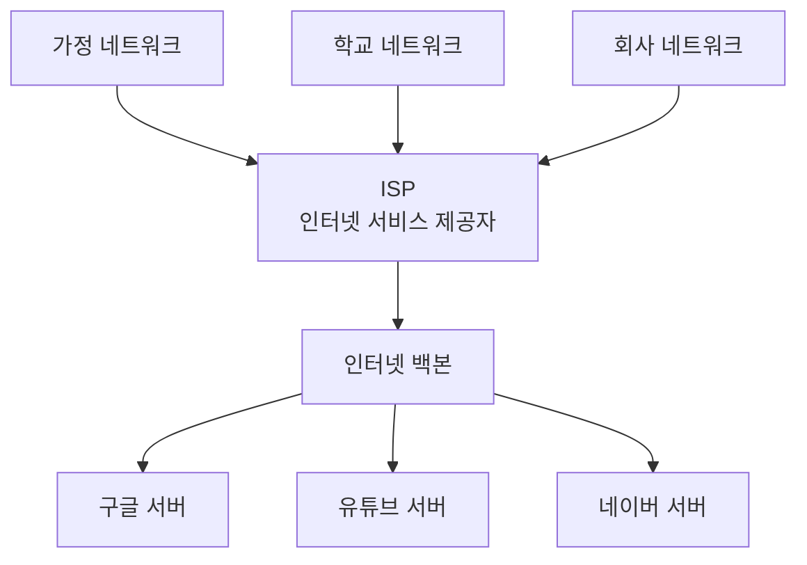
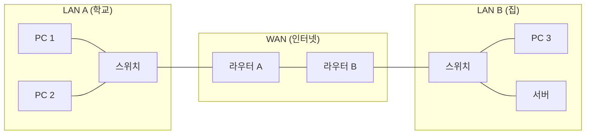

# 네트워크 기초 — 네트워크란 무엇인가?

---

# 1장. 네트워크(Network)의 기본 개념

---

## 1.1 네트워크란?

네트워크(Network)란 **두 대 이상의 컴퓨터(장치)가 서로 데이터를 주고받을 수 있도록 연결된 구조**를 말함.

네트워크가 없다면 USB나 CD 같은 저장 매체로만 데이터를 이동할 수 있음.  
네트워크 덕분에 우리는 인터넷 검색, 유튜브 시청, 카카오톡 메시지 전송이 모두 가능함.

> **비유로 이해하기**  
> 네트워크 = 도로망  
> 컴퓨터 = 집  
> 데이터 = 택배 상자  
> 도로(네트워크)가 없으면 택배(데이터)를 집(컴퓨터)에 전달할 수 없음.

```
[내 PC]  -----(케이블/와이파이)-----  [스위치]  -----  [라우터]  -----  [인터넷]  -----  [유튜브 서버]
```

---

## 1.2 인터넷(Internet)이란?

인터넷(Internet)은 **전 세계 수백만 개의 네트워크가 서로 연결된 거대한 네트워크의 집합체**임.

- **Inter** + **net** = 네트워크들 사이의 연결
- 우리가 일상에서 사용하는 인터넷은 TCP/IP 프로토콜을 기반으로 동작함
- 학교 네트워크, 회사 네트워크, 가정 네트워크 등 작은 네트워크들이 모여 인터넷이 됨



> **ISP(Internet Service Provider)**: KT, SK브로드밴드, LG U+ 처럼 인터넷 회선을 제공하는 회사

---

## 1.3 데이터는 어떻게 이동하는가? — 패킷(Packet)

데이터는 한 번에 통째로 전송되지 않음.  
네트워크에서는 데이터를 **패킷(Packet)** 이라는 작은 단위로 쪼개서 전송함.

> **왜 패킷으로 쪼개는가?**  
> 하나의 큰 파일을 통째로 보내면 그 파일이 다 전송되는 동안 다른 사람은 아무것도 못 보냄.  
> 작게 쪼개서 보내면 여러 사람이 동시에 데이터를 주고받을 수 있음.

```
[원본 데이터: 1GB 영상]
         |
    ┌────┴─────┐
    | 패킷 분할 |
    └────┬─────┘
         |
  패킷1(1KB) + 패킷2(1KB) + 패킷3(1KB) + ... 

         | 각자 다른 경로로 이동 가능
         |
  ┌──────┴──────┐
  | 수신측에서   |
  | 재조립       |
  └─────────────┘
```

**패킷의 구조:**

| 구성 요소 | 설명 |
|---|---|
| **헤더(Header)** | 출발지 IP, 목적지 IP, 패킷 번호 등 제어 정보 |
| **페이로드(Payload)** | 실제 전송하려는 데이터 내용 |
| **트레일러(Trailer)** | 오류 검출 정보 (체크섬 등) |

---

# 2장. 주소 체계 — IP 주소, MAC 주소, 포트 번호

---

## 2.1 IP 주소 (IP Address)

IP 주소(Internet Protocol Address)란 **네트워크에 연결된 각 장치를 식별하는 논리적 주소**임.

> **비유**: IP 주소 = 집 주소 (서울시 강남구 역삼동 123번지)

우편을 배달할 때 주소가 있어야 하듯, 네트워크에서 데이터를 보내려면 목적지 IP 주소가 필요함.

### IPv4 주소 형식

현재 가장 많이 사용하는 IP 주소 체계임.

```
192  .  168  .  1  .  100
 |        |      |      |
옥텟1   옥텟2  옥텟3   옥텟4
(8비트) (8비트)(8비트) (8비트)
```

- 32비트(4바이트) 숫자로 구성됨
- 점(`.`)으로 구분된 4개의 숫자 (각 0~255)
- 전체 약 43억 개의 주소 표현 가능
- 예: `192.168.1.1`, `10.0.0.1`, `172.16.0.100`

### 공인 IP vs 사설 IP

| 구분 | 설명 | 예시 |
|---|---|---|
| **공인 IP (Public IP)** | 인터넷에서 유일하게 식별되는 주소. ISP가 할당함 | `118.42.1.100` |
| **사설 IP (Private IP)** | 내부 네트워크 안에서만 사용하는 주소. 공인 IP가 필요 없음 | `192.168.1.1` |

**사설 IP 대역 (외울 것):**

| 대역 | 범위 |
|---|---|
| `10.0.0.0/8` | `10.0.0.0` ~ `10.255.255.255` |
| `172.16.0.0/12` | `172.16.0.0` ~ `172.31.255.255` |
| `192.168.0.0/16` | `192.168.0.0` ~ `192.168.255.255` |

> 집 공유기에서 자동으로 받는 IP가 `192.168.x.x` 인 이유가 바로 사설 IP 대역이기 때문임.

### 서브넷 마스크 (Subnet Mask)

서브넷 마스크는 **IP 주소에서 네트워크 부분과 호스트 부분을 구분하는 값**임.

```
IP 주소:      192.168.1.100
서브넷 마스크: 255.255.255.0
              |        |
         네트워크 주소  호스트 주소
         (192.168.1)   (.100)
```

- `255.255.255.0` = `/24` 표기로 줄여 씀
- 같은 네트워크 주소를 가진 장치끼리 직접 통신 가능함

---

## 2.2 MAC 주소 (MAC Address)

MAC 주소(Media Access Control Address)란 **네트워크 장치(NIC, 랜카드)에 부여된 물리적 고유 주소**임.

> **비유**: MAC 주소 = 주민등록번호 (태어날 때부터 고유하게 부여된 번호)

- 48비트(6바이트) 로 구성됨
- 16진수 숫자로 표기, 콜론(`:`) 또는 하이픈(`-`)으로 구분
- 예: `00:1A:2B:3C:4D:5E`, `00-1A-2B-3C-4D-5E`
- 제조사가 NIC(랜카드)에 영구적으로 기록함
- 앞 3바이트: **OUI** (제조사 식별 코드)
- 뒤 3바이트: 제조사가 부여한 **일련번호**

```
00  :  1A  :  2B  :  3C  :  4D  :  5E
|_________|   |___________________|
  OUI 코드         일련번호
 (제조사 식별)      (고유 번호)
```

### IP 주소 vs MAC 주소 비교

| 비교 항목 | IP 주소 | MAC 주소 |
|---|---|---|
| **역할** | 논리적 주소 (위치 식별) | 물리적 주소 (장치 식별) |
| **변경 여부** | 변경 가능 (관리자가 설정) | 제조사가 고정 (원칙적으로 불변) |
| **범위** | 네트워크 전체 (인터넷) | 같은 네트워크 내부에서만 사용 |
| **비유** | 집 주소 | 주민등록번호 |
| **계층** | OSI 3계층 (네트워크) | OSI 2계층 (데이터링크) |

> **정리**: 인터넷을 통해 데이터를 찾아갈 때는 IP 주소를 사용하고, 같은 네트워크 안에서 실제 전달할 때는 MAC 주소를 사용함.

---

## 2.3 포트 번호 (Port Number)

포트 번호(Port Number)란 **같은 컴퓨터 안에서 어떤 프로그램(서비스)으로 데이터를 전달할지 구분하는 번호**임.

> **비유**: 아파트에 비유하면  
> IP 주소 = 아파트 건물 주소  
> 포트 번호 = 몇 호인지 (101호, 202호...)

컴퓨터 하나에서 웹 브라우저, 카카오톡, 게임 클라이언트가 동시에 실행됨.  
IP 주소만으로는 어느 프로그램으로 데이터를 보낼지 알 수 없음.  
포트 번호가 있어서 각 프로그램이 데이터를 받을 수 있음.

- 0 ~ 65535 범위의 숫자
- 16비트 크기

### 잘 알려진 포트 번호 (Well-known Port)

| 포트 번호 | 프로토콜 | 설명 |
|---|---|---|
| **80** | HTTP | 웹 브라우저 (암호화 없음) |
| **443** | HTTPS | 웹 브라우저 (SSL/TLS 암호화) |
| **22** | SSH | 원격 서버 접속 (암호화) |
| **21** | FTP | 파일 전송 |
| **25** | SMTP | 이메일 전송 |
| **53** | DNS | 도메인 이름 변환 |
| **3306** | MySQL | 데이터베이스 |

---

# 3장. LAN, WAN, 그리고 네트워크 장비

---

## 3.1 LAN (Local Area Network)

LAN(근거리 통신망, Local Area Network)은 **같은 건물, 같은 층, 같은 방처럼 좁은 범위 안에 구성된 네트워크**임.

- 빠른 속도 (100Mbps ~ 10Gbps)
- 직접 케이블이나 Wi-Fi로 연결
- 예: 학교 컴퓨터실, 집 공유기, 회사 사무실

---

## 3.2 WAN (Wide Area Network)

WAN(광역 통신망, Wide Area Network)은 **지리적으로 먼 거리의 LAN들을 연결한 넓은 범위의 네트워크**임.

- 도시와 도시, 나라와 나라 연결
- LAN보다 느린 편 (ISP 회선 속도에 따름)
- 인터넷이 WAN의 대표적인 예
- 라우터(Router)가 LAN과 WAN을 연결함



---

## 3.3 네트워크 장비 역할

### 허브 (Hub)

허브는 **여러 장치를 연결하되, 들어온 데이터를 연결된 모든 포트로 무조건 전달하는 장비**임.

- MAC 주소를 구분하지 못함
- 모든 장치가 같은 데이터를 받음 → **충돌(Collision)** 발생
- 현재는 거의 사용하지 않음 (스위치로 대체)

---

### 스위치 (Switch)

스위치는 **MAC 주소를 학습하여, 목적지 장치에게만 데이터를 전달하는 지능적인 허브**임.

- MAC 주소 테이블(MAC Address Table)을 유지함
- 목적지 MAC 주소를 확인하여 해당 포트로만 전달
- 충돌 없음, 효율적인 통신
- LAN 구성의 핵심 장비

---

### 라우터 (Router)

라우터는 **서로 다른 네트워크(LAN과 WAN, 또는 LAN과 LAN)를 연결하고, 최적의 경로를 찾아 데이터를 전달하는 장비**임.

- IP 주소를 기반으로 경로 결정 (라우팅, Routing)
- LAN과 인터넷(WAN)을 연결하는 관문 (게이트웨이, Gateway)
- 집의 공유기(유무선 공유기)가 라우터 기능을 포함함

### 장비 비교 요약

| 장비 | OSI 계층 | 기준 주소 | 역할 |
|---|---|---|---|
| **허브** | 1계층 (물리) | 없음 | 모든 포트로 무조건 전달 |
| **스위치** | 2계층 (데이터링크) | MAC 주소 | 목적지 포트로만 전달 |
| **라우터** | 3계층 (네트워크) | IP 주소 | 다른 네트워크로 경로 결정 후 전달 |

---

# 정리

| 개념 | 설명 |
|---|---|
| **네트워크** | 두 대 이상의 장치가 데이터를 주고받도록 연결된 구조 |
| **패킷** | 데이터를 잘게 쪼갠 전송 단위 |
| **IP 주소** | 네트워크 장치의 논리적 주소 (집 주소) |
| **MAC 주소** | 네트워크 장치의 물리적 고유 주소 (주민번호) |
| **포트 번호** | 같은 컴퓨터 안의 프로그램(서비스)을 구분하는 번호 |
| **LAN** | 좁은 범위 내부 네트워크 |
| **WAN** | LAN들을 연결한 넓은 범위 네트워크 (인터넷) |
| **스위치** | MAC 주소로 LAN 내부 통신 담당 |
| **라우터** | IP 주소로 서로 다른 네트워크 연결 담당 |

> **다음 강의 예고**  
> 2강에서는 Packet Tracer를 직접 설치하고, PC 2대와 스위치 1대로 첫 번째 네트워크를 구성해 봄.
