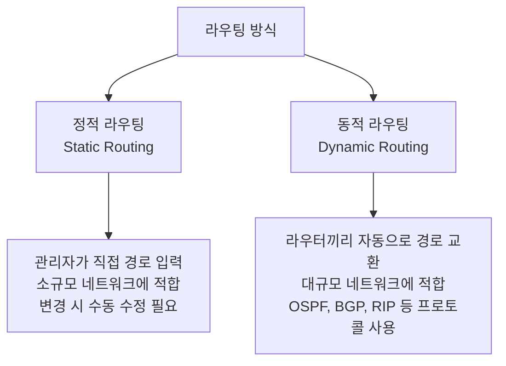

# 라우터 역할과 라우팅 — Static Route 기초 이론

---

# 1장. 라우터(Router)란?

---

## 1.1 라우터의 정의와 역할

라우터(Router)는 **서로 다른 네트워크를 연결하고, IP 주소를 기반으로 패킷이 목적지까지 가는 최적 경로를 결정하는 장비**임.

> **스위치와 라우터의 결정적 차이**  
> 스위치: 같은 네트워크(LAN) 안에서 MAC 주소로 전달  
> 라우터: 서로 다른 네트워크 사이에서 IP 주소로 경로 결정

---

## 1.2 라우터의 핵심 기능 3가지

| 기능 | 설명 |
|---|---|
| **경로 결정 (Path Determination)** | 패킷이 목적지까지 가는 최적 경로를 라우팅 테이블에서 찾음 |
| **패킷 전달 (Packet Forwarding)** | 결정된 경로의 인터페이스로 패킷을 내보냄 |
| **네트워크 분리 (Network Segmentation)** | 서로 다른 IP 대역을 가진 네트워크를 연결·분리 |

---

## 1.3 인터페이스 종류

| 인터페이스 | 설명 | 사용처 |
|---|---|---|
| **FastEthernet (Fa0/0, Fa0/1)** | 100Mbps 이더넷 포트 | LAN 연결 |
| **GigabitEthernet (Gi0/0)** | 1000Mbps 이더넷 포트 | LAN 연결 |
| **Serial (Se0/0/0)** | WAN 직렬 인터페이스 | 라우터 간 WAN 연결 |

> **게이트웨이(Gateway)란?**  
> PC에서 설정하는 기본 게이트웨이(Default Gateway)가 바로 **라우터의 LAN 쪽 IP 주소**임.

---

# 2장. 라우팅(Routing)이란?

---

## 2.1 라우팅의 종류



| 비교 항목 | 정적 라우팅 (Static) | 동적 라우팅 (Dynamic) |
|---|---|---|
| **설정 방법** | 관리자가 직접 입력 | 라우터가 자동으로 학습 |
| **변경 대응** | 수동 수정 필요 | 자동으로 경로 갱신 |
| **적합한 환경** | 소규모, 간단한 네트워크 | 대규모, 복잡한 네트워크 |
| **대표 프로토콜** | ip route 명령어 | OSPF, BGP, RIP |
| **오늘 실습** | ✅ 사용 | — |

---

# 3장. Static Route (정적 라우팅) 상세

---

## 3.1 Static Route 명령어

```
ip route [목적지 네트워크] [서브넷 마스크] [다음 홉 IP 또는 출구 인터페이스]
```

**예시:**

```
Router(config)# ip route 192.168.2.0 255.255.255.0 10.0.0.2
```

---

## 3.2 기본 경로 (Default Route)

```
Router(config)# ip route 0.0.0.0 0.0.0.0 10.0.0.2
```

> 라우팅 테이블에 없는 모든 목적지에 패킷을 보내는 경로임.

---

# 4장. 오늘 실습에서 구성할 토폴로지

---

## 4.1 전체 토폴로지 구조

```
[LAN A: 192.168.1.0/24]     [WAN: 10.0.0.0/30]      [LAN B: 192.168.2.0/24]

  PC0 (192.168.1.10)                                   PC2 (192.168.2.10)
      |                                                       |
  Switch0 — Router0 ——— Se0/0/0 ——— Se0/0/0 ——— Router1 — Switch1
             Fa0/0: 192.168.1.1           Fa0/0: 192.168.2.1
             Se0/0/0: 10.0.0.1            Se0/0/0: 10.0.0.2
```

| 장비 | 인터페이스 | IP 주소 | 서브넷 마스크 |
|---|---|---|---|
| PC0 | NIC | 192.168.1.10 | 255.255.255.0 |
| Router0 | Fa0/0 (LAN) | 192.168.1.1 | 255.255.255.0 |
| Router0 | Se0/0/0 (WAN) | 10.0.0.1 | 255.255.255.252 |
| Router1 | Se0/0/0 (WAN) | 10.0.0.2 | 255.255.255.252 |
| Router1 | Fa0/0 (LAN) | 192.168.2.1 | 255.255.255.0 |
| PC2 | NIC | 192.168.2.10 | 255.255.255.0 |

> **WAN /30 서브넷 이유**: 라우터 간 점대점 연결은 IP 2개만 필요 → 낭비 없이 /30 사용

---

## 4.2 패킷 이동 경로 분석

PC0이 PC2(192.168.2.10)에게 Ping을 보낼 때:

```mermaid
graph LR
    PC0["PC0<br/>192.168.1.10"]
    SW0["Switch0<br/>2계층"]
    R0["Router0<br/>192.168.1.1 | 10.0.0.1"]
    R1["Router1<br/>10.0.0.2 | 192.168.2.1"]
    SW1["Switch1<br/>2계층"]
    PC2["PC2<br/>192.168.2.10"]

    PC0 -->|"DST IP: 192.168.2.10<br/>DST MAC: Router0 MAC"| SW0
    SW0 -->|"2계층 전달"| R0
    R0 -->|"DST IP: 192.168.2.10<br/>DST MAC: Router1 MAC<br/>← MAC 교체!"| R1
    R1 -->|"DST IP: 192.168.2.10<br/>DST MAC: PC2 MAC<br/>← MAC 교체!"| SW1
    SW1 -->|"2계층 전달"| PC2
```



> **IP 주소(192.168.2.10)**: 처음부터 끝까지 변하지 않음.  
> **MAC 주소**: 라우터를 거칠 때마다 다음 장비의 MAC으로 교체됨.

---

# 5장. Cisco IOS 기본 명령어

---

## 5.1 라우터 CLI 진입 모드

```
Router>                  ← 사용자 모드
Router> enable
Router#                  ← 특권 모드
Router# configure terminal
Router(config)#          ← 전역 설정 모드
Router(config)# interface fa0/0
Router(config-if)#       ← 인터페이스 설정 모드
```

### 모드가 왜 여러 개인가?

Cisco IOS는 아무 명령이나 한 화면에서 다 치는 방식이 아님.  
`보기 전용`, `전체 설정`, `특정 포트 설정`을 나눠 둬서 실수를 줄이는 구조라고 생각하면 됨.

### 1. 사용자 모드 `Router>`

- 가장 처음 들어가는 기본 모드
- 장비에 대한 아주 기본적인 확인만 가능
- **큰 설정 변경은 아직 못 하는 상태**

쉽게 말하면:

```text
"일단 라우터에 들어오긴 했지만, 아직 관리자 모드는 아님"
```

### 2. 특권 모드 `Router#`

- `enable`을 입력하면 들어가는 모드
- 설정 보기, 테스트, 상세 확인 명령을 실행할 수 있음
- `show`, `ping` 같은 확인용 명령을 주로 여기서 사용함

쉽게 말하면:

```text
"이제 라우터 상태를 자세히 보고, 다음 설정 단계로 들어갈 수 있음"
```

### 3. 전역 설정 모드 `Router(config)#`

- `configure terminal`로 들어감
- 라우터 전체에 영향을 주는 설정을 하는 모드
- 라우터 이름 변경, 정적 라우팅 입력 같은 작업을 여기서 함

쉽게 말하면:

```text
"이제 이 라우터를 어떻게 동작하게 할지 전체 규칙을 정하는 단계"
```

### 4. 인터페이스 설정 모드 `Router(config-if)#`

- `interface g0/0`, `interface fa0/0`, `interface s0/0/0`처럼 특정 포트를 선택하면 들어감
- IP 주소 설정, `no shutdown` 같은 **포트별 설정**을 여기서 함

쉽게 말하면:

```text
"라우터 전체가 아니라, 지금 선택한 포트 하나를 직접 설정하는 단계"
```

### 학생이 외우기 쉽게 한 줄로 정리

| 모드 | 프롬프트 | 하는 일 |
|---|---|---|
| 사용자 모드 | `>` | 아주 기본적인 진입 상태 |
| 특권 모드 | `#` | 상태 확인, 테스트, 상세 조회 |
| 전역 설정 모드 | `(config)#` | 라우터 전체 설정 |
| 인터페이스 모드 | `(config-if)#` | 특정 포트 설정 |

### 실제로 많이 쓰는 흐름

라우터 설정은 보통 아래 순서로 움직임.

```text
Router>
enable
Router#
configure terminal
Router(config)#
interface g0/0
Router(config-if)#
```

그리고 설정이 끝나면:

```text
exit      ← 한 단계 위로 올라감
end       ← 바로 특권 모드로 돌아감
```

> 초보자 기준으로는  
> `enable = 관리자 모드 들어가기`  
> `configure terminal = 설정 시작하기`  
> `interface ... = 포트 하나 선택하기`  
> 이렇게 이해하면 충분함.

## 5.2 자주 쓰는 IOS 명령어

| 명령어 | 모드 | 설명 |
|---|---|---|
| `enable` | 사용자 모드 | 특권 모드로 진입 |
| `configure terminal` | 특권 모드 | 전역 설정 모드 진입 |
| `ip address [IP] [마스크]` | 인터페이스 | IP 주소 설정 |
| `no shutdown` | 인터페이스 | 인터페이스 활성화 |
| `show ip route` | 특권 모드 | 라우팅 테이블 확인 |
| `show ip interface brief` | 특권 모드 | 인터페이스 상태 요약 확인 |
| `ping [IP]` | 특권 모드 | 통신 확인 |

> **`no shutdown` 주의**: Cisco 라우터 인터페이스는 기본이 shutdown 상태임. 반드시 입력해야 함.

### 명령어를 왜 쓰는지까지 같이 이해하기

#### `enable`

- 위치: 사용자 모드 `Router>`
- 목적: 관리자 수준의 확인과 설정을 하기 위한 입장권

예시:

```text
Router> enable
Router#
```

이 명령을 쓰는 이유:

- 그냥 들어온 상태에서는 할 수 있는 일이 적음
- 라우터 상태를 제대로 보거나 설정하려면 먼저 `#` 모드로 가야 함

#### `configure terminal`

- 위치: 특권 모드 `Router#`
- 목적: 실제 설정을 시작하기 위해 전역 설정 모드로 들어감

예시:

```text
Router# configure terminal
Router(config)#
```

이 명령을 쓰는 이유:

- `show`로 보는 것만으로는 라우터 동작이 바뀌지 않음
- IP 주소, 라우팅, 이름 같은 설정을 하려면 `(config)#`로 들어가야 함

#### `interface g0/0` 또는 `interface fa0/0`

- 위치: 전역 설정 모드
- 목적: 특정 LAN 포트를 선택함

예시:

```text
Router(config)# interface g0/0
Router(config-if)#
```

이 명령을 쓰는 이유:

- 라우터에는 포트가 여러 개 있음
- "어느 포트에 IP를 넣을지" 먼저 지정해야 하기 때문임

#### `interface s0/0/0`

- 위치: 전역 설정 모드
- 목적: 시리얼 WAN 포트를 선택함

이 명령을 쓰는 이유:

- 라우터끼리 연결된 WAN 포트에 IP를 넣으려면 해당 시리얼 포트를 선택해야 함

#### `ip address [IP] [마스크]`

- 위치: 인터페이스 모드
- 목적: 선택한 포트에 IP 주소를 부여함

예시:

```text
Router(config-if)# ip address 192.168.1.1 255.255.255.0
```

이 명령을 쓰는 이유:

- 라우터 포트도 네트워크 장비이므로 주소가 있어야 통신 가능
- PC의 기본 게이트웨이가 되는 주소도 여기서 만들어짐

#### `no shutdown`

- 위치: 인터페이스 모드
- 목적: 꺼져 있는 포트를 켬

예시:

```text
Router(config-if)# no shutdown
```

이 명령을 쓰는 이유:

- Cisco 라우터 포트는 기본적으로 꺼져 있는 경우가 많음
- IP를 넣어도 포트가 꺼져 있으면 통신이 안 됨

학생이 꼭 기억할 것:

```text
ip address만 넣고 no shutdown을 안 하면 "주소는 있는데 선이 죽어 있는 상태"
```

#### `clock rate 64000`

- 위치: 시리얼 인터페이스 모드
- 목적: DCE 쪽 시리얼 포트에 클럭 제공

이 명령을 쓰는 이유:

- 라우터 간 시리얼 연결에서는 한쪽이 시간 기준을 제공해야 함
- Packet Tracer 실습에서는 보통 먼저 연결한 쪽, 즉 DCE 쪽에 넣음

#### `ip route [목적지 네트워크] [마스크] [다음 홉]`

- 위치: 전역 설정 모드
- 목적: 반대편 네트워크로 가는 길을 라우터에게 직접 알려줌

예시:

```text
Router(config)# ip route 192.168.2.0 255.255.255.0 10.0.0.2
```

이 명령을 쓰는 이유:

- 라우터는 모르는 네트워크로는 패킷을 보낼 수 없음
- 그래서 "192.168.2.0 대역은 10.0.0.2 쪽으로 보내라"는 길 안내를 수동으로 넣는 것임

#### `show ip interface brief`

- 위치: 특권 모드
- 목적: 포트별 IP 주소와 상태를 한눈에 확인

이 명령을 쓰는 이유:

- 실습 중 가장 먼저 확인하는 진단 명령어
- IP가 들어갔는지, 포트가 살아 있는지 빠르게 볼 수 있음

학생이 여기서 보는 포인트:

- IP 주소가 맞는지
- `Status`가 `up`인지
- `Protocol`도 `up`인지

#### `show ip route`

- 위치: 특권 모드
- 목적: 라우팅 테이블 확인

이 명령을 쓰는 이유:

- 라우터가 어떤 네트워크를 어디로 보내는지 확인 가능
- Static Route가 제대로 들어갔는지 볼 때 핵심 명령어

학생이 여기서 보는 포인트:

- `C`는 직접 연결된 네트워크
- `S`는 직접 입력한 Static Route
- 내가 넣은 목적지 네트워크가 보이는지

#### `ping [IP]`

- 위치: 특권 모드 또는 PC의 Command Prompt
- 목적: 통신이 실제로 되는지 확인

이 명령을 쓰는 이유:

- 설정이 맞는지 가장 빠르게 검증할 수 있음
- 가까운 곳부터 차례대로 Ping하면 어디가 문제인지 좁힐 수 있음

### 모드별 대표 명령어 묶어서 보기

| 모드 | 대표 명령어 | 왜 쓰는가 |
|---|---|---|
| 사용자 모드 | `enable` | 관리자 수준으로 올라가기 위해 |
| 특권 모드 | `show ip route`, `show ip interface brief`, `ping` | 상태 확인, 테스트 |
| 전역 설정 모드 | `hostname`, `ip route`, `interface ...` | 전체 설정 시작 |
| 인터페이스 모드 | `ip address`, `no shutdown`, `clock rate` | 포트별 주소와 활성화 설정 |

### 초보자용 실전 흐름 예시

아래처럼 보면 "왜 이 명령을 치는지"가 연결됨.

```text
Router> enable
```

- 관리자 모드로 들어가기

```text
Router# configure terminal
```

- 이제 설정 시작하기

```text
Router(config)# interface g0/0
Router(config-if)# ip address 192.168.1.1 255.255.255.0
Router(config-if)# no shutdown
```

- LAN 포트 하나를 고르고, 주소를 주고, 포트를 켜기

```text
Router(config)# ip route 192.168.2.0 255.255.255.0 10.0.0.2
```

- 반대편 네트워크로 가는 길 알려주기

```text
Router# show ip interface brief
Router# show ip route
```

- 설정이 진짜 들어갔는지 확인하기

---

# 정리

| 개념 | 핵심 내용 |
|---|---|
| **라우터** | 서로 다른 네트워크를 연결, IP 기반 경로 결정 |
| **라우팅 테이블** | 목적지 네트워크별 경로 정보 저장 |
| **Static Route** | 관리자가 직접 입력하는 정적 경로 |
| **기본 경로** | 0.0.0.0/0, 테이블에 없는 모든 목적지에 적용 |
| **no shutdown** | Cisco 라우터 인터페이스 활성화 필수 명령어 |
| **/30 서브넷** | WAN 구간 2개 IP만 필요할 때 사용 |

> **다음 강의 예고**  
> 11강에서는 Packet Tracer에 라우터 2대를 배치하고 LAN-WAN-LAN 토폴로지를 직접 구성함.  
> Static Route 명령어를 입력하고 PC0에서 PC2로 Ping이 성공하는지 확인함.
