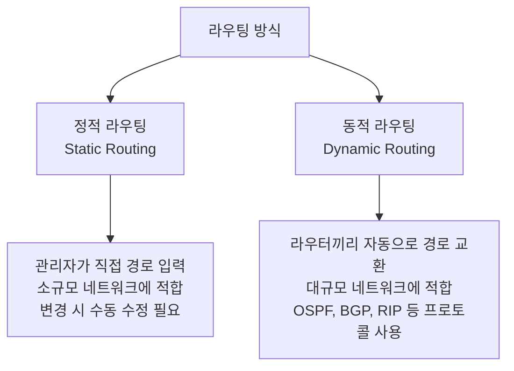

# 라우터 역할과 라우팅 — Static Route 기초 이론

---

# 1장. 라우터(Router)란?

---

## 1.1 라우터의 정의와 역할

라우터(Router)는 **서로 다른 네트워크를 연결하고, IP 주소를 기반으로 패킷이 목적지까지 가는 최적 경로를 결정하는 장비**임.

> **스위치와 라우터의 결정적 차이**  
> 스위치: 같은 네트워크(LAN) 안에서 MAC 주소로 전달  
> 라우터: 서로 다른 네트워크 사이에서 IP 주소로 경로 결정

---

## 1.2 라우터의 핵심 기능 3가지

| 기능 | 설명 |
|---|---|
| **경로 결정 (Path Determination)** | 패킷이 목적지까지 가는 최적 경로를 라우팅 테이블에서 찾음 |
| **패킷 전달 (Packet Forwarding)** | 결정된 경로의 인터페이스로 패킷을 내보냄 |
| **네트워크 분리 (Network Segmentation)** | 서로 다른 IP 대역을 가진 네트워크를 연결·분리 |

---

## 1.3 인터페이스 종류

| 인터페이스 | 설명 | 사용처 |
|---|---|---|
| **FastEthernet (Fa0/0, Fa0/1)** | 100Mbps 이더넷 포트 | LAN 연결 |
| **GigabitEthernet (Gi0/0)** | 1000Mbps 이더넷 포트 | LAN 연결 |
| **Serial (Se0/0/0)** | WAN 직렬 인터페이스 | 라우터 간 WAN 연결 |

> **게이트웨이(Gateway)란?**  
> PC에서 설정하는 기본 게이트웨이(Default Gateway)가 바로 **라우터의 LAN 쪽 IP 주소**임.

---

# 2장. 라우팅(Routing)이란?

---

## 2.1 라우팅의 종류



| 비교 항목 | 정적 라우팅 (Static) | 동적 라우팅 (Dynamic) |
|---|---|---|
| **설정 방법** | 관리자가 직접 입력 | 라우터가 자동으로 학습 |
| **변경 대응** | 수동 수정 필요 | 자동으로 경로 갱신 |
| **적합한 환경** | 소규모, 간단한 네트워크 | 대규모, 복잡한 네트워크 |
| **대표 프로토콜** | ip route 명령어 | OSPF, BGP, RIP |
| **오늘 실습** | ✅ 사용 | — |

---

# 3장. Static Route (정적 라우팅) 상세

---

## 3.1 Static Route 명령어

```
ip route [목적지 네트워크] [서브넷 마스크] [다음 홉 IP 또는 출구 인터페이스]
```

**예시:**

```
Router(config)# ip route 192.168.2.0 255.255.255.0 10.0.0.2
```

---

## 3.2 기본 경로 (Default Route)

```
Router(config)# ip route 0.0.0.0 0.0.0.0 10.0.0.2
```

> 라우팅 테이블에 없는 모든 목적지에 패킷을 보내는 경로임.

---

# 4장. 오늘 실습에서 구성할 토폴로지

---

## 4.1 전체 토폴로지 구조

```
[LAN A: 192.168.1.0/24]     [WAN: 10.0.0.0/30]      [LAN B: 192.168.2.0/24]

  PC0 (192.168.1.10)                                   PC2 (192.168.2.10)
      |                                                       |
  Switch0 — Router0 ——— Se0/0/0 ——— Se0/0/0 ——— Router1 — Switch1
             Fa0/0: 192.168.1.1           Fa0/0: 192.168.2.1
             Se0/0/0: 10.0.0.1            Se0/0/0: 10.0.0.2
```

| 장비 | 인터페이스 | IP 주소 | 서브넷 마스크 |
|---|---|---|---|
| PC0 | NIC | 192.168.1.10 | 255.255.255.0 |
| Router0 | Fa0/0 (LAN) | 192.168.1.1 | 255.255.255.0 |
| Router0 | Se0/0/0 (WAN) | 10.0.0.1 | 255.255.255.252 |
| Router1 | Se0/0/0 (WAN) | 10.0.0.2 | 255.255.255.252 |
| Router1 | Fa0/0 (LAN) | 192.168.2.1 | 255.255.255.0 |
| PC2 | NIC | 192.168.2.10 | 255.255.255.0 |

> **WAN /30 서브넷 이유**: 라우터 간 점대점 연결은 IP 2개만 필요 → 낭비 없이 /30 사용

---

## 4.2 패킷 이동 경로 분석

PC0이 PC2(192.168.2.10)에게 Ping을 보낼 때:

```mermaid
graph LR
    PC0["PC0<br/>192.168.1.10"]
    SW0["Switch0<br/>2계층"]
    R0["Router0<br/>192.168.1.1 | 10.0.0.1"]
    R1["Router1<br/>10.0.0.2 | 192.168.2.1"]
    SW1["Switch1<br/>2계층"]
    PC2["PC2<br/>192.168.2.10"]

    PC0 -->|"DST IP: 192.168.2.10<br/>DST MAC: Router0 MAC"| SW0
    SW0 -->|"2계층 전달"| R0
    R0 -->|"DST IP: 192.168.2.10<br/>DST MAC: Router1 MAC<br/>← MAC 교체!"| R1
    R1 -->|"DST IP: 192.168.2.10<br/>DST MAC: PC2 MAC<br/>← MAC 교체!"| SW1
    SW1 -->|"2계층 전달"| PC2
```



> **IP 주소(192.168.2.10)**: 처음부터 끝까지 변하지 않음.  
> **MAC 주소**: 라우터를 거칠 때마다 다음 장비의 MAC으로 교체됨.

---

# 5장. Cisco IOS 기본 명령어

---

## 5.1 라우터 CLI 진입 모드

```
Router>                  ← 사용자 모드
Router> enable
Router#                  ← 특권 모드
Router# configure terminal
Router(config)#          ← 전역 설정 모드
Router(config)# interface fa0/0
Router(config-if)#       ← 인터페이스 설정 모드
```

## 5.2 자주 쓰는 IOS 명령어

| 명령어 | 모드 | 설명 |
|---|---|---|
| `enable` | 사용자 모드 | 특권 모드로 진입 |
| `configure terminal` | 특권 모드 | 전역 설정 모드 진입 |
| `ip address [IP] [마스크]` | 인터페이스 | IP 주소 설정 |
| `no shutdown` | 인터페이스 | 인터페이스 활성화 |
| `show ip route` | 특권 모드 | 라우팅 테이블 확인 |
| `show ip interface brief` | 특권 모드 | 인터페이스 상태 요약 확인 |
| `ping [IP]` | 특권 모드 | 통신 확인 |

> **`no shutdown` 주의**: Cisco 라우터 인터페이스는 기본이 shutdown 상태임. 반드시 입력해야 함.

---

# 정리

| 개념 | 핵심 내용 |
|---|---|
| **라우터** | 서로 다른 네트워크를 연결, IP 기반 경로 결정 |
| **라우팅 테이블** | 목적지 네트워크별 경로 정보 저장 |
| **Static Route** | 관리자가 직접 입력하는 정적 경로 |
| **기본 경로** | 0.0.0.0/0, 테이블에 없는 모든 목적지에 적용 |
| **no shutdown** | Cisco 라우터 인터페이스 활성화 필수 명령어 |
| **/30 서브넷** | WAN 구간 2개 IP만 필요할 때 사용 |

> **다음 강의 예고**  
> 11강에서는 Packet Tracer에 라우터 2대를 배치하고 LAN-WAN-LAN 토폴로지를 직접 구성함.  
> Static Route 명령어를 입력하고 PC0에서 PC2로 Ping이 성공하는지 확인함.
