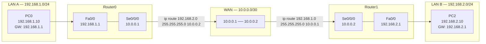

# 라우터 WAN 구간 변경 & Static Route 완성 — 4일차 과제

---

# 1장. 핵심 개념 복습

---

## 1.1 Static Route 설정 흐름 복습



> Static Route는 **양방향** 으로 설정해야 함.  
> Router0에만 설정하면 PC0 → PC2 방향은 되어도 PC2 → PC0 응답이 돌아오지 못함.

---

## 1.2 라우팅 테이블 읽는 법

```
Router0# show ip route

C    192.168.1.0/24 is directly connected, FastEthernet0/0
C    10.0.0.0/30    is directly connected, Serial0/0/0
S    192.168.2.0/24 [1/0] via 10.0.0.2
```

| 코드 | 의미 | 설명 |
|---|---|---|
| **C** | Connected | 라우터 인터페이스에 직접 연결된 네트워크 |
| **S** | Static | 관리자가 `ip route` 로 직접 입력한 경로 |
| **[1/0]** | [AD/Metric] | AD=1(Static 기본값), Metric=0 |

---

# 2장. 4일차 과제

---

## 과제 1 — WAN 구간 IP 변경 및 Static Route 재설정

**[변경 사항]**

| 장비 | 인터페이스 | 기존 IP | 변경 IP |
|---|---|---|---|
| Router0 | Se0/0/0 | 10.0.0.1/30 | **172.16.0.1/30** |
| Router1 | Se0/0/0 | 10.0.0.2/30 | **172.16.0.2/30** |

### 작업 1 — Router0 WAN IP 변경

```
Router0# configure terminal
Router0(config)# interface se0/0/0
Router0(config-if)# ip address __________ __________
Router0(config-if)# no shutdown
Router0(config-if)# exit
```

### 작업 2 — Router1 WAN IP 변경

```
Router1# configure terminal
Router1(config)# interface se0/0/0
Router1(config-if)# ip address __________ __________
Router1(config-if)# no shutdown
Router1(config-if)# exit
```

### 작업 3 — Router0 Static Route 재설정

```
[기존 경로 제거]
Router0(config)# no ip route 192.168.2.0 255.255.255.0 10.0.0.2

[새 경로 추가]
Router0(config)# ip route 192.168.2.0 255.255.255.0 __________
```

### 작업 4 — Router1 Static Route 재설정

```
[기존 경로 제거]
Router1(config)# no ip route 192.168.1.0 255.255.255.0 10.0.0.1

[새 경로 추가]
Router1(config)# ip route 192.168.1.0 255.255.255.0 __________
```

### 작업 5 — 통신 테스트 및 캡처

```
PC0> ping 192.168.2.10
```

---

## 과제 2 — 라우팅 테이블 해석

```
Router0# show ip route

C    192.168.1.0/24 is directly connected, FastEthernet0/0
C    172.16.0.0/30  is directly connected, Serial0/0/0
S    192.168.2.0/24 [1/0] via 172.16.0.2
```

| 질문 | 답 |
|---|---|
| Router0의 LAN 쪽 인터페이스 IP는? | |
| WAN 구간 네트워크 대역은? | |
| 192.168.2.0/24 네트워크로 가는 다음 홉(Next Hop) IP는? | |
| `S` 코드의 의미는? | |
| Router0에서 `ping 192.168.2.10` 성공 여부는? (왜?) | |

---

## 과제 3 — Static Route 명령어 직접 작성

**[조건]**

```
LAN A: 10.10.1.0/24   ← Router A의 Fa0/0 연결
WAN:   172.30.0.0/30  ← Router A: 172.30.0.1 / Router B: 172.30.0.2
LAN B: 10.10.2.0/24   ← Router B의 Fa0/0 연결
```

```
[Router A에 입력할 Static Route]
ip route __________ __________ __________

[Router B에 입력할 Static Route]
ip route __________ __________ __________
```

---

## 제출 방법

| 제출 항목 | 내용 |
|---|---|
| **① 과제 1 캡처** | `show ip route` 결과 (Router0, Router1 각 1장) |
| **② 과제 1 캡처** | PC0에서 `ping 192.168.2.10` 성공 결과 |
| **③ 과제 2 표** | 빈칸 채운 라우팅 테이블 해석 표 |
| **④ 과제 3 답** | Static Route 명령어 완성본 |

---

## 추가 도전 과제 (선택)

| 도전 항목 | 내용 |
|---|---|
| **도전 1** | Simulation Mode로 패킷 경로 추적 (라우터마다 MAC 교체 확인) |
| **도전 2** | `no ip route` 로 Static Route 삭제 → Ping 실패 확인 → 복구하기 |
| **도전 3** | LAN A에 PC1 (192.168.1.20) 추가 후 PC1 ↔ PC2 통신 — Static Route 추가 불필요 이유 설명하기 |

---

# 3장. 4일차 전체 복습

---

## 라우터 설정 전체 명령어 흐름

```
enable
configure terminal
hostname Router0

interface fa0/0
  ip address 192.168.1.1 255.255.255.0
  no shutdown
  exit

interface se0/0/0
  ip address 172.16.0.1 255.255.255.252
  clock rate 64000
  no shutdown
  exit

ip route 192.168.2.0 255.255.255.0 172.16.0.2

end
show ip route
show ip interface brief
```

---

## 핵심 개념 총정리 (4일차)

| 개념 | 설명 |
|---|---|
| **라우터** | 서로 다른 IP 네트워크를 연결·경로 결정 |
| **Static Route** | 관리자가 직접 입력한 정적 경로 (`ip route`) |
| **기본 경로** | 0.0.0.0/0 — 테이블에 없는 모든 목적지에 적용 |
| **no shutdown** | 라우터 인터페이스 활성화 필수 명령어 |
| **clock rate** | Serial DCE 쪽 라우터에서 WAN 클럭 속도 설정 |
| **/30 서브넷** | WAN 점대점 연결에 사용 (호스트 IP 2개) |
| **TTL 감소** | 라우터 1개 통과 시 TTL 1 감소 → 홉 수 파악 가능 |
| **show ip route** | 라우팅 테이블 확인 명령어 |

> **내일 예고 (Day 5)**  
> Day 1~4 전체 내용을 복습하고, 지금까지 만든 모든 토폴로지를 하나로 통합하여  
> PC → 스위치 → 라우터 → 라우터 → 웹서버까지 전 구간 패킷 경로를 Simulation Mode로 추적함.
