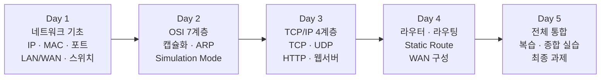
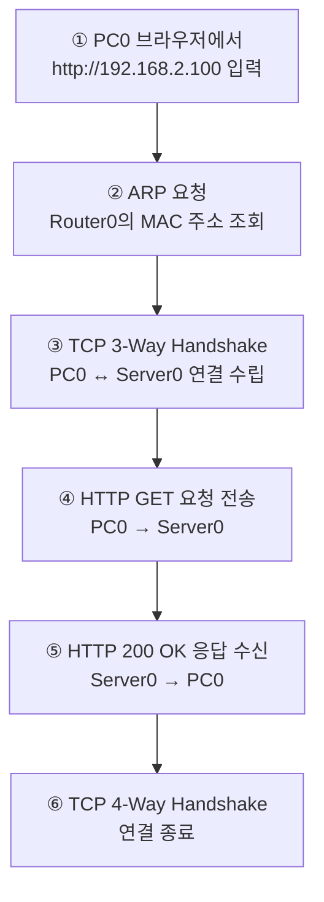
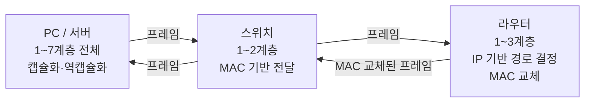

# 전체 흐름 복습 — PC → 스위치 → 라우터 → 라우터 → 서버

---

# 1장. 5일간 배운 내용 한눈에 보기

---

## 1.1 커리큘럼 전체 흐름



---

## 1.2 배운 핵심 개념 총정리

| 일차 | 핵심 개념 | 대표 프로토콜/장비 |
|---|---|---|
| Day 1 | 패킷, IP/MAC/포트 주소, LAN/WAN | 스위치, 라우터, UTP 케이블 |
| Day 2 | OSI 7계층, 캡슐화, ARP, Simulation Mode | 이더넷 프레임, ICMP |
| Day 3 | TCP/IP 4계층, TCP 3-Way Handshake, HTTP | TCP, UDP, HTTP |
| Day 4 | 라우터, 라우팅 테이블, Static Route, IOS | ip route, show ip route |
| Day 5 | 전체 통합 복습, 종합 실습, 최종 과제 | — |

---

# 2장. 전체 통신 흐름 완전 분석

---

## 2.1 오늘 분석할 시나리오

PC0이 웹 서버(Server0)에 HTTP 요청을 보내는 전 과정을 분석함.

**토폴로지:**

```
[LAN A: 192.168.1.0/24]   [WAN: 10.0.0.0/30]    [LAN B: 192.168.2.0/24]

  PC0 (192.168.1.10)                               Server0 (192.168.2.100)
        |                                                     |
    Switch0 — Router0 ——— Se0/0/0 ——— Se0/0/0 ——— Router1 — Switch1
               Fa0/0: 192.168.1.1              Fa0/0: 192.168.2.1
               Se0/0/0: 10.0.0.1               Se0/0/0: 10.0.0.2
```

**각 장비 설정 요약:**

| 장비 | IP 주소 | 서브넷 마스크 | 게이트웨이 |
|---|---|---|---|
| PC0 | 192.168.1.10 | 255.255.255.0 | 192.168.1.1 |
| Router0 Fa0/0 | 192.168.1.1 | 255.255.255.0 | — |
| Router0 Se0/0/0 | 10.0.0.1 | 255.255.255.252 | — |
| Router1 Se0/0/0 | 10.0.0.2 | 255.255.255.252 | — |
| Router1 Fa0/0 | 192.168.2.1 | 255.255.255.0 | — |
| Server0 | 192.168.2.100 | 255.255.255.0 | 192.168.2.1 |

---

## 2.2 전체 통신 순서 개요



---

## 2.3 단계별 상세 분석

---

### ① ARP — 게이트웨이 MAC 주소 조회

PC0이 192.168.2.100으로 패킷을 보내려면 먼저 **게이트웨이(Router0: 192.168.1.1)의 MAC 주소**가 필요함.

```
[ARP Request — PC0 → 브로드캐스트 (FF:FF:FF:FF:FF:FF)]
─────────────────────────────────────────────────
2계층: DST MAC = FF:FF:FF:FF:FF:FF (브로드캐스트)
       SRC MAC = PC0의 MAC
3계층: ARP 패킷 (Who has 192.168.1.1? Tell 192.168.1.10)
─────────────────────────────────────────────────

[ARP Reply — Router0 → PC0]
─────────────────────────────────────────────────
2계층: DST MAC = PC0의 MAC
       SRC MAC = Router0 Fa0/0의 MAC
3계층: ARP 패킷 (192.168.1.1 is at AA:BB:CC:DD:EE:FF)
─────────────────────────────────────────────────
```

> **중요**: PC0의 ARP 테이블에 게이트웨이 MAC이 저장됨.  
> 이후 모든 외부 패킷은 이 MAC 주소를 목적지 MAC으로 사용함.

---

### ② TCP SYN — 연결 요청 (PC0 → Server0)

**PC0 → Switch0 구간 패킷:**

```
┌──────────────────────────────────────────────────────────┐
│ 2계층 (Ethernet Frame)                                    │
│   DST MAC: Router0 Fa0/0 MAC  ← 게이트웨이 MAC            │
│   SRC MAC: PC0 MAC                                        │
├──────────────────────────────────────────────────────────┤
│ 3계층 (IP Packet)                                         │
│   DST IP: 192.168.2.100  ← 최종 목적지 Server0           │
│   SRC IP: 192.168.1.10                                    │
│   TTL: 128                                                │
├──────────────────────────────────────────────────────────┤
│ 4계층 (TCP Segment)                                       │
│   DST Port: 80 (HTTP)                                     │
│   SRC Port: 1025 (임시 포트)                              │
│   SYN Flag: Set                                           │
└──────────────────────────────────────────────────────────┘
```

**Switch0 처리:**
- 2계층(MAC)만 확인
- MAC 테이블에서 DST MAC(Router0) 찾아 해당 포트로 전달
- IP, TCP 내용 보지 않음

---

### ③ Router0 처리 — MAC 교체 + 라우팅 (핵심!)

Router0이 패킷을 받으면:

```
[수신 — Router0이 받은 패킷]
   DST MAC: Router0 Fa0/0 MAC  ← 자기 MAC이므로 수신
   DST IP: 192.168.2.100

[Router0의 처리 과정]
1. 2계층: MAC 헤더 제거 (역캡슐화)
2. 3계층: DST IP 192.168.2.100 확인
         라우팅 테이블 조회:
         S 192.168.2.0/24 [1/0] via 10.0.0.2  ← Static Route 검색!
         → 10.0.0.2 방향으로 보내야 함
3. 2계층: 새 MAC 헤더 추가 (재캡슐화)
         DST MAC = Router1 Se0/0/0 MAC  ← MAC이 바뀜!
         SRC MAC = Router0 Se0/0/0 MAC
4. TTL: 128 → 127 (1 감소)
5. Se0/0/0으로 출력

[Router0이 내보낸 패킷]
   DST MAC: Router1 Se0/0/0 MAC  ← 교체됨!
   SRC MAC: Router0 Se0/0/0 MAC
   DST IP: 192.168.2.100         ← 변하지 않음
   SRC IP: 192.168.1.10          ← 변하지 않음
   TTL: 127                      ← 1 감소
```

---

### ④ Router1 처리 — MAC 교체 + LAN 전달

```
[Router1이 받은 패킷]
   DST MAC: Router1 Se0/0/0 MAC  ← 자기 MAC이므로 수신
   DST IP: 192.168.2.100

[Router1의 처리 과정]
1. 2계층: MAC 헤더 제거
2. 3계층: DST IP 192.168.2.100 확인
         라우팅 테이블:
         C 192.168.2.0/24 is directly connected, FastEthernet0/0  ← 직접 연결!
         → 직접 ARP로 Server0 MAC 조회 후 전달
3. 2계층: 새 MAC 헤더 추가
         DST MAC = Server0 MAC  ← 또 바뀜!
         SRC MAC = Router1 Fa0/0 MAC
4. TTL: 127 → 126
5. Fa0/0으로 출력

[Router1이 내보낸 패킷]
   DST MAC: Server0 MAC          ← 교체됨!
   DST IP: 192.168.2.100         ← 변하지 않음
   TTL: 126
```

---

### ⑤ Server0 수신 — 역캡슐화 및 응답

```
[Server0 수신 처리]
1계층: 전기신호 수신
2계층: DST MAC = 자기 MAC ← 수신 확정. MAC 헤더 제거
3계층: DST IP = 192.168.2.100 = 자기 IP ← 수신 확정. IP 헤더 제거
4계층: DST Port = 80 = HTTP 서비스 포트. TCP 헤더 제거
7계층: HTTP GET 요청 처리 → HTTP 200 OK 응답 생성
```

**응답 패킷 전송 시 반대 방향으로 동일하게 동작:**

```
Server0 → Router1 → Router0 → Switch0 → PC0
(각 라우터에서 MAC 교체, TTL 감소)
```

---

## 2.4 구간별 MAC/IP 주소 변화 정리

| 구간 | DST MAC | SRC MAC | DST IP | SRC IP | TTL |
|---|---|---|---|---|---|
| PC0 → Switch0 → Router0 | Router0 Fa0/0 | PC0 | 192.168.2.100 | 192.168.1.10 | 128 |
| Router0 → Router1 | Router1 Se0/0/0 | Router0 Se0/0/0 | 192.168.2.100 | 192.168.1.10 | 127 |
| Router1 → Switch1 → Server0 | Server0 | Router1 Fa0/0 | 192.168.2.100 | 192.168.1.10 | 126 |

> **핵심 원칙**  
> IP 주소 (DST/SRC): 처음부터 끝까지 **절대 변하지 않음**  
> MAC 주소 (DST/SRC): 라우터를 거칠 때마다 **다음 장비 MAC으로 교체**  
> TTL: 라우터 1개 통과 시 **1씩 감소**

---

# 3장. 장비별 역할 최종 정리

---

## 3.1 장비별 OSI 계층 처리 범위



| 장비 | 계층 | 기준 | 주요 동작 |
|---|---|---|---|
| **PC / 서버** | 1~7계층 | — | 캡슐화·역캡슐화, HTTP/TCP/IP/MAC 헤더 생성·제거 |
| **스위치** | 1~2계층 | MAC 주소 | MAC 테이블 조회 → 해당 포트로 프레임 전달 |
| **라우터** | 1~3계층 | IP 주소 | 라우팅 테이블 조회 → MAC 교체 → 다음 홉으로 패킷 전달 |

---

## 3.2 라우팅 테이블 vs MAC 테이블 비교

| 비교 항목 | 라우팅 테이블 (라우터) | MAC 테이블 (스위치) |
|---|---|---|
| **저장 정보** | 목적지 네트워크, 다음 홉 IP | MAC 주소, 연결된 포트 번호 |
| **학습 방법** | 직접 연결(C), Static(S), 동적(O 등) | 프레임 수신 시 자동 학습 |
| **확인 명령어** | `show ip route` | `show mac-address-table` |
| **적용 범위** | 네트워크 간 (LAN→WAN→LAN) | 같은 LAN 내부 |

---

## 3.3 TCP/IP 4계층 흐름 최종 정리

```
[PC0에서 Server0으로 HTTP GET 보낼 때]

TCP/IP 4계층      OSI 7계층       PDU          내용
─────────────────────────────────────────────────────
응용 계층         7계층 응용      Data         GET / HTTP/1.1
                  6계층 표현
                  5계층 세션
─────────────────────────────────────────────────────
전송 계층         4계층 전송      Segment      TCP 헤더
                                               (포트 1025→80, SYN/ACK)
─────────────────────────────────────────────────────
인터넷 계층       3계층 네트워크  Packet       IP 헤더
                                               (192.168.1.10→192.168.2.100)
─────────────────────────────────────────────────────
네트워크 접속     2계층 데이터링크 Frame       Ethernet 헤더
계층              1계층 물리      Bit          (MAC, FCS) + 전기신호
─────────────────────────────────────────────────────
```

---

# 4장. Static Route 완전 정리

---

## 4.1 Static Route 양방향 설정 필수

```
[Router0]                              [Router1]
ip route 192.168.2.0 255.255.255.0 10.0.0.2   ip route 192.168.1.0 255.255.255.0 10.0.0.1

이유: 패킷이 오가는 방향이 모두 있어야 통신이 완성됨
PC0 → Server0: Router0의 경로 필요
Server0 → PC0(응답): Router1의 경로 필요
```

## 4.2 Static Route 없을 때 발생하는 일

```
[Router0에만 경로 설정한 경우]

PC0 → Server0 방향: ✅ (Router0이 192.168.2.0 경로 알고 있음)
Server0 → PC0 응답: ❌ (Router1이 192.168.1.0 경로 모름 → 패킷 버림)

결과: Ping Request는 도달하지만 Reply가 돌아오지 못함
      → "Request timeout" 발생
```

---

# 5장. 오늘 실습 사전 준비

---

## 5.1 14강 실습 토폴로지 미리 보기

내일 실습에서 구성할 **Day 1~4 통합 토폴로지**:

```
[LAN A: 192.168.1.0/24]    [WAN]    [LAN B: 192.168.2.0/24]

  PC0 (192.168.1.10)                  Server0 (192.168.2.100)
  PC1 (192.168.1.20)                     |
      |                                Switch1
   Switch0                                |
      |                             Router1 (Fa0/0: 192.168.2.1)
   Router0 (Fa0/0: 192.168.1.1)          |
      | Se0/0/0: 10.0.0.1     Se0/0/0: 10.0.0.2
      └────────── WAN ─────────────────┘
```

**14강 실습에서 해야 할 것:**
1. 위 토폴로지를 Packet Tracer에서 완성
2. Server0에 HTTP 서비스 설정
3. PC0 브라우저로 `http://192.168.2.100` 접속 성공
4. Simulation Mode로 전 구간 패킷 경로 추적

---

## 5.2 설정 체크리스트

| 항목 | 확인 내용 | 상태 |
|---|---|---|
| PC0 IP | 192.168.1.10 / 255.255.255.0 / GW: 192.168.1.1 | |
| PC1 IP | 192.168.1.20 / 255.255.255.0 / GW: 192.168.1.1 | |
| Router0 Fa0/0 | 192.168.1.1 / 255.255.255.0 + no shutdown | |
| Router0 Se0/0/0 | 10.0.0.1 / 255.255.255.252 + clock rate + no shutdown | |
| Router1 Se0/0/0 | 10.0.0.2 / 255.255.255.252 + no shutdown | |
| Router1 Fa0/0 | 192.168.2.1 / 255.255.255.0 + no shutdown | |
| Server0 IP | 192.168.2.100 / 255.255.255.0 / GW: 192.168.2.1 | |
| Server0 HTTP | Services → HTTP → On | |
| Router0 Static Route | ip route 192.168.2.0 255.255.255.0 10.0.0.2 | |
| Router1 Static Route | ip route 192.168.1.0 255.255.255.0 10.0.0.1 | |

---

# 정리

| 핵심 내용 | 요약 |
|---|---|
| **MAC 주소 변화** | 라우터를 거칠 때마다 DST/SRC MAC 교체. IP는 불변. |
| **TTL 감소** | 라우터 1개 통과 = TTL 1 감소. 128→127→126 |
| **ARP 역할** | IP 주소로 MAC 주소를 알아냄. 게이트웨이 MAC 조회에 필수. |
| **Static Route 양방향** | 요청(→)과 응답(←) 양쪽 모두 경로 설정 필요. |
| **스위치 역할** | MAC 기반 전달. IP·TCP·HTTP 내용 보지 않음. |
| **라우터 역할** | IP 기반 경로 결정. MAC 헤더 교체. TTL 감소. |

> **다음 강의 예고**  
> 14강에서는 오늘 복습한 내용을 바탕으로 Day 1~4 토폴로지를 Packet Tracer에서 통합 완성하고,  
> PC0 브라우저로 Server0에 실제 HTTP 접속한 뒤 Simulation Mode로 전 구간을 추적함.
