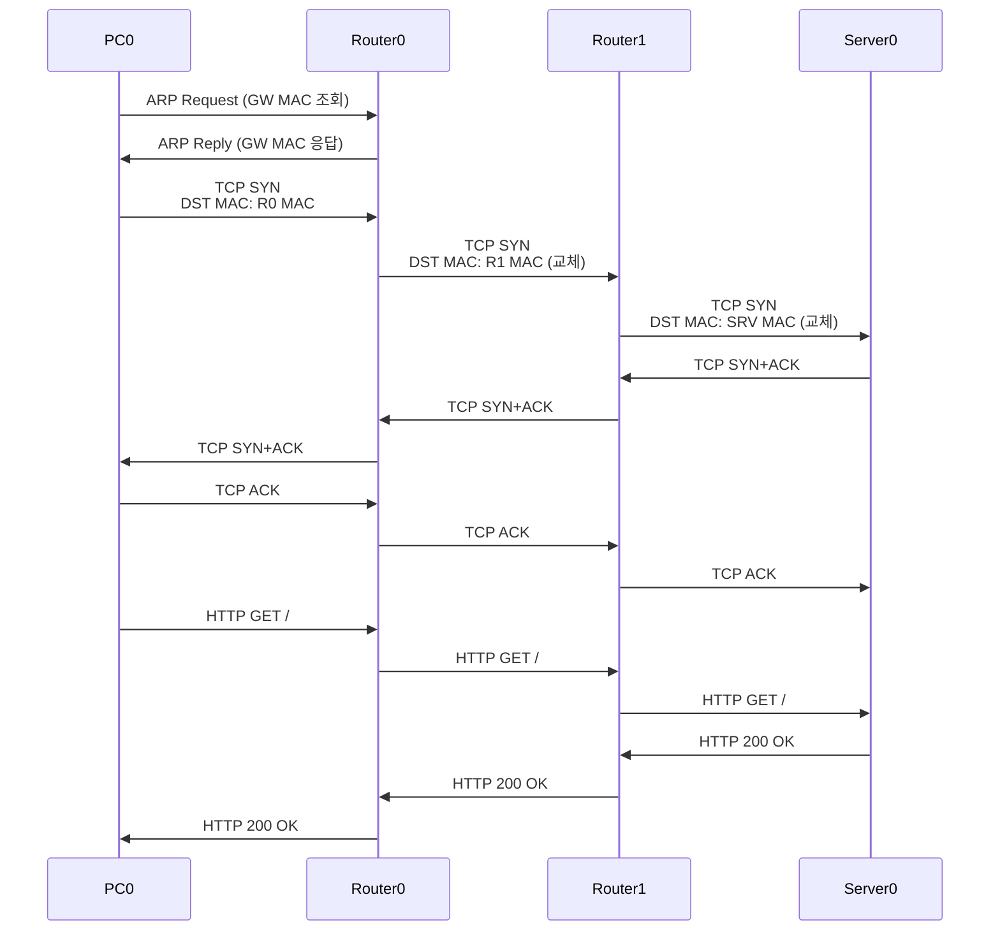

# Day1~4 통합 토폴로지 완성 & 전 구간 패킷 추적 실습

---

# 1장. 실습 목표

---

## 1.1 이번 실습의 의미

이 실습은 **5일간 배운 모든 내용을 하나의 토폴로지에 담아** 완성하는 최종 종합 실습임.

- Day 1: PC + 스위치 LAN 구성
- Day 2: Simulation Mode로 패킷 관찰
- Day 3: 웹서버 추가 + HTTP 통신
- Day 4: 라우터 2대 + Static Route
- **Day 5**: 위 모든 요소를 하나로 통합 → 전 구간 추적

---

## 1.2 완성 목표 토폴로지

```
[LAN A: 192.168.1.0/24]      [WAN: 10.0.0.0/30]       [LAN B: 192.168.2.0/24]

  PC0 (192.168.1.10)                                    Server0 (192.168.2.100)
  PC1 (192.168.1.20)                                          |
       |                                                   Switch1
   Switch0                                                     |
       |                                              Router1 (Fa0/0: 192.168.2.1)
   Router0 (Fa0/0: 192.168.1.1)                              |
   (Se0/0/0: 10.0.0.1) ──────── WAN ────── (Se0/0/0: 10.0.0.2)
```

**실습 성공 기준:**

| 기준 | 확인 방법 |
|---|---|
| ① PC0 → Server0 Ping 성공 | `ping 192.168.2.100` → 0% loss |
| ② PC0 브라우저 → Server0 HTTP 접속 성공 | Web Browser → 페이지 표시 |
| ③ Simulation Mode에서 전 구간 패킷 추적 | ARP → TCP SYN → HTTP GET → 200 OK 관찰 |

---

# 2장. Step-by-Step 실습 — 토폴로지 구성

---

## Step 1 — 새 파일 생성

1. Packet Tracer 실행
2. `File` → `New` (Ctrl+N)
3. 빈 작업 공간 확인

---

## Step 2 — 전체 장비 배치

아래 순서로 장비를 배치함.

| 장비 | 패널 | 모델 | 수량 | 배치 위치 |
|---|---|---|---|---|
| PC | End Devices | PC-PT | 2대 | 좌측 (PC0, PC1) |
| Switch | Switches | 2960 | 2대 | PC 옆 (Switch0, Switch1) |
| Router | Routers | 1941 | 2대 | 중앙 (Router0, Router1) |
| Server | End Devices | Server-PT | 1대 | 우측 (Server0) |

**권장 배치:**

```
[PC0]                                              [Server0]
[PC1]  [Switch0]  [Router0]  [Router1]  [Switch1]
```

---

## Step 3 — LAN A 케이블 연결

1. Connections → `Auto` 케이블 선택
2. `PC0` ↔ `Switch0`
3. `PC1` ↔ `Switch0`
4. `Switch0` ↔ `Router0` (Router0의 **Fa0/0** 포트)

---

## Step 4 — WAN 케이블 연결

1. Connections → **`Serial DCE`** 케이블 선택
2. `Router0` 의 **Se0/0/0** 클릭
3. `Router1` 의 **Se0/0/0** 클릭

> Serial DCE를 Router0에 먼저 연결했으므로 Router0이 DCE 쪽임.  
> → Router0에서 `clock rate 64000` 명령어 필요.

---

## Step 5 — LAN B 케이블 연결

1. `Router1` (Fa0/0) ↔ `Switch1`
2. `Switch1` ↔ `Server0`

---

## Step 6 — 연결 상태 초기 확인

모든 포트가 **빨간색 불** → 정상 (아직 IP 미설정)

---

# 3장. Step-by-Step 실습 — IP 설정

---

## Step 7 — PC0 IP 설정

`PC0` 더블클릭 → `Desktop` → `IP Configuration`

| 항목 | 값 |
|---|---|
| IP Address | `192.168.1.10` |
| Subnet Mask | `255.255.255.0` |
| Default Gateway | `192.168.1.1` |

---

## Step 8 — PC1 IP 설정

`PC1` 더블클릭 → `Desktop` → `IP Configuration`

| 항목 | 값 |
|---|---|
| IP Address | `192.168.1.20` |
| Subnet Mask | `255.255.255.0` |
| Default Gateway | `192.168.1.1` |

---

## Step 9 — Router0 전체 설정

`Router0` 더블클릭 → `CLI` 탭 → 아래 명령어 순서대로 입력

```
Router> enable
Router# configure terminal
Router(config)# hostname Router0

Router0(config)# interface fa0/0
Router0(config-if)# ip address 192.168.1.1 255.255.255.0
Router0(config-if)# no shutdown
Router0(config-if)# exit

Router0(config)# interface se0/0/0
Router0(config-if)# ip address 10.0.0.1 255.255.255.252
Router0(config-if)# clock rate 64000
Router0(config-if)# no shutdown
Router0(config-if)# exit

Router0(config)# ip route 192.168.2.0 255.255.255.0 10.0.0.2
Router0(config)# end
```

---

## Step 10 — Router1 전체 설정

`Router1` 더블클릭 → `CLI` 탭

```
Router> enable
Router# configure terminal
Router(config)# hostname Router1

Router1(config)# interface se0/0/0
Router1(config-if)# ip address 10.0.0.2 255.255.255.252
Router1(config-if)# no shutdown
Router1(config-if)# exit

Router1(config)# interface fa0/0
Router1(config-if)# ip address 192.168.2.1 255.255.255.0
Router1(config-if)# no shutdown
Router1(config-if)# exit

Router1(config)# ip route 192.168.1.0 255.255.255.0 10.0.0.1
Router1(config)# end
```

---

## Step 11 — Server0 IP 설정 및 HTTP 서비스 확인

**IP 설정:**

`Server0` 더블클릭 → `Config` 탭 → `FastEthernet0`

| 항목 | 값 |
|---|---|
| IP Address | `192.168.2.100` |
| Subnet Mask | `255.255.255.0` |
| Default Gateway | `192.168.2.1` |

**HTTP 서비스 확인:**

`Server0` 더블클릭 → `Services` 탭 → `HTTP` → **`On`** 확인

---

# 4장. Step-by-Step 실습 — 통신 테스트

---

## Step 12 — 단계별 Ping 테스트

아래 순서로 통신 범위를 점차 넓혀가며 테스트함.

**PC0에서 순서대로 실행:**

```
[1단계] 게이트웨이 확인
PC0> ping 192.168.1.1
→ 성공 필수

[2단계] WAN 건너편 라우터 확인
PC0> ping 10.0.0.2
→ 성공 필수 (라우터 2개 거침)

[3단계] LAN B 게이트웨이 확인
PC0> ping 192.168.2.1
→ 성공 필수

[4단계] 최종 목표: 서버 통신 확인
PC0> ping 192.168.2.100
→ 성공 필수! TTL=126 확인
```

---

## Step 13 — 웹 브라우저로 HTTP 접속

1. `PC0` 더블클릭 → `Desktop` → **`Web Browser`**
2. 주소창에 입력

```
http://192.168.2.100
```

3. `Go` 버튼 클릭
4. **Cisco Packet Tracer 기본 페이지** 표시 → 성공 ✅

---

# 5장. Step-by-Step 실습 — Simulation Mode 전 구간 패킷 추적

---

## Step 14 — Simulation Mode 진입 및 필터 설정

1. 우측 하단 **`Simulation`** 탭 클릭
2. **`Edit Filters`** → `Show All/None` 으로 전체 해제
3. 아래 4가지만 선택

| 프로토콜 | 관찰 목적 |
|---|---|
| **ARP** | 게이트웨이 MAC 조회 과정 |
| **TCP** | 3-Way Handshake 관찰 |
| **HTTP** | GET 요청·응답 내용 확인 |
| **ICMP** | Ping 패킷 (선택) |

---

## Step 15 — HTTP 요청 발생

1. `PC0` 더블클릭 → `Desktop` → `Web Browser`
2. `http://192.168.2.100` 입력 → `Go`
3. Simulation Mode 이벤트 리스트에 이벤트 추가 확인

---

## Step 16 — 구간별 패킷 추적 (핵심!)

`Capture/Forward` 버튼을 한 번씩 클릭하며 아래 체크 포인트를 순서대로 확인함.

---

### 체크포인트 1 — ARP (PC0 → Switch0)

패킷 클릭 → PDU 창 → **Outbound PDU Details** 탭

```
확인 항목:
- Type: ARP
- Sender IP: 192.168.1.10  (PC0)
- Target IP: 192.168.1.1   (Router0 = 게이트웨이)
- DST MAC: FF:FF:FF:FF:FF:FF  (브로드캐스트)
```

---

### 체크포인트 2 — Switch0 통과

Switch0 클릭 → PDU 창

```
확인 항목:
- Layer 1: 신호 수신·재전송 ✅
- Layer 2: MAC 테이블 조회 ✅
- Layer 3: 처리 없음 (비어있음) ← 스위치는 IP 안 봄
```

---

### 체크포인트 3 — TCP SYN (PC0 출발)

TCP SYN 패킷 클릭 → **OSI Model** 탭

```
확인 항목:
Layer 4 - TCP:
  SRC Port: 1025
  DST Port: 80
  SYN Flag: Set

Layer 3 - IP:
  SRC IP: 192.168.1.10
  DST IP: 192.168.2.100   ← 최종 목적지

Layer 2 - Ethernet:
  DST MAC: [Router0 Fa0/0 MAC]  ← 게이트웨이 MAC
  SRC MAC: [PC0 MAC]
```

---

### 체크포인트 4 — Router0 통과 (MAC 교체 확인!)

Router0에서 패킷 클릭 → **OSI Model** 탭 → Inbound/Outbound 비교

```
[Inbound — Router0가 받은 패킷]
  DST MAC: Router0 Fa0/0 MAC
  SRC MAC: PC0 MAC
  DST IP: 192.168.2.100
  TTL: 128

[Outbound — Router0가 내보낸 패킷]
  DST MAC: Router1 Se0/0/0 MAC  ← 교체됨!
  SRC MAC: Router0 Se0/0/0 MAC  ← 교체됨!
  DST IP: 192.168.2.100          ← 그대로
  TTL: 127                       ← 1 감소!
```

> **이것이 라우터의 핵심 동작!**  
> IP는 변하지 않고 MAC만 다음 구간에 맞게 교체됨.

---

### 체크포인트 5 — Router1 통과 (MAC 2차 교체)

```
[Inbound]
  DST MAC: Router1 Se0/0/0 MAC
  TTL: 127

[Outbound]
  DST MAC: Server0 MAC  ← 또 교체됨!
  SRC MAC: Router1 Fa0/0 MAC
  TTL: 126              ← 또 1 감소!
```

---

### 체크포인트 6 — HTTP GET 패킷 (Layer 7 확인)

HTTP GET 패킷 클릭 → OSI Model 탭

```
Layer 7 - HTTP:
  Request Method: GET
  URL: /
  HTTP Version: HTTP/1.1
  Host: 192.168.2.100

← 이 내용을 볼 수 있는 장비: PC0과 Server0만!
← Switch0, Router0, Router1은 이 내용을 전혀 보지 않음
```

---

### 체크포인트 7 — HTTP 200 OK 응답 (반대 방향)

Server0에서 PC0으로 돌아오는 패킷 관찰.

```
Layer 7 - HTTP:
  Response Code: 200
  Response Phrase: OK
  Content-Type: text/html

Layer 3:
  SRC IP: 192.168.2.100  ← Server0
  DST IP: 192.168.1.10   ← PC0
```

---

## Step 17 — Realtime Mode 복귀 및 결과 확인

1. **`Realtime`** 탭 클릭
2. PC0 Web Browser에 웹 페이지 완전히 표시 확인
3. PC1에서도 동일하게 `http://192.168.2.100` 접속하여 성공 확인

---

# 6장. 전체 이벤트 흐름 최종 정리



---

# 7장. 트러블슈팅 체크리스트

| 증상 | 원인 후보 | 확인 방법 |
|---|---|---|
| 게이트웨이 Ping 실패 | Router0 Fa0/0 설정 오류 | `show ip interface brief` |
| WAN Ping 실패 | clock rate 미설정 또는 Se0/0/0 IP 오류 | `show ip interface brief` (Protocol 확인) |
| Server0 Ping 실패 | Static Route 누락 | `show ip route` (S 경로 확인) |
| 웹 접속 실패 (Ping은 성공) | Server0 HTTP 서비스 Off | `Services → HTTP → On` 확인 |
| TTL=128 (감소 없음) | 같은 LAN 안 통신 | 정상 (라우터 안 거침) |
| TTL=126 | 라우터 2개 거침 | 정상 (128-2=126) |

---

# 정리

| 실습 항목 | 완료 기준 |
|---|---|
| **토폴로지 구성** | 장비 6개 + 케이블 연결 완료, 포트 녹색 불 |
| **IP 설정** | 모든 장비 IP/마스크/GW 설정, Router no shutdown |
| **Static Route** | Router0·Router1 양방향 설정, show ip route 에 S 경로 |
| **Ping 테스트** | PC0 → Server0 ping 성공 (TTL=126) |
| **HTTP 접속** | Web Browser → 페이지 표시 |
| **패킷 추적** | MAC 교체·TTL 감소·HTTP 내용 확인 |

> **다음 강의 예고**  
> 15강에서는 오늘 완성한 토폴로지를 최종 과제로 제출하고,  
> 각 장비의 역할을 설명하는 보고서를 작성함.
