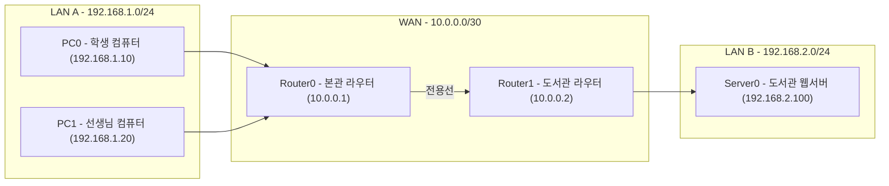
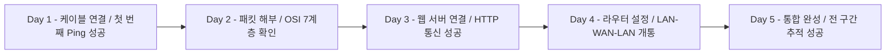

# 최종 평가 — 내가 만든 네트워크, 내가 증명한다

---

# 오늘은 평가가 아니라 미션이다

5일 동안 배운 것들을 한 번에 쏟아붓는 날임.
오늘 만드는 토폴로지는 **지금까지 배운 모든 것의 집합체**임.

> 단순히 정답을 찾는 게 아니라,
> **직접 네트워크를 만들고, 실제로 통신이 되는지 증명하는 것**이 목표임.

---

# 1장. 최종 미션 브리핑

---

## 미션 개요

**시나리오:**
학교 본관(LAN A)에 있는 학생 PC에서
WAN을 건너
도서관 서버실(LAN B)에 있는 웹 서버에 접속하려 함.

네트워크 엔지니어로서 이 통신이 되도록 구성해야 함.



---

## 미션 목표 5가지

아래 5가지를 모두 달성해야 미션 완료임.

| 미션 | 목표 | 성공 기준 |
|---|---|---|
| **미션 1** | 네트워크 구성 | 토폴로지 완성 + 포트 녹색 불 |
| **미션 2** | 내부 통신 확인 | PC0 → Router0 Ping 성공 |
| **미션 3** | 외부 통신 확인 | PC0 → Server0 Ping 성공 (TTL=126) |
| **미션 4** | 웹 접속 성공 | PC0 브라우저 → 도서관 서버 페이지 표시 |
| **미션 5** | 패킷 추적 | Simulation Mode에서 MAC 교체 확인 |

---

# 2장. IP 설정표 (엔지니어 배포 자료)

---

## 네트워크 설계서

실제 현장에서는 이 설계서를 보고 장비를 설정함. 그대로 따라 입력하면 됨.

| 장비 | 인터페이스 | IP 주소 | 서브넷 마스크 | 게이트웨이 |
|---|---|---|---|---|
| **PC0** | NIC | `192.168.1.10` | `255.255.255.0` | `192.168.1.1` |
| **PC1** | NIC | `192.168.1.20` | `255.255.255.0` | `192.168.1.1` |
| **Router0** | Fa0/0 (본관 LAN) | `192.168.1.1` | `255.255.255.0` | — |
| **Router0** | Se0/0/0 (WAN) | `10.0.0.1` | `255.255.255.252` | — |
| **Router1** | Se0/0/0 (WAN) | `10.0.0.2` | `255.255.255.252` | — |
| **Router1** | Fa0/0 (도서관 LAN) | `192.168.2.1` | `255.255.255.0` | — |
| **Server0** | NIC | `192.168.2.100` | `255.255.255.0` | `192.168.2.1` |

---

# 3장. 미션 진행 — 체크리스트 방식

---

## 설정 체크리스트

각 단계를 완료할 때마다 체크함.

### [STEP 1] 장비 배치

```
□ PC0, PC1 배치 (End Devices → PC-PT)
□ Switch0, Switch1 배치 (Switches → 2960)
□ Router0, Router1 배치 (Routers → 1941)
□ Server0 배치 (End Devices → Server-PT)
```

### [STEP 2] 케이블 연결

```
□ PC0 ↔ Switch0
□ PC1 ↔ Switch0
□ Switch0 ↔ Router0 (Fa0/0)
□ Router0 (Se0/0/0) ↔ Router1 (Se0/0/0)  [Serial DCE 케이블 사용!]
□ Router1 (Fa0/0) ↔ Switch1
□ Switch1 ↔ Server0
```

### [STEP 3] PC IP 설정

```
□ PC0: 192.168.1.10 / 255.255.255.0 / GW: 192.168.1.1
□ PC1: 192.168.1.20 / 255.255.255.0 / GW: 192.168.1.1
```

### [STEP 4] Router0 설정

```
□ hostname Router0
□ Fa0/0: 192.168.1.1 / 255.255.255.0 + no shutdown
□ Se0/0/0: 10.0.0.1 / 255.255.255.252 + clock rate 64000 + no shutdown
□ ip route 192.168.2.0 255.255.255.0 10.0.0.2
```

### [STEP 5] Router1 설정

```
□ hostname Router1
□ Se0/0/0: 10.0.0.2 / 255.255.255.252 + no shutdown
□ Fa0/0: 192.168.2.1 / 255.255.255.0 + no shutdown
□ ip route 192.168.1.0 255.255.255.0 10.0.0.1
```

### [STEP 6] Server0 설정

```
□ IP: 192.168.2.100 / 255.255.255.0 / GW: 192.168.2.1
□ Services → HTTP → On 확인
□ (도전) index.html 내용 수정해서 나만의 페이지 만들기
```

---

# 4장. 미션 검증 — 증거를 남겨라

---

## 캡처 8종 세트

미션 달성 증거로 아래 8가지 화면을 캡처하여 제출함.

---

### 캡처 1 — 토폴로지 전체 화면

```
전체 토폴로지가 다 보이도록 화면을 축소하여 캡처
포트 녹색 불 확인 (케이블 연결 확인)
```

---

### 캡처 2 — Router0 라우팅 테이블

```
Router0# show ip route
```

**정상 결과 예시:**

```
C    192.168.1.0/24 is directly connected, FastEthernet0/0
C    10.0.0.0/30    is directly connected, Serial0/0/0
S    192.168.2.0/24 [1/0] via 10.0.0.2    <- 이 줄이 보여야 함!
```

---

### 캡처 3 — Router1 라우팅 테이블

```
Router1# show ip route
```

```
C    192.168.2.0/24 is directly connected, FastEthernet0/0
C    10.0.0.0/30    is directly connected, Serial0/0/0
S    192.168.1.0/24 [1/0] via 10.0.0.1    <- 이 줄이 보여야 함!
```

---

### 캡처 4 — PC0에서 Ping 성공

```
PC0> ping 192.168.2.100
```

**성공 결과:**

```
Reply from 192.168.2.100: bytes=32 time=2ms TTL=126
Reply from 192.168.2.100: bytes=32 time=1ms TTL=126
...
Packets: Sent = 4, Received = 4, Lost = 0 (0% loss)
```

> **TTL=126** 이어야 함. (라우터 2개 통과 = 128-2=126)

---

### 캡처 5 — 웹 브라우저 접속 성공

```
PC0 → Desktop → Web Browser → http://192.168.2.100 → Go
```

페이지가 표시된 화면 캡처.

---

### 캡처 6 — ARP 패킷 PDU 창

Simulation Mode에서 ARP Request 패킷 클릭 → PDU 창.

```
확인 항목:
- DST MAC: FF:FF:FF:FF:FF:FF  (브로드캐스트!)
- Target IP: 192.168.1.1       (게이트웨이 MAC 조회)
```

---

### 캡처 7 — Router0 통과 시 MAC 교체

Simulation Mode에서 Router0에 있는 TCP SYN 패킷 클릭.

```
[Inbound]
  DST MAC: Router0 Fa0/0 MAC   <- PC0이 보낸 그 MAC
  TTL: 128

[Outbound]
  DST MAC: Router1 Se0/0/0 MAC <- 교체됨!
  TTL: 127                      <- 1 감소!
```

---

### 캡처 8 — HTTP GET 패킷 (Layer 7 내용)

Simulation Mode에서 HTTP GET 패킷 클릭 → OSI Model 탭.

```
Layer 7 (Application - HTTP):
  Request Method: GET
  URL: /
  Host: 192.168.2.100
```

---

# 5장. 도전 미션 (선택, 가산점)

기본 미션을 모두 완료한 경우 아래에 도전해볼 것.

---

## 도전 1 — 나만의 도서관 웹 페이지 만들기

Server0의 `index.html`을 수정하여 자기 이름이 표시되는 페이지를 만들어봄.

**방법:**

```
Server0 더블클릭 → Services 탭 → HTTP → index.html 클릭 → 편집
```

**예시 HTML:**

```html
<html>
<body>
  <h1>도서관 서버</h1>
  <p>네트워크 엔지니어: 홍길동</p>
  <p>이 페이지는 LAN-WAN-LAN을 넘어 도달했습니다!</p>
</body>
</html>
```

---

## 도전 2 — PC2 추가 연결

LAN A에 PC2(192.168.1.30)를 추가하고 PC2에서도 Server0에 접속 성공.

```
추가 설정:
PC2 IP: 192.168.1.30 / 255.255.255.0 / GW: 192.168.1.1
```

> **Static Route를 추가하지 않아도 PC2 ↔ Server0 통신이 됨.**
> 이유: Router0은 192.168.1.0/24 전체 네트워크를 이미 알고 있기 때문.
> 이유를 직접 설명해볼 것.

---

## 도전 3 — 경로 삭제 후 복구

Router0에서 Static Route를 삭제하면 어떻게 되는지 직접 확인함.

```
[삭제]
Router0(config)# no ip route 192.168.2.0 255.255.255.0 10.0.0.2

[PC0에서 Ping 시도]
ping 192.168.2.100  → 실패 확인

[복구]
Router0(config)# ip route 192.168.2.0 255.255.255.0 10.0.0.2

[PC0에서 Ping 재시도]
ping 192.168.2.100  → 성공 확인
```

> 왜 실패했다가 다시 성공하는가? 직접 설명해볼 것.

---

## 도전 4 — TTL 추적

Simulation Mode에서 패킷이 Router0을 통과할 때와 Router1을 통과할 때
TTL 값이 각각 어떻게 변하는지 PDU 창에서 확인하고 캡처함.

```
PC0 출발: TTL = 128
Router0 통과 후: TTL = ?
Router1 통과 후: TTL = ?
Server0 도착: TTL = ?
```

---

# 6장. 평가 기준

---

## 점수 구성

| 항목 | 배점 | 내용 |
|---|---|---|
| **토폴로지 완성** | 20점 | 장비 배치·케이블·IP 설정 정확 여부 |
| **통신 성공 증거** | 30점 | Ping 성공·TTL=126·웹 접속 화면 |
| **패킷 추적 캡처** | 30점 | ARP·MAC 교체·HTTP GET·TTL 감소 확인 |
| **파일 저장** | 20점 | `final-network.pkt` 제출 |
| **도전 미션 (보너스)** | 각 10점 | 최대 40점 추가 |

---

## 이것만 기억하면 80점은 보장

> 1. 라우터 설정할 때 **`no shutdown`** 반드시 입력
> 2. Router0에 DCE 케이블 연결 → **`clock rate 64000`** 필수
> 3. Static Route는 **양쪽 라우터 모두** 설정
> 4. 캡처할 때 **라우팅 테이블에 `S` 경로**가 보여야 함
> 5. Simulation Mode에서 Router0의 **Inbound/Outbound MAC이 다른지** 확인

---

# 7장. 5일 과정 마무리



---

## 핵심 원리 3줄 요약

> **IP 주소**: 출발지부터 목적지까지 절대 변하지 않음
> **MAC 주소**: 라우터를 거칠 때마다 다음 장비의 MAC으로 교체됨
> **TTL**: 라우터 1개 통과마다 1씩 줄어듦 — 몇 홉 거쳤는지 알 수 있음

---

## 다음에 배울 수 있는 것들

이번 과정은 **네트워크의 가장 기초적인 뼈대**임.
여기서 더 나아가면 아래를 배울 수 있음.

| 주제 | 내용 |
|---|---|
| **VLAN** | 하나의 스위치를 여러 개의 가상 LAN으로 나누기 |
| **OSPF** | 라우터들이 서로 자동으로 경로를 학습하는 동적 라우팅 |
| **DHCP** | IP 주소를 자동으로 배분하는 서버 구성 |
| **NAT/PAT** | 사설 IP → 공인 IP 변환 (공유기 원리) |
| **ACL** | 특정 IP나 포트를 차단하는 방화벽 기초 |
| **무료 강의** | [skillsforall.com](https://skillsforall.com) — Cisco NetAcad 무료 네트워크 강의 |

---

수고했음. 5일 동안 직접 네트워크를 만들고 패킷의 흐름을 눈으로 확인했다면 네트워크 엔지니어의 첫 번째 발걸음을 뗀 것임.
