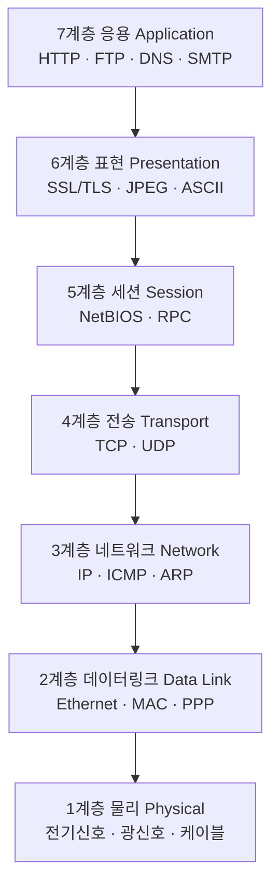

# OSI 7계층 — 왜 나눴는가? 각 층의 역할

---

# 1장. OSI 모델이란?

---

## 1.1 OSI 모델의 탄생 배경

1970년대까지 네트워크 장비와 소프트웨어는 **제조사마다 서로 다른 방식**으로 통신을 구현했음.  
A사 컴퓨터와 B사 컴퓨터가 통신하려면 양쪽 모두 같은 제조사 장비를 써야 했음.

이 문제를 해결하기 위해 **ISO(국제표준화기구)** 가 1984년 **OSI 모델(Open Systems Interconnection Model)** 을 발표함.

> **OSI 모델이란?**  
> 서로 다른 컴퓨터 시스템이 **표준화된 방식**으로 통신할 수 있도록 네트워크 통신 과정을 **7개의 계층(Layer)** 으로 나눈 참조 모델(Reference Model)임.

- **참조 모델**: 실제 구현이 아니라 개념적 기준을 제시하는 모델
- 실제 인터넷은 TCP/IP 4계층 모델을 사용하지만, OSI 7계층은 네트워크를 이해하는 **학습 표준**으로 사용됨

---

## 1.2 왜 7계층으로 나눴는가?

| 장점 | 설명 |
|---|---|
| **모듈화** | 각 계층은 독립적으로 개발·교체 가능 |
| **표준화** | 다른 회사의 장비와도 계층별 표준만 지키면 통신 가능 |
| **문제 격리** | 통신 오류 발생 시 어느 계층 문제인지 빠르게 파악 가능 |
| **교육 용이** | 복잡한 네트워크를 단계별로 이해 가능 |

---

# 2장. OSI 7계층 전체 구조

---

## 2.1 7계층 한눈에 보기



> **암기법**: **아파서 티내지 말데물** (응용-표현-세션-전송-네트워크-데이터링크-물리)

---

## 2.2 계층별 핵심 요약

| 계층 | 이름 | 역할 | PDU | 대표 장비 |
|---|---|---|---|---|
| **7** | 응용 (Application) | 사용자 인터페이스 제공 | 데이터(Data) | - |
| **6** | 표현 (Presentation) | 데이터 형식·암호화·압축 | 데이터(Data) | - |
| **5** | 세션 (Session) | 연결 수립·유지·종료 | 데이터(Data) | - |
| **4** | 전송 (Transport) | 신뢰성 있는 데이터 전달 | 세그먼트(Segment) | - |
| **3** | 네트워크 (Network) | IP 기반 경로 결정 | 패킷(Packet) | 라우터 |
| **2** | 데이터링크 (Data Link) | MAC 기반 같은 네트워크 전달 | 프레임(Frame) | 스위치 |
| **1** | 물리 (Physical) | 비트 신호 전송 | 비트(Bit) | 허브, 케이블 |

---

# 3장. 각 계층 상세 설명

---

## 3.1 1계층 — 물리 계층 (Physical Layer)

**역할**: 데이터를 전기 신호, 광 신호, 무선 신호로 변환하여 물리적 매체를 통해 전송함.

| 매체 | 설명 | 속도 |
|---|---|---|
| 트위스트 페어 케이블 (UTP) | 일반 랜선. 이더넷 케이블 | 1Gbps ~ 10Gbps |
| 광케이블 (Fiber Optic) | 빛 신호 사용. 장거리·고속 | 100Gbps 이상 |
| 무선 (Wi-Fi) | 전파 신호 사용 | 수백 Mbps ~ 수 Gbps |

**대표 장비**: 허브(Hub), 리피터(Repeater), 케이블, 커넥터

---

## 3.2 2계층 — 데이터링크 계층 (Data Link Layer)

**역할**: **같은 네트워크(LAN)** 안에서 MAC 주소를 기반으로 프레임(Frame)을 전달하고, 오류를 감지함.

```
┌──────────┬──────────┬──────┬────────────────┬───────┐
│목적지 MAC │출발지 MAC │타입  │  데이터(Payload)│ FCS   │
│(6바이트)  │(6바이트)  │(2B)  │  (46~1500B)    │(4B)   │
└──────────┴──────────┴──────┴────────────────┴───────┘
                                              오류검출
```

**대표 장비**: 스위치(Switch), 브리지(Bridge)

---

## 3.3 3계층 — 네트워크 계층 (Network Layer)

**역할**: **IP 주소**를 기반으로 서로 다른 네트워크 간 최적의 경로를 찾아 패킷(Packet)을 전달함.

| 필드 | 설명 |
|---|---|
| 출발지 IP (Source IP) | 데이터를 보내는 장치의 IP 주소 |
| 목적지 IP (Destination IP) | 데이터를 받을 장치의 IP 주소 |
| TTL (Time to Live) | 패킷이 거칠 수 있는 최대 라우터 수 (무한루프 방지) |
| 프로토콜 | 상위 계층 프로토콜 종류 (TCP=6, UDP=17) |

**대표 장비**: 라우터(Router)

---

## 3.4 4계층 — 전송 계층 (Transport Layer)

**역할**: 출발지와 목적지 간 **신뢰성 있는 데이터 전달**을 보장하고, 포트 번호로 프로세스를 식별함.

| 비교 항목 | TCP | UDP |
|---|---|---|
| 연결 방식 | 연결 지향 (3-Way Handshake) | 비연결 |
| 신뢰성 | 보장 (재전송 있음) | 보장 안 함 |
| 속도 | 느림 | 빠름 |
| 사용처 | 웹, 이메일, 파일전송 | 스트리밍, 게임, DNS |

---

## 3.5 5계층 — 세션 계층 (Session Layer)

**역할**: 두 장치 간 통신 세션(Session)을 수립하고, 유지하고, 종료하는 기능을 담당함.

**대표 프로토콜**: NetBIOS, RPC, NFS

---

## 3.6 6계층 — 표현 계층 (Presentation Layer)

**역할**: 데이터를 응용 계층이 이해할 수 있는 **형식으로 변환**하고, 암호화/복호화, 압축/해제를 수행함.

**대표 프로토콜**: SSL/TLS, JPEG, MPEG, ASCII, UTF-8

---

## 3.7 7계층 — 응용 계층 (Application Layer)

**역할**: 사용자가 직접 사용하는 **애플리케이션에 네트워크 서비스를 제공**하는 계층.

| 프로토콜 | 설명 | 포트 |
|---|---|---|
| HTTP | 웹 페이지 전송 | 80 |
| HTTPS | 암호화 웹 페이지 전송 | 443 |
| FTP | 파일 전송 | 21 |
| SMTP | 이메일 전송 | 25 |
| DNS | 도메인 → IP 주소 변환 | 53 |
| DHCP | IP 주소 자동 할당 | 67/68 |

---

# 4장. 캡슐화와 역캡슐화

---

## 4.1 캡슐화 (Encapsulation)

```
[송신 측 — 캡슐화 과정]

7계층: [데이터]
6계층: [데이터]                              ← 형식 변환
5계층: [데이터]                              ← 세션 정보
4계층: [TCP 헤더 | 데이터]                   ← 세그먼트
3계층: [IP 헤더 | TCP 헤더 | 데이터]         ← 패킷
2계층: [MAC 헤더 | IP 헤더 | TCP | 데이터 | FCS] ← 프레임
1계층: 0101011001010...                      ← 비트(전기신호)
```

---

## 4.2 역캡슐화 (Decapsulation)

```
[수신 측 — 역캡슐화 과정]

1계층: 비트 수신 → 프레임으로 변환
2계층: MAC 헤더 확인 후 제거
3계층: IP 헤더 확인 후 제거
4계층: TCP 헤더 확인 후 제거 → 포트 번호로 앱 식별
5~7계층: 최종 데이터를 응용 프로그램에 전달
```

---

## 4.3 실제 통신 흐름 요약


---

# 정리

| 계층 | 이름 | PDU | 핵심 역할 |
|---|---|---|---|
| 7 | 응용 | Data | 사용자 서비스 (HTTP, FTP) |
| 6 | 표현 | Data | 형식 변환, 암호화 (SSL) |
| 5 | 세션 | Data | 연결 수립·유지·종료 |
| 4 | 전송 | Segment | 신뢰성, 포트 번호 (TCP/UDP) |
| 3 | 네트워크 | Packet | 경로 결정, IP 주소 (라우터) |
| 2 | 데이터링크 | Frame | LAN 전달, MAC 주소 (스위치) |
| 1 | 물리 | Bit | 전기신호 전송 (케이블) |

> **다음 강의 예고**  
> 5강에서는 Packet Tracer Simulation Mode를 켜고, Ping 패킷이 OSI 계층별로 어떻게 처리되는지 직접 눈으로 확인함.
