# OSI 5~7계층 & 캡슐화 흐름 — 2일차 과제

---

# 1장. OSI 5~7계층 심화

---

## 1.1 5계층 — 세션 계층 (Session Layer) 심화

세션(Session)이란 **두 장치 간에 데이터를 교환하기 위해 논리적으로 연결된 상태**임.  
세션 계층은 이 연결의 시작, 유지, 종료를 관리함.

**세션의 3단계:**

```
[1단계 수립 (Establishment)]
클라이언트와 서버가 통신 합의
→ 인증, 연결 설정, 파라미터 협상

[2단계 유지 (Maintenance)]
실제 데이터 교환 진행
→ 체크포인트 설정 (대용량 파일 전송 시)
→ 동기화 (Synchronization)

[3단계 종료 (Termination)]
정상 종료 또는 비정상 종료 처리
→ 자원 해제
```

**체크포인트(Checkpoint) 예시:**

```
1GB 파일 전송 중 500MB 지점에 체크포인트 설정
→ 600MB 지점에서 연결 끊김
→ 처음부터 다시? ❌
→ 체크포인트(500MB)부터 재전송! ✅
```

**실생활 예시:**

| 상황 | 세션 계층 역할 |
|---|---|
| 웹 로그인 상태 유지 | 로그인 세션 수립 → 브라우저 닫을 때까지 유지 |
| 영상 통화 | 통화 시작(수립) → 통화 중(유지) → 통화 종료(종료) |
| 온라인 게임 접속 | 서버 접속(수립) → 게임 중(유지) → 로그아웃(종료) |

---

## 1.2 6계층 — 표현 계층 (Presentation Layer) 심화

표현 계층은 **데이터를 응용 계층이 이해할 수 있는 형태로 변환**하는 번역사 역할을 함.

### ① 데이터 형식 변환 (Translation)

| 인코딩 방식 | 설명 | 사용처 |
|---|---|---|
| ASCII | 영문자 128개 문자 표현 | 영어권 시스템 |
| UTF-8 | 전 세계 모든 문자 표현 (한글 포함) | 웹, 현대 시스템 |
| EBCDIC | IBM 메인프레임용 문자 코드 | 구형 서버 |

### ② 암호화/복호화 (Encryption/Decryption)

```
[HTTP  — 암호화 없음]
브라우저 → 평문 데이터 → 서버 (위험!)

[HTTPS — SSL/TLS 암호화]
브라우저 → 암호화된 데이터 → 서버 (안전!)
```

### ③ 압축/해제 (Compression/Decompression)

| 파일 형식 | 압축 대상 | 특징 |
|---|---|---|
| JPEG | 사진 이미지 | 손실 압축 |
| PNG | 이미지 | 무손실 압축 |
| MP3 | 음악 | 손실 압축 |
| ZIP | 모든 파일 | 무손실 압축 |

---

## 1.3 7계층 — 응용 계층 (Application Layer) 심화

**HTTP 주요 상태 코드:**

| 코드 | 의미 | 설명 |
|---|---|---|
| 200 | OK | 요청 성공 |
| 301 | Moved Permanently | 영구 이동 |
| 404 | Not Found | 페이지 없음 |
| 500 | Internal Server Error | 서버 오류 |

---

# 2장. 캡슐화 & 역캡슐화 완전 정리

---

## 2.1 캡슐화 전체 흐름

```
7계층 → 데이터(Data)
6계층 → 데이터(Data) ← SSL 암호화
5계층 → 데이터(Data) ← 세션 정보
4계층 → [TCP 헤더 | 데이터] = 세그먼트
3계층 → [IP 헤더 | TCP | 데이터] = 패킷
2계층 → [MAC 헤더 | IP | TCP | 데이터 | FCS] = 프레임
1계층 → 전기신호(비트)
```

> IP 패킷의 목적지 IP = **최종 목적지 서버 IP** (변하지 않음)  
> MAC 프레임의 목적지 MAC = **다음 장비의 MAC** (라우터마다 바뀜!)

---

## 2.2 중간 장비별 처리 범위

```mermaid
graph TD
    subgraph PC0["PC0 송신측 — 캡슐화"]
        p7["7계층 응용 — 데이터 생성"]
        p6["6계층 표현 — 암호화·형식변환"]
        p5["5계층 세션 — 연결 관리"]
        p4["4계층 전송 — TCP 헤더 추가 → Segment"]
        p3["3계층 네트워크 — IP 헤더 추가 → Packet"]
        p2["2계층 데이터링크 — MAC 헤더 추가 → Frame"]
        p1["1계층 물리 — 전기신호 변환 후 전송"]
        p7 --> p6 --> p5 --> p4 --> p3 --> p2 --> p1
    end

    subgraph SW["스위치 — 2계층까지만 처리"]
        sw1["1계층 물리 — 신호 수신"]
        sw2["2계층 데이터링크 — MAC 테이블 조회 → 포트 결정"]
        sw1x["1계층 물리 — 신호 재전송"]
        sw1 --> sw2 --> sw1x
    end

    subgraph RT["라우터 — 3계층까지 처리"]
        r1["1계층 물리 — 신호 수신"]
        r2a["2계층 데이터링크 — 기존 MAC 헤더 제거"]
        r3["3계층 네트워크 — IP 확인 → 라우팅 결정"]
        r2b["2계층 데이터링크 — 새 MAC 헤더 추가"]
        r1x["1계층 물리 — 신호 재전송"]
        r1 --> r2a --> r3 --> r2b --> r1x
    end

    subgraph SRV["서버 수신측 — 역캡슐화"]
        s1["1계층 물리 — 전기신호 수신"]
        s2["2계층 데이터링크 — MAC 헤더 제거"]
        s3["3계층 네트워크 — IP 헤더 제거"]
        s4["4계층 전송 — TCP 헤더 제거 · 포트 확인"]
        s5["5계층 세션"]
        s6["6계층 표현 — 복호화"]
        s7["7계층 응용 — 데이터 처리"]
        s1 --> s2 --> s3 --> s4 --> s5 --> s6 --> s7
    end

    p1  -->|"프레임 전기신호"| sw1
    sw1x -->|"프레임 전기신호"| r1
    r1x  -->|"MAC 재작성된 프레임"| s1
```



> **핵심 포인트**
> - **스위치**: 1~2계층만 처리. MAC 주소로 포트 결정 후 신호 재전송.
> - **라우터**: 1~3계층 처리. MAC 헤더 제거 → IP로 경로 결정 → 새 MAC 씌워 재전송.
> - **IP 주소**: 출발지→목적지까지 변하지 않음.
> - **MAC 주소**: 라우터를 거칠 때마다 다음 장비 MAC으로 교체됨.

| 장비 | 처리 계층 | 기준 주소 | 역할 |
|---|---|---|---|
| 스위치 | 1~2계층 | MAC 주소 | LAN 내 프레임 전달 |
| 라우터 | 1~3계층 | IP 주소 | 네트워크 간 경로 결정 + MAC 재작성 |
| PC / 서버 | 1~7계층 전체 | — | 캡슐화·역캡슐화 전담 |

---

# 3장. 2일차 과제

---

## 과제 1 — OSI 계층별 PDU 이름 정리표 작성

| 계층 | 이름 | PDU 이름 | 대표 프로토콜 |
|---|---|---|---|
| 7 | 응용 (Application) | ________ | HTTP, FTP, DNS |
| 6 | 표현 (Presentation) | ________ | SSL/TLS, JPEG |
| 5 | 세션 (Session) | ________ | NetBIOS, RPC |
| 4 | 전송 (Transport) | ________ | TCP, UDP |
| 3 | 네트워크 (Network) | ________ | IP, ICMP |
| 2 | 데이터링크 (Data Link) | ________ | Ethernet |
| 1 | 물리 (Physical) | ________ | 케이블, 무선 |

> **정답 힌트**: Data / Data / Data / Segment / Packet / Frame / Bit

---

## 과제 2 — 캡슐화 흐름도 손으로 그리기

**[상황]**: PC0 (192.168.1.10) → PC1 (192.168.1.20) 으로 Ping을 보낼 때

```
PC0 송신 과정 (캡슐화):
7계층: [ ? ]
3계층: [ IP 헤더 | ICMP | ? ]       ← 출발지/목적지 IP 적기
2계층: [ MAC 헤더 | IP | ICMP | ? | FCS ]  ← 출발지/목적지 MAC 적기
1계층: 비트(전기신호)
```

> ICMP(Ping)는 4계층 없이 IP 헤더 안에 직접 포함됨.

---

## 과제 3 — Simulation Mode 결과 정리

| 확인 항목 | Simulation Mode에서 확인한 내용 |
|---|---|
| ARP 발생 여부 | ARP Request / ARP Reply 캡처 화면 |
| ICMP Echo Request | 3계층에서 SRC IP / DST IP 값 |
| ICMP Echo Request | 2계층에서 SRC MAC / DST MAC 값 |
| 스위치 처리 계층 | 몇 계층까지 처리했는지 |

---

## 제출 방법

| 제출 항목 | 내용 |
|---|---|
| **① 정리표** | 과제 1 빈칸 채운 사진 또는 파일 |
| **② 흐름도** | 과제 2 손으로 그린 사진 |
| **③ 캡처** | 과제 3 Simulation Mode 화면 캡처 4장 |

---

## 추가 도전 과제 (선택)

| 도전 항목 | 내용 |
|---|---|
| **도전 1** | HTTP 통신을 Simulation Mode로 관찰하기 (웹서버 추가 후 실습) |
| **도전 2** | TCP 3-Way Handshake 과정을 Simulation Mode에서 캡처하기 |
| **도전 3** | 스위치와 라우터에서 처리하는 계층이 다른 이유를 자기 말로 설명하기 |

---

# 핵심 개념 총정리 (2일차)

| 개념 | 설명 |
|---|---|
| **OSI 7계층** | 네트워크 통신을 7단계로 나눈 국제 표준 참조 모델 |
| **PDU** | 각 계층에서 데이터를 부르는 이름 (비트/프레임/패킷/세그먼트) |
| **캡슐화** | 송신 시 각 계층을 내려가며 헤더를 추가하는 과정 |
| **역캡슐화** | 수신 시 각 계층을 올라가며 헤더를 제거하는 과정 |
| **ARP** | IP 주소로 MAC 주소를 알아내는 프로토콜 |
| **3-Way Handshake** | TCP 연결 수립 과정 (SYN → SYN+ACK → ACK) |
| **Simulation Mode** | Packet Tracer에서 패킷 이동을 단계별로 관찰하는 모드 |

> **내일 예고 (Day 3)**  
> TCP/IP 4계층 구조와 OSI 7계층의 비교, TCP vs UDP 차이, HTTP 요청/응답 구조를 배우고  
> Packet Tracer에서 웹서버를 추가하여 HTTP 통신 패킷을 Simulation Mode로 확인함.
