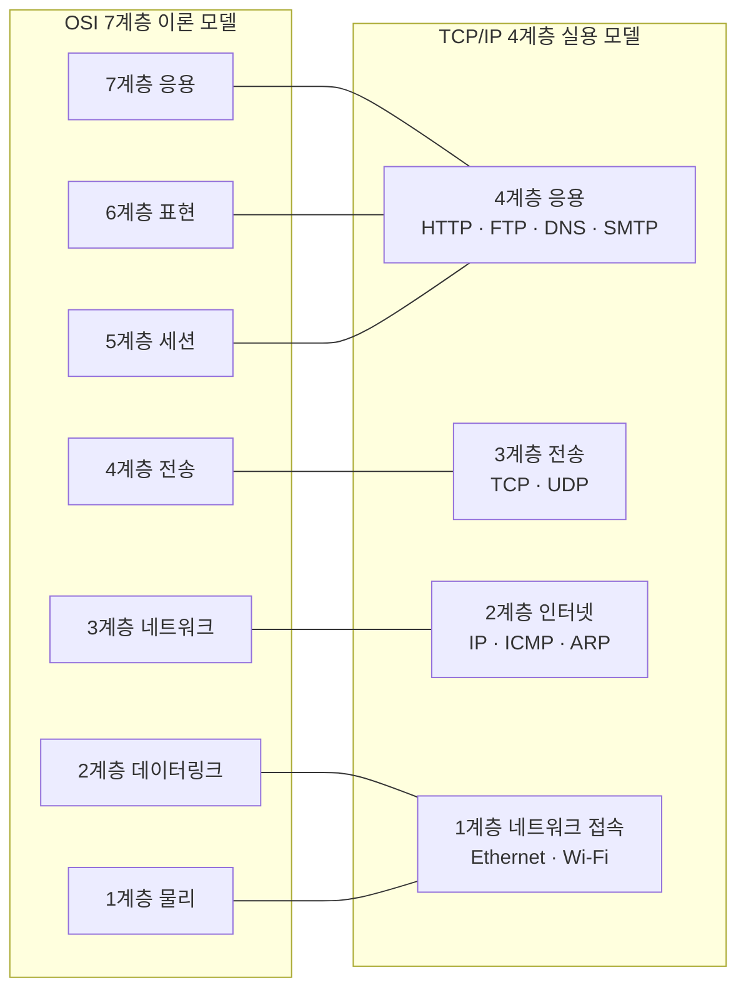

# TCP/IP 4계층 — OSI와 비교, TCP·UDP, 3-Way Handshake

---

# 1장. TCP/IP 4계층 모델

---

## 1.1 TCP/IP 모델이란?

TCP/IP 모델(TCP/IP Model)은 **실제 인터넷이 동작하는 방식을 정의한 표준 프로토콜 스택**임.  
OSI 7계층이 이론적 참조 모델이라면, TCP/IP는 **현실에서 실제로 사용되는 구현 모델**임.

> 인터넷에서 오가는 모든 데이터는 TCP/IP 4계층 구조를 따름.  
> 우리가 유튜브를 보고, 카카오톡을 하고, 웹 검색을 하는 모든 순간이 TCP/IP로 동작함.

**탄생 배경:**
- 1970년대 미국 국방부(DARPA)가 군사 통신망 ARPANET을 위해 개발
- OSI 모델보다 먼저 실제 구현되어 인터넷 표준이 됨
- 현재 전 세계 인터넷의 실질적 통신 표준

---

## 1.2 TCP/IP 4계층 구조

```
┌────────────────────────────────────────┐
│  4계층  응용 (Application)              │  ← OSI 5·6·7계층 통합
│         HTTP · HTTPS · FTP · DNS       │
├────────────────────────────────────────┤
│  3계층  전송 (Transport)                │  ← OSI 4계층과 동일
│         TCP · UDP                      │
├────────────────────────────────────────┤
│  2계층  인터넷 (Internet)               │  ← OSI 3계층과 동일
│         IP · ICMP · ARP               │
├────────────────────────────────────────┤
│  1계층  네트워크 접속 (Network Access)  │  ← OSI 1·2계층 통합
│         Ethernet · Wi-Fi · PPP         │
└────────────────────────────────────────┘
```

---

## 1.3 OSI 7계층 vs TCP/IP 4계층 비교



| OSI 계층 | TCP/IP 계층 | 주요 프로토콜 |
|---|---|---|
| 7·6·5 (응용·표현·세션) | **응용 (Application)** | HTTP, HTTPS, FTP, DNS, SMTP, DHCP |
| 4 (전송) | **전송 (Transport)** | TCP, UDP |
| 3 (네트워크) | **인터넷 (Internet)** | IP, ICMP, ARP |
| 2·1 (데이터링크·물리) | **네트워크 접속 (Network Access)** | Ethernet, Wi-Fi, PPP |

> **왜 OSI를 배우고 TCP/IP를 또 배우는가?**  
> OSI는 문제를 분석할 때 사용하는 **이론 도구**이고,  
> TCP/IP는 실제 프로그램과 장비가 동작하는 **현실 구조**임.  
> 두 가지를 함께 알아야 실무에서 통신 구조를 정확히 이해할 수 있음.

---

# 2장. TCP (Transmission Control Protocol)

---

## 2.1 TCP란?

TCP(전송 제어 프로토콜, Transmission Control Protocol)는 **데이터를 신뢰성 있게 순서대로 전달하는 연결 지향 프로토콜**임.

- **연결 지향(Connection-oriented)**: 데이터 전송 전 반드시 연결 수립
- **신뢰성(Reliability)**: 데이터 손실 시 자동 재전송
- **순서 보장(Ordering)**: 분할된 데이터를 올바른 순서로 재조립
- **흐름 제어(Flow Control)**: 수신측 처리 속도에 맞게 전송 속도 조절
- **혼잡 제어(Congestion Control)**: 네트워크 혼잡 시 전송 속도 조절

---

## 2.2 주요 플래그(Flag) 설명

| 플래그 | 이름 | 역할 |
|---|---|---|
| **SYN** | Synchronize | 연결 요청. 3-Way Handshake 시작 |
| **ACK** | Acknowledge | 수신 확인. 데이터 잘 받았다는 응답 |
| **FIN** | Finish | 연결 정상 종료 요청 |
| **RST** | Reset | 연결 강제 초기화 |
| **PSH** | Push | 데이터를 즉시 애플리케이션에 전달 |

---

## 2.3 TCP 3-Way Handshake 상세

TCP는 데이터 전송 전 **반드시 3단계 연결 수립 과정**을 거침.

```
[클라이언트 192.168.1.10]        [서버 192.168.1.100]
          |                              |
          |  ① SYN (seq=100)            |
          | --------------------------> |
          |                              |
          |  ② SYN + ACK (seq=200, ack=101) |
          | <-------------------------- |
          |                              |
          |  ③ ACK (ack=201)            |
          | --------------------------> |
          |                              |
          |  ===== 데이터 전송 시작 =====  |
```

| 단계 | 방향 | 플래그 | 의미 |
|---|---|---|---|
| ① | 클라이언트 → 서버 | SYN | 연결 요청. 클라이언트 초기 순서번호(ISN) 전송 |
| ② | 서버 → 클라이언트 | SYN + ACK | 요청 수락(ACK) + 서버도 연결 요청(SYN) |
| ③ | 클라이언트 → 서버 | ACK | 서버의 연결 요청 확인(ACK) → 연결 완료 |

> **왜 반드시 3번인가?**  
> 2번이면 한쪽 방향만 확인됨. **양방향 통신이 모두 정상임을 3번으로 보장**함.

---

## 2.4 TCP 연결 종료 — 4-Way Handshake

```
[클라이언트]                    [서버]
     |  ① FIN ─────────────>  |
     |  ② ACK <─────────────  |
     |  ③ FIN <─────────────  |
     |  ④ ACK ─────────────>  |
```

> 종료가 4번인 이유: 서버도 보낼 데이터가 남아있을 수 있으므로 FIN을 따로 보냄.

---

# 3장. UDP (User Datagram Protocol)

---

## 3.1 TCP vs UDP 최종 비교

| 비교 항목 | TCP | UDP |
|---|---|---|
| **연결 방식** | 연결 지향 (3-Way Handshake) | 비연결 (바로 전송) |
| **신뢰성** | 보장 (손실 시 재전송) | 보장 안 함 |
| **순서 보장** | 있음 | 없음 |
| **속도** | 상대적으로 느림 | 빠름 |
| **헤더 크기** | 20~60 바이트 | 8 바이트 고정 |
| **흐름 제어** | 있음 | 없음 |
| **혼잡 제어** | 있음 | 없음 |
| **주요 사용처** | 웹(HTTP/HTTPS), 이메일(SMTP), 파일전송(FTP) | 스트리밍, 온라인 게임, DNS, VoIP |

> **언제 UDP를 선택하는가?**  
> 데이터 손실보다 **속도가 더 중요한 경우** 사용함.  
> 예) 유튜브 스트리밍: 1개 프레임이 빠져도 재전송 기다리면 영상이 끊김 → 그냥 넘어가는 게 나음.

---

# 4장. 포트 번호 심화

---

## 4.1 포트 번호 범위

| 범위 | 이름 | 설명 |
|---|---|---|
| **0 ~ 1023** | Well-known Port | IANA가 지정한 표준 포트. HTTP=80, HTTPS=443 등 |
| **1024 ~ 49151** | Registered Port | 특정 앱이 등록해서 사용. MySQL=3306 등 |
| **49152 ~ 65535** | Dynamic Port | 클라이언트가 임시로 사용하는 포트 (Ephemeral Port) |

---

## 4.2 대표 포트 번호 정리

| 포트 | 프로토콜 | 전송 계층 | 설명 |
|---|---|---|---|
| **20/21** | FTP | TCP | 파일 전송 (20=데이터, 21=제어) |
| **22** | SSH | TCP | 암호화 원격 접속 |
| **53** | DNS | UDP(주로) | 도메인 → IP 변환 |
| **80** | HTTP | TCP | 웹 페이지 전송 |
| **443** | HTTPS | TCP | 암호화 웹 페이지 전송 |
| **3306** | MySQL | TCP | 데이터베이스 |

---

# 5장. HTTP 프로토콜 기초

---

## 5.1 HTTP 동작 과정 전체 흐름

```
① DNS 조회 (IP가 직접 입력된 경우 생략)
② TCP 3-Way Handshake  클라이언트(55432) ↔ 서버(80)
③ HTTP GET 요청 전송   GET / HTTP/1.1
④ HTTP 200 OK 응답 수신
⑤ TCP 4-Way Handshake (연결 종료)
```

## 5.2 HTTP 요청 메서드

| 메서드 | 역할 | 사용 예 |
|---|---|---|
| **GET** | 데이터 조회 | 웹 페이지 불러오기 |
| **POST** | 데이터 전송 | 로그인, 게시글 작성 |
| **PUT** | 데이터 수정 | 회원정보 수정 |
| **DELETE** | 데이터 삭제 | 게시글 삭제 |

---

# 정리

| 개념 | 핵심 내용 |
|---|---|
| **TCP/IP 4계층** | 실제 인터넷의 동작 모델. OSI 7계층을 4계층으로 단순화 |
| **TCP** | 신뢰성 있는 연결 지향 프로토콜. 3-Way Handshake로 연결 수립 |
| **UDP** | 빠른 비연결 프로토콜. 스트리밍·게임·DNS에 사용 |
| **3-Way Handshake** | SYN → SYN+ACK → ACK 순서로 TCP 연결 수립 |
| **포트 번호** | 같은 IP에서 여러 서비스를 구분하는 번호. HTTP=80, HTTPS=443 |
| **소켓** | IP + 포트 + 프로토콜로 하나의 통신 연결을 식별 |

> **다음 강의 예고**  
> 8강에서는 Packet Tracer에 웹 서버를 추가하고, Simulation Mode로 TCP Handshake → HTTP GET → HTTP 응답 패킷 전 과정을 눈으로 확인함.
