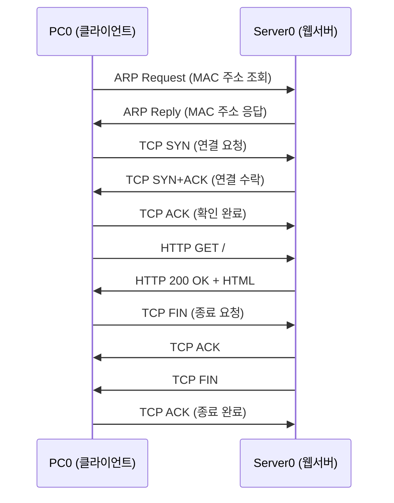

# 웹서버 추가 & HTTP 통신 패킷 Simulation Mode 실습

---

# 1장. 실습 목표 및 준비

---

## 1.1 이번 실습에서 만들 토폴로지

Day 1~2 실습의 LAN에 **웹 서버(HTTP Server)** 를 추가하고,  
PC0의 브라우저로 웹 서버에 접속하여 HTTP 통신 전 과정을 Simulation Mode로 관찰함.

```
[PC0]                 [PC1]            [Server0]
IP: 192.168.1.10      IP: 192.168.1.20  IP: 192.168.1.100
    |                     |                   |
    └─────────────[Switch0]────────────────────┘
```

**실습 목표:**

| 순서 | 확인 항목 |
|---|---|
| ① | TCP 3-Way Handshake 패킷 3개 관찰 |
| ② | HTTP GET 요청 패킷 확인 (7계층 내용 포함) |
| ③ | HTTP 200 OK 응답 패킷 확인 |
| ④ | 각 패킷의 OSI 계층별 헤더 값 비교 |

---

## 1.2 Packet Tracer 파일 준비

Day 1 과제에서 저장한 `.pkt` 파일을 열거나, 아래를 새로 구성함.

> **파일이 없는 경우**: Packet Tracer를 열고 처음부터 Step 1부터 따라하면 됨.


---

# 2장. Step-by-Step 실습 — 웹서버 추가 및 설정

---

## Step 1 — 기존 토폴로지 열기 또는 새로 구성

**기존 파일이 있는 경우:**
1. Packet Tracer 실행 → `File` → `Open` → Day 1 과제 파일 선택

**새로 구성하는 경우:**

| 장비 | 수량 | 위치 |
|---|---|---|
| PC | 2대 (PC0, PC1) | 좌측 |
| Server | 1대 (Server0) | 우측 |
| Switch (2960) | 1대 | 중앙 |

### 새로 구성할 때 클릭 순서

1. Packet Tracer 실행
2. 아래 장비 목록에서 `End Devices` 클릭
3. `PC` 아이콘을 작업 화면으로 2번 끌어다 놓음
4. 다시 `End Devices`에서 `Server` 아이콘을 1번 끌어다 놓음
5. 아래 장비 목록에서 `Switches` 클릭
6. `2960` 스위치를 작업 화면 중앙에 끌어다 놓음
7. 장비가 `PC0`, `PC1`, `Server0`, `Switch0`처럼 보이는지 확인
8. 보기 편하게 `PC0 - PC1 - Switch0 - Server0` 또는 `PC0 - Switch0 - PC1 - Server0` 형태로 정리함
   
   
   
   

### 여기서 꼭 알아둘 포인트

- 장비 이름은 자동으로 붙는 경우가 많음
- 이름이 조금 달라도 실습은 가능하지만, 글과 똑같이 따라가려면 자동 이름 그대로 두는 것이 편함
- 스위치는 네트워크의 가운데에 놓고, PC와 서버는 양옆에 놓으면 연결 구조를 보기 쉬움

---

## Step 2 — Server0 배치 및 케이블 연결

1. End Devices 패널 → **`Server`** 아이콘을 작업 공간에 드래그
2. 이름이 `Server0`으로 표시되는지 확인
3. Connections 패널 → **`Auto`** 케이블 선택
4. `Server0`과 `Switch0` 의 빈 포트 클릭하여 연결
5. 케이블 양쪽에 **녹색 불** 들어오는지 확인

### 처음부터 전부 연결해야 하는 경우

1. 아래 메뉴에서 `Connections` 클릭
2. `Auto` 또는 `Copper Straight-Through` 선택
3. `PC0` 클릭 → `FastEthernet0`
4. `Switch0` 클릭 → `FastEthernet0/1`
5. 다시 `Auto` 또는 `Copper Straight-Through` 선택
6. `PC1` 클릭 → `FastEthernet0`
7. `Switch0` 클릭 → `FastEthernet0/2`
8. 다시 `Auto` 또는 `Copper Straight-Through` 선택
9. `Server0` 클릭 → `FastEthernet0`
10. `Switch0` 클릭 → 남는 포트 하나 선택

### 연결 직후 확인할 것

- 선 끝의 불이 초록색이면 정상
- 잠깐 주황색이었다가 초록색으로 바뀌는 것은 정상
- 계속 빨간색이면 케이블 종류 또는 포트를 다시 확인
- 서버와 PC는 보통 `FastEthernet0`을 선택하면 됨

---

## Step 3 — Server0 IP 주소 설정

1. `Server0` 더블클릭
2. **`Config`** 탭 → **`FastEthernet0`** 클릭
3. 아래와 같이 입력

| 항목 | 입력값 |
|---|---|
| IP Address | `192.168.1.100` |
| Subnet Mask | `255.255.255.0` |

4. 창 닫기

### PC0와 PC1도 처음부터 설정해야 하는 경우

#### PC0

1. `PC0` 더블클릭
2. `Desktop` 탭 클릭
3. `IP Configuration` 클릭
4. 아래 값 입력

```text
IP Address: 192.168.1.10
Subnet Mask: 255.255.255.0
```

#### PC1

1. `PC1` 더블클릭
2. `Desktop` 탭 클릭
3. `IP Configuration` 클릭
4. 아래 값 입력

```text
IP Address: 192.168.1.20
Subnet Mask: 255.255.255.0
```

### 여기서 알아둘 포인트

- 이번 실습은 모두 같은 LAN 안에 있으므로 기본 게이트웨이는 없어도 됨
- IP 주소는 겹치면 안 됨
- 세 장비 모두 `192.168.1.x` 대역을 쓰고, 서브넷 마스크는 모두 `255.255.255.0`
- 서버 주소를 `192.168.1.100`으로 두는 이유는 PC 주소와 구분하기 쉽게 하기 위함

---

## Step 4 — HTTP 서비스 활성화 확인

1. `Server0` 더블클릭 → **`Services`** 탭 클릭
   
   
   
   
1. 좌측 목록에서 **`HTTP`** 클릭
2. 우측 상단 **`On`** 버튼이 활성화되어 있는지 확인

> **기본값이 On** 임. 처음 서버를 배치하면 HTTP 서비스가 자동으로 켜져 있음.

**기본 제공 웹 페이지 확인:**
- `index.html` 파일이 기본으로 들어있음
- 별도 수정 없이 브라우저 접속 시 기본 페이지 표시됨

### 만약 HTTP가 꺼져 있으면

1. `HTTP` 화면에서 `On` 선택
2. 필요하면 `index.html`이 있는지 확인
3. 수정하지 않아도 기본 웹 페이지 실습은 가능

### 여기서 알아둘 포인트

- Server0는 단순히 파일을 저장하는 장비가 아니라 웹서비스를 제공하는 장비임
- `HTTP On`은 "이 서버가 80번 포트로 웹 요청을 받겠다"는 뜻으로 이해하면 됨

---

## Step 5 — PC0에서 웹 서버 접속 테스트 (Realtime Mode)

먼저 **Realtime Mode** 에서 정상 접속되는지 확인함.

1. `PC0` 더블클릭 → **`Desktop`** 탭 → **`Web Browser`** 클릭
2. 주소창에 입력

```
http://192.168.1.100
```

3. `Go` 버튼 클릭
4. **"Cisco Packet Tracer"** 기본 페이지가 표시되면 성공 ✅
   
   

> **접속이 안 되는 경우 확인:**
> - PC0 IP: `192.168.1.10`, 서브넷: `255.255.255.0` 설정 여부
> - Server0 IP: `192.168.1.100`, 서브넷: `255.255.255.0` 설정 여부
> - Server0 HTTP 서비스 `On` 여부
> - 케이블 연결 및 녹색 불 확인
>
> **중요**  
> 먼저 Realtime Mode에서 웹 접속을 꼭 성공시킨 뒤 Simulation Mode로 넘어감.  
> Simulation Mode는 분석용이므로, 먼저 접속 성공 경험을 만드는 것이 초보자에게 더 쉬움.

### 브라우저 화면에서 꼭 볼 것

- 주소창에 `http://192.168.1.100`을 정확히 입력했는지
- `Go` 버튼을 눌렀는지
- 하얀 페이지가 뜨면서 기본 문구가 보이는지

### 접속이 안 될 때 점검 순서

1. PC0 IP가 `192.168.1.10`인지 확인
2. Server0 IP가 `192.168.1.100`인지 확인
3. 둘 다 서브넷 마스크가 `255.255.255.0`인지 확인
4. Server0의 `Services → HTTP → On`인지 확인
5. 케이블 불이 초록색인지 확인

### 왜 Realtime Mode를 먼저 보나?

- 먼저 "정상 작동"을 확인해야 나중에 Simulation에서 나오는 패킷이 무엇을 의미하는지 이해하기 쉬움
- 처음부터 Simulation으로 가면 설정 오류와 패킷 분석이 섞여서 더 헷갈릴 수 있음

---

# 3장. Step-by-Step 실습 — Simulation Mode HTTP 패킷 추적

---

## Step 6 — Simulation Mode 진입 및 필터 설정

1. 우측 하단 **`Simulation`** 탭 클릭
2. **`Edit Filters`** 클릭
3. **`Show All/None`** 으로 전체 해제
4. 아래 프로토콜만 선택

| 선택할 프로토콜 | 이유 |
|---|---|
| **TCP** | 3-Way Handshake 및 HTTP 데이터 전송 관찰 |
| **HTTP** | HTTP GET 요청·응답 내용 확인 |
| **ARP** | 처음 통신 시 MAC 주소 조회 과정 관찰 |

> **화면이 복잡하면 이렇게 함**  
> `ARP`, `TCP`, `HTTP` 3개만 켜고 시작함.  
> 이벤트가 너무 많으면 `Reset Simulation` 후 다시 시도하면 됨.
>  

### 처음 하는 학생이 알아야 할 것

- `Realtime`은 실제처럼 바로 통신이 진행되는 화면
- `Simulation`은 패킷이 한 단계씩 움직이는 것을 보는 화면
- `Edit Filters`는 "어떤 종류의 패킷만 볼지" 정하는 기능
- 이번에는 `ARP`, `TCP`, `HTTP`만 보면 충분함

### 필터를 설정한 뒤 추가로 할 일

1. 필요하면 `Reset Simulation` 클릭
2. Event List가 비워졌는지 확인
3. 이제 새 웹 요청을 보내야 현재 실습에 필요한 이벤트만 깔끔하게 쌓임

### STP가 보여도 당황하지 말 것

- 스위치는 기본적으로 `STP`라는 제어 프로토콜을 사용함
- 이것은 오류가 아니라 스위치의 기본 동작임
- 이번 실습에서는 `STP`를 끄고 `ARP`, `TCP`, `HTTP`만 보면 됨

---

## Step 7 — HTTP 요청 발생

1. `PC0` 더블클릭 → `Desktop` → **`Web Browser`**
2. 주소창에 `http://192.168.1.100` 입력 후 `Go` 클릭
3. 브라우저가 대기 상태가 되고 Event List에 이벤트 추가됨

### Step 7에서 꼭 기억할 포인트

- Simulation Mode에서는 `Go`를 눌러도 페이지가 바로 뜨지 않을 수 있음
- 이유는 패킷이 아직 이동 중이기 때문임
- 이때는 오류가 아니라 정상이며, `Capture/Forward`로 직접 진행시켜야 함

### Event List를 어떻게 보면 되나?

- 새 이벤트가 위에서 아래로 쌓임
- `Type` 열에서 `ARP`, `TCP`, `HTTP`를 구분함
- `At Device`를 보면 지금 어느 장비에서 처리 중인지 알 수 있음

---

## Step 8 — 패킷 단계별 관찰

**`Capture/Forward`** 버튼을 한 번씩 클릭하며 아래 순서로 패킷을 관찰함.

### 봉투를 클릭했을 때 보는 기본 순서

1. 움직이는 봉투를 클릭하거나 Event List의 해당 이벤트를 클릭
2. `PDU Information at Device` 창 열기
3. 먼저 `OSI Model` 탭 보기
4. 필요하면 `Inbound PDU Details`, `Outbound PDU Details` 비교
5. `Capture/Forward`를 다시 눌러 다음 단계로 넘기기

### 먼저 알아둘 가장 중요한 점

- Packet Tracer는 버전에 따라 보이는 문구가 조금 다름
- 어떤 버전은 `SYN`, `ACK`, `GET`, `200 OK`가 바로 보임
- 어떤 버전은 그런 문구 대신 `TCP Segment`, `HTTP`, `Last Device`, `At Device` 정도만 보일 수 있음
- 그래서 이번 실습은 **글자가 완전히 똑같이 보이는지**보다 **패킷의 순서와 방향**을 확인하는 것이 더 중요함

### 탭별로 무엇을 보면 되나?

- `OSI Model`
  - 지금 이 장비에서 몇 계층까지 처리하는지 보기 좋음
  - PC와 Server에서는 Layer 7까지 올라갈 수 있음
  - Switch에서는 주로 Layer 2까지만 의미 있게 보임
- `Inbound PDU Details`
  - 이 장비로 **들어온** 패킷 내용을 확인
  - 목적지 MAC, 목적지 IP, TCP/HTTP 여부를 볼 때 유용
- `Outbound PDU Details`
  - 이 장비에서 **나가는** 패킷 내용을 확인
  - 출발지/목적지 주소, 다음 단계로 보낼 내용을 볼 때 유용

> 잘 안 보이면 `OSI Model`에서 전체 흐름을 먼저 보고, 자세한 값은 `Inbound/Outbound PDU Details`에서 찾는 식으로 보면 됨.

### 이번 실습에서 가장 중요한 관찰 포인트

- ARP: 서버의 MAC 주소를 알아내는 과정
- TCP: 연결을 만들고 끊는 과정
- HTTP: 실제 웹 요청과 응답 내용
- 스위치: 주로 2계층(MAC) 기준으로 전달
- PC와 서버: 7계층(HTTP)까지 실제로 처리

---

### 관찰 1 — ARP (최초 접속 시 발생)

첫 번째 HTTP 접속이면 **ARP가 먼저 발생**함.

> ARP Request: PC0 → 브로드캐스트 ("192.168.1.100의 MAC 주소 알려줘!")  
> ARP Reply: Server0 → PC0 ("나야! 내 MAC 주소는 이것이야")

**어느 이벤트를 눌러야 하나?**

- Event List의 `Type`이 `ARP`인 첫 이벤트를 찾음
- 보통 시작은 `PC0` 쪽에서 생김
- 방향은 먼저 `PC0 → Switch0 → Server0` 쪽으로 감

**어느 탭에서 무엇을 보나?**

1. `OSI Model`
   - ARP 관련 처리인지 확인
   - PC에서 시작해서 스위치를 거쳐 서버 쪽으로 가는 흐름 보기
2. `Outbound PDU Details`
   - PC0에서 보낼 때 대상 IP가 `192.168.1.100` 근처인지 확인
   - 브로드캐스트 성격의 요청인지 확인
3. `Inbound PDU Details`
   - Server0에 도착했을 때 "이 요청이 나를 찾는 것이구나"라는 흐름으로 보기

**실제로 학생이 확인해야 할 최소 포인트**

- `Type`이 `ARP`인지
- 시작 장비가 `PC0`인지
- 대상이 `Server0`의 IP를 찾는 과정인지
- Reply가 다시 `Server0 → PC0`로 돌아오는지

> 버전에 따라 `Sender IP`, `Target IP` 문구가 그대로 안 보일 수 있음. 그럴 때는 `Type=ARP`와 이동 방향만 확인해도 실습 목표는 충분히 달성한 것임.

**여기서 배워야 하는 것**

- HTTP를 보내기 전에도 먼저 MAC 주소를 알아내는 과정이 필요함
- 같은 LAN 안에서는 목적지 장비의 MAC 주소를 직접 알아내야 함

---

### 관찰 2 — TCP SYN (3-Way Handshake 1단계)

ARP 완료 후 **TCP SYN 패킷** 등장.

**어느 이벤트를 눌러야 하나?**

- ARP가 끝난 뒤 처음 나오는 `TCP` 이벤트를 찾음
- 방향이 `PC0 → Server0` 쪽이면 보통 SYN 시작 패킷임

**어느 탭에서 무엇을 보나?**

1. `OSI Model`
   - Layer 4가 `TCP`인지 확인
   - PC0에서 서버로 연결을 시작하는 단계로 이해
2. `Outbound PDU Details`
   - 가능하면 목적지 포트가 `80`인지 확인
   - 출발지 IP가 `192.168.1.10`, 목적지 IP가 `192.168.1.100`인지 확인
3. `Inbound PDU Details`
   - Server0에 도착했을 때 같은 TCP 연결 요청이 들어오는지 보기

**실제로 학생이 확인해야 할 최소 포인트**

- `Type`이 `TCP`인지
- 방향이 `PC0 → Server0`인지
- HTTP보다 먼저 TCP가 등장하는지
- 가능하면 포트 `80`이 보이는지

> 어떤 버전은 `SYN Flag: Set`이 잘 보이지만, 어떤 버전은 플래그가 눈에 띄지 않을 수 있음. 그 경우에는 "첫 번째 PC0→Server0 TCP 패킷"을 SYN 단계로 이해하면 됨.

**여기서 배워야 하는 것**

- 웹 접속은 HTTP를 바로 보내지 않고 먼저 TCP 연결부터 만듦
- 서버의 HTTP 서비스는 보통 80번 포트를 사용함

---

### 관찰 3 — TCP SYN+ACK (3-Way Handshake 2단계)

Server0 → PC0 방향으로 **SYN+ACK 패킷** 등장.

**어느 이벤트를 눌러야 하나?**

- SYN 다음에 바로 나오는 `TCP`
- 방향이 `Server0 → PC0`인 이벤트를 찾음

**어느 탭에서 무엇을 보나?**

1. `OSI Model`
   - Server가 TCP 응답을 보내는 중인지 확인
2. `Outbound PDU Details`
   - Server0에서 나가는 TCP인지 확인
3. `Inbound PDU Details`
   - PC0에 들어오는 응답인지 확인

**실제로 학생이 확인해야 할 최소 포인트**

- `TCP`가 서버에서 클라이언트로 돌아오는지
- 첫 번째 응답 TCP라는 점
- SYN 다음에 바로 나오는 응답이라는 점

> `SYN+ACK`라는 글자가 안 보여도 괜찮음. 순서상 두 번째 TCP이고 방향이 `Server0 → PC0`이면 이 단계를 보는 것임.

**여기서 배워야 하는 것**

- 서버가 "연결 요청을 받았고, 나도 준비되었다"고 답하는 단계임

---

### 관찰 4 — TCP ACK (3-Way Handshake 3단계)

PC0 → Server0 방향으로 **ACK 패킷** 등장.

> 이 시점에서 **TCP 연결 수립 완료**. 이제부터 HTTP 데이터 전송 가능.

**어느 이벤트를 눌러야 하나?**

- 바로 직전 `Server0 → PC0` TCP 다음에 나오는
- `PC0 → Server0` 방향의 TCP를 찾음

**어느 탭에서 무엇을 보나?**

1. `OSI Model`
   - TCP 연결 마무리 단계로 보기
2. `Outbound PDU Details`
   - 다시 클라이언트에서 서버로 보내는 TCP인지 확인

**실제로 학생이 확인해야 할 최소 포인트**

- TCP가 다시 `PC0 → Server0`로 가는지
- 이 단계가 끝난 뒤에 HTTP가 나오기 시작하는지

> 이 패킷에서 꼭 `ACK Flag`를 찾지 못해도 괜찮음. `TCP 3개가 PC0→Server0, Server0→PC0, PC0→Server0 순서로 오갔다`면 3-Way Handshake를 확인한 것임.

**여기서 배워야 하는 것**

- 3-Way Handshake는 `SYN → SYN+ACK → ACK` 순서로 끝남
- 이 3개가 끝난 뒤에야 GET 요청이 나감

---

### 관찰 5 — HTTP GET 요청

TCP 연결 완료 후 **HTTP GET 요청 패킷** 등장.

> **7계층 내용이 처음으로 보임!**  
> Day 2 Ping 실습에서는 7계층이 비어있었음.  
> HTTP 통신에서는 `GET / HTTP/1.1` 요청 내용이 7계층에 표시됨.
>
> **쉽게 이해하면**  
> 스위치는 주로 MAC 주소를 보고 전달하고,  
> PC와 Server는 HTTP 내용까지 실제로 처리한다고 생각하면 됨.

**어느 이벤트를 눌러야 하나?**

- `Type`이 `HTTP`인 첫 번째 이벤트를 찾음
- 방향은 보통 `PC0 → Server0`

**어느 탭에서 무엇을 보나?**

1. `OSI Model`
   - Layer 7까지 올라가는지 먼저 확인
   - "이제는 단순 TCP가 아니라 HTTP 요청이구나"를 보는 것이 핵심
2. `Outbound PDU Details`
   - 가능하면 `GET`, `Host`, `/` 같은 요청 정보를 찾음
3. `Inbound PDU Details`
   - Server0 입장에서 HTTP 요청이 들어왔는지 확인

**실제로 학생이 확인해야 할 최소 포인트**

- `Type`이 `HTTP`인지
- 방향이 `PC0 → Server0`인지
- Layer 7이 보이는지
- 가능하면 `GET` 또는 요청 관련 문구가 보이는지

> Packet Tracer 버전에 따라 `GET / HTTP/1.1`이 그대로 안 보일 수도 있음. 그 경우에는 `Type=HTTP`, `PC0→Server0`, `Layer 7 표시`까지만 확인해도 충분함.

**여기서 배워야 하는 것**

- HTTP는 7계층 프로토콜이라서 Application 계층 정보가 보임
- Ping 실습과 달리 이번에는 실제 웹 요청 내용이 나타남

---

### 관찰 6 — HTTP 200 OK 응답

Server0 → PC0 방향으로 **HTTP 응답 패킷** 등장.

**어느 이벤트를 눌러야 하나?**

- `Type`이 `HTTP`인 다음 이벤트를 찾음
- 방향이 `Server0 → PC0`이면 HTTP 응답을 보는 중일 가능성이 큼

**어느 탭에서 무엇을 보나?**

1. `OSI Model`
   - Server에서 HTTP 응답을 보내고 있는지 확인
   - Layer 7이 나타나는지 확인
2. `Outbound PDU Details`
   - 가능하면 `200 OK`, `text/html`, 응답 관련 문구를 찾음
3. `Inbound PDU Details`
   - PC0에 HTTP 응답이 도착하는지 확인

**실제로 학생이 확인해야 할 최소 포인트**

- `Type`이 `HTTP`인지
- 방향이 `Server0 → PC0`인지
- Layer 7 응답이라는 점
- 가능하면 `200` 또는 `OK` 또는 HTML 관련 문구가 보이는지

> 이 부분은 Packet Tracer 버전 차이가 특히 큼. 어떤 버전은 `200 OK`가 잘 보이지만, 어떤 버전은 HTTP 응답 정도만 보이고 자세한 본문은 안 보일 수 있음.

**여기서 배워야 하는 것**

- `200 OK`는 서버가 요청을 정상 처리했다는 뜻임
- 이 응답 안에 실제 웹 페이지 내용이 들어감

---

### 관찰 7 — TCP FIN (연결 종료)

HTTP 응답 완료 후 **TCP FIN 패킷** 등장 (4-Way Handshake 시작).

**어느 이벤트를 눌러야 하나?**

- HTTP 응답 뒤에 다시 `TCP` 이벤트들이 이어짐
- 그 마지막 쪽 TCP 묶음을 보면 연결 종료 단계임

**어느 탭에서 무엇을 보나?**

1. `OSI Model`
   - 다시 HTTP가 아니라 TCP 정리 단계라는 점 확인
2. `Inbound/Outbound PDU Details`
   - 플래그가 보이면 `FIN` 여부 확인
   - 안 보여도 종료용 TCP가 몇 번 오가는 흐름을 확인

**실제로 학생이 확인해야 할 최소 포인트**

- HTTP가 끝난 뒤 TCP가 몇 개 더 오가는지
- 마지막은 연결 종료를 위한 절차라는 점
- 시작할 때도 TCP, 끝낼 때도 TCP가 관여한다는 점

> `FIN` 글자가 안 보여도 괜찮음. HTTP 뒤에 TCP가 추가로 오가며 연결을 정리하면 그 과정을 본 것임.

**여기서 배워야 하는 것**

- TCP는 데이터를 다 보내고 나서도 연결을 정리하는 절차가 있음
- 연결 시작과 종료 모두 TCP가 책임짐

---

## Step 9 — Realtime Mode 복귀

1. 우측 하단 **`Realtime`** 탭 클릭
2. 브라우저에 웹 페이지가 완전히 표시되는지 확인

---

# 4장. 관찰 결과 정리 및 심화 분석

---

## 4.1 이번 실습에서 확인한 TCP/IP 동작 순서



---

## 4.2 스위치에서의 패킷 처리 재확인

HTTP 패킷이 Switch0을 통과할 때 클릭하여 확인.

```
Switch0 PDU 처리:
✅ Layer 1 (Physical): 전기신호 수신·재전송
✅ Layer 2 (Data Link): MAC 테이블 조회 → 포트 결정
❌ Layer 3 (Network): 처리 안 함 (IP 주소 보지 않음)
❌ Layer 4 (Transport): 처리 안 함 (TCP/UDP 보지 않음)
❌ Layer 7 (Application): 처리 안 함 (HTTP 내용 보지 않음)
```

---

## 4.3 Ping vs HTTP 통신 비교

| 비교 항목        | Ping (ICMP)                | HTTP 웹 요청                                |
| ------------ | -------------------------- | ---------------------------------------- |
| **4계층 프로토콜** | 없음 (ICMP는 3계층)             | TCP                                      |
| **사전 연결**    | 없음                         | TCP 3-Way Handshake 필요                   |
| **7계층 내용**   | 없음 (비어있음)                  | GET 요청 / 200 OK 응답                       |
| **패킷 수**     | Echo Request 1개 + Reply 1개 | SYN, SYN+ACK, ACK, GET, 200OK, FIN... 다수 |
| **사용 목적**    | 통신 가능 여부 확인                | 실제 데이터 교환                                |

---

# 정리

| 확인 항목 | 내용 |
|---|---|
| **웹서버 추가** | Server0 → IP 설정 → HTTP 서비스 On 확인 |
| **Realtime 접속** | Web Browser → http://192.168.1.100 → 페이지 확인 |
| **ARP 관찰** | 첫 접속 시 ARP Request/Reply 선행 발생 |
| **3-Way Handshake** | SYN → SYN+ACK → ACK 3단계 확인 |
| **HTTP GET** | Layer 7에서 GET 요청 내용 확인 |
| **HTTP 200 OK** | Layer 7에서 응답 코드 및 HTML 확인 |
| **4-Way FIN** | HTTP 완료 후 FIN으로 TCP 연결 종료 |

