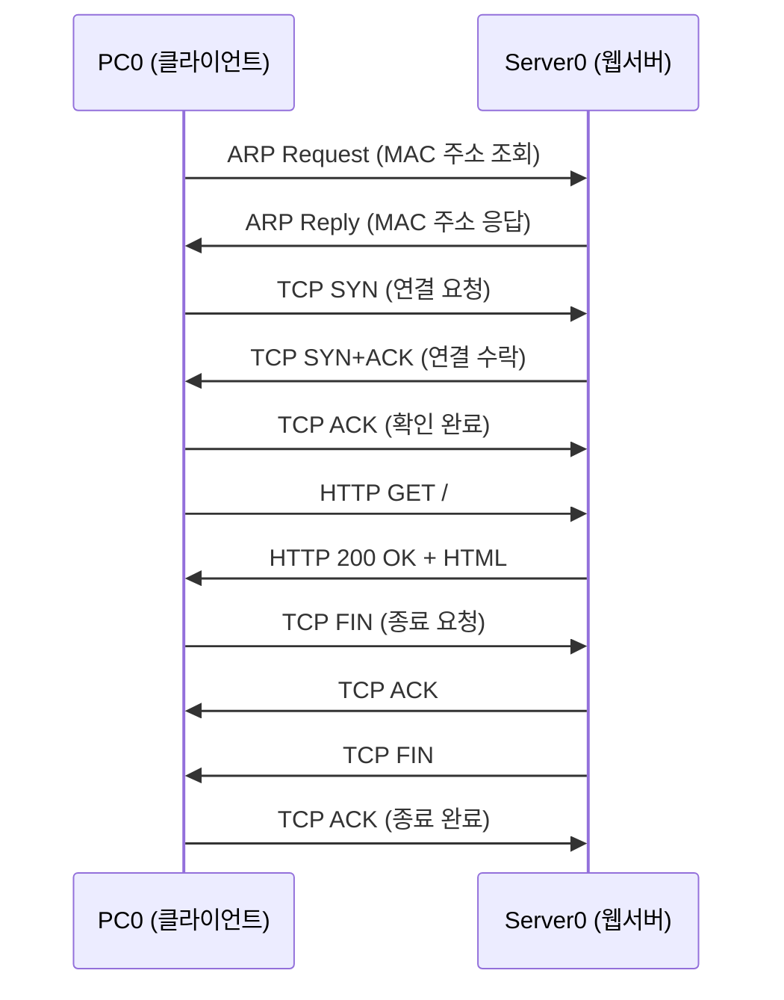

# 웹서버 추가 & HTTP 통신 패킷 Simulation Mode 실습

---

# 1장. 실습 목표 및 준비

---

## 1.1 이번 실습에서 만들 토폴로지

Day 1~2 실습의 LAN에 **웹 서버(HTTP Server)** 를 추가하고,  
PC0의 브라우저로 웹 서버에 접속하여 HTTP 통신 전 과정을 Simulation Mode로 관찰함.

```
[PC0]                 [PC1]            [Server0]
IP: 192.168.1.10      IP: 192.168.1.20  IP: 192.168.1.100
    |                     |                   |
    └─────────────[Switch0]────────────────────┘
```

**실습 목표:**

| 순서 | 확인 항목 |
|---|---|
| ① | TCP 3-Way Handshake 패킷 3개 관찰 |
| ② | HTTP GET 요청 패킷 확인 (7계층 내용 포함) |
| ③ | HTTP 200 OK 응답 패킷 확인 |
| ④ | 각 패킷의 OSI 계층별 헤더 값 비교 |

---

## 1.2 Packet Tracer 파일 준비

Day 1 과제에서 저장한 `.pkt` 파일을 열거나, 아래를 새로 구성함.

> **파일이 없는 경우**: Packet Tracer를 열고 처음부터 Step 1부터 따라하면 됨.

---

# 2장. Step-by-Step 실습 — 웹서버 추가 및 설정

---

## Step 1 — 기존 토폴로지 열기 또는 새로 구성

**기존 파일이 있는 경우:**
1. Packet Tracer 실행 → `File` → `Open` → Day 1 과제 파일 선택

**새로 구성하는 경우:**

| 장비 | 수량 | 위치 |
|---|---|---|
| PC | 2대 (PC0, PC1) | 좌측 |
| Server | 1대 (Server0) | 우측 |
| Switch (2960) | 1대 | 중앙 |

---

## Step 2 — Server0 배치 및 케이블 연결

1. End Devices 패널 → **`Server`** 아이콘을 작업 공간에 드래그
2. 이름이 `Server0`으로 표시되는지 확인
3. Connections 패널 → **`Auto`** 케이블 선택
4. `Server0`과 `Switch0` 의 빈 포트 클릭하여 연결
5. 케이블 양쪽에 **녹색 불** 들어오는지 확인

---

## Step 3 — Server0 IP 주소 설정

1. `Server0` 더블클릭
2. **`Config`** 탭 → **`FastEthernet0`** 클릭
3. 아래와 같이 입력

| 항목 | 입력값 |
|---|---|
| IP Address | `192.168.1.100` |
| Subnet Mask | `255.255.255.0` |

4. 창 닫기

---

## Step 4 — HTTP 서비스 활성화 확인

1. `Server0` 더블클릭 → **`Services`** 탭 클릭
2. 좌측 목록에서 **`HTTP`** 클릭
3. 우측 상단 **`On`** 버튼이 활성화되어 있는지 확인

> **기본값이 On** 임. 처음 서버를 배치하면 HTTP 서비스가 자동으로 켜져 있음.

**기본 제공 웹 페이지 확인:**
- `index.html` 파일이 기본으로 들어있음
- 별도 수정 없이 브라우저 접속 시 기본 페이지 표시됨

---

## Step 5 — PC0에서 웹 서버 접속 테스트 (Realtime Mode)

먼저 **Realtime Mode** 에서 정상 접속되는지 확인함.

1. `PC0` 더블클릭 → **`Desktop`** 탭 → **`Web Browser`** 클릭
2. 주소창에 입력

```
http://192.168.1.100
```

3. `Go` 버튼 클릭
4. **"Cisco Packet Tracer"** 기본 페이지가 표시되면 성공 ✅

> **접속이 안 되는 경우 확인:**
> - PC0 IP: `192.168.1.10`, 서브넷: `255.255.255.0` 설정 여부
> - Server0 IP: `192.168.1.100`, 서브넷: `255.255.255.0` 설정 여부
> - Server0 HTTP 서비스 `On` 여부
> - 케이블 연결 및 녹색 불 확인

---

# 3장. Step-by-Step 실습 — Simulation Mode HTTP 패킷 추적

---

## Step 6 — Simulation Mode 진입 및 필터 설정

1. 우측 하단 **`Simulation`** 탭 클릭
2. **`Edit Filters`** 클릭
3. **`Show All/None`** 으로 전체 해제
4. 아래 프로토콜만 선택

| 선택할 프로토콜 | 이유 |
|---|---|
| **TCP** | 3-Way Handshake 및 HTTP 데이터 전송 관찰 |
| **HTTP** | HTTP GET 요청·응답 내용 확인 |
| **ARP** | 처음 통신 시 MAC 주소 조회 과정 관찰 |

---

## Step 7 — HTTP 요청 발생

1. `PC0` 더블클릭 → `Desktop` → **`Web Browser`**
2. 주소창에 `http://192.168.1.100` 입력 후 `Go` 클릭
3. 브라우저가 대기 상태가 되고 Event List에 이벤트 추가됨

---

## Step 8 — 패킷 단계별 관찰

**`Capture/Forward`** 버튼을 한 번씩 클릭하며 아래 순서로 패킷을 관찰함.

---

### 관찰 1 — ARP (최초 접속 시 발생)

첫 번째 HTTP 접속이면 **ARP가 먼저 발생**함.

> ARP Request: PC0 → 브로드캐스트 ("192.168.1.100의 MAC 주소 알려줘!")  
> ARP Reply: Server0 → PC0 ("나야! MAC = 00:XX:XX:XX:XX:XX")

**PDU 창에서 확인:**
- Type: `ARP`
- Sender IP: `192.168.1.10` (PC0)
- Target IP: `192.168.1.100` (Server0)

---

### 관찰 2 — TCP SYN (3-Way Handshake 1단계)

ARP 완료 후 **TCP SYN 패킷** 등장.

**패킷 아이콘 클릭 → OSI Model 탭 확인:**

```
Layer 4 (Transport — TCP):
  SRC Port: 1025 (클라이언트 임시 포트)
  DST Port: 80   (HTTP 포트)
  SYN Flag: Set  ← 연결 요청!
  ACK Flag: Not Set

Layer 3 (Network — IP):
  SRC IP: 192.168.1.10
  DST IP: 192.168.1.100

Layer 2 (Data Link — Ethernet):
  SRC MAC: PC0의 MAC 주소
  DST MAC: Server0의 MAC 주소
```

---

### 관찰 3 — TCP SYN+ACK (3-Way Handshake 2단계)

Server0 → PC0 방향으로 **SYN+ACK 패킷** 등장.

```
Layer 4:
  SYN Flag: Set  ← 서버도 연결 요청
  ACK Flag: Set  ← 클라이언트 SYN 확인
```

---

### 관찰 4 — TCP ACK (3-Way Handshake 3단계)

PC0 → Server0 방향으로 **ACK 패킷** 등장.

```
Layer 4:
  SYN Flag: Not Set
  ACK Flag: Set   ← 연결 완료!
```

> 이 시점에서 **TCP 연결 수립 완료**. 이제부터 HTTP 데이터 전송 가능.

---

### 관찰 5 — HTTP GET 요청

TCP 연결 완료 후 **HTTP GET 요청 패킷** 등장.

**PDU 창 → OSI Model 탭:**

```
Layer 7 (Application — HTTP):  ← 이번 실습의 핵심!
  Request Method: GET
  URL: /
  HTTP Version: HTTP/1.1
  Host: 192.168.1.100

Layer 4 (Transport — TCP):
  SRC Port: 1025
  DST Port: 80
  ACK Flag: Set

Layer 3 (Network — IP):
  SRC IP: 192.168.1.10
  DST IP: 192.168.1.100
```

> **7계층 내용이 처음으로 보임!**  
> Day 2 Ping 실습에서는 7계층이 비어있었음.  
> HTTP 통신에서는 `GET / HTTP/1.1` 요청 내용이 7계층에 표시됨.

---

### 관찰 6 — HTTP 200 OK 응답

Server0 → PC0 방향으로 **HTTP 응답 패킷** 등장.

```
Layer 7 (Application — HTTP):
  Response Code: 200
  Response Phrase: OK
  Content-Type: text/html
  [HTML 페이지 내용]
```

---

### 관찰 7 — TCP FIN (연결 종료)

HTTP 응답 완료 후 **TCP FIN 패킷** 등장 (4-Way Handshake 시작).

```
Layer 4:
  FIN Flag: Set  ← 연결 종료 요청
```

---

## Step 9 — Realtime Mode 복귀

1. 우측 하단 **`Realtime`** 탭 클릭
2. 브라우저에 웹 페이지가 완전히 표시되는지 확인

---

# 4장. 관찰 결과 정리 및 심화 분석

---

## 4.1 이번 실습에서 확인한 TCP/IP 동작 순서



---

## 4.2 스위치에서의 패킷 처리 재확인

HTTP 패킷이 Switch0을 통과할 때 클릭하여 확인.

```
Switch0 PDU 처리:
✅ Layer 1 (Physical): 전기신호 수신·재전송
✅ Layer 2 (Data Link): MAC 테이블 조회 → 포트 결정
❌ Layer 3 (Network): 처리 안 함 (IP 주소 보지 않음)
❌ Layer 4 (Transport): 처리 안 함 (TCP/UDP 보지 않음)
❌ Layer 7 (Application): 처리 안 함 (HTTP 내용 보지 않음)
```

---

## 4.3 Ping vs HTTP 통신 비교

| 비교 항목 | Ping (ICMP) | HTTP 웹 요청 |
|---|---|---|
| **4계층 프로토콜** | 없음 (ICMP는 3계층) | TCP |
| **사전 연결** | 없음 | TCP 3-Way Handshake 필요 |
| **7계층 내용** | 없음 (비어있음) | GET 요청 / 200 OK 응답 |
| **패킷 수** | Echo Request 1개 + Reply 1개 | SYN, SYN+ACK, ACK, GET, 200OK, FIN... 다수 |
| **사용 목적** | 통신 가능 여부 확인 | 실제 데이터 교환 |

---

# 정리

| 확인 항목 | 내용 |
|---|---|
| **웹서버 추가** | Server0 → IP 설정 → HTTP 서비스 On 확인 |
| **Realtime 접속** | Web Browser → http://192.168.1.100 → 페이지 확인 |
| **ARP 관찰** | 첫 접속 시 ARP Request/Reply 선행 발생 |
| **3-Way Handshake** | SYN → SYN+ACK → ACK 3단계 확인 |
| **HTTP GET** | Layer 7에서 GET 요청 내용 확인 |
| **HTTP 200 OK** | Layer 7에서 응답 코드 및 HTML 확인 |
| **4-Way FIN** | HTTP 완료 후 FIN으로 TCP 연결 종료 |

> **다음 강의 예고**  
> 9강에서는 오늘 실습 내용을 바탕으로 TCP 3-Way Handshake 흐름도와  
> HTTP GET 요청 과정을 직접 작성하는 과제를 수행함.
