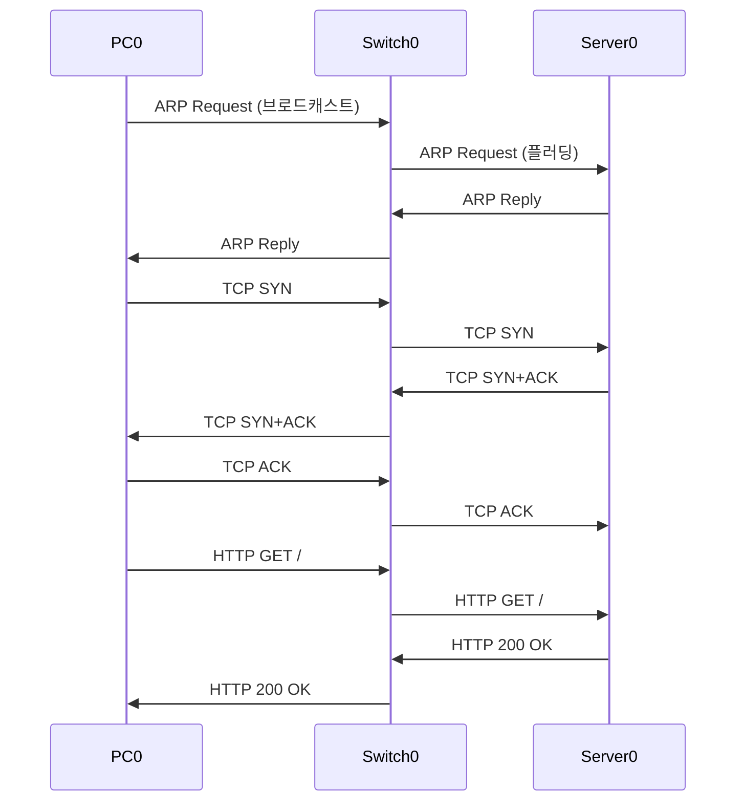

# TCP 3-Way Handshake & HTTP GET 흐름 — 3일차 과제

---

# 1장. 핵심 개념 복습

---

## 1.1 TCP 3-Way Handshake 복습

8강 실습에서 직접 눈으로 확인한 내용을 다시 정리함.

```
[PC0: 192.168.1.10]            [Server0: 192.168.1.100]
         |                               |
         |  SYN (포트 1025 → 80)         |
         | ----------------------------> |   ① 연결 요청
         |                               |
         |  SYN + ACK (80 → 1025)        |
         | <---------------------------- |   ② 수락 + 서버도 연결 요청
         |                               |
         |  ACK (1025 → 80)              |
         | ----------------------------> |   ③ 확인 → 연결 완료
         |                               |
         |  HTTP GET / HTTP/1.1          |
         | ----------------------------> |   ④ 웹 페이지 요청
         |                               |
         |  HTTP 200 OK + HTML           |
         | <---------------------------- |   ⑤ 웹 페이지 응답
         |                               |
         |  FIN → ACK → FIN → ACK       |
         | <--------연결 종료-----------> |   ⑥ TCP 4-Way Handshake
```

---

## 1.2 캡슐화 관점에서 HTTP 패킷 구조

HTTP GET 요청이 실제로 전송될 때의 패킷 내부:

```
┌──────────────────────────────────────────────────┐
│ 2계층  MAC 헤더 (PC0 MAC → Server0 MAC)           │
├──────────────────────────────────────────────────┤
│ 3계층  IP 헤더 (192.168.1.10 → 192.168.1.100)    │
├──────────────────────────────────────────────────┤
│ 4계층  TCP 헤더 (포트 1025 → 80, ACK)             │
├──────────────────────────────────────────────────┤
│ 7계층  HTTP 데이터                                 │
│        GET / HTTP/1.1                            │
│        Host: 192.168.1.100                       │
└──────────────────────────────────────────────────┘
```

> 2~4계층 헤더는 **어디로 보낼지**를 담당하고,  
> 7계층 데이터는 **무엇을 보낼지**를 담당함.

---

# 2장. 3일차 과제

---

## 과제 1 — TCP 3-Way Handshake 흐름도 직접 그리기

아래 조건으로 TCP 3-Way Handshake 흐름도를 **손으로 그려** 제출함.

**[조건]**

| 항목 | 값 |
|---|---|
| 클라이언트 | PC0 — IP: 192.168.1.10, 포트: 1025 |
| 서버 | Server0 — IP: 192.168.1.100, 포트: 80 |

**그려야 할 내용:**

```
[PC0]                          [Server0]
  |                                |
  |  ① ____________               |   SYN / SYN+ACK / ACK 중 어느 것?
  | -----------------------------> |   출발지 포트: ____  목적지 포트: ____
  |                                |
  |  ② ____________               |   SYN / SYN+ACK / ACK 중 어느 것?
  | <------------------------------ |   출발지 포트: ____  목적지 포트: ____
  |                                |
  |  ③ ____________               |   SYN / SYN+ACK / ACK 중 어느 것?
  | -----------------------------> |   출발지 포트: ____  목적지 포트: ____
  |                                |
  ===== 연결 완료 =====
```

> **정답 힌트**  
> ① SYN: 클라이언트 → 서버 (포트 1025 → 80)  
> ② SYN+ACK: 서버 → 클라이언트 (포트 80 → 1025)  
> ③ ACK: 클라이언트 → 서버 (포트 1025 → 80)

---

## 과제 2 — HTTP GET 요청 전체 과정 정리

아래 빈칸을 채워서 HTTP 요청 전체 흐름을 완성함.

**[상황]**: PC0 브라우저 → `http://192.168.1.100` 접속

| 단계 | 동작 | 프로토콜 | 내용 |
|---|---|---|---|
| 1 | MAC 주소 조회 | ________ | PC0이 Server0의 MAC 주소를 알아냄 |
| 2 | 연결 수립 1단계 | TCP | ________ 패킷 전송 (포트 1025 → 80) |
| 3 | 연결 수립 2단계 | TCP | ________ 패킷 수신 (포트 80 → 1025) |
| 4 | 연결 수립 3단계 | TCP | ________ 패킷 전송 → 연결 완료 |
| 5 | 웹 페이지 요청 | HTTP | ________ / HTTP/1.1 전송 |
| 6 | 웹 페이지 응답 | HTTP | HTTP/1.1 ________ OK + HTML 수신 |
| 7 | 연결 종료 | TCP | ________ Handshake (4단계) |

> **정답 힌트**  
> 1: ARP / 2: SYN / 3: SYN+ACK / 4: ACK / 5: GET / 6: 200 / 7: 4-Way

---

## 과제 3 — Simulation Mode 캡처 및 분석

8강 실습에서 관찰한 내용을 아래 양식으로 정리하여 제출함.

### 과제 3-1: TCP SYN 패킷 분석

Simulation Mode에서 TCP SYN 패킷을 클릭하여 OSI Model 탭의 정보를 기록함.

| 계층 | 확인 항목 | 기록한 값 |
|---|---|---|
| 4계층 (TCP) | 출발지 포트 (SRC Port) | |
| 4계층 (TCP) | 목적지 포트 (DST Port) | |
| 4계층 (TCP) | SYN 플래그 | Set / Not Set |
| 3계층 (IP) | 출발지 IP (SRC IP) | |
| 3계층 (IP) | 목적지 IP (DST IP) | |
| 2계층 (Ethernet) | 출발지 MAC | |
| 2계층 (Ethernet) | 목적지 MAC | |

### 과제 3-2: HTTP GET 패킷 분석

Simulation Mode에서 HTTP GET 패킷을 클릭하여 정보를 기록함.

| 계층 | 확인 항목 | 기록한 값 |
|---|---|---|
| 7계층 (HTTP) | 요청 메서드 | |
| 7계층 (HTTP) | 요청 URL | |
| 4계층 (TCP) | 출발지 포트 | |
| 4계층 (TCP) | 목적지 포트 | |
| 3계층 (IP) | 출발지 IP | |
| 3계층 (IP) | 목적지 IP | |

### 과제 3-3: 화면 캡처 제출

| 캡처 항목 | 설명 |
|---|---|
| **캡처 1** | TCP SYN 패킷 PDU 창 (OSI Model 탭) |
| **캡처 2** | TCP SYN+ACK 패킷 PDU 창 (OSI Model 탭) |
| **캡처 3** | HTTP GET 패킷 PDU 창 (OSI Model 탭, Layer 7 포함) |
| **캡처 4** | HTTP 200 OK 패킷 PDU 창 (OSI Model 탭, Layer 7 포함) |

---

## 제출 방법

| 제출 항목 | 내용 |
|---|---|
| **① 흐름도** | 과제 1 손으로 그린 3-Way Handshake 흐름도 사진 |
| **② 빈칸 표** | 과제 2 채워진 표 사진 또는 파일 |
| **③ 분석표** | 과제 3-1, 3-2 기록한 표 |
| **④ 캡처 4장** | 과제 3-3 Simulation Mode 화면 캡처 |

---

## 추가 도전 과제 (선택)

| 도전 항목 | 내용 |
|---|---|
| **도전 1** | PC1에서도 동시에 http://192.168.1.100 접속 → 두 연결의 포트 번호가 다름을 Simulation Mode로 확인하기 |
| **도전 2** | Server0 HTTP 서비스를 Off로 끄고 PC0에서 접속 → 어떤 에러가 발생하는지 확인하기 |
| **도전 3** | Server0의 index.html 파일 내용을 수정하여 나만의 웹 페이지 만들기 |

---

# 3장. 3일차 전체 복습

---

## OSI 7계층 vs TCP/IP 4계층 대응 최종 정리

| TCP/IP | OSI | PDU | 대표 프로토콜 | 대표 장비 |
|---|---|---|---|---|
| 응용 | 7·6·5 | Data | HTTP · DNS · FTP · SMTP | — |
| 전송 | 4 | Segment | TCP · UDP | — |
| 인터넷 | 3 | Packet | IP · ICMP · ARP | 라우터 |
| 네트워크 접속 | 2·1 | Frame / Bit | Ethernet · Wi-Fi | 스위치·케이블 |

---

## HTTP 웹 접속 전체 흐름 요약



> **스위치는 중계자 역할만 함**  
> 모든 패킷이 스위치를 경유하지만, 스위치는 2계층(MAC)만 보고 전달함.  
> HTTP 내용(7계층), IP 주소(3계층), TCP 포트(4계층)는 스위치가 전혀 관여하지 않음.

---

## 핵심 개념 총정리 (3일차)

| 개념 | 설명 |
|---|---|
| **TCP/IP 4계층** | 실제 인터넷 동작 모델. OSI 7계층을 4계층으로 단순화 |
| **TCP** | 연결 지향·신뢰성 프로토콜. 3-Way Handshake로 연결 수립 |
| **UDP** | 비연결·빠른 프로토콜. 스트리밍·DNS에 사용 |
| **3-Way Handshake** | SYN → SYN+ACK → ACK 순서로 TCP 연결 수립 |
| **4-Way Handshake** | FIN → ACK → FIN → ACK 순서로 TCP 연결 종료 |
| **HTTP GET** | 브라우저가 서버에 웹 페이지를 요청하는 메서드 |
| **HTTP 200 OK** | 서버가 요청 성공으로 웹 페이지를 응답하는 코드 |
| **포트 번호 80** | HTTP 서버의 표준 포트 번호 |
| **소켓** | IP + 포트 + 프로토콜로 구성된 하나의 연결 단위 |

> **내일 예고 (Day 4)**  
> 라우터(Router)의 역할과 라우팅(Routing) 개념을 배우고,  
> Packet Tracer에서 라우터 2대를 연결한 LAN-WAN-LAN 토폴로지를 구성하여  
> Static Route 설정 후 서로 다른 네트워크 간 통신을 확인함.
