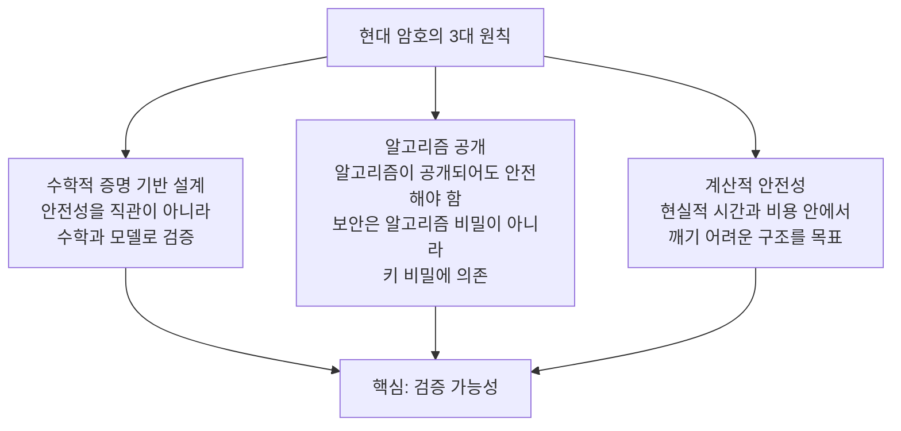
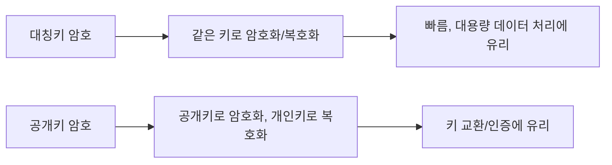
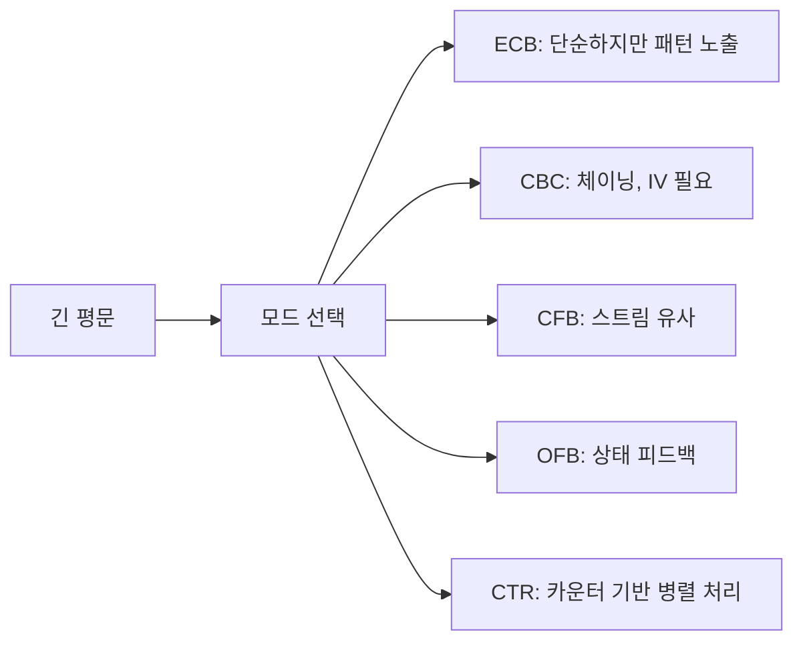

# 현대 암호 #1: 대칭키 암호체계

---

## 1. 현대 암호로의 전환

### 1.1 고전 암호의 한계

고전 암호(시저, 비제네르 등)는 역사적으로 매우 중요하지만, 공통 약점이 있었다.

1. 규칙이 단순해서 통계 분석에 취약
2. **컴퓨터 계산 능력 증가로 해독 시간 급감**
3. 보안성이 "감"이나 "복잡해 보임"에 의존

비제네르 암호는 한때 강력해 보였지만, 반복 키 구조 때문에 카시스키 분석 같은 방법으로 약점이 드러났다.

### 1.2 컴퓨터 시대와 암호학의 재정의

컴퓨터 시대가 열리며 암호는 감각이 아니라 수학으로 재정의되었다.

- Claude Shannon(1948~1949): 정보이론 기반 암호학 토대
- 핵심 질문: "절대 안전한가?"보다 "현실적 자원으로 깨기 가능한가?"
  
  

### 1.3 완전비밀성(Perfect Secrecy)과 계산적 안전성(Computational Security)

완전비밀성(Perfect Secrecy)은 이론적으로 이상적이다.

$$
P(M \mid C) = P(M)
$$

암호문 `C`를 봐도 평문 `M`의 확률이 바뀌지 않으면 완전비밀성이다.  
대표 예시는 OTP(One-Time Pad)지만, 키 길이/배포 문제로 일반 서비스에 쓰기 어렵다.

**현대 암호는 대신 계산적 안전성을 추구한다**.

- 충분히 큰 계산 비용이 들면 실질적으로 안전하다고 본다.
- AES 같은 블록 암호가 여기에 속한다.

---

## 2. 현대 암호의 3대 원칙

### 2.1 수학적 증명 기반 설계

안전성을 직관이 아니라 수학과 모델로 검증한다.

### 2.2 알고리즘 공개

좋은 암호는 알고리즘이 공개되어도 안전해야 한다.  
보안은 "알고리즘 비밀"이 아니라 "키 비밀"에 의존해야 한다.

### 2.3 계산적 안전성

현실적 시간/비용 안에서 깨기 어려운 구조를 목표로 한다.

> 현대 암호는 "숨기는 기술"이 아니라 "공개 검증 가능한 설계"다.
{: .prompt-tip }

---

## 3. 현대 암호체계의 큰 그림

### 3.1 대칭키와 공개키

대부분의 실제 시스템은 혼합 구조를 쓴다.

1. 공개키로 세션 키를 안전하게 교환
2. 대칭키로 실제 데이터를 빠르게 암호화

### 3.2 블록 암호의 기본 아이디어

DES/AES는 블록 암호다.

블록 암호의 "블록"은 데이터를 일정한 크기로 잘라 처리하는 단위를 뜻한다.

- DES: 64비트 블록 단위 처리
- AES: 128비트 블록 단위 처리

예를 들어 AES는 128비트(16바이트)씩 잘라서 암호화한다.  
즉, 긴 문서도 내부적으로는 `16바이트 조각`으로 나뉘어 순서대로 처리된다.

왜 블록 암호를 쓰게 되었을까?

1. 컴퓨터가 고정 길이 단위를 처리하기 쉽다(구현/최적화 유리)
2. 큰 데이터를 작은 단위로 나누면 메모리/성능 관리가 편해진다
3. **반복 라운드 구조를 설계해 [확산/혼돈 성질](#diffusion-confusion)을 안정적으로 구현할 수 있다**

장점:

1. 하드웨어/소프트웨어 최적화가 쉬워 고성능 구현이 가능하다
2. 보안 분석 모델이 잘 정리되어 검증과 표준화가 유리하다
3. [운영모드(Operation Mode)](#operation-mode)를 붙여 다양한 상황(파일, 네트워크, 병렬 처리)에 적용할 수 있다

단점:

1. 데이터 길이가 블록 배수가 아니면 패딩 처리가 필요하다
2. 운영모드를 잘못 선택하면 패턴 노출(예: ECB) 같은 문제가 생긴다
3. IV/Nonce 재사용 같은 운용 실수에 민감하다

즉, 블록 암호는 "강력한 엔진"이고, 운영모드는 그 엔진을 안전하게 쓰는 "주행 방식"이다.

### 3.3 확산(Diffusion)과 혼돈(Confusion)
{: #diffusion-confusion }

현대 블록 암호가 안전해지려면, 입력과 출력 사이의 관계가 공격자에게 쉽게 보이면 안 된다.  
여기서 중요한 두 축이 확산과 혼돈이다.

혼돈(Confusion):

1. **키와 암호문 사이의 관계를 복잡하게 만든다.**
2. **공격자가 "키의 일부가 출력의 어느 부분에 영향"을 주는지 추적하기 어렵게 한다.**
3. 주로 비선형 치환(S-Box) 같은 연산이 이 역할을 맡는다.

확산(Diffusion):

1. **평문의 작은 변화가 출력 전체로 넓게 퍼지게 만든다.**
2. 예를 들어 **평문 1비트만 바꿔도 암호문 여러 비트가 바뀌어야 한다.**
3. 치환 이후의 순열/혼합 연산(행 이동, 열 혼합 등)이 확산을 강화한다.

왜 중요한가?

1. 혼돈이 약하면 키 추론이 쉬워진다.
2. 확산이 약하면 입력 패턴이 출력에 남는다.
3. 둘이 함께 강해야 통계 공격과 구조적 공격에 견딜 수 있다.

짧은 비유:

- 혼돈은 "관계를 알아보기 어렵게 꼬는 것"
- 확산은 "작은 흔적을 전체로 퍼뜨리는 것"

AES를 예로 보면, S-Box 단계는 혼돈에, 행 이동/열 혼합 단계는 확산에 크게 기여한다.

---

## 4. 대칭키 암호체계 기초

### 4.1 정의

대칭키 암호(symmetric key encryption)는 송신자와 수신자가 같은 키를 공유한다.

- 암호화 키 = 복호화 키
- 빠르고 구현 효율이 좋아 저장 데이터 암호화에 널리 사용

대표 알고리즘:

- DES
- Triple-DES
- AES

### 4.2 장점과 단점

장점:

1. 빠르다
2. 대용량 처리에 유리하다

단점:

1. 키를 안전하게 전달해야 한다
2. 키 유출 시 영향이 크다

---

## 5. XOR 기초 (반드시 이해해야 할 핵심)

운영모드(CBC/CFB/OFB/CTR)를 이해하려면 XOR를 알아야 한다.

### 5.1 XOR 진리표

`XOR`는 두 비트가 다르면 1, 같으면 0이다.

| A | B | A XOR B |
|---|---|---|
| 0 | 0 | 0 |
| 0 | 1 | 1 |
| 1 | 0 | 1 |
| 1 | 1 | 0 |

### 5.2 왜 암호에서 XOR를 많이 쓰는가

가장 중요한 성질:

$$
(P \oplus K) \oplus K = P
$$

즉, 같은 키 `K`를 한 번 더 XOR하면 원래 평문 `P`가 복원된다.  
이 성질 때문에 스트림 계열 처리나 모드 설계에서 XOR가 핵심 연산으로 등장한다.

### 5.3 짧은 예시

평문 비트: `1011`  
키 비트: `0110`

암호문:

$$
1011 \oplus 0110 = 1101
$$

복호:

$$
1101 \oplus 0110 = 1011
$$

---

## 6. DES 심화

### 6.1 DES 탄생 배경

**1970년대, 표준 암호 필요성이 커지며 DES가 표준으로 채택되었다(1977).**

- 1970년대 초 -미국 정부: "우리에게 표준 암호가 필요하다“
	- 국가안보국(NSA): 기밀 암호만 사용 중
	- 민간 기업: 각자 다른 암호 사용 → 혼란
	- IBM: Lucifer 암호 개발 ➔ NSA 검토 및 수정
	  
	- 1977년 DES(Data Encryption Standard) 공표

의의:

1. **대중적인 표준 블록 암호의 시작**
2. 최초로 알고리즘 공개
	1. 고전: 알고리즘을 비밀로 (security by obscurity)
	2. **DES: 알고리즘 완전 공개, 키만 비밀 → 케르크호프스 원리의 실현!**
3. **이진 데이터 처리**
	1. 입력: 64비트 (8바이트)
	2. 키: 56비트
	3. 출력: 64비트 ➔ 모든 것이 0과 1로!
4. 하드웨어 구현
	1. 고전: 사람이 수작업
	2. **DES: 전용 칩으로 초당 수백만 블록 암호화**
### 6.2 구조 핵심

- 블록 크기: 64비트
- 키 길이: 64비트 입력(실효 56비트)
- 16라운드 Feistel 구조

**Feistel 구조의 장점은 암호화/복호화 구조가 유사해 구현이 효율적이라는 점이다.**

Feistel 구조를 아주 간단히 말하면, 입력 블록을 왼쪽(`L`)과 오른쪽(`R`)으로 나눈 뒤 라운드마다 섞는 방식이다.

라운드의 대표 형태:

$$
L_{i+1} = R_i,\quad
R_{i+1} = L_i \oplus F(R_i, K_i)
$$

**핵심은 복호화 시 같은 구조를 쓰고 서브키 순서만 반대로 적용하면 된다는 점이다.**

장점:

1. **암호화/복호화 회로(코드)를 거의 공용으로 쓸 수 있어 구현이 단순하다.**
2. 라운드 함수 `F`가 역함수가 아니어도 전체 복호가 가능해 설계 유연성이 있다.
3. 하드웨어/소프트웨어 구현에서 검증과 유지보수가 비교적 쉽다.

단점:

1. 보안성은 라운드 수와 `F` 함수 품질에 크게 의존한다.
2. 충분한 안전성을 확보하려면 라운드가 많아져 성능 비용이 증가할 수 있다.
3. DES처럼 키 길이가 짧으면 구조 자체와 무관하게 현대 환경에서 취약해질 수 있다.

### 6.3 왜 DES는 퇴장했는가

실효 키 길이 56비트는 현대 계산 능력 앞에서 충분히 작다.  
실제로 DES 전용 크래커 사례가 등장하며 실무 안전성이 붕괴했다.
- 무차별 대입 공격(Brute Force)의 현실화
	- 1977년: 가능한 키 개수: 2^56 = 72,057,594,037,927,936개
	- 당시 컴퓨터로 모두 시도 : 수백~수천 년 걸림 ➔ 안전함

>1998년 EFF는 단 25만 달러로 Deep Crack(ASIC 1,856개)를 만들어 초당 880억 개 키를 때려보며 “DES는 이제 안전하지 않다”는 걸 현실로 증명했다. 이 머신은 RSA Labs의 DES Challenge II-2를 1998년 7월 13일부터 17일까지 단 56시간 만에 깨버렸고, 상금 1만 달러를 받은 EFF는 그 돈을 기부했다. 이 사건 이후 DES는 사실상 역사 속으로 밀려나고, 더 강한 표준(AES)으로의 전환이 가속됐다.

>이미 1993년 Michael Wiener가 “**돈만 있으면 DES는 빠르게 깰 수 있다**”는 걸 이론적으로 못 박았고, 문제는 보안 기술이 아니라 비용의 문제로 바뀌었다. 그래서 1990년대엔 3DES를 임시로 썼지만, 속도는 느리고 블록 크기(64비트) 한계는 그대로라 근본 해결이 아니었다. **여기에 컴퓨터 성능이 급격히 올라가며 “DES는 2000년대에 사실상 무용지물”이라는 결론이 현실이 됐다.**

### 6.4 DES 실습 링크

- [DES Encrypt 실습](https://emn178.github.io/online-tools/des/encrypt/)

실습 권장 순서:

1. 같은 평문에 다른 키를 넣어 암호문 비교
2. 같은 키에 평문 1글자만 바꿔 암호문 변화 확인
3. "작은 입력 변화가 큰 출력 변화"가 나타나는지 관찰

---

## 7. AES 심화

### 7.1 AES 표준화

DES 대체 표준으로 NIST가 공모를 진행했고, Rijndael이 AES로 채택되었다.
- NIST는 1997년 1월에 AES라는 이름의 표준을 제정할 것을 발표
- 개방성과 국제 흐름을 반영
	- 수학자, 컴퓨터 학자, 암호학자, 공학자등 다양한 분야의 전문가들이 의견을 적극적으로 반영
- 1997년 9월부터 암호화 알고리즘의 공모
	- 조건: 128비트 블록 암호이며, 128, 192, 256비트 길이의 키를 지원할 것
- MARS, RC6,Rijndael , Serpent, Twofish 알고리즘이 최종 후보
	- 안전성, 유연성, 성능 등을 가장 잘 만족하는 Rijndael 알고리즘이 최종적으로 채택
	- Vincent Rijmen, Joan Daemen ➔ Rijndael = Rijmen + Daemen
	  
	
- NIST는 2001년 11월 26일에 Rijndael 알고리즘을 FIPS 197, AES라는 이름으로 표준으로 발표
  

- 블록 크기: 128비트 고정
- 키 길이: 128/192/256비트

### 7.2 DES와 구조 차이

- DES: Feistel 구조
- AES: SPN(Substitution-Permutation Network)

AES는 S-Box 치환, 행 이동, 열 혼합, 라운드 키 추가를 반복하며 확산/혼돈을 강화한다.

- [AES 애니메이션(CrypTool)](https://legacy.cryptool.org/en/cto/aes-animation)

#### DES(Feistel)와 AES(SPN) 구조 비교

| 구분 | Feistel : DES | SPN : AES |
|---|---|---|
| 핵심 방식 | 절반씩 처리 + 교환 | 전체를 한 번에 처리 |
| 한 라운드 | 절반만 변환됨 | 전체가 변환됨 |
| 확산 속도 | 느림 (2라운드/전체) | 빠름 (1~2라운드) |
| 필요 라운드 | 많음 (16+) | 적음 (10~14) |
| 암/복호화 | 동일 구조 | 다른 구조 |
| 하드웨어 | 단순 (회로 재사용) | 복잡 (역회로 필요) |
| 소프트웨어 | 느림 | 빠름 (병렬 처리 가능) |
| 수학적 분석 | 복잡 | 명확 |
| 대표 암호 | DES (16라운드) | AES (10라운드) |
| 현대 적합성 | 레거시/제약 환경 | 범용/고성능 환경 |

### 7.3 AES 실습 링크

- [AES Encrypt 실습](https://emn178.github.io/online-tools/aes/encrypt/)

실습 포인트:

1. AES-128, AES-192, AES-256 비교
2. 같은 키에서 평문 1비트 변화 시 암호문 변화를 관찰
3. ECB/CBC 모드 바꿔 결과 비교(가능한 도구에서)

---

## 8. 대칭키 운영모드 (영상 핵심)
{: #operation-mode }

### 8.1 운영모드가 필요한 이유

예를 들어 AES는 128비트씩 처리한다.  
현실 데이터(문서, 이미지, 로그)는 훨씬 크고 길이가 제각각이다.

운영모드는 아래 문제를 해결한다.

1. 긴 메시지 분할 처리
2. 블록 간 연결 규칙
3. IV/Nonce 사용 방식
4. 오류 전파 특성 제어
5. 병렬 처리 가능 여부

---

### 8.2 ECB(Electronic Codebook) 모드(가장 기본 모드)

원리:

$$
C_i = E_K(P_i)
$$

각 블록을 독립적으로 암호화한다.

장점:

1. 단순하고 빠르다
2. 병렬 처리 쉬움

단점:

1. 같은 평문 블록 -> 같은 암호문 블록
2. 패턴 노출(이미지/정형 데이터에서 특히 위험)

실무 권장: 일반 데이터 암호화에는 사실상 비권장.

---

### 8.3 CBC(Cipher Block Chaining) 모드

원리:

$$
C_i = E_K(P_i \oplus C_{i-1}), \quad C_0 = IV
$$

**현재 평문 블록을 이전 암호문 블록과 XOR한 뒤 암호화한다.**

특징:

1. **같은 평문 블록이라도 다른 결과 가능**
2. **IV가 중요(재사용 금지)**
  >IV(Initialization Vector, 초기화 벡터)는 암호화할 때 함께 넣는 **초기값**입니다.  
   >같은 평문과 같은 키를 써도 결과 암호문이 매번 달라지게 만들어 패턴 노출을 줄여줍니다.  
   >보통 IV는 비밀일 필요는 없지만, **예측 가능하거나 재사용하면 위험**합니다.
3. 복호 시 오류 전파 특성 존재

---

### 8.4 CFB(Cipher Feedback) 모드

**블록 암호를 스트림처럼 쓰는 방식 중 하나다.**
1. 스트림처럼 처리 가능
    - 블록 단위가 아니라 바이트/비트 단위 처리도 가능해서 실시간 전송에 유리.
    - 지연이 적음
2. 패딩이 불필요
    - CBC는 블록 맞춤 패딩이 필요하지만 CFB는 보통 패딩 없이 처리 가능.

핵심:

1. 이전 암호문/상태를 암호화해 키스트림 생성
2. 그 키스트림과 평문을 XOR

특징:

1. 비트/바이트 단위 처리 유연
2. 전송 환경에서 활용 가능
3. **일부 오류 전파 발생**

---

### 8.5 OFB(Output Feedback) 모드

CFB와 유사하지만 피드백에 암호문이 아니라 내부 출력 상태를 사용한다.

1. 오류 전파가 거의 없음
    - 전송 중 비트 1개가 깨지면 복호 평문도 해당 비트만 주로 영향받음.
2. 키스트림 사전 생성 가능
    - 평문 도착 전에도 키스트림을 만들어둘 수 있어 지연을 줄이기 좋음.
    - 블록 암호를 스트림처럼 사용 가능

특징:

1. 키스트림을 미리 생성 가능
2. 오류가 다음 블록으로 크게 전파되지 않는 경향
3. IV/Nonce 재사용 시 매우 위험

---

### 8.6 CTR(Counter) 모드

원리:

$$
C_i = P_i \oplus E_K(\text{Nonce} \parallel \text{Counter}_i)
$$

카운터 값을 암호화해 키스트림을 만들고 XOR한다.

1. 빠름
    - 블록들을 병렬로 암/복호할 수 있어 속도가 잘 나옵니다.
2. 랜덤 접근 가능
    - 파일 일부만 바로 복호 가능해서 저장장치/대용량 데이터에 유리합니다.
3. 구현이 단순
    - 키스트림 생성 후 XOR 구조라 처리 흐름이 깔끔합니다.
4. 오류 전파가 작음

장점:

1. 병렬 처리 매우 유리
2. 랜덤 접근 가능(특정 블록만 처리)
3. 구현 단순성/성능 측면에서 현대 시스템과 잘 맞음

주의:

1. 같은 키에서 Nonce 재사용 금지
	1. nonce는 **한 번만 쓰는 값**(number used once)
	2. CTR 같은 모드에서 키와 함께 입력되어, 같은 키를 써도 매번 다른 키스트림/암호문이 나오게 함
	3. 핵심 규칙은 **같은 키에서 nonce를 절대 재사용하지 않는 것**
2. 카운터 충돌 금지

---

### 8.7 운영모드 비교표

| 모드 | 핵심 아이디어 | 패턴 노출 | 병렬 암호화 | 오류 전파 |
|---|---|---|---|---|
| ECB | 블록 독립 암호화 | 큼 | 쉬움 | 낮음(블록 단위) |
| CBC | 이전 암호문과 XOR 후 암호화 | 작음 | 어려움(직렬) | 일부 전파 |
| CFB | 피드백 기반 스트림화 | 작음 | 제한적 | 일부 전파 |
| OFB | 내부 상태 피드백 스트림 | 작음 | 제한적 | 전파 적음 |
| CTR | 카운터 암호화 스트림 | 작음 | 쉬움 | 전파 적음 |

---

## 9. 대칭키 암호의 실무 한계와 보완

### 9.1 키 공유/관리 문제

- 키 공유 문제 : 키 전달과정에서 누군가 키를 가로챌 수 있음
  
  
- 키 관리 문제 : 사용자가 많아질수록 다수의 키를 관리
  

### 9.2 IV/Nonce 재사용 문제

- CBC/CTR/OFB 같은 모드에서 IV/Nonce 재사용은 치명적일 수 있다.  
- 특히 CTR에서 같은 키+Nonce 조합 재사용은 평문 유출 가능성을 크게 높인다.

### 9.3 패딩/구현 실수

보안 사고는 알고리즘 약점보다 구현 실수에서 더 자주 난다.

1. 패딩 오류 처리 누출
2. 키/IV 하드코딩
3. 난수 생성기 품질 문제
4. 예외 메시지 과다 노출

현대 대칭키 암호를 공부할 때 반드시 기억해야 할 한 문장:

**"강한 알고리즘 + 올바른 운영모드 + 안전한 키/IV 관리"가 함께 있어야 보안이 된다.**

