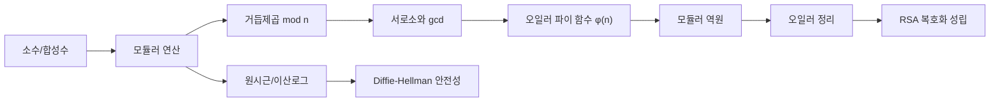

# 공개키 암호를 위한 수학 배경 노트

이 노트는 `현대 암호 #2(공개키 암호체계)` 본문에서 사용한 수학 개념만 따로 정리한 보조 자료다.  
핵심 목표는 다음 한 줄이다.

> RSA와 Diffie-Hellman의 식을 "그냥 외우는 것"이 아니라, 왜 작동하는지 설명할 수 있게 만드는 것
{: .prompt-tip }

---

## 0. 먼저 큰 그림

---

## 1. 소수, 합성수, 인수분해

### 1.1 소수와 합성수

- 소수(prime): `1`과 자기 자신만 약수로 갖는 1보다 큰 자연수 (`2, 3, 5, 7, 11, ...`)
- 합성수(composite): 소수가 아닌 1보다 큰 수 (`4, 6, 8, 9, 10, ...`)

### 1.2 왜 중요한가

1. RSA는 `n = p * q` 형태(`p`, `q`는 큰 소수)를 사용한다.
2. `n`만 보고 `p`, `q`를 찾는 인수분해가 어려우면 RSA가 안전해진다.
3. 즉, "곱하기는 쉽고, 다시 쪼개기는 어렵다"는 비대칭성이 핵심이다.

---

## 2. 모듈러 연산(mod): 시계 산술

### 2.1 기본 정의

`a mod n`은 "`a`를 `n`으로 나눴을 때 나머지"다.

- `15 mod 12 = 3`
- `25 mod 7 = 4`
- `100 mod 23 = 8`

### 2.2 암호에서 중요한 이유

암호학은 숫자가 매우 커진다. 그런데 mod를 쓰면 값을 일정 범위(`0`~`n-1`) 안에 유지할 수 있다.

### 2.3 자주 쓰는 성질

$$
(a+b) \bmod n = [(a \bmod n) + (b \bmod n)] \bmod n
$$

$$
(a \times b) \bmod n = [(a \bmod n)\times(b \bmod n)] \bmod n
$$

---

## 3. 모듈러 거듭제곱

### 3.1 왜 필요한가

RSA, DH는 모두 `a^x mod n` 형태를 반복 사용한다.

### 3.2 예시

`3^4 mod 7`:

1. `3^2 = 9`, `9 mod 7 = 2`
2. `3^4 = (3^2)^2`
3. `3^4 mod 7 = 2^2 mod 7 = 4`

직접 큰 수를 만들지 않고 중간중간 mod를 취하면 계산이 빨라진다.

---

## 4. 서로소와 최대공약수(gcd)

### 4.1 정의

- `gcd(a,b)`: `a`와 `b`의 최대공약수
- `gcd(a,b)=1`이면 서로소(coprime)

예시:

- `gcd(15,25)=5` (서로소 아님)
- `gcd(7,13)=1` (서로소)

### 4.2 유클리드 호제법

$$
gcd(a,b) = gcd(b, a \bmod b)
$$

반복해서 나머지를 줄이면 빠르게 gcd를 구할 수 있다.

---

## 5. 오일러 파이 함수 φ(n)

### 5.1 정의

`φ(n)`은 `1`부터 `n` 사이에서 `n`과 서로소인 수의 개수다.

### 5.2 RSA에서 자주 쓰는 형태

`n = p*q`이고 `p,q`가 서로 다른 소수면:

$$
\varphi(n)=\varphi(pq)=(p-1)(q-1)
$$

예시:

- `p=11`, `q=13`
- `n=143`
- `φ(n)=(11-1)(13-1)=10*12=120`

---

## 6. 모듈러 역원

### 6.1 정의

`a`의 모듈러 역원 `x`는 아래를 만족한다.

$$
a \times x \equiv 1 \pmod n
$$

이때 `x = a^{-1} mod n`으로 표기한다.

### 6.2 존재 조건

역원이 존재하려면 `gcd(a,n)=1`이어야 한다.

### 6.3 예시

`3x ≡ 1 (mod 7)`의 해:

- `3*1 mod 7 = 3`
- `3*2 mod 7 = 6`
- `3*3 mod 7 = 2`
- `3*4 mod 7 = 5`
- `3*5 mod 7 = 1`

따라서 `3^{-1} mod 7 = 5`.

### 6.4 RSA와 연결

RSA에서 공개지수 `e`를 정하면 개인지수 `d`는

$$
e \times d \equiv 1 \pmod{\varphi(n)}
$$

을 만족하는 역원이다. 즉 `d = e^{-1} mod φ(n)`.

---

## 7. 오일러 정리

### 7.1 정리

`gcd(a,n)=1`이면:

$$
a^{\varphi(n)} \equiv 1 \pmod n
$$

### 7.2 간단 검산

- `a=3`, `n=10`
- `gcd(3,10)=1`
- `φ(10)=4`
- `3^4=81`, `81 mod 10 = 1`

성립한다.

### 7.3 RSA 복호화가 되는 이유(핵심)

RSA에서 `ed ≡ 1 (mod φ(n))`이면 `ed = 1 + kφ(n)` 형태다.  
이때 적절한 조건에서:

$$
M^{ed} \equiv M \pmod n
$$

이 성립하고, 그래서 암호화 후 복호화하면 원문으로 돌아온다.

---

## 8. 원시근과 이산로그(DH 배경)

### 8.1 원시근 직관

소수 `p`에 대해 특정 `g`를 거듭제곱 mod `p` 했을 때, `1`부터 `p-1`까지의 값을 순환하며 거의 모두 만들어내는 `g`가 있다. 이를 원시근(primitive root)이라 부른다.

### 8.2 DH와 연결

DH는 공개값 `g^a mod p`, `g^b mod p`를 교환한다.  
공격자는 이 값들을 보더라도 `a`, `b`를 직접 찾기 어렵다. 이 어려움이 이산로그 문제다.

---

## 9. RSA 미니 예제(수업용 숫자)

1. 소수 선택: `p=11`, `q=13`
2. `n=pq=143`
3. `φ(n)=120`
4. 공개지수 선택: `e=7` (`gcd(7,120)=1`)
5. 개인지수 계산: `d=103` (`7*103=721 ≡ 1 mod 120`)

공개키: `(e,n)=(7,143)`  
개인키: `(d,n)=(103,143)`

평문 `M=5` 암호화:

$$
C = M^e \bmod n = 5^7 \bmod 143 = 47
$$

복호화:

$$
M = C^d \bmod n = 47^{103} \bmod 143 = 5
$$

---

## 10. 수업에서 자주 나오는 질문

### Q1. 왜 꼭 소수를 쓰나요?

소수 기반 구조는 역원, φ(n), 정리 적용이 깔끔해지고, 안전성 가정(인수분해/이산로그)도 명확해진다.

### Q2. 왜 숫자를 크게 하나요?

수학적 "가능/불가능"이 아니라 계산 비용의 싸움이다. 충분히 큰 수를 써서 공격 비용을 비현실적으로 만든다.

### Q3. 이 수학을 전부 증명해야 하나요?

입문 단계에서는 개념-연결-계산 흐름을 정확히 이해하는 것이 목표다.  
증명은 상위 과정에서 확장하면 된다.

---

## 11. 본문으로 돌아가기

- [현대 암호 #2 본문으로 이동](/posts/infosec-5-crypto-3/)
