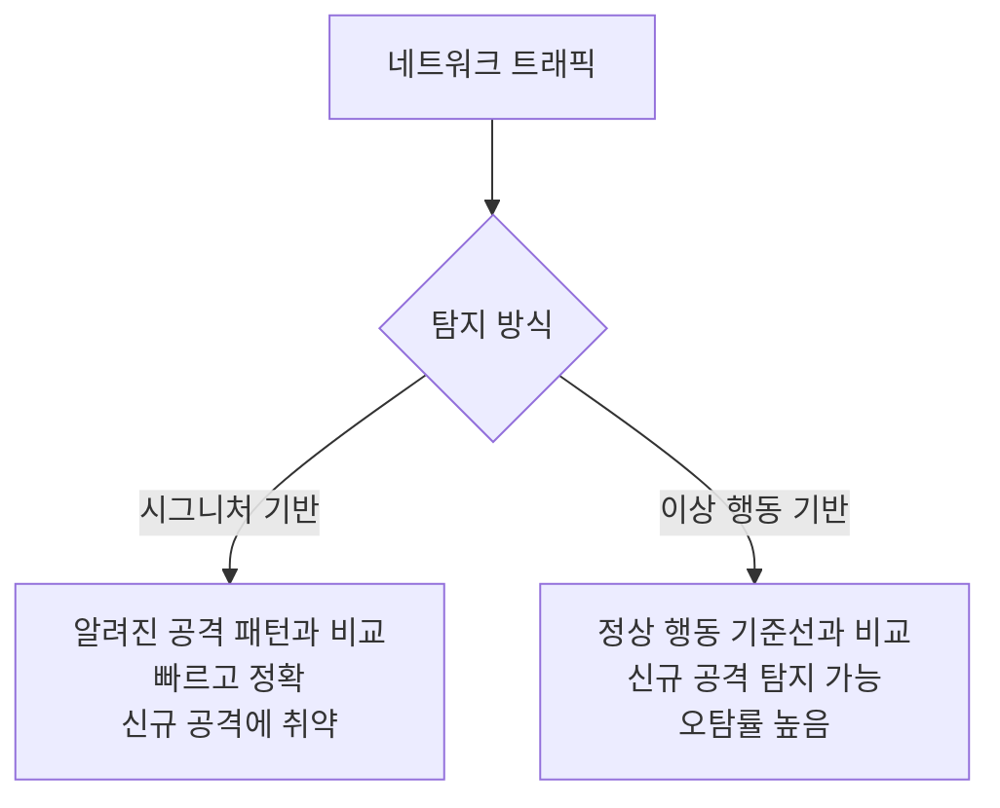
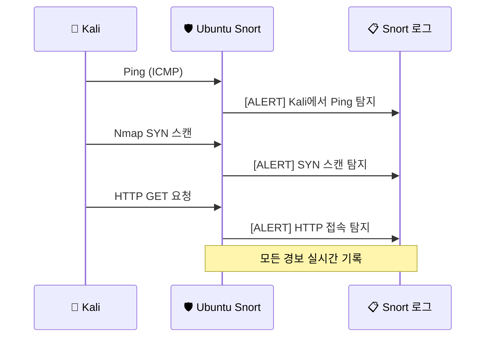
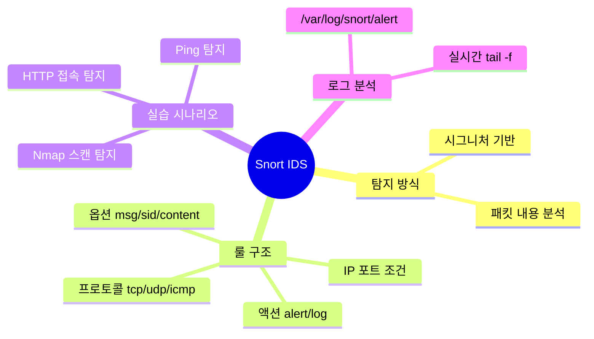

# 침입 탐지 시스템 — Snort IDS

---

## 실습 환경

| 역할 | OS | IP |
|------|----|----|
| 공격자 | Kali Linux | `192.168.0.10` |
| 탐지 서버 | Ubuntu | `192.168.0.30` |

---

## Part 1. IDS/IPS 개념

### 1.1 IDS vs IPS

| 항목 | IDS (Intrusion Detection System) | IPS (Intrusion Prevention System) |
|------|----------------------------------|-----------------------------------|
| 역할 | 공격 **탐지** → 경보 발생 | 공격 탐지 → **차단** |
| 동작 방식 | 트래픽 복사본 분석 (Passive) | 트래픽 경로 상에 위치 (Inline) |
| 서비스 영향 | 없음 | 오탐 시 정상 트래픽도 차단 위험 |
| 적합한 상황 | 모니터링 우선 | 즉각적인 방어 필요 |

### 1.2 탐지 방식



### 1.3 Snort란?

**Snort**는 가장 널리 쓰이는 오픈소스 네트워크 IDS/IPS다.

- **시그니처 기반** 탐지
- 패킷 스니퍼, 패킷 로거, NIDS 세 가지 모드 지원
- 커스텀 룰 작성 가능
- 실시간 트래픽 분석 및 경보

---

## Part 2. Snort 설치 (Ubuntu)

### 2.1 설치

```bash
sudo apt update
sudo apt install snort -y
```

설치 중 네트워크 인터페이스와 홈 네트워크 대역을 입력한다:

```
HOME_NET: 192.168.0.0/24
```

### 2.2 설치 확인

```bash
snort --version
```

```
   ,,_     -*> Snort! <*-
  o"  )~   Version 2.9.x.x
   ''''    By Martin Roesch & The Snort Team
```

### 2.3 주요 설정 파일

| 파일 | 역할 |
|------|------|
| `/etc/snort/snort.conf` | 메인 설정 파일 |
| `/etc/snort/rules/` | 룰 파일 디렉토리 |
| `/var/log/snort/` | 로그 저장 디렉토리 |

### 2.4 네트워크 인터페이스 확인

```bash
ip addr show
```

인터페이스 이름 확인 (예: `ens33`, `eth0`, `enp0s3`). 이후 Snort 실행 시 사용한다.

---

## Part 3. Snort 룰(Rule) 작성

### 3.1 룰 구조

Snort 룰은 **헤더**와 **옵션**으로 구성된다.

```
[액션] [프로토콜] [출발지IP] [출발지포트] -> [목적지IP] [목적지포트] (옵션들)
```

**예시:**
```
alert tcp any any -> 192.168.0.30 80 (msg:"HTTP 접속 탐지"; sid:1000001; rev:1;)
```

### 3.2 주요 액션

| 액션 | 의미 |
|------|------|
| `alert` | 경보 발생 + 로그 기록 |
| `log` | 로그만 기록 |
| `drop` | 패킷 차단 (IPS 모드) |
| `pass` | 무시 |

### 3.3 주요 룰 옵션

| 옵션 | 설명 | 예시 |
|------|------|------|
| `msg` | 경보 메시지 | `msg:"Nmap SYN Scan";` |
| `sid` | 룰 고유 ID (1000000 이상 커스텀) | `sid:1000001;` |
| `rev` | 룰 버전 | `rev:1;` |
| `content` | 페이로드 내용 매칭 | `content:"GET";` |
| `flags` | TCP 플래그 | `flags:S;` (SYN만) |
| `ttl` | TTL 값 조건 | `ttl:<64;` |
| `threshold` | 임계치 설정 | `threshold:type limit,...` |

---

## Part 4. 실습 — 커스텀 룰 작성 및 Kali 공격 탐지

### 4.1 커스텀 룰 파일 생성

```bash
sudo nano /etc/snort/rules/local.rules
```

아래 룰을 추가한다:

```bash
# Kali에서 오는 모든 TCP 트래픽 탐지
alert tcp 192.168.0.10 any -> 192.168.0.30 any (msg:"[ALERT] Kali에서 TCP 접속 탐지"; sid:1000001; rev:1;)

# Nmap SYN 스캔 탐지 (SYN 플래그만 있는 패킷)
alert tcp any any -> 192.168.0.30 any (msg:"[ALERT] SYN 스캔 탐지"; flags:S; threshold:type both, track by_src, count 20, seconds 3; sid:1000002; rev:1;)

# HTTP 서버 접속 탐지
alert tcp any any -> 192.168.0.30 80 (msg:"[ALERT] HTTP 접속 탐지"; content:"GET"; sid:1000003; rev:1;)

# ICMP Ping 탐지
alert icmp 192.168.0.10 any -> 192.168.0.30 any (msg:"[ALERT] Kali에서 Ping 탐지"; itype:8; sid:1000004; rev:1;)
```

### 4.2 설정 파일에서 커스텀 룰 활성화

```bash
sudo nano /etc/snort/snort.conf
```

파일 하단 룰 include 섹션에 추가:

```bash
include $RULE_PATH/local.rules
```

### 4.3 Snort 테스트 실행 (설정 검증)

```bash
sudo snort -T -c /etc/snort/snort.conf -i ens33
```

```
Snort successfully validated the configuration!
```

### 4.4 Snort 실시간 탐지 모드 실행

```bash
# -A console: 경보를 터미널에 출력
sudo snort -A console -c /etc/snort/snort.conf -i ens33
```

### 4.5 Kali에서 공격 시나리오 실행

**시나리오 1: Ping 테스트**
```bash
# Kali에서 실행
ping -c 5 192.168.0.30
```

Ubuntu Snort 출력 예상:
```
03/26-09:30:01.123456  [**] [1:1000004:1] [ALERT] Kali에서 Ping 탐지 [**]
[Priority: 0]
ICMP 192.168.0.10 -> 192.168.0.30
```

**시나리오 2: Nmap SYN 스캔**
```bash
# Kali에서 실행
sudo nmap -sS 192.168.0.30
```

Ubuntu Snort 출력 예상:
```
[**] [1:1000002:1] [ALERT] SYN 스캔 탐지 [**]
[Priority: 0]
TCP 192.168.0.10:xxxxx -> 192.168.0.30:22
```

**시나리오 3: 웹 접속**
```bash
# Kali에서 실행
curl http://192.168.0.30/
```

**시나리오 4: 전체 종합 공격 흐름**



---

## Part 5. Snort 로그 분석

### 5.1 로그 파일 확인

```bash
# 로그 디렉토리
ls -la /var/log/snort/

# alert 로그 실시간 모니터링
sudo tail -f /var/log/snort/alert
```

### 5.2 로그 형식 이해

```
03/26-09:30:01.123456  [**] [1:1000001:1] [ALERT] Kali에서 TCP 접속 탐지 [**]
[Priority: 0]
{TCP} 192.168.0.10:54321 -> 192.168.0.30:80
```

| 항목 | 의미 |
|------|------|
| `03/26-09:30:01` | 탐지 시간 |
| `[1:1000001:1]` | gid:sid:rev |
| 메시지 | 룰의 msg 내용 |
| `{TCP}` | 프로토콜 |
| IP:포트 | 출발지 → 목적지 |

### 5.3 통계 확인

Snort 종료(`Ctrl+C`) 후 통계 출력:

```
Snort exiting
...
Total alerts:        47
...
```

---

## Part 6. 룰 심화 — 임계치(Threshold) 설정

무차별 스캔은 짧은 시간에 많은 패킷을 발생시킨다. 임계치 옵션으로 이를 탐지한다.

```bash
# 3초 안에 같은 IP에서 20번 이상 SYN이 오면 경보
alert tcp any any -> 192.168.0.30 any (
    msg:"[ALERT] 포트 스캔 의심";
    flags:S;
    threshold:type both, track by_src, count 20, seconds 3;
    sid:1000005;
    rev:1;
)
```

| 옵션 | 의미 |
|------|------|
| `type both` | 탐지 + 로그 모두 |
| `track by_src` | 출발지 IP 기준 |
| `count 20` | 20회 발생 시 |
| `seconds 3` | 3초 안에 |

---

## 정리



| 명령어 | 설명 |
|--------|------|
| `sudo snort -T -c /etc/snort/snort.conf -i ens33` | 설정 검증 |
| `sudo snort -A console -c /etc/snort/snort.conf -i ens33` | 실시간 탐지 |
| `sudo tail -f /var/log/snort/alert` | 로그 실시간 확인 |

다음 시간에는 **10-2 과제**에서 Snort 경보 로그를 분석하고, IDS 우회 기법과 대응 방법을 정리합니다.
