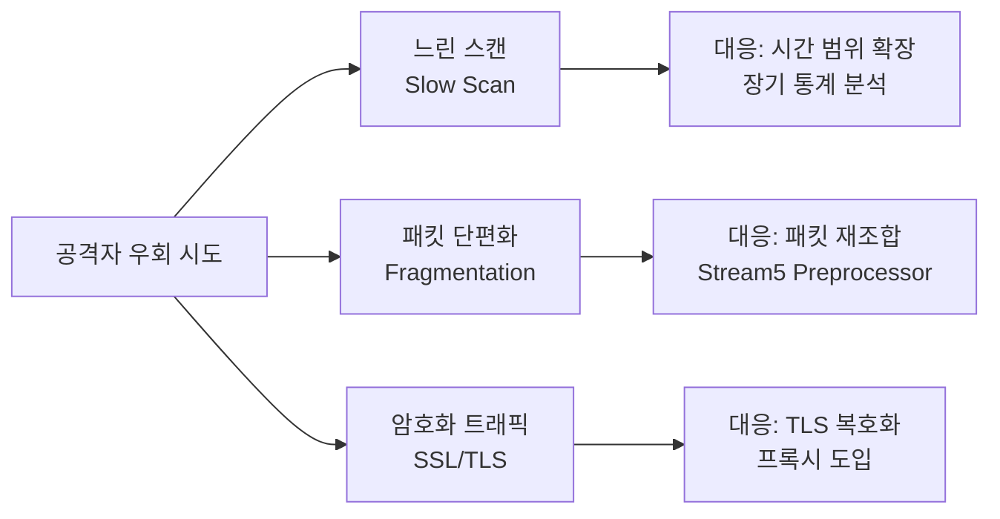
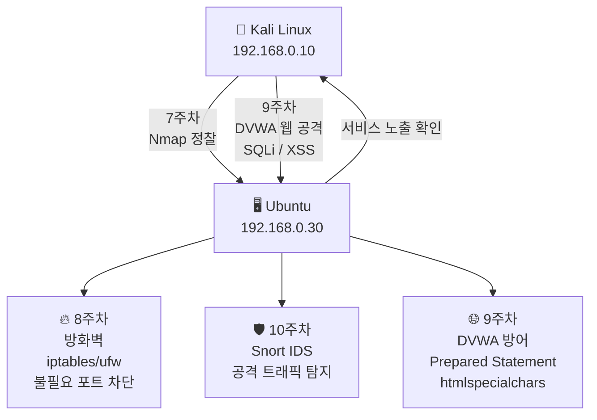
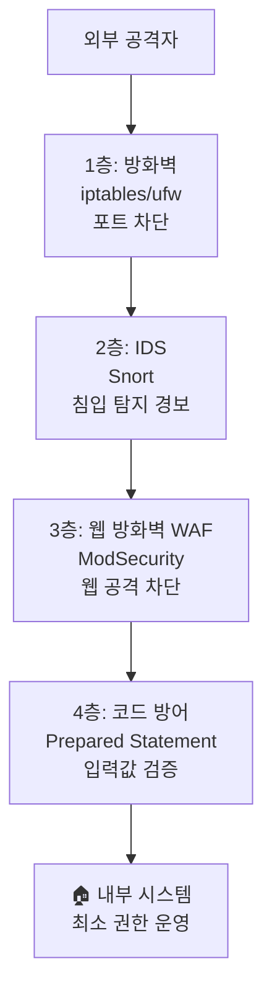

# Snort 로그 분석 — 과제 & IDS 우회와 대응

---

## 실습 환경

| 역할 | OS | IP |
|------|----|----|
| 공격자 | Kali Linux | `192.168.0.10` |
| 탐지 서버 | Ubuntu | `192.168.0.30` |

---

## Part 1. 과제 — Snort 경보 로그 분석

### 과제 1-1. 경보 로그 수집

Snort를 실행한 상태에서 Kali의 공격 시나리오(Ping, Nmap, HTTP)를 모두 수행하고 경보 로그를 수집한다.

```bash
# Ubuntu에서 Snort 실행
sudo snort -A console -c /etc/snort/snort.conf -i ens33 2>&1 | tee snort_log.txt
```

```bash
# Kali에서 순서대로 실행
ping -c 5 192.168.0.30
sudo nmap -sS 192.168.0.30
curl http://192.168.0.30/
sudo nmap -sS -p- 192.168.0.30
```

Ubuntu에서 `Ctrl+C`로 Snort 종료 후 로그 저장.

---

### 과제 1-2. 로그 분석 보고서 작성

수집한 `snort_log.txt`를 바탕으로 아래 보고서를 완성하라.

**경보 유형별 집계:**

```bash
# 경보 메시지별 건수 집계
grep "\[\*\*\]" snort_log.txt | grep -oP '\[ALERT\][^[]+' | sort | uniq -c | sort -rn
```

**보고서 양식:**

```
=== Snort 탐지 보고서 ===
분석 기간  : YYYY-MM-DD HH:MM ~ HH:MM
탐지 서버  : Ubuntu (192.168.0.30)
공격 출발지: Kali (192.168.0.10)

[경보 유형별 통계]
경보 메시지                 | 탐지 건수
--------------------------|--------
[ALERT] Kali에서 Ping 탐지 |
[ALERT] SYN 스캔 탐지      |
[ALERT] HTTP 접속 탐지     |
합계                       |

[탐지 시간 분포]
가장 많은 경보 발생 시간대:
공격 시작 추정 시각:

[결론 및 조치 권고]
1.
2.
```

---

### 과제 1-3. 룰 추가 작성

아래 요구사항에 맞는 Snort 룰을 작성하라.

**요구사항 1:** MySQL 포트(3306)에 대한 접근 시도를 탐지하는 룰

```
alert ____ any any -> 192.168.0.30 ____ (msg:"[ALERT] MySQL 접근 시도"; sid:______; rev:1;)
```

**요구사항 2:** Kali에서 SSH(22) 포트로 5초 안에 10번 이상 접속 시도 시 경보

```
alert tcp 192.168.0.10 any -> 192.168.0.30 22 (
    msg:"[ALERT] SSH 무차별 대입 의심";
    threshold:type both, track by_src, count ___, seconds ___;
    sid:1000006; rev:1;
)
```

**정답:**

```bash
# 요구사항 1
alert tcp any any -> 192.168.0.30 3306 (msg:"[ALERT] MySQL 접근 시도"; sid:1000007; rev:1;)

# 요구사항 2
alert tcp 192.168.0.10 any -> 192.168.0.30 22 (
    msg:"[ALERT] SSH 무차별 대입 의심";
    threshold:type both, track by_src, count 10, seconds 5;
    sid:1000006; rev:1;
)
```

---

## Part 2. IDS 우회 기법 소개

IDS도 완벽하지 않다. 공격자는 다양한 방법으로 탐지를 피하려 한다. 이를 알아야 더 강한 방어가 가능하다.

### 2.1 느린 스캔 (Slow Scan)

빠른 스캔은 임계치 룰에 탐지된다. 스캔 속도를 낮추면 임계치를 우회할 수 있다.

```bash
# Kali에서 느린 스캔 (--scan-delay)
sudo nmap -sS --scan-delay 5s 192.168.0.30
```

**대응:** 임계치 시간 범위를 더 길게 설정하거나, 장기 통계 분석 도입.

### 2.2 분산 스캔 (Distributed Scan)

여러 IP에서 동시에 조금씩 스캔하면 단일 IP 기반 임계치를 우회할 수 있다.

**대응:** `track by_dst` 옵션으로 목적지 기준 집계.

### 2.3 패킷 단편화 (Fragmentation)

패킷을 작은 조각으로 나눠 전송하면 시그니처 매칭이 어렵다.

```bash
# Kali에서 단편화 스캔
sudo nmap -sS -f 192.168.0.30
```

**대응:** Snort의 스트림 재조합(Stream5 preprocessor) 기능 활성화.

### 2.4 SSL/TLS 암호화

암호화된 트래픽은 내용 기반 시그니처를 적용하기 어렵다.

**대응:** SSL/TLS 복호화 프록시 도입, 인증서 검사.

### 2.5 우회와 대응 정리



---

## Part 3. 전체 커리큘럼 7~10주차 정리

### 3.1 공격-탐지-방어 전체 흐름



### 3.2 주차별 핵심 정리

| 주차 | 주제 | 공격 도구 | 방어 방법 |
|------|------|-----------|-----------|
| 7주차 | 네트워크 스캐닝 | Nmap, Wireshark | 서비스 최소화, 포트 관리 |
| 8주차 | 방화벽 | 포트 스캔 | iptables, ufw |
| 9주차 | 웹 취약점 | Burp Suite, DVWA | Prepared Statement, htmlspecialchars, WAF |
| 10주차 | 침입 탐지 | Nmap, curl | Snort IDS 룰 작성 |

### 3.3 보안의 다층 방어 원칙 (Defense in Depth)



---

## Part 4. 셀프체크

### 객관식

**Q1.** IDS와 IPS의 가장 큰 차이점은?

- ① IDS는 유료, IPS는 무료다
- **② IDS는 탐지만 하고, IPS는 탐지 후 차단까지 수행한다**
- ③ IDS는 웹 전용, IPS는 네트워크 전용이다
- ④ IPS는 로그를 남기지 않는다

**Q2.** Snort 룰에서 `flags:S;` 옵션의 의미는?

- ① SYN-ACK 패킷만 탐지
- **② SYN 플래그만 있는 패킷을 탐지 (Half-open 스캔)**
- ③ FIN 패킷을 탐지
- ④ 모든 TCP 플래그를 탐지

**Q3.** Snort 룰에서 `sid`가 1000000 이상이어야 하는 이유는?

- ① 숫자가 클수록 우선순위가 높다
- **② 1~999999는 Snort 공식 룰을 위해 예약되어 있고, 커스텀 룰은 1000000 이상을 사용한다**
- ③ 시스템 성능을 높이기 위해
- ④ IPv6 주소와 혼동을 피하기 위해

**Q4.** 다음 중 IDS 우회 기법이 아닌 것은?

- ① 느린 스캔(Slow Scan)
- ② 패킷 단편화(Fragmentation)
- ③ SSL/TLS 암호화
- **④ Prepared Statement 사용**

---

### 단답형

**Q5.** Snort 경보 로그가 저장되는 기본 디렉토리는?
→ `______`

**Q6.** Snort에서 `threshold:type both, track by_src, count 20, seconds 3;` 의 의미를 설명하시오.
→ `______`

**Q7.** 방화벽(iptables/ufw)과 IDS(Snort)를 함께 사용해야 하는 이유를 설명하시오.
→ `______`

---

### 정답

| 문제 | 정답 |
|------|------|
| Q1 | ② |
| Q2 | ② |
| Q3 | ② |
| Q4 | ④ (Prepared Statement는 SQL Injection 방어 코드) |
| Q5 | `/var/log/snort/` |
| Q6 | 같은 출발지 IP에서 3초 안에 20번 이상 패킷이 오면 경보와 로그를 모두 기록 |
| Q7 | 방화벽은 알려진 포트/IP를 차단하지만, 허용된 포트를 통한 공격은 탐지하지 못한다. IDS는 허용된 트래픽 중에서도 공격 패턴을 탐지해 다층 방어를 완성한다. |

---

## 10주차 최종 정리

**7~10주차를 통해 배운 것:**

1. **공격자 관점** (7주차): Nmap으로 대상을 정찰하고 취약점을 파악한다.
2. **방어 1단계** (8주차): 방화벽으로 불필요한 포트를 차단해 공격 표면을 줄인다.
3. **웹 공격/방어** (9주차): 웹 취약점을 실습하고 코드 수준의 방어를 적용한다.
4. **탐지 시스템** (10주차): IDS로 공격 시도를 실시간으로 탐지하고 기록한다.

> **결론:** 보안은 단일 도구로 완성되지 않는다. 방화벽 + IDS + 코드 방어 + 모니터링이 함께 동작하는 **다층 방어(Defense in Depth)**가 핵심이다.
{: .prompt-tip }
