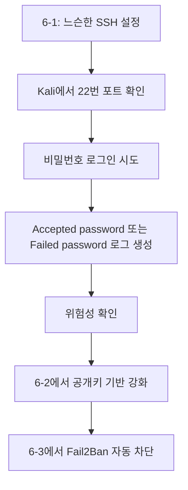

# 허술한 SSH 설정과 공격 성공 확인

---

## 실습 목표

이번 6-1의 목표는 "안전한 SSH 서버 만들기"가 아니다. 오히려 **일부러 허술한 SSH 상태를 만든 뒤**, Kali에서 공격자 관점으로 어떤 일이 벌어지는지 확인하는 데 있다.

이 문서가 끝나면 다음을 이해하게 된다.

- SSH 서버를 기본 형태로 열면 어떤 위험이 생기는가
- 비밀번호 로그인만 허용된 서버는 왜 공격 표적이 되기 쉬운가
- Kali에서 정상 접속 또는 계정 추측 시도가 로그에 어떻게 남는가
- 왜 다음 시간에 공개키 인증과 Fail2Ban이 필요한가

> **주의**
> 이번 문서의 설정은 일부러 느슨하게 만든 실습용 상태다. 6-2와 6-3에서 반드시 보강한다.
{: .prompt-warning }

---

## 실습 환경

| 역할 | OS | IP 주소 |
|------|----|---------|
| 공격자/접속 시도 PC | Kali Linux | `192.168.0.10` |
| SSH 서버 | Ubuntu | `192.168.0.30` |

---

## Part 1. 왜 허술한 SSH를 먼저 보는가?

보안을 배우는 가장 좋은 방법 중 하나는, **방어 전 상태가 얼마나 위험한지 직접 보는 것**이다.

SSH는 서버 관리에서 매우 자주 사용하는 원격 접속 도구다. 하지만 아래와 같은 상태라면 공격자는 비교적 쉽게 시도할 수 있다.

- 기본 포트 `22` 사용
- 비밀번호 로그인 허용
- 자주 쓰는 계정 이름 사용
- 반복 로그인 실패를 막는 자동 차단 없음

이 상태에서는 공격자가 Kali에서 다음과 같은 행동을 할 수 있다.

1. 서버의 22번 포트가 열려 있는지 확인
2. 실제로 SSH 로그인 시도
3. 여러 계정 이름 또는 비밀번호를 반복 시도
4. 성공 또는 실패 결과를 남기고 계속 재시도


---

## Part 2. Ubuntu에 OpenSSH 서버 설치

### 2.1 두 VM 사이 통신 확인

Ubuntu에서 IP를 확인한다.

```bash
ip addr show
```

예시:

```text
inet 192.168.0.30/24 brd 192.168.0.255 scope global ens33
```

Kali에서 Ubuntu로 핑을 보내 통신을 확인한다.

```bash
ping -c 3 192.168.0.30
```

### 2.2 OpenSSH 서버 설치

Ubuntu에서 실행한다.

```bash
sudo apt update
sudo apt install openssh-server -y
```

### 2.3 SSH 서비스 상태 확인

```bash
sudo systemctl start ssh
sudo systemctl status ssh
sudo systemctl status ssh.socket
```

정상이라면 `ssh.service` 또는 `ssh.socket` 이 활성화되어 있다.

포트가 실제로 열려 있는지도 확인한다.

```bash
sudo ss -tlnp | grep -E '(:22|ssh)'
```

보통 처음에는 `22`번 포트가 보인다.

---

## Part 3. 일부러 느슨한 SSH 설정 만들기

### 3.1 SSH 설정 파일 열기

```bash
sudo nano /etc/ssh/sshd_config
```

파일을 열면 내용이 많다. `Ctrl+End` 로 맨 아래로 이동한 뒤 아래 내용을 추가한다.

```ini
# 6-1 실습용 느슨한 SSH 설정
Port 22
PermitRootLogin no
PubkeyAuthentication yes
PasswordAuthentication yes
MaxAuthTries 6
LoginGraceTime 60
```

설명:

- `Port 22`: 기본 SSH 포트를 그대로 사용
- `PermitRootLogin no`: root 직접 로그인은 막지만, 일반 사용자 비밀번호 로그인은 허용
- `PasswordAuthentication yes`: 비밀번호만 알면 로그인 시도 가능
- `MaxAuthTries 6`: 비교적 넉넉하게 시도 가능

> **왜 공개키 인증을 yes로 두는가?**
> 기능 자체를 막는 것이 아니라, 이번 시간에는 "비밀번호 로그인도 열려 있는 상태"의 위험을 보는 것이 목적이다. 진짜 차이는 6-2에서 `PasswordAuthentication no` 로 바꿀 때 드러난다.
{: .prompt-tip }

저장은 `Ctrl+O` → `Enter`, 종료는 `Ctrl+X` 다.

### 3.2 설정 적용

```bash
sudo sshd -t
sudo systemctl daemon-reload
sudo systemctl restart ssh
sudo ss -tlnp | grep -E '(:22|ssh)'
```

---

## Part 4. Kali에서 정상 접속 성공 확인

SSH가 열린 서버는 공격자만 보는 것이 아니라, 정상 사용자도 접속한다. 먼저 "정상 비밀번호 로그인"이 성공하는지 본다.

Ubuntu에서 접속할 일반 사용자 이름을 확인한다.

```bash
whoami
```

예를 들어 사용자 이름이 `student` 라고 가정하면, Kali에서 아래처럼 접속할 수 있다.

```bash
ssh student@192.168.0.30
```

처음 접속 시 아래 메시지가 나올 수 있다.

```text
The authenticity of host '192.168.0.30 (192.168.0.30)' can't be established.
Are you sure you want to continue connecting (yes/no/[fingerprint])?
```

직접 만든 서버가 맞다면 `yes` 를 입력한다. 그다음 Ubuntu 사용자 비밀번호를 입력한다.

성공 시 예시:

```text
student@ubuntu:~$
```

이것은 공격자가 아니라도, **비밀번호만 알면 바로 들어갈 수 있는 상태**라는 뜻이다.

---

## Part 5. Kali에서 공격자 관점으로 보기

이번에는 정상 사용자가 아니라 공격자 관점으로 본다.

### 5.1 열린 포트 확인

Kali에서 대상 서버의 22번 포트가 보이는지 확인한다.

```bash
nc -zv 192.168.0.30 22
```

또는:

```bash
nmap -Pn -p 22 192.168.0.30
```

`22/tcp open ssh` 와 비슷한 결과가 보이면, 공격자는 "SSH가 열려 있다"는 사실을 바로 알 수 있다.

### 5.2 잘못된 비밀번호로 접속 시도

```bash
ssh student@192.168.0.30
```

비밀번호를 일부러 틀리게 입력해 본다. 여러 번 틀리면 로그인은 실패하지만, 중요한 것은 **시도 자체가 가능했다**는 점이다.

### 5.3 존재하지 않는 계정으로 시도

```bash
ssh admin@192.168.0.30
ssh test@192.168.0.30
```

자동화된 공격은 흔한 계정 이름을 자주 시도한다. 서버 입장에서는 이런 시도가 로그에 계속 남는다.

---

## Part 6. Ubuntu에서 공격 성공/실패 로그 확인

최신 Ubuntu에서는 `journalctl` 로 SSH 로그를 확인하는 방식이 안정적이다.

### 6.1 실시간으로 보기

Ubuntu에서 실행한다.

```bash
sudo journalctl -u ssh.service -u ssh.socket -f
```

이 상태에서 Kali에서 접속을 시도하면 로그가 실시간으로 보인다.

### 6.2 성공 로그의 의미

예시:

```text
sshd[1234]: Accepted password for student from 192.168.0.10 port 54321 ssh2
```

이 줄은 다음 뜻이다.

- `Accepted password`: 비밀번호 인증으로 로그인 성공
- `for student`: `student` 계정으로 접속
- `from 192.168.0.10`: Kali에서 접속

즉, **공격자 또는 사용자가 비밀번호만 맞추면 실제로 접속 성공이 가능하다**는 의미다.

### 6.3 실패 로그의 의미

예시:

```text
sshd[1240]: Failed password for invalid user admin from 192.168.0.10 port 54330 ssh2
```

이 줄은 존재하지 않는 계정 이름으로 로그인 시도했다는 뜻이다.

이런 실패 로그가 반복된다는 것은, 공격자가 계속 계정과 비밀번호를 추측할 수 있다는 의미다.

### 6.4 자주 쓰는 검색 예시

```bash
sudo journalctl -u ssh.service -u ssh.socket | grep "Accepted password"
sudo journalctl -u ssh.service -u ssh.socket | grep "Failed password"
sudo journalctl -u ssh.service -u ssh.socket | grep "Invalid user"
```

---

## Part 7. 왜 이 상태가 위험한가?

이번 6-1에서 우리는 일부러 다음 상태를 만들었다.

- 기본 포트 `22` 사용
- 비밀번호 로그인 허용
- 반복 로그인 차단 장치 없음

이 상태에서는 Kali에서:

- 서버 존재를 쉽게 찾을 수 있고
- 로그인 시도를 계속할 수 있으며
- 비밀번호를 맞추면 실제로 접속 성공까지 가능하다

즉, 6-1의 핵심 메시지는 이것이다.

> **SSH가 "열려 있는 것" 자체가 문제가 아니라, 비밀번호 중심의 느슨한 설정이 공격 성공 가능성을 크게 높인다는 점이 문제다.**
{: .prompt-warning }

---

## 다음 시간 예고

6-2에서는 이 허술한 서버를 다음처럼 강화한다.

1. 포트를 `22`에서 `2222`로 변경
2. 공개키 기반 인증 준비
3. `PasswordAuthentication no` 로 비밀번호 로그인 차단
4. Kali에서 이전 공격이 왜 더 이상 통하지 않는지 확인

6-3에서는 여기에 Fail2Ban을 추가해서, **반복 로그인 실패를 자동 탐지하고 공격 IP를 차단**하는 구조까지 완성한다.

---

## 정리

| 항목 | 6-1 상태 |
|------|-----------|
| SSH 포트 | `22` |
| 비밀번호 로그인 | 허용 (`yes`) |
| 공개키 인증 | 가능하지만 강제 아님 |
| 공격 시도 | 가능 |
| 로그인 성공 가능성 | 비밀번호를 알면 성공 |


