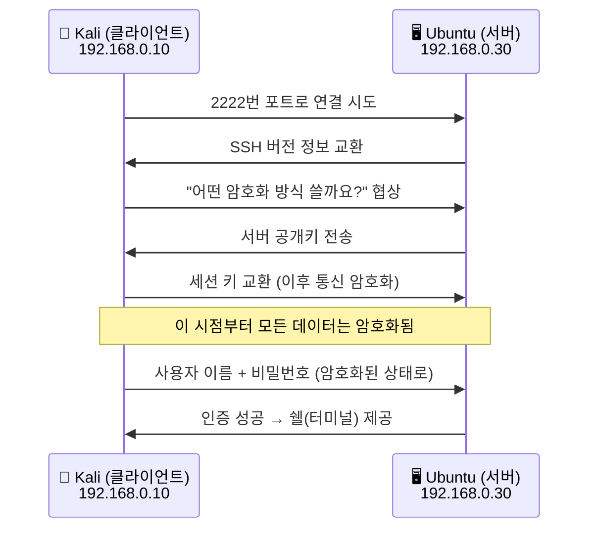
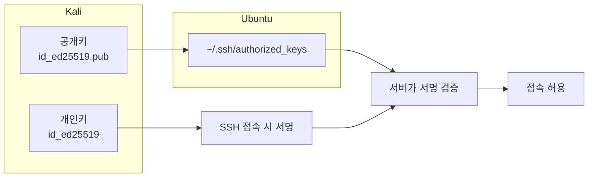
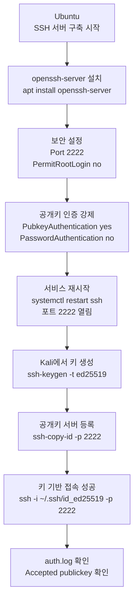

# SSH 서버 구축 및 원격 접속

---

## 실습 환경

| 역할 | OS | IP 주소 |
|------|----|----|
| 원격 접속자 (공격자 역할) | Kali Linux | `192.168.0.10` |
| SSH 서버 (우리가 만들 서버) | Ubuntu | `192.168.0.30` |

> **이번 주차부터 두 VM을 동시에 사용합니다.**
> VirtualBox 또는 VMware에서 Kali Linux와 Ubuntu 두 개의 가상머신을 모두 켜두고 시작하세요.
{: .prompt-info }

---

## Part 1. SSH란? — 원격 접속의 기초

### 1.1 SSH(Secure Shell)가 왜 필요한가?

서버는 대부분 **모니터나 키보드 없이** 운영된다. 관리자가 물리적으로 서버 앞에 앉아서 일일이 타이핑할 수 없기 때문에, 네트워크를 통해 **원격으로 명령어를 입력**할 수 있어야 한다.

SSH는 이를 **암호화된 터널**로 안전하게 연결해주는 프로토콜이다.

> **Telnet과 차이점:** 옛날에는 Telnet을 썼지만, Telnet은 비밀번호를 포함한 모든 데이터를 **암호화 없이** 전송한다. 중간에서 패킷을 가로채면 바로 읽힌다. SSH는 모든 내용을 암호화하기 때문에 안전하다.
{: .prompt-tip }

| 항목 | 내용 |
|------|------|
| 기본 포트 번호 | 기본값은 22번 (TCP), 실습에서는 2222 사용 |
| 암호화 여부 | 전송 구간 전체 암호화 |
| 인증 방식 | 비밀번호 인증 / 키(Key) 기반 인증 |
| 주요 용도 | 원격 명령 실행, 파일 전송(SCP) |

### 1.2 SSH 연결 흐름



### 1.3 왜 SSH 포트를 2222로 바꾸는가?

SSH의 기본 포트는 22번이다. 문제는 인터넷에 연결된 서버 대부분이 이 사실을 이미 공격자에게 알려진 상태라는 점이다. 자동화된 봇이나 스캐너는 먼저 22번 포트를 두드려 보고, 열려 있으면 비밀번호 대입이나 취약한 계정 탐색을 시도한다.

포트를 2222로 바꾸는 이유는 다음과 같다.

- 기본 22번만 노리는 자동화 공격을 어느 정도 줄일 수 있다.
- 로그에 찍히는 불필요한 잡음이 줄어 관리가 쉬워진다.
- 학생이 포트 개념과 서비스 노출의 의미를 함께 이해할 수 있다.

다만 포트 변경만으로 보안이 완성되지는 않는다.

- 포트 변경은 "숨김"에 가까운 완화책이다.
- 진짜 핵심은 `PermitRootLogin no`, `PasswordAuthentication no`, 공개키 인증, 접근 제어, 로그 점검이다.

> **정리**
> 2222로 바꾸는 이유는 공격을 완전히 막기 위해서가 아니라, 기본 22번만 노리는 자동화 시도를 줄이고 실습 환경을 더 안전하게 관리하기 위해서다.
{: .prompt-tip }

### 1.4 비밀번호 인증 vs 키(Key) 기반 인증

| 항목 | 비밀번호 인증 | 키 기반 인증 |
|------|-------------|------------|
| 보안 수준 | 낮음 — 비밀번호 유출·무차별 대입에 취약 | 높음 — 수학적으로 안전 |
| 처음 설정 | 바로 사용 가능 | 키 쌍 생성 + 서버 등록 필요 |
| 실무 사용 | 초보 학습용 | 실무 표준 |

이번 실습에서는 **공개키 기반 인증을 중심**으로 진행한다. 비밀번호 로그인은 설명만 최소한으로 다루고, 최종 목표는 `PasswordAuthentication no` 상태에서 키로만 접속하는 것이다.

---

## Part 2. Ubuntu — SSH 서버 설치

### 2.1 시작 전: 두 VM이 서로 통신 가능한지 확인

**Ubuntu 터미널에서** IP 주소를 먼저 확인한다.

```bash
# ip addr show : 이 컴퓨터의 네트워크 카드 목록과 IP 주소를 보여주는 명령어
ip addr show
```

출력 예시:
```
2: ens33: <BROADCAST,MULTICAST,UP,LOWER_UP>
    inet 192.168.0.30/24 brd 192.168.0.255 scope global ens33
```

`192.168.0.30`이 보이면 정상이다. 이 숫자가 다르게 나오면 선생님께 문의한다.

**Kali 터미널에서** Ubuntu로 Ping을 쳐서 통신이 되는지 확인한다.

```bash
# ping : 상대방이 살아있는지 확인하는 명령어
# -c 3 : 3번만 보내고 멈춰라 (c = count)
ping -c 3 192.168.0.30
```

출력 예시 (성공):
```
PING 192.168.0.30: 64 bytes from 192.168.0.30: icmp_seq=1 ttl=64 time=0.5 ms
```

"Request timeout" 이 나오면 두 VM의 네트워크 설정을 확인해야 한다.

### 2.2 패키지 목록 업데이트 (Ubuntu에서)

```bash
# apt update : 설치 가능한 프로그램 목록을 인터넷에서 최신으로 갱신
# sudo : 관리자 권한으로 실행 (일반 사용자는 시스템 변경 불가)
sudo apt update
```

### 2.3 OpenSSH 서버 설치 (Ubuntu에서)

```bash
# apt install : 프로그램을 설치하는 명령어
# openssh-server : SSH 서버 프로그램 이름
# -y : "설치할거냐?" 질문에 자동으로 "예(yes)" 답변
sudo apt install openssh-server -y
```

설치가 끝나면 SSH 서버가 자동으로 시작된다.

### 2.4 SSH 서비스 상태 확인 및 자동 시작 설정

```bash
# systemctl start : 서비스를 지금 즉시 시작
sudo systemctl start ssh

# systemctl enable : 컴퓨터를 껐다 켜도 자동으로 시작되도록 등록
sudo systemctl enable ssh

# systemctl status : 서비스가 잘 돌아가는지 상태 확인
sudo systemctl status ssh
```

정상 실행 시 이렇게 보인다:
```
● ssh.service - OpenBSD Secure Shell server
     Active: active (running)  ← 이 부분이 "active (running)" 이어야 함
```

"active (running)"이 보이면 SSH 서버가 정상 동작 중이다.

### 2.5 SSH 포트가 열렸는지 확인

```bash
# ss : 현재 열려있는 네트워크 연결 목록을 보여주는 명령어
# -t : TCP 연결만 보여줘 (t = TCP)
# -l : 현재 연결 대기 중인(Listening) 포트만 보여줘 (l = listening)
# -n : IP 주소를 숫자로 표시해 (DNS 조회 생략, 빠름)
# -p : 어떤 프로그램이 사용 중인지 보여줘 (p = process)
# | grep sshd : sshd 와 관련된 줄만 걸러서 보여줘
ss -tlnp | grep sshd
```

출력 예시:
```
LISTEN  0  128  0.0.0.0:22  0.0.0.0:*  users:(("sshd",pid=1234))
```

- 처음 설치 직후에는 보통 `0.0.0.0:22` 로 보인다.
- `sshd` — SSH 서버 프로그램이 이 포트를 사용 중

---

## Part 3. SSH 기본 보안 설정

SSH 서버를 외부에 열기 전에, 먼저 보안 설정을 강화해야 한다.

### 3.1 설정 파일 열기

```bash
# nano : 텍스트 편집기 (메모장과 같은 역할)
# /etc/ssh/sshd_config : SSH 서버의 주요 설정 파일 경로
sudo nano /etc/ssh/sshd_config
```

> **nano 사용법:**
> - 방향키로 이동
> - 직접 타이핑해서 수정
> - `Ctrl + W` : 단어 검색
> - `Ctrl + O` → `Enter` : 저장
> - `Ctrl + X` : 종료
{: .prompt-tip }

### 3.2 주요 보안 설정 항목 변경

아래 항목들을 파일에서 찾아서 수정한다. `#`으로 시작하는 줄은 주석(비활성)이므로, 앞의 `#`을 지우고 값을 바꿔야 적용된다.

```ini
# SSH 서버가 사용하는 포트 번호
# 기본값은 22지만, 실습에서는 2222로 변경
Port 2222

# root 계정으로 직접 로그인하는 것을 막는다
PermitRootLogin no

# 공개키 인증 허용
PubkeyAuthentication yes

# 비밀번호 로그인 비활성화
PasswordAuthentication no

# 로그인 시도 최대 횟수 (3번 틀리면 연결 끊음)
MaxAuthTries 3

# 비밀번호가 없는 계정으로 로그인 허용 안 함
PermitEmptyPasswords no

# 로그인 화면이 나타난 후 입력을 기다리는 최대 시간(초)
LoginGraceTime 30
```

### 3.3 설정 적용

```bash
# sshd -t : 설정 파일에 문법 오류가 없는지 검사 (t = test)
# 아무 메시지도 안 나오면 문법 오류 없음
sudo sshd -t

# 설정 파일을 바꿨으면 SSH 서버를 재시작해야 적용됨
sudo systemctl restart ssh

# 변경된 포트 확인
ss -tlnp | grep sshd
```

출력 예시:
```
LISTEN  0  128  0.0.0.0:2222  0.0.0.0:*  users:(("sshd",pid=1402))
```

이제부터는 SSH 서버가 기본 22번이 아니라 **2222번 포트**에서 접속을 기다린다.

### 3.4 접속에 사용할 사용자 계정 확인

SSH로 접속할 때는 Ubuntu의 일반 사용자 계정이 필요하다.

```bash
# whoami : 지금 나는 누구인지 (현재 로그인된 사용자 이름 출력)
whoami
```

출력 예시: `ubuntu` 또는 `student` 등 본인이 만든 계정 이름이 나온다.

> 이 계정 이름은 Kali에서 공개키를 등록하고 접속할 때 그대로 사용한다.
{: .prompt-info }

---

## Part 4. Kali에서 공개키 기반 인증 준비

이제 **Kali 터미널**로 이동해서 공개키 인증을 준비한다.

### 4.1 Kali에서 키 쌍 생성

```bash
# ssh-keygen : SSH 키 쌍 생성 명령어
# -t ed25519 : ED25519 방식 사용
# -C : 키 설명(comment) 추가
ssh-keygen -t ed25519 -C "kali-to-ubuntu-2222"
```

생성 위치 질문이 나오면 기본값을 사용한다:

```
Enter file in which to save the key (/home/kali/.ssh/id_ed25519):
```

개인키와 공개키가 생성되면 보통 다음 파일이 생긴다:

```text
/home/kali/.ssh/id_ed25519
/home/kali/.ssh/id_ed25519.pub
```

### 4.2 공개키를 Ubuntu 서버에 등록

```bash
# ssh-copy-id : 공개키를 서버의 authorized_keys 에 추가
# -i : 등록할 공개키 파일 지정
# -p 2222 : 변경한 SSH 포트 사용
ssh-copy-id -i ~/.ssh/id_ed25519.pub -p 2222 ubuntu@192.168.0.30
```

예상 화면:

```text
/usr/bin/ssh-copy-id: INFO: Source of key(s) to be installed: "/home/kali/.ssh/id_ed25519.pub"
/usr/bin/ssh-copy-id: INFO: Number of key(s) added: 1
Now try logging into the machine with: "ssh -p 2222 'ubuntu@192.168.0.30'"
```

### 4.3 키 기반 인증으로 SSH 접속

```bash
# -i : 사용할 개인키 지정
# -p 2222 : 변경한 SSH 포트 사용
ssh -i ~/.ssh/id_ed25519 -p 2222 ubuntu@192.168.0.30
```

**처음 접속할 때만** 아래 메시지가 나타날 수 있다:

```
The authenticity of host '[192.168.0.30]:2222' can't be established.
ED25519 key fingerprint is SHA256:xxxxxxxxxxxxxxxxxxxx
Are you sure you want to continue connecting (yes/no/[fingerprint])?
```

직접 만든 서버가 맞다면 `yes`를 입력한다.

접속 성공 시 프롬프트 예시:

```bash
ubuntu@ubuntu-server:~$
```

### 4.4 접속 후 현재 서버 정보 확인

```bash
# hostname : 서버 이름 출력
hostname

# hostname -I : 서버 IP 주소 출력
hostname -I

# who : 현재 로그인 사용자 확인
who
```

### 4.5 접속 종료

```bash
exit
```

---

## Part 5. SSH 원라이너와 파일 전송

한 번 접속해 두는 방식 말고, SSH를 이용해 명령 한 개만 실행하거나 파일을 주고받을 수도 있다.

### 5.1 원격 명령 한 번에 실행

```bash
ssh -i ~/.ssh/id_ed25519 -p 2222 ubuntu@192.168.0.30 "hostname && uptime"
```

이 방식은 자동화 스크립트나 빠른 점검에 유용하다.

### 5.2 공개키 인증 원리 다시 보기



### 5.3 SCP로 파일 전송

```bash
# 업로드
scp -i ~/.ssh/id_ed25519 -P 2222 test_upload.txt ubuntu@192.168.0.30:~/

# 다운로드
scp -i ~/.ssh/id_ed25519 -P 2222 ubuntu@192.168.0.30:/etc/os-release ./
```

> `ssh`는 포트 옵션이 소문자 `-p` 이고, `scp`는 대문자 `-P` 이다.
{: .prompt-warning }

---

## Part 6. SSH 접속 로그 확인 (Ubuntu)

누가 언제 접속했는지, 실패한 시도는 없는지 로그로 확인할 수 있다.

### 6.1 접속 로그 실시간 보기

```bash
# Ubuntu에서 실행
# tail : 파일의 마지막 부분을 보여주는 명령어
# -f : 파일에 새 내용이 추가되면 실시간으로 계속 보여줌 (f = follow)
# /var/log/auth.log : 인증(로그인) 관련 기록이 저장되는 파일
# | grep sshd : SSH 관련 줄만 걸러서 보여줌
sudo tail -f /var/log/auth.log | grep sshd
```

이 상태에서 Kali에서 SSH 접속을 시도하면 실시간으로 로그가 나타난다.

정상 접속 로그:
```
sshd[1234]: Accepted publickey for ubuntu from 192.168.0.10 port 54321 ssh2
# 의미: 192.168.0.10 에서 ubuntu 계정으로 공개키 인증 성공
```

`Ctrl + C`로 종료.

### 6.2 현재 접속 중인 사용자 확인

```bash
# who : 지금 이 서버에 로그인된 사용자 목록
who

# ss -tnp | grep :2222 : 2222번 포트의 현재 연결 상태 확인
ss -tnp | grep :2222
```

---

## Part 7. SCP — SSH로 파일 전송

SSH 연결을 이용해 두 컴퓨터 사이에서 파일을 안전하게 주고받을 수 있다.

```bash
# scp : SSH를 이용한 파일 복사 명령어 (scp = secure copy)

# [Kali → Ubuntu] 파일 보내기
# /root/test.txt : Kali의 파일 경로
# ubuntu@192.168.0.30:/home/ubuntu/ : Ubuntu의 저장 위치
scp -P 2222 /root/test.txt ubuntu@192.168.0.30:/home/ubuntu/

# [Ubuntu → Kali] 파일 받아오기
# /home/ubuntu/file.txt : Ubuntu에서 가져올 파일
# ./ : Kali의 현재 폴더에 저장
scp -P 2222 ubuntu@192.168.0.30:/home/ubuntu/file.txt ./

# 폴더(디렉토리) 전체를 복사할 때는 -r 옵션 추가 (r = recursive)
scp -P 2222 -r ubuntu@192.168.0.30:/home/ubuntu/myfolder/ ./
```

---

## 정리



| 명령어 | 하는 일 |
|--------|--------|
| `sudo apt install openssh-server` | SSH 서버 프로그램 설치 |
| `sudo systemctl start ssh` | SSH 서비스 시작 |
| `sudo systemctl status ssh` | SSH 서비스 상태 확인 |
| `sudo nano /etc/ssh/sshd_config` | SSH 설정 파일 편집 |
| `ssh -i ~/.ssh/id_ed25519 -p 2222 ubuntu@192.168.0.30` | 공개키 기반 원격 접속 |
| `ssh-keygen -t ed25519` | 키 쌍 생성 |
| `ssh-copy-id -i ~/.ssh/id_ed25519.pub -p 2222 ubuntu@192.168.0.30` | 공개키 서버 등록 |
| `scp -P 2222 파일 ubuntu@192.168.0.30:경로` | 파일 전송 |
| `sudo tail -f /var/log/auth.log` | 접속 로그 실시간 확인 |

다음 시간에는 **6-2 과제**에서 SSH 설정을 직접 점검하고, 실패 로그 분석을 실습합니다.
그리고 **7주차**에서는 이 SSH 서버가 열린 상태에서, 공격자(Kali) 관점으로 서버를 스캔했을 때 어떤 정보가 보이는지 확인합니다.
