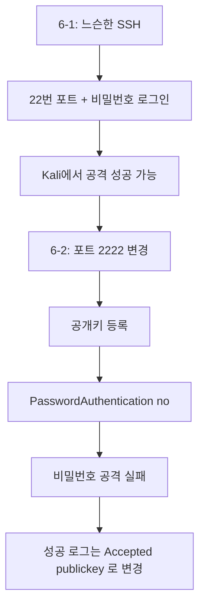

# SSH 공개키 인증 강화와 공격 실패 확인

---

## 실습 목표

6-1에서는 일부러 허술한 SSH 서버를 만들고, Kali에서 비밀번호 로그인 시도와 성공 가능성을 확인했다.

이번 6-2의 목표는 그 서버를 실제로 강화하는 것이다.

- SSH 포트를 `22`에서 `2222`로 변경
- 공개키 기반 인증 설정
- 비밀번호 로그인 차단
- Kali에서 예전 방식 공격이 실패하는지 확인
- 로그에서 `Accepted password` 가 `Accepted publickey` 로 바뀌는 차이 이해

> **6-1에서 이어지는 내용입니다.**
> 6-1에서 SSH 서버가 설치되어 있고, Kali와 Ubuntu 사이 통신이 가능한 상태를 전제로 합니다.
{: .prompt-info }

---

## Part 1. 6-1 상태 다시 확인

먼저 Ubuntu에서 현재 상태를 확인한다.

```bash
sudo systemctl status ssh
sudo ss -tlnp | grep -E '(:22|ssh)'
sudo journalctl -u ssh.service -u ssh.socket | grep "Accepted password"
```

6-1을 진행했다면 보통 아래 특징이 있다.

- 22번 포트 사용
- 비밀번호 로그인 허용
- `Accepted password` 로그가 보일 수 있음

이제 이 상태를 바꿀 것이다.

---

## Part 2. Ubuntu SSH 설정 강화

### 2.1 `ssh.socket` 상태 확인

최신 Ubuntu에서는 `ssh.socket` 이 함께 보일 수 있다. 다만 이것이 보인다고 해서 **무조건 먼저 비활성화해야 하는 것은 아니다.**

먼저 현재 상태를 확인한다.

```bash
sudo systemctl status ssh.socket
```

설명:

- `ssh.socket` 이 활성화된 환경도 있다.
- 이런 환경에서도 보통은 `sshd_config` 의 `Port` 값을 수정한 뒤 `sudo systemctl daemon-reload` 와 `sudo systemctl restart ssh` 를 실행하면 변경 사항이 반영된다.
- 즉, 이번 실습에서는 **우선 SSH 설정 파일을 수정하고 정상 반영되는지 확인하는 흐름**으로 진행한다.
- 만약 수업 환경에서 포트가 끝까지 바뀌지 않는다면, 그때 추가 점검이 필요하다.

### 2.2 SSH 설정 파일 수정

```bash
sudo nano /etc/ssh/sshd_config
```

`Ctrl+End` 로 파일 맨 아래로 이동하면 6-1에서 추가한 설정 블록이 보인다. 그 내용을 아래처럼 **수정**한다.

> 새로 추가하지 않고 기존 블록을 수정해야 한다. sshd_config는 같은 항목이 여러 개 있으면 **먼저 나온 값**이 적용되므로, 아래에 새로 추가하면 `Port 2222`가 무시된다.
{: .prompt-warning }

```ini
# 6-2 실습용 강화 SSH 설정
Port 2222
PermitRootLogin no
PubkeyAuthentication yes
PasswordAuthentication yes
MaxAuthTries 3
LoginGraceTime 30
```

지금은 아직 `PasswordAuthentication yes` 로 둔다. 이유는 **공개키를 서버에 복사하는 중간 단계**가 필요하기 때문이다.

저장은 `Ctrl+O` → `Enter`, 종료는 `Ctrl+X` 다.

### 2.3 설정 적용

```bash
sudo sshd -t
sudo systemctl daemon-reload
sudo systemctl restart ssh
sudo ss -tlnp | grep -E '2222|ssh'
```

정상이라면 `2222` 포트가 보인다.

환경에 따라 `sshd` 가 직접 리슨할 수도 있고, `systemd` 가 먼저 `2222` 포트를 열고 있을 수도 있다. 둘 다 설정이 반영된 상태라면 정상이다.

만약 여전히 `22`번만 보인다면 아래를 순서대로 점검한다.

1. `sshd_config` 맨 아래의 기존 실습 블록이 정말 `Port 2222` 로 수정되었는지 확인
2. `sudo sshd -t` 에서 문법 오류가 없었는지 확인
3. `sudo systemctl daemon-reload` 와 `sudo systemctl restart ssh` 를 다시 실행
4. 그래도 바뀌지 않으면 그때 `ssh.socket` 설정을 별도로 점검

---

## Part 3. Kali에서 공개키 생성 및 등록

### 3.1 Kali에서 키 생성

```bash
ssh-keygen -t ed25519 -C "kali-to-ubuntu-2222"
```

기본 경로를 사용하면 보통 아래 두 파일이 생긴다.

```text
/home/kali/.ssh/id_ed25519
/home/kali/.ssh/id_ed25519.pub
```

### 3.2 공개키를 Ubuntu에 복사

Ubuntu 사용자 이름이 `student` 라고 가정하면:

```bash
ssh-copy-id -i ~/.ssh/id_ed25519.pub -p 2222 student@192.168.0.30
```

`student` 부분은 실제 Ubuntu 사용자 이름으로 바꿔서 사용한다.

이 단계에서는 Ubuntu 사용자 비밀번호를 한 번 물어볼 수 있다.

### 3.3 키 기반 로그인 확인

```bash
ssh -i ~/.ssh/id_ed25519 -p 2222 student@192.168.0.30
```

성공하면 비밀번호 없이 접속되거나, 최소한 공개키 인증으로 로그인되는 것을 확인할 수 있다.

Ubuntu 로그에서는 다음과 같은 형태가 보인다.

```text
Accepted publickey for student from 192.168.0.10 ...
```

---

## Part 4. 이제 비밀번호 로그인을 끄기

공개키 로그인이 성공했다면 Ubuntu에서 다시 설정을 바꾼다.

```bash
sudo nano /etc/ssh/sshd_config
```

파일 맨 아래에서 아까 추가한 설정을 찾아 아래 한 줄을 바꾼다.

```ini
PasswordAuthentication no
```

최종 예시는 다음과 같다.

```ini
# 6-2 실습용 강화 SSH 설정
Port 2222
PermitRootLogin no
PubkeyAuthentication yes
PasswordAuthentication no
MaxAuthTries 3
LoginGraceTime 30
```

적용:

```bash
sudo sshd -t
sudo systemctl daemon-reload
sudo systemctl restart ssh
sudo ss -tlnp | grep -E '2222|ssh'
```

---

## Part 5. Kali에서 공격 실패 확인

이제 같은 Kali에서, 6-1에서 가능했던 시도가 어떻게 달라지는지 본다.

### 5.1 예전처럼 비밀번호 로그인 시도

```bash
ssh -p 2222 student@192.168.0.30
```

이제는 서버가 비밀번호 로그인을 허용하지 않으므로, 예전처럼 비밀번호를 맞춰서 들어가는 방식이 통하지 않는다.

### 5.2 공개키 없이 접속 시도

```bash
ssh -o PreferredAuthentications=password -o PubkeyAuthentication=no -p 2222 student@192.168.0.30
```

이 시도는 실패해야 정상이다.

### 5.3 공개키로 접속

```bash
ssh -i ~/.ssh/id_ed25519 -p 2222 student@192.168.0.30
```

이 시도는 성공해야 정상이다.

즉, 같은 Kali라도:

- 비밀번호만 가지고는 실패
- 올바른 개인키가 있으면 성공

이라는 차이가 생긴다.

---

## Part 6. 로그에서 바뀐 점 확인

Ubuntu에서 실시간 로그를 본다.

```bash
sudo journalctl -u ssh.service -u ssh.socket -f
```

### 6.1 강화 전 성공 로그

6-1에서는 이런 로그가 가능했다.

```text
Accepted password for student from 192.168.0.10 ...
```

### 6.2 강화 후 성공 로그

6-2 이후에는 성공 로그가 이런 형태로 바뀌어야 한다.

```text
Accepted publickey for student from 192.168.0.10 ...
```

### 6.3 실패 로그 확인

```bash
sudo journalctl -u ssh.service -u ssh.socket | grep "Failed"
sudo journalctl -u ssh.service -u ssh.socket | grep "Invalid user"
```

이제 실패 시도는 계속 남을 수 있지만, 비밀번호로 성공하는 상태는 아니어야 한다.

---

## Part 7. 왜 6-2만으로도 보안이 크게 좋아지는가?

6-1과 비교하면 가장 큰 변화는 이것이다.

- 공격자가 서버를 찾더라도
- 비밀번호 추측만으로는 더 이상 로그인 성공이 어렵다
- 실제로는 올바른 개인키가 있어야 접속 가능하다

즉, 6-2는 **공격 시도 자체를 완전히 없애는 단계가 아니라, 공격 성공 가능성을 크게 낮추는 단계**다.

---

## 다음 시간 예고

6-3에서는 여기서 한 단계 더 나아가:

- 반복 로그인 실패를 탐지하고
- 해당 IP를 자동 차단하는
- `Fail2Ban` 을 붙인다.

그렇게 하면 "성공은 어렵고, 시도도 오래 못 하게 만드는" 구조가 완성된다.

---

## 정리

| 항목 | 6-1 | 6-2 |
|------|-----|------|
| 포트 | `22` | `2222` |
| 비밀번호 로그인 | 허용 | 차단 |
| 공개키 인증 | 선택 가능 | 사실상 필수 |
| 성공 로그 | `Accepted password` 가능 | `Accepted publickey` 중심 |
| 공격 결과 | 성공 가능 | 대부분 실패 |


