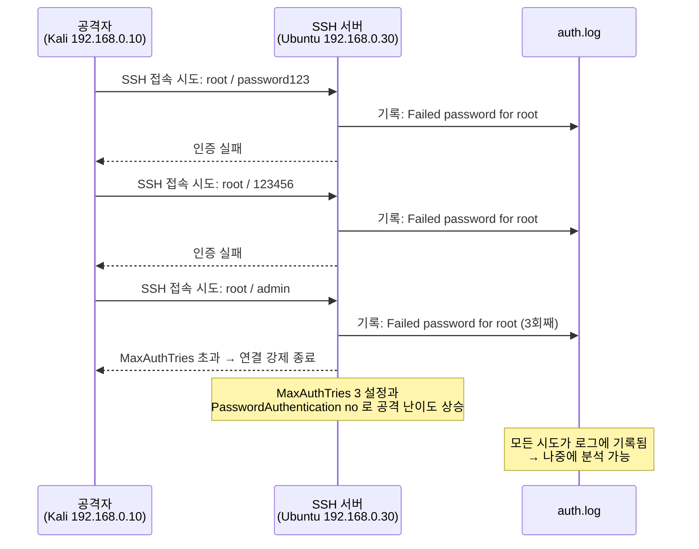
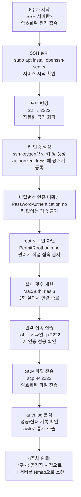

## 실습 환경

| 구분 | 운영체제 | IP 주소 | 역할 |
|------|----------|---------|------|
| 공격자 PC | Kali Linux | 192.168.0.10 | SSH 접속 시도, 로그 확인 |
| 서버 | Ubuntu | 192.168.0.30 | SSH 서버 운영 |

> **6-1에서 이어지는 내용입니다.**
> 6-1에서 SSH 서버 설치, 포트 변경(2222), 키 인증 설정을 완료했다고 가정합니다.
> 아직 6-1을 완료하지 않았다면 먼저 진행해 주세요.

---

## 시작 전 확인 (6-1 연결 체크)

Ubuntu 서버에서 아래를 확인합니다.

```bash
# SSH 서비스가 실행 중인지 확인
# systemctl: 서비스(프로그램)를 관리하는 명령어
# status: 해당 서비스의 현재 상태를 표시
# ssh: 확인할 서비스 이름
sudo systemctl status ssh
# 출력에서 "active (running)" 이 보이면 정상입니다

# SSH 설정 파일에서 포트 번호 확인
# grep: 파일에서 특정 단어가 포함된 줄만 찾아서 출력
# Port: 찾을 단어
# /etc/ssh/sshd_config: SSH 서버 설정 파일 경로
grep Port /etc/ssh/sshd_config
# "Port 2222" 가 보이면 6-1 설정이 완료된 것입니다

# 키 인증이 허용되어 있는지 확인
grep PubkeyAuthentication /etc/ssh/sshd_config
# "PubkeyAuthentication yes" 가 보이면 정상입니다

# 비밀번호 인증이 꺼져 있는지 확인
grep PasswordAuthentication /etc/ssh/sshd_config
# "PasswordAuthentication no" 가 보이면 공개키 중심 설정이 완료된 것입니다
```

---

## Part 1: 과제 — SSH 보안 설정 점검

### 1-1. 현재 SSH 설정 전체 점검

아래 명령어로 현재 `/etc/ssh/sshd_config` 파일에서 보안 관련 항목만 추려봅니다. 이번 주차의 기준은 `Port 2222`, `PubkeyAuthentication yes`, `PasswordAuthentication no` 이다.

```bash
# Ubuntu 서버에서 실행하세요
# grep: 파일에서 특정 단어가 있는 줄만 출력
# -E: 여러 패턴을 | (또는) 으로 연결하여 한 번에 검색 가능
# 검색 대상: Port, PermitRootLogin, PasswordAuthentication, PubkeyAuthentication, MaxAuthTries
sudo grep -E "Port|PermitRootLogin|PasswordAuthentication|PubkeyAuthentication|MaxAuthTries" /etc/ssh/sshd_config \
  | grep -v "^#"
# grep -v "^#": # 로 시작하는 줄(주석)을 제외
# ^: 줄의 맨 앞을 의미, ^# 은 "줄이 #으로 시작한다" 는 뜻
# -v: 해당 패턴과 일치하지 않는 줄만 출력 (반전)
```

예상 출력 예시:

```
Port 2222
PermitRootLogin no
PasswordAuthentication no
PubkeyAuthentication yes
MaxAuthTries 3
```

> **각 항목 의미 정리**
>
> | 항목 | 설정값 | 의미 |
> |------|--------|------|
> | Port | 2222 | 기본 22 대신 2222 사용 → 22번만 노리는 자동화 스캔과 무차별 대입 시도를 줄이는 데 도움 |
> | PermitRootLogin | no | root 계정으로 직접 SSH 접속 불가 |
> | PasswordAuthentication | no | 비밀번호 로그인 불가, 키 파일만 사용 |
> | PubkeyAuthentication | yes | 공개키 인증 허용 |
> | MaxAuthTries | 3 | 인증 실패 3회면 연결 강제 종료 |

### 1-2. SSH 키 인증 확인

Kali에서 Ubuntu로 키 인증 접속이 제대로 되는지 확인합니다.

```bash
# Kali에서 실행하세요
# ssh: SSH 접속 명령어
# -i: identity file, 사용할 개인키 파일을 지정
#     ~/.ssh/id_ed25519 는 홈 디렉터리의 .ssh 폴더 안에 있는 개인키 파일
# -p: port, 접속할 포트 번호 (기본 22 대신 2222 지정)
# -v: verbose, 접속 과정을 상세히 출력 (문제 발생 시 원인 파악에 유용)
# student@192.168.0.30: Ubuntu 서버의 student 계정으로 접속
ssh -i ~/.ssh/id_ed25519 -p 2222 -v student@192.168.0.30
```

`-v` 옵션을 붙이면 접속 과정이 상세히 출력됩니다.
아래와 같은 줄이 보이면 키 인증 성공입니다:

```
debug1: Authentication succeeded (publickey).
```

### 1-3. 원격 명령 실행 (SSH 원라이너)

SSH에 접속한 뒤 명령을 실행하고 바로 나오는 방법입니다.
자동화 스크립트나 빠른 점검에 매우 유용합니다.

```bash
# Kali에서 실행하세요
# SSH 접속과 동시에 명령을 실행하고 결과만 받아오는 방식
# 마지막에 있는 '' 안의 명령은 Ubuntu 서버에서 실행됩니다
ssh -i ~/.ssh/id_ed25519 -p 2222 student@192.168.0.30 'hostname && uptime'
# hostname: 서버의 이름 출력
# &&: 앞 명령이 성공하면 뒤 명령도 실행
# uptime: 서버가 부팅된 이후 경과 시간과 현재 시스템 부하를 출력
```

```bash
# 서버의 열린 포트 목록을 원격으로 확인
ssh -i ~/.ssh/id_ed25519 -p 2222 student@192.168.0.30 'ss -tlnp'
# ss: 소켓(네트워크 연결) 상태 확인 명령어 (옛날의 netstat를 대체)
# -t: TCP 소켓만 표시
# -l: 현재 Listen(대기) 중인 소켓만 표시
# -n: 포트 번호를 숫자로 표시 (서비스 이름 변환 없이)
# -p: 해당 포트를 사용하는 프로세스(프로그램) 이름도 함께 표시
```

### 1-4. SCP로 파일 전송 실습

SCP(Secure Copy Protocol)는 SSH를 이용해 파일을 안전하게 전송하는 명령어입니다.
전송 중 데이터가 암호화되므로 도청당해도 내용을 알 수 없습니다.

```bash
# Kali에서 Ubuntu로 파일 보내기 (업로드)

# 먼저 보낼 테스트 파일 만들기
echo "SSH 실습 테스트 파일" > test_upload.txt
# echo: 텍스트를 화면에 출력하는 명령어
# >: 출력 내용을 파일로 저장 (파일이 없으면 새로 생성, 있으면 덮어씀)

# scp로 파일 전송
scp -i ~/.ssh/id_ed25519 -P 2222 test_upload.txt student@192.168.0.30:~/
# scp: Secure Copy, SSH 기반 파일 전송 명령어
# -i: 사용할 개인키 파일 지정
# -P: 포트 번호 지정 (주의! scp는 대문자 -P, ssh는 소문자 -p)
# test_upload.txt: 전송할 파일 이름
# student@192.168.0.30:~/  → Ubuntu의 student 계정 홈 디렉터리(~/)에 저장
```

```bash
# Ubuntu에서 Kali로 파일 가져오기 (다운로드)
scp -i ~/.ssh/id_ed25519 -P 2222 student@192.168.0.30:/etc/os-release ./
# /etc/os-release: Ubuntu의 운영체제 정보가 담긴 파일
# ./: 현재 Kali의 작업 디렉터리에 저장
```

```bash
# Ubuntu에서 파일이 도착했는지 확인
ssh -i ~/.ssh/id_ed25519 -p 2222 student@192.168.0.30 'ls -l ~/test_upload.txt'
# ls -l: 파일 목록을 자세히 출력 (크기, 날짜, 소유자 등 포함)
# ~/test_upload.txt: 홈 디렉터리의 파일 경로
```

---

## Part 2: auth.log 분석

`/var/log/auth.log`는 Ubuntu의 인증 관련 로그 파일입니다.
SSH 접속 성공, 실패, sudo 사용 등의 모든 기록이 여기에 저장됩니다.
보안 사고 발생 시 가장 먼저 확인해야 하는 파일입니다.

### 2-1. 최근 로그 확인

```bash
# Ubuntu 서버에서 실행하세요
# tail: 파일의 마지막 부분을 출력하는 명령어
# -n 50: 마지막 50줄만 출력 (숫자를 바꿔서 더 많이 볼 수 있음)
sudo tail -n 50 /var/log/auth.log
```

### 2-2. SSH 접속 성공 기록만 추출

```bash
# grep으로 "Accepted" 가 포함된 줄만 출력
# "Accepted" = 인증을 수락했다는 의미, 즉 접속 성공
sudo grep "Accepted" /var/log/auth.log
```

출력 예시:

```
Mar 26 09:15:33 ubuntu sshd[1234]: Accepted publickey for student from 192.168.0.10 port 54321 ssh2
```

로그 해석:
- `Mar 26 09:15:33`: 접속이 이루어진 시각
- `Accepted publickey`: 공개키 인증 방식으로 성공
- `for student`: student 계정으로 접속
- `from 192.168.0.10`: 접속한 Kali의 IP 주소
- `port 54321`: Kali에서 사용한 임시 포트 번호

### 2-3. SSH 접속 실패 기록 확인

```bash
# "Failed" 키워드로 실패 기록 추출
# PasswordAuthentication no 상태에서도 잘못된 키 사용, 잘못된 계정, 허용되지 않은 인증 시도는 실패 로그로 남을 수 있음
sudo grep "Failed" /var/log/auth.log
```

```bash
# "Invalid user" 로 존재하지 않는 계정으로의 접속 시도 확인
# 자동화된 공격은 보통 admin, root, test 등 흔한 계정명을 시도함
sudo grep "Invalid user" /var/log/auth.log
```

### 2-4. 특정 IP의 접속 시도 횟수 세기 (awk 활용)

`awk`는 텍스트를 열(column) 단위로 처리하는 강력한 도구입니다.
처음에는 복잡해 보이지만, 패턴만 이해하면 됩니다.

```bash
# 명령어 파이프라인 설명:
# ① Failed password 줄만 추출
# ② IP 주소가 있는 열(column)만 뽑기
# ③ 정렬해서 같은 IP끼리 묶기
# ④ 중복 제거하면서 개수 세기
# ⑤ 많이 시도한 순으로 정렬

sudo grep "Failed password" /var/log/auth.log \
  | awk '{print $11}' \
  | sort \
  | uniq -c \
  | sort -rn

# awk '{print $11}': 각 줄을 공백 기준으로 나눠서 11번째 단어 출력
#   → 로그 형식에서 11번째 위치가 IP 주소에 해당
#   (환경에 따라 $9 또는 $11 이 될 수 있음, 실제 로그를 보고 확인)
# sort: 텍스트를 알파벳 순으로 정렬 (같은 IP를 연속되게 모음)
# uniq -c: 연속된 중복 줄을 하나로 합치고, 앞에 개수(-c) 표시
# sort -rn: 숫자(-n) 기준으로 역순(-r) 정렬 → 많이 시도한 IP가 맨 위
```

> **awk 이해하기 — 로그 한 줄을 분해해봅시다**
>
> 로그의 한 줄 예시:
> ```
> Mar  26 10:00:01 ubuntu sshd[999]: Failed password for root from 10.0.0.5 port 12345 ssh2
>  $1   $2  $3      $4      $5        $6     $7       $8  $9   $10  $11    $12   $13   $14
> ```
> 공백으로 구분했을 때 `$11` 위치에 IP 주소(`10.0.0.5`)가 옵니다.

### 2-5. 오늘 날짜 로그만 확인

```bash
# date 명령어로 오늘 날짜를 "Mar 26" 형식으로 구하고 grep에 활용
TODAY=$(date +"%b %e")
# date: 현재 날짜/시간 출력
# +"%b %e": 출력 형식 지정
#   %b = 월 이름 축약형 (Jan, Feb, Mar 등)
#   %e = 날짜 (1~31, 한 자리면 앞에 공백 추가)
# $( ): 괄호 안의 명령어를 실행하고 그 결과를 변수에 저장

sudo grep "$TODAY" /var/log/auth.log | grep "sshd"
# "$TODAY": 위에서 저장한 오늘 날짜 변수 사용
# grep "sshd": SSH 데몬(서비스)과 관련된 로그만 필터
```

---

## Part 3: 무차별 대입 공격(Brute Force) 이해

무차별 대입 공격이란 비밀번호를 자동으로 수천~수백만 번 시도해 맞추려는 공격입니다.
이번 실습 환경에서는 `PasswordAuthentication no` 로 비밀번호 로그인을 차단했기 때문에, 이 공격은 성공하기 훨씬 어려워집니다. 그래도 공격 시도 자체는 로그에 남고, 공개된 SSH 포트(2222)에 대한 탐색과 계정 추측은 계속 발생할 수 있습니다.
아래 다이어그램으로 공격 흐름을 이해해 봅시다.



## Part 4: 6주차 전체 복습

6주차에서 배운 내용을 전체 흐름으로 정리합니다.



---

## Part 5: 셀프체크

### 객관식 문제 (각 1점)

**Q1.** SSH 설정 파일에서 비밀번호 로그인을 비활성화하는 항목은 무엇인가?

① `MaxAuthTries no`
② `PermitRootLogin no`
③ `PasswordAuthentication no`
④ `PubkeyAuthentication no`

---

**Q2.** `scp`로 파일을 전송할 때 포트를 지정하는 옵션은 무엇인가?

① `-p` (소문자)
② `-P` (대문자)
③ `-port`
④ `-i`

---

**Q3.** `/var/log/auth.log`에서 SSH 접속 성공을 나타내는 키워드는?

① `Connected`
② `Authorized`
③ `Accepted`
④ `Granted`

---

**Q4.** `MaxAuthTries 3`으로 설정하면 어떤 효과가 있는가?

① 접속 후 3분이 지나면 자동으로 연결 종료
② 인증 실패 3회 시 해당 연결 강제 종료
③ 동시 접속자를 3명으로 제한
④ 3가지 인증 방식을 순서대로 시도

---

### 단답형 문제 (각 2점)

**Q5.** `awk '{print $11}'` 명령에서 `$11`이 의미하는 것은 무엇인가?

**Q6.** SCP는 어떤 프로토콜 위에서 동작하며, 그것을 사용하는 이유는 무엇인가?

**Q7.** `tail -n 50 /var/log/auth.log` 에서 `-n 50`의 의미를 설명하시오.

---

### 정답

| 번호 | 정답 | 해설 |
|------|------|------|
| Q1 | ③ | `PasswordAuthentication no` 가 비밀번호 로그인을 비활성화하는 항목 |
| Q2 | ② | scp는 대문자 `-P`, ssh는 소문자 `-p` 사용 — 헷갈리기 쉬우니 주의! |
| Q3 | ③ | `Accepted` = 인증을 수락(성공)했다는 의미 |
| Q4 | ② | 인증 시도 3회 실패 시 해당 연결을 강제로 종료함 |
| Q5 | 각 줄에서 공백으로 구분된 11번째 단어 (auth.log 에서 주로 IP 주소에 해당) |
| Q6 | SSH 프로토콜 위에서 동작. SSH의 암호화를 그대로 사용하기 때문에 전송 중 데이터가 도청되지 않음 |
| Q7 | 파일의 마지막 50줄만 출력 (`-n` 은 줄 수 지정, `50` 은 출력할 줄 수) |

---

## 다음 주 예고: 7주차 — 공격자의 눈으로 내 서버를 바라보다

6주차에서 우리는 **방어하는 입장**에서 SSH 서버를 설정했습니다.
7주차에서는 **공격자의 눈으로** 같은 서버를 바라봅니다.

- Kali Linux에서 `nmap`으로 Ubuntu 서버의 열린 포트를 스캔합니다.
- 6주차에서 설정한 포트 2222가 공격자에게 어떻게 노출되는지 직접 확인합니다.
- Wireshark로 스캔 패킷이 실제로 어떻게 생겼는지 분석합니다.
- Apache 웹 서버와 MySQL 데이터베이스를 설치하여 공격 표면이 넓어지는 것을 관찰합니다.

> 보안은 공격자의 시각을 이해할 때 더 잘 방어할 수 있습니다.
> 다음 주에는 내 서버가 외부에서 어떻게 보이는지 직접 확인해 봅시다!
