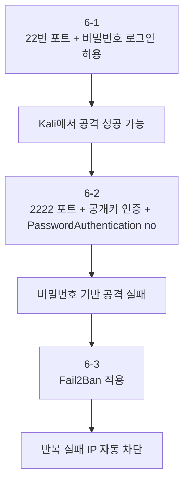

# Fail2Ban으로 반복 SSH 공격 자동 차단

---

## 실습 목표

6-2까지 끝내면 비밀번호 로그인은 차단되고, 공개키가 없는 공격자는 쉽게 성공할 수 없다. 하지만 **공격 시도 자체는 계속 들어올 수 있다.**

이번 6-3의 목표는 그 시도를 자동으로 막는 것이다.

- SSH 실패 로그를 감시
- 짧은 시간 안에 반복 실패한 IP를 탐지
- 해당 IP를 일정 시간 자동 차단
- Kali에서 반복 시도 후 차단 결과 확인

> **6-2에서 이어지는 내용입니다.**
> 이 문서는 `Port 2222`, `PubkeyAuthentication yes`, `PasswordAuthentication no` 상태를 전제로 합니다.
{: .prompt-info }

---

## Part 1. 왜 Fail2Ban이 필요한가?

6-2에서 비밀번호 로그인을 껐기 때문에, 공격자는 더 이상 예전처럼 쉽게 로그인 성공할 수 없다. 그래도 아래 문제는 남아 있다.

- 존재하지 않는 계정 이름을 계속 시도할 수 있음
- 공개키 없이 접속을 반복 시도할 수 있음
- 로그가 계속 쌓이고 관리자가 일일이 확인해야 함

Fail2Ban은 이 문제를 자동화로 줄여준다.


---

## Part 2. 설치와 기본 상태 확인

Ubuntu에서 실행한다.

```bash
sudo apt update
sudo apt install fail2ban -y
sudo systemctl start fail2ban
sudo systemctl enable fail2ban
sudo systemctl status fail2ban
```

정상이라면 `active (running)` 이 보인다.

---

## Part 3. SSH용 Fail2Ban 설정

### 3.1 SSH 전용 설정 파일 만들기

`jail.conf`를 직접 수정하면 패키지 업데이트 시 덮어쓰일 수 있다. Fail2Ban 공식 권장 방식은 `/etc/fail2ban/jail.d/` 아래에 별도 파일을 만드는 것이다.

```bash
sudo nano /etc/fail2ban/jail.d/sshd-lab.local
```

아래 내용을 입력한다.

```ini
[sshd]
enabled = true
port = 2222
backend = systemd
maxretry = 3
findtime = 10m
bantime = 1h
```

저장은 `Ctrl+O` → `Enter`, 종료는 `Ctrl+X` 다.

설명:

- `enabled = true`: SSH 감시 활성화
- `port = 2222`: 6-2에서 바꾼 포트와 동일하게 맞춤
- `backend = systemd`: 최신 Ubuntu의 systemd 저널 로그를 기준으로 감시
- `maxretry = 3`: 3회 실패 시 차단
- `findtime = 10m`: 10분 안의 실패 횟수를 계산
- `bantime = 1h`: 1시간 차단

### 3.2 설정 적용

```bash
sudo fail2ban-client reload
sudo fail2ban-client status sshd
```

---

## Part 4. Kali에서 반복 공격 시도

이제 Kali에서 일부러 실패를 반복해 본다.

### 4.1 존재하지 않는 계정 시도

```bash
ssh -p 2222 admin@192.168.0.30
ssh -p 2222 test@192.168.0.30
ssh -p 2222 guest@192.168.0.30
```

### 4.2 공개키 없이 강제로 시도

```bash
ssh -o PreferredAuthentications=password -o PubkeyAuthentication=no -p 2222 student@192.168.0.30
```

이런 시도를 몇 차례 반복하면 Fail2Ban 기준에 걸리게 된다.

---

## Part 5. 차단 결과 확인

### 5.1 Fail2Ban 상태 확인

Ubuntu에서 실행한다.

```bash
sudo fail2ban-client status sshd
```

예시:

```text
Status for the jail: sshd
|- Filter
|  |- Currently failed: 3
|  |- Total failed: 5
`- Actions
   |- Currently banned: 1
   |- Total banned: 1
   `- Banned IP list: 192.168.0.10
```

`192.168.0.10` 이 보이면 Kali가 차단된 것이다.

### 5.2 Fail2Ban 로그 확인

```bash
sudo journalctl -u fail2ban
```

예를 들어 아래와 비슷한 줄이 보일 수 있다.

```text
Ban 192.168.0.10
```

### 5.3 SSH 로그와 함께 보기

```bash
sudo journalctl -u ssh.service -u ssh.socket -f
```

차단 전에는 실패 로그가 쌓이고, 차단 후에는 접속 자체가 막히는 흐름을 비교할 수 있다.

---

## Part 6. "공격 성공"과 "차단 성공"을 어떻게 구분하나?

이 부분이 중요하다.

### 6.1 공격 성공

아래와 같은 로그가 보이면 로그인 성공이다.

```text
Accepted publickey for student from 192.168.0.10 ...
```

또는 6-1 같은 느슨한 상태에서는:

```text
Accepted password for student from 192.168.0.10 ...
```

### 6.2 공격 실패

아래와 같은 로그는 실패 시도다.

```text
Failed password for invalid user admin from 192.168.0.10 ...
```

### 6.3 차단 성공

이건 SSH 성공 로그가 아니라 Fail2Ban 상태나 Fail2Ban 로그로 확인한다.

```bash
sudo fail2ban-client status sshd
sudo journalctl -u fail2ban
```

즉:

- `Accepted ...` 이면 로그인 성공
- `Failed ...` 이면 로그인 실패
- `Ban 192.168.0.10` 또는 `Banned IP list` 이면 자동 차단 성공

---

## Part 7. 6-1부터 6-3까지 흐름 정리

이 시리즈는 아래 순서로 이해하면 된다.

1. 6-1: 허술한 SSH 설정에서 공격이 실제로 통할 수 있음을 확인
2. 6-2: 공개키 기반 인증과 포트 변경으로 공격 성공 가능성을 크게 낮춤
3. 6-3: Fail2Ban으로 반복 공격 자체를 오래 지속하지 못하게 만듦



---

## 실습 마무리: Fail2Ban 차단 해제 방법

실습 중 Kali에서 일부러 여러 번 실패를 만들었다면, 마지막에는 자기 IP 차단을 직접 풀어줄 수 있어야 한다.

### 1. 현재 차단된 IP 확인

Ubuntu에서 실행한다.

```bash
sudo fail2ban-client status sshd
```

출력의 `Banned IP list` 에 `192.168.0.10` 이 보이면 현재 Kali가 차단된 상태다.

### 2. 특정 IP 차단 해제

```bash
sudo fail2ban-client set sshd unbanip 192.168.0.10
```

설명:

- `set sshd`: `sshd` jail에 대해 설정 변경
- `unbanip 192.168.0.10`: 해당 IP의 차단 해제

### 3. 해제 결과 다시 확인

```bash
sudo fail2ban-client status sshd
```

`Banned IP list` 에서 `192.168.0.10` 이 사라졌다면 정상적으로 해제된 것이다.

### 4. 참고

- 차단을 직접 풀지 않아도 `bantime` 시간이 지나면 자동 해제된다.
- 실습을 반복할 때는 자기 Kali IP를 수동 해제하고 다시 시도하는 편이 편하다.
