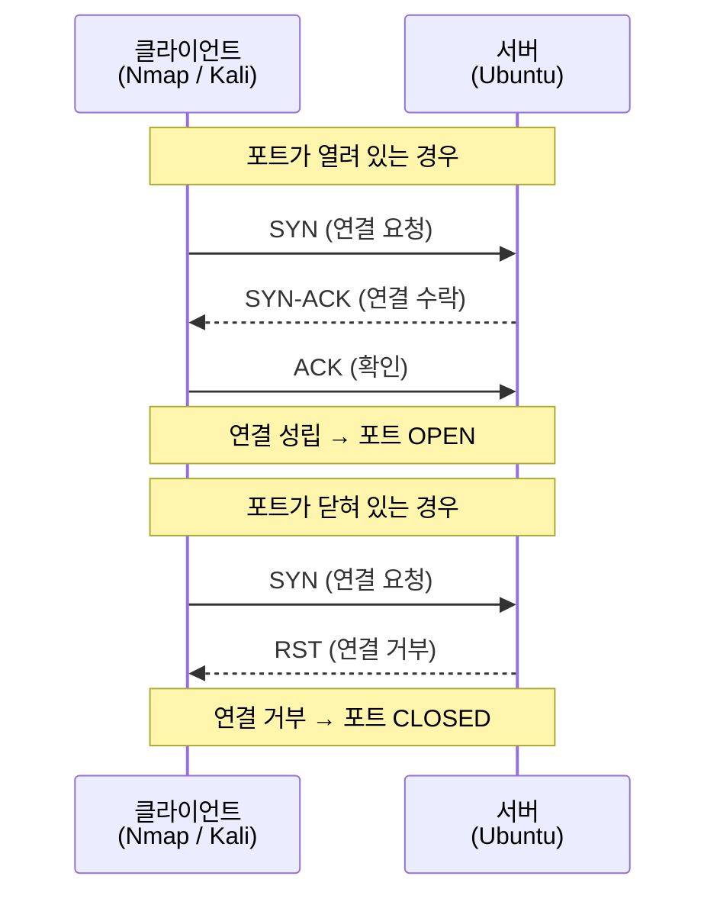

## 실습 환경

| 구분 | 운영체제 | IP 주소 | 역할 |
|------|----------|---------|------|
| 공격자 PC | Kali Linux | 192.168.0.10 | Nmap 스캔, Wireshark 분석 |
| 서버 | Ubuntu | 192.168.0.30 | 스캔 대상 서버 |

---

## 시작 전 확인 (6주차 완료 확인)

7주차를 시작하기 전에 6주차 설정이 유지되고 있는지 확인합니다.

```bash
# Ubuntu 서버에서 실행
# SSH 서비스가 실행 중인지 확인
sudo systemctl status ssh
# "active (running)" 이 보이면 정상

# SSH 포트가 2222인지 확인
grep "^Port" /etc/ssh/sshd_config
# "Port 2222" 가 보이면 6주차 설정 유지됨
```

---

## 중요: 네트워크 인터페이스 이름 확인 (반드시 먼저!)

> **이 단계를 건너뛰지 마세요!**
> 가상머신 환경마다 네트워크 카드(인터페이스) 이름이 다릅니다.
> `ens33`, `eth0`, `enp0s3`, `ens3` 등 여러 이름이 있을 수 있습니다.
> 이후 실습에서 인터페이스 이름이 필요하므로 반드시 먼저 확인하세요.

```bash
# Kali에서 실행: 네트워크 인터페이스 목록 확인
ip link show
# ip: 네트워크 설정을 관리하는 명령어
# link: 네트워크 인터페이스(랜카드) 관련 설정
# show: 현재 상태를 출력

# 출력 예시:
# 1: lo: <LOOPBACK,UP,LOWER_UP> ...    ← 루프백 (127.0.0.1), 무시
# 2: ens33: <BROADCAST,MULTICAST,UP>  ← 실제 네트워크 카드 이름!
#    또는 eth0, enp0s3 등으로 표시될 수 있음
```

```bash
# Ubuntu 서버에서도 확인
ip link show
# 서버의 인터페이스 이름도 확인해 두세요
```

> **내 인터페이스 이름을 기록해 두세요:**
> - Kali 인터페이스 이름: `___________` (예: ens33)
> - Ubuntu 인터페이스 이름: `___________` (예: ens33)
>
> 이후 실습에서 `ens33` 대신 본인 환경의 인터페이스 이름을 사용하세요.

---

## Part 1: 정찰(Reconnaissance)이란?

해킹은 보통 **정찰 → 침투 → 권한 획득 → 유지 → 흔적 제거** 순서로 이루어집니다.
오늘 배울 내용은 가장 첫 단계인 **정찰**입니다.

정찰이란 "저 서버에 무슨 포트가 열려 있을까? 어떤 서비스를 쓸까?"를 알아내는 과정입니다.


### Nmap이란?

Nmap(Network Mapper)은 네트워크 상의 컴퓨터를 탐색하고 열린 포트를 확인하는 도구입니다.
정상적인 네트워크 관리자도 자신의 서버를 점검할 때 사용하지만,
공격자도 같은 도구로 공격 대상을 분석합니다.

> **주의:** Nmap은 허가받은 자신의 서버에만 사용하세요.
> 다른 사람의 서버에 무단으로 스캔하는 것은 불법입니다.

---

## Part 2: 포트와 TCP 원리 이해

### 포트(Port)란?

포트는 컴퓨터의 "문"이라고 생각하면 됩니다.
하나의 IP 주소(집 주소)에 포트(방 번호)가 여러 개 있어서
각 방에서 다른 서비스가 기다리고 있습니다.

| 포트 번호 | 서비스      | 설명          |
| ----- | -------- | ----------- |
| 22    | SSH      | 원격 접속 (암호화) |
| 80    | HTTP     | 웹 서비스 (평문)  |
| 443   | HTTPS    | 웹 서비스 (암호화) |
| 3306  | MySQL    | 데이터베이스      |
| 21    | FTP      | 파일 전송       |
| 25    | SMTP     | 이메일 발송      |
| 2222  | SSH (변경) | 우리가 변경한 포트  |

### TCP 3-Way Handshake

Nmap이 포트를 스캔할 때 TCP 연결 시도를 이용합니다.
TCP 연결은 항상 3단계 악수(Handshake)로 시작합니다.



---

## Part 3: Nmap 스캔 유형

| 스캔 방식 | 명령어 옵션 | 특징 | 속도 |
|-----------|------------|------|------|
| TCP SYN 스캔 | `-sS` | 가장 기본, 빠름, root 권한 필요 | 빠름 |
| TCP Connect 스캔 | `-sT` | root 권한 불필요 | 보통 |
| UDP 스캔 | `-sU` | UDP 포트 확인 | 느림 |
| 서비스 버전 탐지 | `-sV` | 서비스명과 버전 출력 | 보통 |
| OS 탐지 | `-O` | 운영체제 종류 추측 | 보통 |
| 취약점 스크립트 | `-sC` | 기본 NSE 스크립트 실행 | 보통 |

---

## Part 4: 실습 — Ubuntu 초기 스캔 (SSH만 열린 상태)

### 4-1. 기본 스캔

Kali에서 Ubuntu를 스캔해봅시다.
처음에는 SSH(포트 2222)만 열려 있어야 합니다.

```bash
# Kali에서 실행
# nmap: 포트 스캔 도구
# 192.168.0.30: 스캔할 Ubuntu 서버 IP 주소
nmap 192.168.0.30
# 기본 스캔: 가장 많이 쓰이는 1000개 포트를 확인
```

예상 출력:

```
PORT     STATE SERVICE
2222/tcp open  EtherNetIP-1
```

### 4-2. 서비스 버전 확인 스캔

```bash
# -sV: 열린 포트에서 실행 중인 서비스의 버전 정보 탐지
# -p-: 1~65535 전체 포트 스캔 (기본은 1000개만)
# 시간이 걸릴 수 있으므로 -p 22,2222,80,3306 으로 주요 포트만 지정해도 됨
nmap -sV -p 22,2222,80,443,3306 192.168.0.30
# -sV: Service Version detection, 서비스 버전 탐지
# -p: port, 스캔할 포트 번호 지정 (쉼표로 여러 개 지정 가능)
```

예상 출력:

```
PORT     STATE  SERVICE VERSION
22/tcp   closed ssh
2222/tcp open   ssh     OpenSSH 8.9p1 Ubuntu 3ubuntu0.7
80/tcp   closed http
3306/tcp closed mysql
```

> **버전 정보 노출의 위험성**
>
> `OpenSSH 8.9p1` 처럼 버전이 노출되면 공격자는 해당 버전의 알려진 취약점을 검색합니다.
> 예를 들어 "OpenSSH 8.9 취약점"을 검색해서 공격 코드를 찾을 수 있습니다.
> 이것이 버전 정보를 숨기거나 최신 버전으로 유지해야 하는 이유입니다.

### 4-3. OS 탐지 스캔

```bash
# -O: OS detection, 운영체제 종류를 추측
# sudo 가 필요합니다 (raw socket 접근)
sudo nmap -O 192.168.0.30
# Nmap이 패킷 응답 방식을 분석하여 Ubuntu인지 추측합니다
```

---

## Part 5: 서비스 설치 후 변화 관찰

### 5-1. Apache 웹 서버 설치 → 재스캔

Ubuntu 서버에 Apache 웹 서버를 설치하고, 포트가 어떻게 달라지는지 확인합니다.

```bash
# Ubuntu 서버에서 실행
# apt: Ubuntu의 패키지(프로그램) 관리자
# update: 설치 가능한 최신 패키지 목록을 다운로드
sudo apt update

# apache2: Apache 웹 서버 패키지 이름
# -y: 설치 중 나오는 질문에 자동으로 yes 대답
sudo apt install apache2 -y

# Apache 서비스 시작 및 자동 시작 등록
sudo systemctl start apache2
# enable: 서버 재부팅 후에도 자동으로 Apache가 시작되도록 등록
sudo systemctl enable apache2

# Apache가 정상 실행 중인지 확인
sudo systemctl status apache2
```

```bash
# Kali에서 Apache 설치 후 재스캔
nmap -sV -p 22,2222,80,443,3306 192.168.0.30
# 이제 80/tcp 포트가 open 으로 바뀐 것을 확인할 수 있습니다
```

예상 출력 변화:

```
PORT     STATE  SERVICE VERSION
2222/tcp open   ssh     OpenSSH 8.9p1
80/tcp   open   http    Apache httpd 2.4.52 ((Ubuntu))
3306/tcp closed mysql
```

### 5-2. MySQL 설치 → 기본 상태 확인

```bash
# Ubuntu 서버에서 MySQL 설치
sudo apt install mysql-server -y
# mysql-server: MySQL 데이터베이스 서버 패키지

# MySQL 서비스 시작
sudo systemctl start mysql
sudo systemctl enable mysql

# MySQL이 어떤 주소에서 대기 중인지 확인
sudo ss -tlnp | grep mysql
# ss: 소켓 상태 확인
# -tlnp: TCP, Listen, 숫자, 프로세스 이름
# grep mysql: mysql 관련 항목만 표시
```

기본 출력 예시:

```
LISTEN  0  151  127.0.0.1:3306  0.0.0.0:*  users:(("mysqld",...))
```

`127.0.0.1:3306` — 루프백 주소(127.0.0.1)에서만 대기 중이므로
**외부(Kali)에서는 접근 불가**입니다.

```bash
# Kali에서 MySQL 포트 스캔 — closed 또는 filtered 가 정상
nmap -p 3306 192.168.0.30
# closed: 포트가 닫혀 있음 (접근 거부)
# filtered: 방화벽이 패킷을 차단함
```

### 5-3. MySQL 위험 설정 시연 (bind-address=0.0.0.0)

> **경고: 이 설정은 교육용 시연입니다. 반드시 바로 복원해야 합니다!**

```bash
# Ubuntu에서 MySQL 설정 파일 열기
# nano: 터미널에서 사용하는 텍스트 편집기
sudo nano /etc/mysql/mysql.conf.d/mysqld.cnf
# bind-address 항목을 찾아서 아래처럼 변경:
# bind-address = 127.0.0.1  →  bind-address = 0.0.0.0
# (0.0.0.0 = 모든 네트워크 인터페이스에서 접속 허용)
# Ctrl+O 로 저장, Ctrl+X 로 나오기
```

```bash
# MySQL 재시작하여 설정 적용
sudo systemctl restart mysql
# restart: 서비스를 멈추고 다시 시작

# 변경 확인
sudo ss -tlnp | grep mysql
# 이번에는 0.0.0.0:3306 으로 바뀐 것을 확인
```

```bash
# Kali에서 다시 스캔 — 이제 3306이 open 으로 보임!
nmap -p 3306 192.168.0.30
# 외부에서 MySQL 포트가 보이게 됨 → 매우 위험한 상태!
```

### ⚠️ 반드시 복원: MySQL을 다시 127.0.0.1로 되돌리기

> **이 단계를 반드시 완료하세요!**
> 시연 후 즉시 원래 설정으로 복원합니다.

```bash
# Ubuntu에서 MySQL 설정 파일 다시 열기
sudo nano /etc/mysql/mysql.conf.d/mysqld.cnf
# bind-address = 0.0.0.0  →  bind-address = 127.0.0.1  로 복원
# Ctrl+O 저장, Ctrl+X 나오기
```

```bash
# MySQL 재시작
sudo systemctl restart mysql

# 복원 확인 — 127.0.0.1:3306 이 보여야 정상
sudo ss -tlnp | grep mysql
```

```bash
# Kali에서 재확인 — 3306이 다시 closed 로 보여야 함
nmap -p 3306 192.168.0.30
# closed 또는 filtered 이면 복원 성공
```

---

## Part 6: tcpdump / Wireshark 패킷 분석

### 6-1. tcpdump로 스캔 패킷 캡처

tcpdump는 터미널에서 네트워크 패킷을 캡처하는 도구입니다.

```bash
# Ubuntu 서버에서 실행 (스캔 패킷을 받는 쪽)
# 주의: ens33 자리에 본인의 인터페이스 이름을 넣으세요!
# (앞에서 ip link show 로 확인한 이름)
sudo tcpdump -i ens33 -n src 192.168.0.10
# tcpdump: 네트워크 패킷을 캡처하는 명령어
# -i: interface, 캡처할 네트워크 인터페이스 이름 지정
#     ens33 자리에 본인 환경의 인터페이스 이름 사용 (eth0, enp0s3 등)
# -n: numeric, IP 주소를 호스트 이름으로 변환하지 않음 (빠름)
# src 192.168.0.10: source IP 가 Kali(192.168.0.10)인 패킷만 캡처
```

```bash
# Kali에서 동시에 스캔 실행
nmap -sS 192.168.0.30
# -sS: SYN 스캔 (half-open scan)
#   → SYN 패킷만 보내고, SYN-ACK 받으면 포트 열림으로 기록
#   → 실제 연결을 완성하지 않으므로 로그에 남기 어려움
```

tcpdump 출력 예시:

```
09:30:01.123456 IP 192.168.0.10.54321 > 192.168.0.30.80: Flags [S], seq 0
09:30:01.123789 IP 192.168.0.10.54321 > 192.168.0.30.22: Flags [S], seq 0
09:30:01.124001 IP 192.168.0.10.54321 > 192.168.0.30.2222: Flags [S], seq 0
```

`Flags [S]` = SYN 패킷 (연결 요청)

### 6-2. Wireshark GUI 분석 (Kali)

Wireshark는 패킷을 그래픽 화면으로 분석하는 도구입니다.

```bash
# Kali에서 Wireshark 실행
# 주의: 인터페이스 이름을 본인 환경에 맞게 변경하세요!
wireshark &
# &: 백그라운드에서 실행 (터미널을 계속 사용할 수 있게)
```

Wireshark 사용 방법:
1. 상단에서 인터페이스 선택 (ens33 또는 본인 인터페이스)
2. 상어 지느러미 버튼(▶) 클릭하여 캡처 시작
3. Kali 다른 터미널에서 `nmap 192.168.0.30` 실행
4. 필터 창에 `tcp.flags.syn == 1` 입력하여 SYN 패킷만 표시
5. 패킷을 클릭하면 하단에 상세 내용 표시

```bash
# 또는 터미널에서 직접 캡처 후 파일로 저장하여 Wireshark로 열기
# 인터페이스 이름을 본인 환경에 맞게 변경하세요!
sudo tcpdump -i ens33 -w /tmp/nmap_scan.pcap
# -w: write, 캡처한 패킷을 파일로 저장
# /tmp/nmap_scan.pcap: 저장할 파일 경로 및 이름

# Ctrl+C 로 캡처 중단 후 파일 열기
wireshark /tmp/nmap_scan.pcap
```

---

## Part 7: 위험도 평가

| 발견된 서비스 | 포트 | 상태 | 위험도 | 이유 |
|---------------|------|------|--------|------|
| SSH (변경됨) | 2222 | open | 낮음 | 키 인증 설정, 비표준 포트 |
| HTTP (Apache) | 80 | open | 중간 | 웹 취약점 가능성 |
| MySQL (기본) | 3306 | closed | 낮음 | 127.0.0.1 에서만 대기 |
| MySQL (잘못된 설정) | 3306 | open | 매우 높음 | 외부에서 DB 직접 접근 가능 |

---

## 정리

| 항목 | 내용 |
|------|------|
| Nmap | 네트워크 포트 스캔 및 서비스 탐지 도구 |
| `-sV` | 서비스 버전 탐지 옵션 |
| `-sS` | SYN 스캔 (스텔스 스캔) |
| `-p` | 스캔할 포트 지정 |
| tcpdump | 터미널 기반 패킷 캡처 도구 |
| Wireshark | GUI 기반 패킷 분석 도구 |
| bind-address | MySQL이 연결을 허용하는 IP 주소 설정 |
| 127.0.0.1 | 루프백 주소, 외부에서 접근 불가 |
| 0.0.0.0 | 모든 주소 허용, 외부 접근 가능 (위험!) |

> **7-1 완료 체크리스트**
> - [ ] 네트워크 인터페이스 이름 확인 완료
> - [ ] Nmap으로 Ubuntu 스캔 완료
> - [ ] Apache 설치 후 80 포트 open 확인
> - [ ] MySQL 설치 완료
> - [ ] MySQL bind-address가 127.0.0.1 (closed 상태) 확인
> - [ ] MySQL 위험 설정(0.0.0.0) 시연 후 **127.0.0.1로 복원 완료**
> - [ ] tcpdump / Wireshark 패킷 분석 완료
