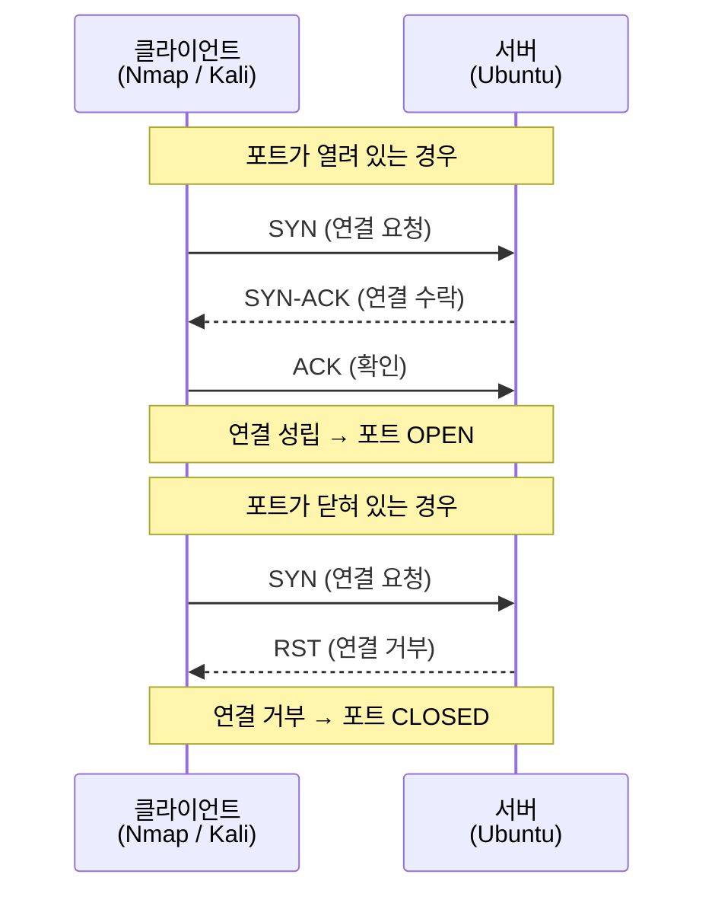
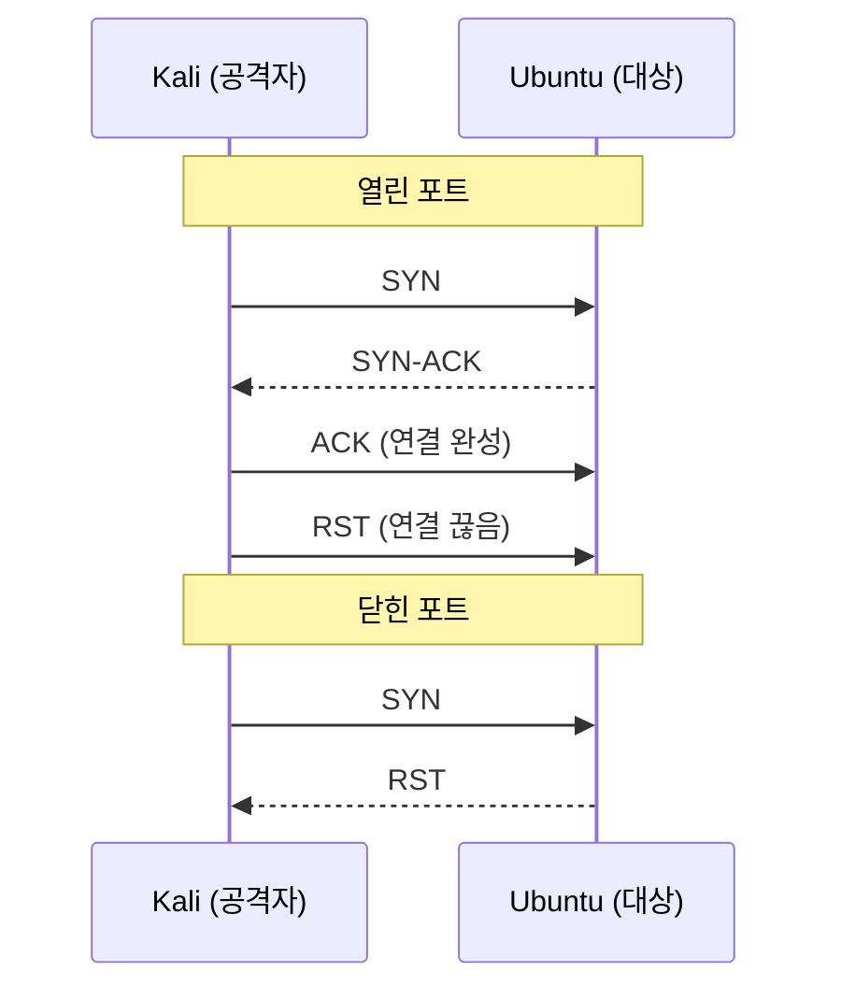
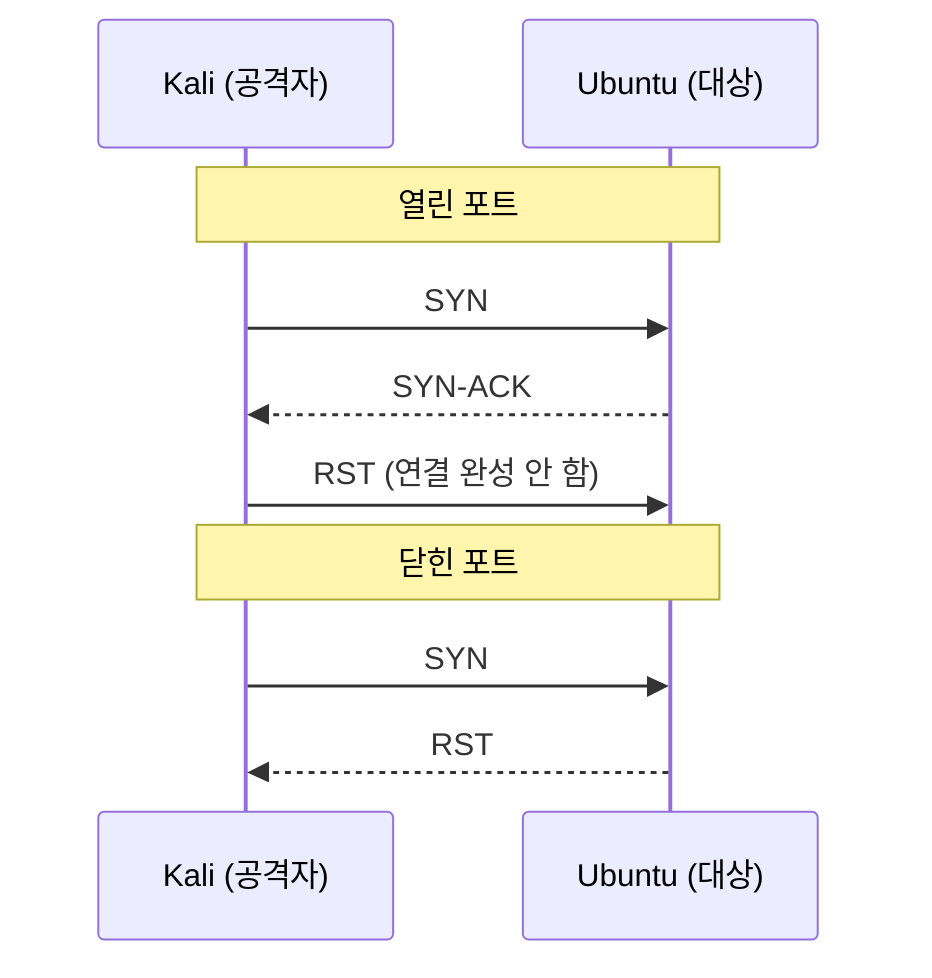
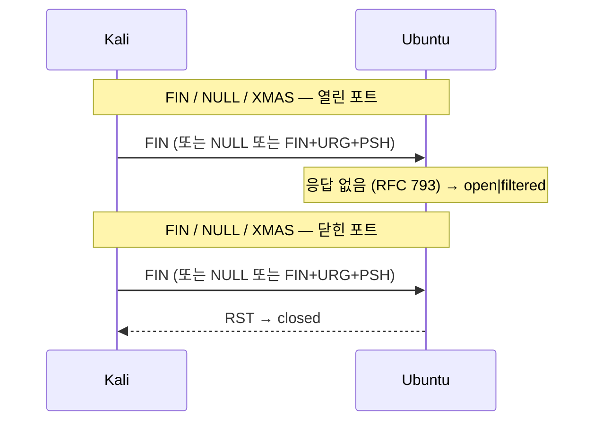
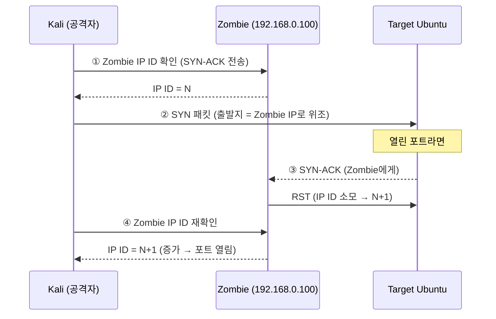
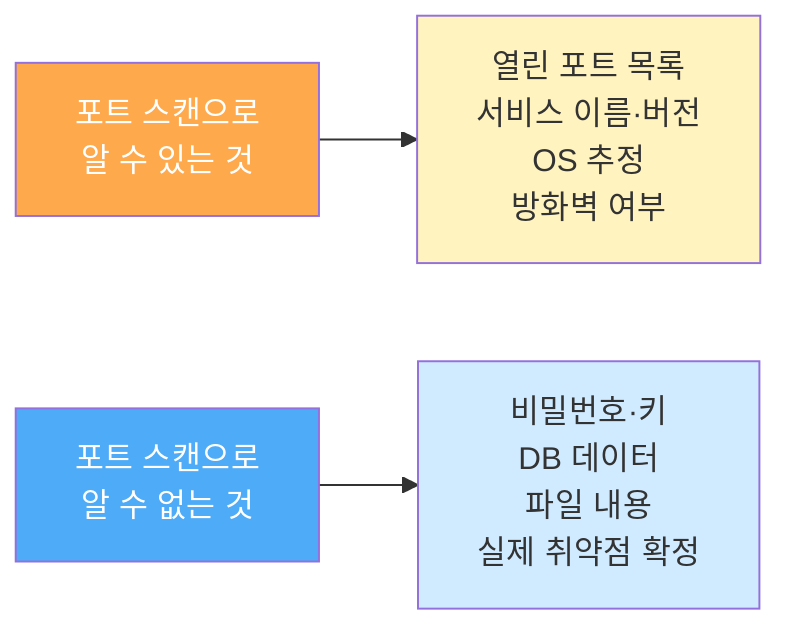

## 실습 환경

| 구분 | 운영체제 | IP 주소 | 역할 |
|------|----------|---------|------|
| 공격자 PC | Kali Linux | 192.168.0.10 | Nmap 스캔, Wireshark 분석 |
| 서버 | Ubuntu | 192.168.0.30 | 스캔 대상 서버 |

---

## 시작 전 확인 (6주차 완료 확인)

6주차에서는 SSH 서버를 단계적으로 점검하고 강화했다.

- **6-1**: 비밀번호 로그인 중심의 취약한 상태를 만들고, 공격 성공 가능성을 확인
- **6-2**: 포트 2222 변경 + 공개키 인증 + 비밀번호 로그인 차단
- **6-3**: Fail2Ban으로 반복 공격 IP 자동 차단

이 상태가 그대로 유지되고 있는지 확인한다. Fail2Ban 실습 중 Kali IP가 차단됐다면, 6-3 마무리 단계에서 해제했는지도 함께 확인한다.

```bash
# Ubuntu 서버에서 실행

# 1. SSH 서비스 실행 중인지 확인
sudo systemctl status ssh
# "active (running)" 이 보이면 정상

# 2. SSH 포트가 2222인지 확인
grep "^Port" /etc/ssh/sshd_config
# "Port 2222" 가 보이면 정상

# 3. 비밀번호 로그인이 꺼져 있는지 확인
grep "^PasswordAuthentication" /etc/ssh/sshd_config
# "PasswordAuthentication no" 가 보이면 정상

# 4. Fail2Ban 실행 중인지 확인
sudo systemctl status fail2ban
# "active (running)" 이 보이면 정상

# 5. Kali IP가 차단 해제됐는지 확인
sudo fail2ban-client status sshd
# "Banned IP list:" 가 비어 있으면 정상
# 192.168.0.10 이 남아 있으면 아래 명령으로 해제
# sudo fail2ban-client set sshd unbanip 192.168.0.10
```

> 6주차에서 SSH 포트·인증·자동차단을 모두 강화했다. 이제 7주차에서는 공격자가 SSH 외에 서버 전체를 어떻게 탐색하는지 Nmap과 Wireshark로 확인한다.
{: .prompt-info }

---

## 중요: 네트워크 인터페이스 이름 확인 (반드시 먼저!)

> **이 단계를 건너뛰지 마세요!**
> 가상머신 환경마다 네트워크 카드(인터페이스) 이름이 다릅니다.
> `ens33`, `eth0`, `enp0s3`, `ens3` 등 여러 이름이 있을 수 있습니다.
> 이후 실습에서 인터페이스 이름이 필요하므로 반드시 먼저 확인하세요.

```bash
# Kali에서 실행: 네트워크 인터페이스 목록 확인
ip link show
# ip: 네트워크 설정을 관리하는 명령어
# link: 네트워크 인터페이스(랜카드) 관련 설정
# show: 현재 상태를 출력

# 출력 예시:
# 1: lo: <LOOPBACK,UP,LOWER_UP> ...    ← 루프백 (127.0.0.1), 무시
# 2: ens33: <BROADCAST,MULTICAST,UP>  ← 실제 네트워크 카드 이름!
#    또는 eth0, enp0s3 등으로 표시될 수 있음
```

```bash
# Ubuntu 서버에서도 확인
ip link show
# 서버의 인터페이스 이름도 확인해 두세요
```

> **내 인터페이스 이름을 기록해 두세요:**
> - Kali 인터페이스 이름: `___________` (예: ens33)
> - Ubuntu 인터페이스 이름: `___________` (예: ens33)
>
> 이후 실습에서 `ens33` 대신 본인 환경의 인터페이스 이름을 사용하세요.

---

## Part 1: 정찰(Reconnaissance)이란?

해킹은 보통 **정찰 → 침투 → 권한 획득 → 유지 → 흔적 제거** 순서로 이루어집니다.
오늘 배울 내용은 가장 첫 단계인 **정찰**입니다.

정찰이란 "저 서버에 무슨 포트가 열려 있을까? 어떤 서비스를 쓸까?"를 알아내는 과정입니다.


### Nmap이란?

Nmap(Network Mapper)은 네트워크 상의 컴퓨터를 탐색하고 열린 포트를 확인하는 도구입니다.
정상적인 네트워크 관리자도 자신의 서버를 점검할 때 사용하지만,
공격자도 같은 도구로 공격 대상을 분석합니다.

> **주의:** Nmap은 허가받은 자신의 서버에만 사용하세요.
> 다른 사람의 서버에 무단으로 스캔하는 것은 불법입니다.

---

## Part 2: 포트와 TCP 원리 이해

### 포트(Port)란?

포트는 컴퓨터의 "문"이라고 생각하면 됩니다.
하나의 IP 주소(집 주소)에 포트(방 번호)가 여러 개 있어서
각 방에서 다른 서비스가 기다리고 있습니다.

| 포트 번호 | 서비스      | 설명          |
| ----- | -------- | ----------- |
| 22    | SSH      | 원격 접속 (암호화) |
| 80    | HTTP     | 웹 서비스 (평문)  |
| 443   | HTTPS    | 웹 서비스 (암호화) |
| 3306  | MySQL    | 데이터베이스      |
| 21    | FTP      | 파일 전송       |
| 25    | SMTP     | 이메일 발송      |
| 2222  | SSH (변경) | 우리가 변경한 포트  |

### TCP 3-Way Handshake

Nmap이 포트를 스캔할 때 TCP 연결 시도를 이용합니다.
TCP 연결은 항상 3단계 악수(Handshake)로 시작합니다.



---

## Part 3: Nmap 스캔 유형

### TCP 플래그 기초 (스캔 이해에 필수)

스캔 유형을 배우기 전에 TCP 헤더의 **제어 플래그(Control Flags)** 를 먼저 이해해야 한다.  
각 스캔은 특정 플래그 조합을 가진 패킷을 보내고, 대상의 응답(또는 무응답)을 보고 포트 상태를 판단한다.

#### TCP 플래그 종류와 역할

| 플래그     | 약자                        | 16진수    | 역할                                 |
| ------- | ------------------------- | ------- | ---------------------------------- |
| **SYN** | Synchronize               | `0x002` | 연결 시작 요청. 3-Way Handshake의 첫 번째 단계 |
| **ACK** | Acknowledge               | `0x010` | 패킷 수신 확인. 대부분의 응답 패킷에 포함           |
| **FIN** | Finish                    | `0x001` | 연결 정상 종료 요청                        |
| **RST** | Reset                     | `0x004` | 연결 강제 초기화. 비정상 종료 또는 잘못된 요청에 응답    |
| **PSH** | Push                      | `0x008` | 버퍼를 기다리지 않고 데이터를 즉시 상위 계층으로 전달     |
| **URG** | Urgent                    | `0x020` | 긴급 데이터 포함 표시. 즉시 처리 요청             |
| **ECE** | ECN-Echo                  | `0x040` | 혼잡 감지 알림 (TCP ECN 기능)              |
| **CWR** | Congestion Window Reduced | `0x080` | 혼잡 윈도우 줄임 알림 (TCP ECN 기능)          |

> 실습에서 자주 보이는 플래그는 **SYN, ACK, FIN, RST** 네 가지다. PSH·URG는 XMAS 스캔에서 특별히 등장한다.
{: .prompt-tip }

#### 3-Way Handshake와 플래그 흐름

정상적인 TCP 연결은 다음 순서로 이루어진다.

```
Kali (클라이언트)          Ubuntu (서버)
      |                        |
      |──── SYN ─────────────→ |   (연결 요청)
      |                        |
      | ←── SYN + ACK ──────── |   (연결 수락 + 확인)
      |                        |
      |──── ACK ─────────────→ |   (확인 완료 → 연결 성립)
      |                        |
      |   (데이터 송수신)        |
      |                        |
      |──── FIN ─────────────→ |   (연결 종료 요청)
      | ←── ACK ──────────── → |
      | ←── FIN ──────────── → |
      |──── ACK ─────────────→ |   (종료 완료)
```

#### 포트 상태와 응답 패킷

| 포트 상태 | 서버 응답 | 의미 |
|-----------|-----------|------|
| **열림 (Open)** | `SYN + ACK` | 서비스가 실행 중, 연결 가능 |
| **닫힘 (Closed)** | `RST + ACK` | 포트는 존재하지만 서비스 없음 |
| **필터됨 (Filtered)** | 응답 없음 또는 ICMP unreachable | 방화벽이 패킷을 차단 중 |

#### 스캔별 플래그 조합 요약

| 스캔 방식 | 보내는 플래그 | Open 포트 응답 | Closed 포트 응답 |
|-----------|--------------|----------------|-----------------|
| TCP Open | `SYN` | `SYN+ACK` | `RST` |
| SYN (스텔스) | `SYN` | `SYN+ACK` → (공격자가 RST 전송) | `RST` |
| FIN | `FIN` | **없음** | `RST` |
| NULL | (없음) | **없음** | `RST` |
| XMAS | `FIN+PSH+URG` | **없음** | `RST` |
| ACK | `ACK` | `RST` | `RST` |

> **FIN / NULL / XMAS 스캔의 원리**: RFC 793에 따르면 예상치 못한 패킷을 받은 **열린 포트**는 무시(응답 없음)하고, **닫힌 포트**는 RST로 응답한다. 이 차이로 포트 상태를 구분한다.
{: .prompt-info }

---

### 개요 비교표 (빠른 참조)

| 스캔 방식 | 옵션 | 전송 패킷 | Open 응답 | Closed 응답 | root 필요 | 로그 탐지 |
|-----------|------|-----------|-----------|-------------|:---------:|:---------:|
| TCP Open (Connect) | `-sT` | SYN | SYN-ACK | RST | ✗ | 쉬움 |
| TCP SYN (Half-Open) | `-sS` | SYN | SYN-ACK → RST | RST | ✓ | 어려움 |
| TCP FIN | `-sF` | FIN | **응답 없음** | RST | ✓ | 어려움 |
| TCP NULL | `-sN` | (플래그 없음) | **응답 없음** | RST | ✓ | 어려움 |
| TCP XMAS | `-sX` | FIN+URG+PSH | **응답 없음** | RST | ✓ | 어려움 |
| TCP ACK | `-sA` | ACK | RST | RST | ✓ | — |
| UDP | `-sU` | UDP | 응답 없음 | ICMP unreachable | ✓ | 어려움 |
| IDLE (Zombie) | `-sI` | SYN (좀비 경유) | IP ID 증가 | IP ID 유지 | ✓ | 매우 어려움 |
| 서비스 버전 탐지 | `-sV` | (스캔 후 배너 요청) | 버전 정보 | — | ✗ | — |
| OS 탐지 | `-O` | 다양한 프로브 | OS 추정 | — | ✓ | — |
| 취약점 스크립트 | `-sC` | NSE 스크립트 | 스크립트별 상이 | — | ✗ | — |

> **정보보안기사 핵심 포인트**
> FIN / NULL / XMAS 스캔은 **RFC 793** 규정에 따라 열린 포트는 응답하지 않고, 닫힌 포트는 RST를 보낸다는 원리를 이용한다.
> 단, **Windows는 이 규정을 따르지 않아 모든 포트에 RST를 보내므로 세 스캔 모두 Windows에서는 효과 없다.**
{: .prompt-warning }

---

### 1. TCP Open Scan (TCP Connect Scan)

TCP 3-Way Handshake를 **완전히 완성**하는 가장 기본적인 스캔.
연결이 완성되므로 서버 로그에 기록이 남는다.

```bash
# Kali에서 실행
nmap -sT 192.168.0.30
# nmap    : Network Mapper, 포트 스캔 도구
# -sT     : TCP Connect 스캔 (기본 TCP 연결을 완전히 완성)
#           root 권한 없이 실행 가능 (OS의 일반 connect() 시스템 콜 사용)
# 192.168.0.30 : 스캔 대상 Ubuntu 서버 IP

nmap -sT -p 22,80,2222,3306 192.168.0.30
# -p 22,80,2222,3306 : 스캔할 포트 번호를 쉼표로 지정
#                      22(SSH), 80(HTTP), 2222(변경된 SSH), 3306(MySQL)
```

예상 출력:

```
Starting Nmap 7.94 ( https://nmap.org )
Nmap scan report for 192.168.0.30
Host is up (0.00045s latency).
Not shown: 998 closed tcp ports (conn-refused)
PORT     STATE SERVICE
80/tcp   open  http
2222/tcp open  EtherNetIP-1

Nmap done: 1 IP address (1 host up) scanned in 0.52 seconds
```

> `conn-refused` — TCP Connect 스캔의 특징. SYN 스캔의 `reset`과 구분되는 표현이다.
{: .prompt-tip }

**Wireshark 분석**

```
캡처 위치 : Kali (자신의 인터페이스)
표시 필터 : tcp && ip.addr == 192.168.0.30
```

| 확인할 패킷 | 방향 | 의미 |
|------------|------|------|
| `SYN` | Kali → Ubuntu | 연결 시도 |
| `SYN-ACK` | Ubuntu → Kali | 포트 열림 응답 |
| `ACK` | Kali → Ubuntu | 연결 완성 ← **Open 스캔의 특징** |
| `RST` | Kali → Ubuntu | Nmap이 연결 종료 |
| `RST` | Ubuntu → Kali | 닫힌 포트 응답 |

Open 스캔에서만 `ACK` 패킷이 보인다. SYN 스캔과의 차이점을 Wireshark에서 직접 비교해볼 것.



| 항목 | 내용 |
|------|------|
| root 필요 | ✗ |
| 탐지 가능성 | 높음 (연결 로그 남음) |
| 정보보안기사 포인트 | 완전한 연결 수립, 가장 신뢰성 높음 |

---

### 2. TCP SYN Scan (Half-Open Scan / Stealth Scan)

권한이 있는 환경에서 Nmap이 자주 사용하는 대표적인 TCP 스캔 방식이다. 3-Way Handshake를 **절반만** 완성하고 RST로 끊는다.
세션이 완성되지 않아 로그에 잘 남지 않아 **스텔스 스캔**이라고도 한다.

```bash
# Kali에서 실행
sudo nmap -sS 192.168.0.30
# sudo    : root 권한으로 실행 (raw socket 접근에 필요)
# -sS     : SYN 스캔 (Half-Open / Stealth 스캔)
#           SYN만 보내고 SYN-ACK를 받으면 즉시 RST로 끊음
#           3-Way Handshake 미완성 → 서버 연결 로그에 잘 남지 않음
#           일반 사용자 권한에서는 connect scan(-sT)으로 바뀔 수 있음

sudo nmap -sS -p 1-1024 192.168.0.30
# -p 1-1024 : 1번부터 1024번까지 Well-known 포트 범위 스캔
#             하이픈(-)으로 범위 지정 가능
```

예상 출력:

```
Starting Nmap 7.94 ( https://nmap.org )
Nmap scan report for 192.168.0.30
Host is up (0.00040s latency).
Not shown: 998 closed tcp ports (reset)
PORT     STATE SERVICE
80/tcp   open  http
2222/tcp open  EtherNetIP-1

Nmap done: 1 IP address (1 host up) scanned in 0.30 seconds
```

> `reset` — SYN 스캔의 특징. Open Scan의 `conn-refused`와 다르다. 같은 결과처럼 보이지만 서버에 남는 로그 흔적이 다르다.
{: .prompt-tip }

**Wireshark 분석**

```
캡처 위치 : Kali (자신의 인터페이스)
표시 필터 : tcp && ip.addr == 192.168.0.30
```

| 확인할 패킷 | 방향 | 의미 |
|------------|------|------|
| `SYN` | Kali → Ubuntu | 연결 시도 |
| `SYN-ACK` | Ubuntu → Kali | 포트 열림 응답 |
| `RST` | Kali → Ubuntu | ACK 없이 바로 RST ← **SYN 스캔의 특징** |

Open 스캔과 비교하면 `ACK` 패킷이 없고 `SYN-ACK` 직후 바로 `RST`가 보인다.



| 항목 | 내용 |
|------|------|
| root 필요 | ✓ (raw socket) |
| 탐지 가능성 | 낮음 |
| 정보보안기사 포인트 | Half-Open, 세션 미완성, 스텔스 |

---

### 3. TCP FIN Scan

연결 종료 패킷인 **FIN**을 갑자기 보낸다.
RFC 793에 따르면 열린 포트는 예상치 못한 FIN에 응답하지 않는다.

```bash
# Kali에서 실행
sudo nmap -sF 192.168.0.30
# -sF     : FIN 스캔
#           연결 종료 신호(FIN)를 먼저 보내는 비정상 패킷
#           열린 포트 → RFC 793에 따라 응답 없음
#           닫힌 포트 → RST 응답
#           Windows는 RFC 793을 따르지 않아 모든 포트에 RST → 효과 없음

sudo nmap -sF -p 22,80,2222 192.168.0.30
# -p 22,80,2222 : 특정 포트만 지정해 스캔 속도 향상
```

예상 출력:

```
Starting Nmap 7.94 ( https://nmap.org )
Nmap scan report for 192.168.0.30
Host is up (0.00048s latency).
Not shown: 998 closed tcp ports (reset)
PORT     STATE         SERVICE
80/tcp   open|filtered http
2222/tcp open|filtered EtherNetIP-1

Nmap done: 1 IP address (1 host up) scanned in 1.35 seconds
```

> `open|filtered` — 응답이 없으면 Nmap은 포트가 열렸는지 방화벽에 막혔는지 구분할 수 없어 두 상태를 함께 표시한다. 이것이 FIN/NULL/XMAS 스캔의 한계다.
{: .prompt-warning }

**Wireshark 분석**

```
캡처 위치 : Kali (자신의 인터페이스)
표시 필터 : tcp.flags.fin == 1 && tcp.flags.ack == 0
```

| 확인할 패킷 | 방향 | 의미 |
|------------|------|------|
| `FIN` (flags=0x001) | Kali → Ubuntu | 각 포트로 FIN 패킷 전송 |
| 응답 없음 | — | 해당 포트 열림 (`open\|filtered`) |
| `RST` | Ubuntu → Kali | 해당 포트 닫힘 (`closed`) |

열린 포트 80, 2222로 보낸 FIN에 **아무 응답이 없는 것**을 Wireshark에서 확인한다.

| 항목 | 내용 |
|------|------|
| root 필요 | ✓ |
| Windows 효과 | ✗ (모든 포트에 RST 반환) |
| 정보보안기사 포인트 | 열린 포트 = 응답 없음, 닫힌 포트 = RST |

---

### 4. TCP NULL Scan

TCP 헤더의 모든 플래그를 **0(없음)** 으로 설정한 패킷을 보낸다.

```bash
# Kali에서 실행
sudo nmap -sN 192.168.0.30
# -sN     : NULL 스캔
#           TCP 헤더 플래그를 모두 0으로 설정 (SYN, ACK, FIN 등 전부 꺼짐)
#           정상적인 TCP 프로토콜에는 없는 패킷 형태
#           열린 포트 → RFC 793에 따라 응답 없음
#           닫힌 포트 → RST 응답
#           Windows에는 효과 없음 (모든 포트에 RST 반환)
```

예상 출력:

```
Starting Nmap 7.94 ( https://nmap.org )
Nmap scan report for 192.168.0.30
Host is up (0.00050s latency).
Not shown: 998 closed tcp ports (reset)
PORT     STATE         SERVICE
80/tcp   open|filtered http
2222/tcp open|filtered EtherNetIP-1

Nmap done: 1 IP address (1 host up) scanned in 1.41 seconds
```

**Wireshark 분석**

```
캡처 위치 : Kali (자신의 인터페이스)
표시 필터 : tcp.flags == 0x000
```

| 확인할 패킷 | 방향 | 의미 |
|------------|------|------|
| `(No flags)` flags=0x000 | Kali → Ubuntu | 플래그 없는 비정상 패킷 전송 |
| 응답 없음 | — | 해당 포트 열림 (`open\|filtered`) |
| `RST` | Ubuntu → Kali | 해당 포트 닫힘 (`closed`) |

패킷 상세보기(하단 패널) → `Transmission Control Protocol` → `Flags: 0x000 (None)` 으로 표시되는 것을 확인한다.

| 항목 | 내용 |
|------|------|
| root 필요 | ✓ |
| Windows 효과 | ✗ |
| 정보보안기사 포인트 | 플래그 없음, 열린 포트 = 응답 없음 |

---

### 5. TCP XMAS Scan

**FIN + URG + PSH** 세 플래그를 동시에 켠다.
크리스마스 트리처럼 모든 불이 켜진 모양이라 XMAS 스캔이라 한다.

```bash
# Kali에서 실행
sudo nmap -sX 192.168.0.30
# -sX     : XMAS 스캔 (크리스마스 스캔)
#           FIN(0x001) + PSH(0x008) + URG(0x020) = 0x029 플래그 조합
#           동시에 켜진 세 플래그가 크리스마스 트리 불빛처럼 보여 명명
#           열린 포트 → RFC 793에 따라 응답 없음
#           닫힌 포트 → RST 응답
#           Windows에는 효과 없음
```

예상 출력:

```
Starting Nmap 7.94 ( https://nmap.org )
Nmap scan report for 192.168.0.30
Host is up (0.00047s latency).
Not shown: 998 closed tcp ports (reset)
PORT     STATE         SERVICE
80/tcp   open|filtered http
2222/tcp open|filtered EtherNetIP-1

Nmap done: 1 IP address (1 host up) scanned in 1.38 seconds
```

**Wireshark 분석**

```
캡처 위치 : Kali (자신의 인터페이스)
표시 필터 : tcp.flags == 0x029
```

| 확인할 패킷 | 방향 | 의미 |
|------------|------|------|
| `FIN PSH URG` flags=0x029 | Kali → Ubuntu | 세 플래그 동시 설정 패킷 전송 |
| 응답 없음 | — | 해당 포트 열림 (`open\|filtered`) |
| `RST` | Ubuntu → Kali | 해당 포트 닫힘 (`closed`) |

패킷 상세보기 → `Flags: 0x029` → `Fin: Set`, `Push: Set`, `Urgent: Set` 세 항목이 체크된 것을 확인한다.

| 항목 | 내용 |
|------|------|
| root 필요 | ✓ |
| Windows 효과 | ✗ |
| 정보보안기사 포인트 | FIN+URG+PSH, 열린 포트 = 응답 없음 |

> FIN / NULL / XMAS 스캔은 원리가 같다. 세 스캔 모두 **열린 포트 = 응답 없음(`open|filtered`), 닫힌 포트 = RST** 패턴이다.
{: .prompt-tip }



---

### 6. TCP ACK Scan

포트 열림/닫힘이 아닌 **방화벽 필터링 여부**를 파악하는 스캔.
ACK를 보냈을 때 응답이 없으면 방화벽이 차단(filtered), RST가 오면 방화벽 없음(unfiltered).

```bash
# Kali에서 실행
sudo nmap -sA 192.168.0.30
# -sA     : ACK 스캔
#           TCP ACK 패킷만 전송 (연결 수립 시도가 아님)
#           포트 열림/닫힘 판별이 목적이 아니라 방화벽 규칙 탐지가 목적
#           RST 응답 → unfiltered (방화벽이 통과시킴)
#           응답 없음  → filtered  (방화벽이 차단함)

sudo nmap -sA -p 22,80,2222 192.168.0.30
# -p 22,80,2222 : 방화벽 확인이 필요한 포트만 지정
```

예상 출력 — **방화벽 없는 상태** (7주차 현재):

```
Starting Nmap 7.94 ( https://nmap.org )
Nmap scan report for 192.168.0.30
Host is up (0.00043s latency).
Not shown: 1000 unfiltered tcp ports (reset)

Nmap done: 1 IP address (1 host up) scanned in 0.45 seconds
```

예상 출력 — **방화벽 적용 후** (8주차 이후 비교용):

```
PORT     STATE      SERVICE
22/tcp   filtered   ssh
80/tcp   unfiltered http
2222/tcp unfiltered ssh
```

> ACK 스캔은 포트가 열렸는지 닫혔는지 알려주지 않는다. 방화벽이 패킷을 막는지(filtered) 통과시키는지(unfiltered)만 알 수 있다. 8주차 방화벽 설정 후 결과가 달라지는 것을 직접 비교해볼 수 있다.
{: .prompt-info }

**Wireshark 분석**

```
캡처 위치 : Kali (자신의 인터페이스)
표시 필터 : tcp.flags.ack == 1 && tcp.flags.syn == 0 && ip.src == 192.168.0.10
```

| 확인할 패킷 | 방향 | 의미 |
|------------|------|------|
| `ACK` | Kali → Ubuntu | ACK 패킷 전송 (연결 수립 아님) |
| `RST` | Ubuntu → Kali | unfiltered — 방화벽이 통과시킴 |
| 응답 없음 | — | filtered — 방화벽이 차단 (8주차 이후) |

| 항목 | 내용 |
|------|------|
| root 필요 | ✓ |
| 목적 | 방화벽 규칙 파악 (열림/닫힘 구분 아님) |
| 정보보안기사 포인트 | filtered vs unfiltered 판별 |

---

### 7. UDP Scan

UDP 기반 서비스(DNS 53, SNMP 161 등)를 탐지한다.
TCP와 달리 연결 확인 응답이 없어 느리고 결과가 불확실하다.

```bash
# Kali에서 실행
sudo nmap -sU 192.168.0.30
# -sU     : UDP 스캔
#           UDP 패킷을 각 포트로 전송
#           응답 없음    → open|filtered (열렸거나 방화벽에 막힘)
#           ICMP type 3 → closed (포트 닫힘 확정)
#           UDP 응답    → open  (열림 확정)
#           TCP보다 훨씬 느림 (전체 스캔 시 수십 분 소요)

sudo nmap -sU -p 53,67,123,161,500 192.168.0.30
# -p 53,67,123,161,500 : 주요 UDP 서비스 포트만 지정
#   53  : DNS
#   67  : DHCP 서버
#   123 : NTP (시간 동기화)
#   161 : SNMP (네트워크 장비 관리)
#   500 : IKE (VPN)
```

예상 출력:

```
Starting Nmap 7.94 ( https://nmap.org )
Nmap scan report for 192.168.0.30
Host is up (0.00050s latency).
Not shown: 995 closed udp ports (port-unreach)
PORT    STATE         SERVICE
68/udp  open|filtered dhcpc
123/udp open|filtered ntp

Nmap done: 1 IP address (1 host up) scanned in 1043.21 seconds
```

> UDP 스캔은 매우 느리다. 전체 포트 스캔(`-p-`)은 수십 분이 걸릴 수 있으므로 반드시 `-p`로 범위를 지정한다.
{: .prompt-warning }

**Wireshark 분석**

```
캡처 위치 : Kali (자신의 인터페이스)
표시 필터 : udp || (icmp && icmp.type == 3)
```

| 확인할 패킷 | 방향 | 의미 |
|------------|------|------|
| `UDP` 각 포트 | Kali → Ubuntu | UDP 스캔 패킷 전송 |
| `ICMP Type 3 (Port Unreachable)` | Ubuntu → Kali | 해당 UDP 포트 닫힘 (`closed`) |
| 응답 없음 | — | 해당 UDP 포트 열림 또는 차단 (`open\|filtered`) |

ICMP 패킷의 상세보기 → `Type: 3 (Destination Unreachable)` → `Code: 3 (Port Unreachable)` 조합이 닫힌 포트의 응답이다.

| 상태 | 의미 |
|------|------|
| `open\|filtered` | 응답 없음 — 열렸거나 방화벽에 막힘, 구분 불가 |
| `closed` | ICMP port unreachable 수신 — 닫힘 확정 |
| `open` | UDP 응답 수신 — 열림 확정 |

| 항목 | 내용 |
|------|------|
| root 필요 | ✓ |
| 속도 | 매우 느림 |
| 정보보안기사 포인트 | 닫힌 포트 = ICMP port unreachable |

---

### 8. IDLE Scan (Zombie Scan)

공격자 IP를 전혀 노출하지 않는 가장 은밀한 스캔.
**제3의 좀비 호스트**를 이용해 스캔하므로 대상 서버 로그에는 좀비 IP만 남는다.

IP 헤더의 **IP ID 필드**가 패킷마다 1씩 증가하는 특성을 이용한다.

```bash
# Kali에서 실행
sudo nmap -sI 192.168.0.100 192.168.0.30
# -sI 192.168.0.100 : IDLE 스캔, 192.168.0.100을 좀비 호스트로 지정
#   좀비 조건: IP ID가 순차적으로 1씩 증가하는 호스트 (예측 가능해야 함)
#   현대 OS는 대부분 무작위 IP ID를 사용해 좀비로 쓰기 어려움
# 192.168.0.30 : 실제 스캔 대상 Ubuntu 서버
# 동작 원리:
#   ① Kali가 좀비의 현재 IP ID(N)를 파악
#   ② 좀비 IP로 위조한 SYN을 대상에 전송
#   ③ 대상이 좀비에게 SYN-ACK 응답 → 좀비 IP ID가 N+1로 증가
#   ④ Kali가 좀비 IP ID를 다시 확인 → N+1이면 포트 열림
```

예상 출력:

```
Starting Nmap 7.94 ( https://nmap.org )
Idle scan using zombie 192.168.0.100 (192.168.0.100:80); Class: Incremental
Nmap scan report for 192.168.0.30
Host is up (0.00060s latency).
Not shown: 998 closed tcp ports
PORT     STATE SERVICE
80/tcp   open  http
2222/tcp open  EtherNetIP-1

Nmap done: 1 IP address (1 host up) scanned in 5.32 seconds
```

> `Idle scan using zombie ... Class: Incremental` — 좀비 호스트의 IP ID가 예측 가능한 순차 증가 방식임을 확인한 것이다. `Class: Incremental`이 보여야 IDLE 스캔이 정상 동작한다.
{: .prompt-tip }

**Wireshark 분석**

```
캡처 위치 : Ubuntu (대상 서버) — tcpdump로 캡처
표시 필터 : ip.src == 192.168.0.100
```

| 확인할 패킷 | 방향 | 의미 |
|------------|------|------|
| `SYN` from 192.168.0.100 | Zombie → Ubuntu | 실제 공격자는 192.168.0.10이지만 좀비 IP로 위조됨 |
| 192.168.0.10 패킷 | — | **보이지 않음** ← IDLE 스캔의 핵심 |

Ubuntu 서버 로그에 `192.168.0.10(Kali)`가 전혀 보이지 않고 `192.168.0.100(Zombie)` 만 보이는 것이 IDLE 스캔의 특징이다.



| 항목 | 내용 |
|------|------|
| root 필요 | ✓ |
| 조건 | IP ID가 예측 가능한 좀비 호스트 필요 |
| 정보보안기사 포인트 | 공격자 IP 노출 없음, IP ID 증가 여부로 판단 |

---

### 정보보안기사 핵심 정리

| 스캔 | 열린 포트 결과 | 닫힌 포트 결과 | Windows | 특징 요약 |
|------|--------------|--------------|:-------:|-----------|
| Open(Connect) `-sT` | `open` | `closed` (conn-refused) | ✓ | 완전한 연결, 로그 남음 |
| SYN(Half-Open) `-sS` | `open` | `closed` (reset) | ✓ | 스텔스, root 필요 |
| FIN `-sF` | **`open\|filtered`** | `closed` (reset) | ✗ | RFC 793 이용 |
| NULL `-sN` | **`open\|filtered`** | `closed` (reset) | ✗ | 플래그 없음 |
| XMAS `-sX` | **`open\|filtered`** | `closed` (reset) | ✗ | FIN+URG+PSH, flags=0x029 |
| ACK `-sA` | `unfiltered` | `unfiltered` | ✓ | 방화벽 탐지 목적 |
| UDP `-sU` | `open\|filtered` | `closed` (port-unreach) | ✓ | 느림, ICMP type 3 |
| IDLE `-sI` | `open` (IP ID 증가) | `closed` (IP ID 유지) | ✓ | 공격자 IP 미노출 |

---

## Part 3-1: 포트 스캔으로 알 수 있는 것과 없는 것

스캔 도구가 강력해 보여도, **포트 스캔만으로는 알 수 없는 것이 훨씬 많다.**
이 차이를 이해해야 공격자가 왜 정찰 이후에도 여러 단계를 더 거치는지, 그리고 방어 입장에서 무엇을 숨겨야 하는지 파악할 수 있다.

### 알 수 있는 것

| 항목 | 방법 | 예시 |
|------|------|------|
| 포트 상태 (open / closed / filtered) | 기본 스캔 | `2222/tcp open` |
| 실행 중인 서비스 이름 | `-sV` | `ssh`, `http` |
| 서비스 버전 | `-sV` | `OpenSSH 8.9p1`, `Apache 2.4.52` |
| 운영체제 종류 추정 | `-O` | `Linux 5.x` |
| 방화벽/필터링 여부 | 기본 스캔 | `filtered` 상태 |
| 어떤 포트가 공격 진입점이 될 수 있는지 | 스캔 결과 종합 | 열린 포트 목록 |

버전 정보가 노출되면 공격자는 해당 버전의 알려진 취약점(CVE)을 바로 검색할 수 있다.
예를 들어 `OpenSSH 8.9p1`이 보이면, 이 버전에 패치되지 않은 취약점이 있는지 확인한다.

### 알 수 없는 것

| 항목 | 이유 |
|------|------|
| 비밀번호 / SSH 개인키 | 포트 스캔은 연결 시도만 하며, 인증 정보는 전혀 전송하지 않음 |
| 데이터베이스 안의 데이터 | 포트가 열려 있어도 인증 없이 내부 데이터에 접근 불가 |
| 파일 내용 | 스캔은 서비스 존재 여부만 확인할 뿐 파일 시스템과 무관 |
| 실제 취약점 여부 확정 | 버전이 같아도 패치가 적용됐을 수 있어 취약한지 단정 불가 |
| 암호화 트래픽 내용 | SSH, HTTPS 등은 포트가 열려 있어도 내용은 암호화되어 있음 |
| 사용자 계정 목록 | 별도의 침투 과정 없이는 알 수 없음 |

### 우리 실습 서버에 대입해 보면

6주차 설정 기준으로, 공격자가 포트 스캔으로 알 수 있는 것과 없는 것은 다음과 같다.

| 공격자가 스캔으로 아는 것 | 공격자가 모르는 것 |
|--------------------------|-------------------|
| SSH가 2222번 포트에서 실행 중 | SSH 개인키 내용 |
| OpenSSH 버전 (예: 8.9p1) | Fail2Ban이 설정돼 있는지 |
| 80번 포트에 Apache가 실행 중 | 웹 서버의 실제 파일 내용 |
| Apache 버전 (예: 2.4.52) | 사용자 계정 이름, 비밀번호 |
| 3306번 포트가 외부에서 막혀 있음 | MySQL 안에 어떤 데이터가 있는지 |

> 포트 스캔은 "어느 문이 열려 있는가"를 아는 것이지, "문 안에 무엇이 있는가"를 아는 것이 아니다.
> 공격자는 이 정보를 바탕으로 다음 단계(취약점 분석, 침투 시도)를 계획한다.
{: .prompt-tip }



---

## Part 4: 실습 — Ubuntu 초기 스캔 (SSH만 열린 상태)

### 4-1. 기본 스캔

Kali에서 Ubuntu를 스캔해봅시다.
처음에는 SSH(포트 2222)만 열려 있어야 합니다.

```bash
# Kali에서 실행
# nmap: 포트 스캔 도구
# 192.168.0.30: 스캔할 Ubuntu 서버 IP 주소
nmap 192.168.0.30
# 기본 스캔: 가장 많이 쓰이는 1000개 포트를 확인
```

예상 출력:

```
PORT     STATE SERVICE
2222/tcp open  EtherNetIP-1
```

### 4-2. 서비스 버전 확인 스캔

```bash
# -sV: 열린 포트에서 실행 중인 서비스의 버전 정보 탐지
# -p-: 1~65535 전체 포트 스캔 (기본은 1000개만)
# 시간이 걸릴 수 있으므로 -p 22,2222,80,3306 으로 주요 포트만 지정해도 됨
nmap -sV -p 22,2222,80,443,3306 192.168.0.30
# -sV: Service Version detection, 서비스 버전 탐지
# -p: port, 스캔할 포트 번호 지정 (쉼표로 여러 개 지정 가능)
```

예상 출력:

```
PORT     STATE  SERVICE VERSION
22/tcp   closed ssh
2222/tcp open   ssh     OpenSSH 8.9p1 Ubuntu 3ubuntu0.7
80/tcp   closed http
3306/tcp closed mysql
```

> **버전 정보 노출의 위험성**
>
> `OpenSSH 8.9p1` 처럼 버전이 노출되면 공격자는 해당 버전의 알려진 취약점을 검색합니다.
> 예를 들어 "OpenSSH 8.9 취약점"을 검색해서 공격 코드를 찾을 수 있습니다.
> 이것이 버전 정보를 숨기거나 최신 버전으로 유지해야 하는 이유입니다.

### 4-3. OS 탐지 스캔

```bash
# -O: OS detection, 운영체제 종류를 추측
# sudo 가 필요합니다 (raw socket 접근)
sudo nmap -O 192.168.0.30
# Nmap이 패킷 응답 방식을 분석하여 Ubuntu인지 추측합니다
```

---

## Part 5: 서비스 설치 후 변화 관찰

### 5-1. Apache 웹 서버 설치 → 재스캔

Ubuntu 서버에 Apache 웹 서버를 설치하고, 포트가 어떻게 달라지는지 확인합니다.

```bash
# Ubuntu 서버에서 실행
# apt: Ubuntu의 패키지(프로그램) 관리자
# update: 설치 가능한 최신 패키지 목록을 다운로드
sudo apt update

# apache2: Apache 웹 서버 패키지 이름
# -y: 설치 중 나오는 질문에 자동으로 yes 대답
sudo apt install apache2 -y

# Apache 서비스 시작 및 자동 시작 등록
sudo systemctl start apache2
# enable: 서버 재부팅 후에도 자동으로 Apache가 시작되도록 등록
sudo systemctl enable apache2

# Apache가 정상 실행 중인지 확인
sudo systemctl status apache2
```

```bash
# Kali에서 Apache 설치 후 재스캔
nmap -sV -p 22,2222,80,443,3306 192.168.0.30
# 이제 80/tcp 포트가 open 으로 바뀐 것을 확인할 수 있습니다
```

예상 출력 변화:

```
PORT     STATE  SERVICE VERSION
2222/tcp open   ssh     OpenSSH 8.9p1
80/tcp   open   http    Apache httpd 2.4.52 ((Ubuntu))
3306/tcp closed mysql
```

### 5-2. MySQL 설치 → 기본 상태 확인

```bash
# Ubuntu 서버에서 MySQL 설치
sudo apt install mysql-server -y
# mysql-server: MySQL 데이터베이스 서버 패키지

# MySQL 서비스 시작
sudo systemctl start mysql
sudo systemctl enable mysql

# MySQL이 어떤 주소에서 대기 중인지 확인
sudo ss -tlnp | grep mysql
# ss: 소켓 상태 확인
# -tlnp: TCP, Listen, 숫자, 프로세스 이름
# grep mysql: mysql 관련 항목만 표시
```

기본 출력 예시:

```
LISTEN  0  151  127.0.0.1:3306  0.0.0.0:*  users:(("mysqld",...))
```

`127.0.0.1:3306` — 루프백 주소(127.0.0.1)에서만 대기 중이므로
**외부(Kali)에서는 접근 불가**입니다.

```bash
# Kali에서 MySQL 포트 스캔 — closed 또는 filtered 가 정상
nmap -p 3306 192.168.0.30
# closed: 포트가 닫혀 있음 (접근 거부)
# filtered: 방화벽이 패킷을 차단함
```

### 5-3. MySQL 위험 설정 시연 (bind-address=0.0.0.0)

> **경고: 이 설정은 교육용 시연입니다. 반드시 바로 복원해야 합니다!**

```bash
# Ubuntu에서 MySQL 설정 파일 열기
# nano: 터미널에서 사용하는 텍스트 편집기
sudo nano /etc/mysql/mysql.conf.d/mysqld.cnf
# bind-address 항목을 찾아서 아래처럼 변경:
# bind-address = 127.0.0.1  →  bind-address = 0.0.0.0
# (0.0.0.0 = 모든 네트워크 인터페이스에서 접속 허용)
# Ctrl+O 로 저장, Ctrl+X 로 나오기
```

```bash
# MySQL 재시작하여 설정 적용
sudo systemctl restart mysql
# restart: 서비스를 멈추고 다시 시작

# 변경 확인
sudo ss -tlnp | grep mysql
# 이번에는 0.0.0.0:3306 으로 바뀐 것을 확인
```

```bash
# Kali에서 다시 스캔 — 이제 3306이 open 으로 보임!
nmap -p 3306 192.168.0.30
# 외부에서 MySQL 포트가 보이게 됨 → 매우 위험한 상태!
```

### ⚠️ 반드시 복원: MySQL을 다시 127.0.0.1로 되돌리기

> **이 단계를 반드시 완료하세요!**
> 시연 후 즉시 원래 설정으로 복원합니다.

```bash
# Ubuntu에서 MySQL 설정 파일 다시 열기
sudo nano /etc/mysql/mysql.conf.d/mysqld.cnf
# bind-address = 0.0.0.0  →  bind-address = 127.0.0.1  로 복원
# Ctrl+O 저장, Ctrl+X 나오기
```

```bash
# MySQL 재시작
sudo systemctl restart mysql

# 복원 확인 — 127.0.0.1:3306 이 보여야 정상
sudo ss -tlnp | grep mysql
```

```bash
# Kali에서 재확인 — 3306이 다시 closed 로 보여야 함
nmap -p 3306 192.168.0.30
# closed 또는 filtered 이면 복원 성공
```

---

## Part 6: tcpdump / Wireshark 패킷 분석

### 6-1. tcpdump로 스캔 패킷 캡처

tcpdump는 터미널에서 네트워크 패킷을 캡처하는 도구입니다.

```bash
# Ubuntu 서버에서 실행 (스캔 패킷을 받는 쪽)
# 주의: ens33 자리에 본인의 인터페이스 이름을 넣으세요!
# (앞에서 ip link show 로 확인한 이름)
sudo tcpdump -i ens33 -n src 192.168.0.10
# tcpdump: 네트워크 패킷을 캡처하는 명령어
# -i: interface, 캡처할 네트워크 인터페이스 이름 지정
#     ens33 자리에 본인 환경의 인터페이스 이름 사용 (eth0, enp0s3 등)
# -n: numeric, IP 주소를 호스트 이름으로 변환하지 않음 (빠름)
# src 192.168.0.10: source IP 가 Kali(192.168.0.10)인 패킷만 캡처
```

```bash
# Kali에서 동시에 스캔 실행
sudo nmap -sS 192.168.0.30
# -sS: SYN 스캔 (half-open scan)
#   → SYN 패킷만 보내고, SYN-ACK 받으면 포트 열림으로 기록
#   → 실제 연결을 완성하지 않으므로 로그에 남기 어려움
```

tcpdump 출력 예시:

```
09:30:01.123456 IP 192.168.0.10.54321 > 192.168.0.30.80: Flags [S], seq 0
09:30:01.123789 IP 192.168.0.10.54321 > 192.168.0.30.22: Flags [S], seq 0
09:30:01.124001 IP 192.168.0.10.54321 > 192.168.0.30.2222: Flags [S], seq 0
```

`Flags [S]` = SYN 패킷 (연결 요청)

### 6-2. Wireshark GUI 분석 (Kali)

Wireshark는 패킷을 그래픽 화면으로 분석하는 도구입니다.

```bash
# Kali에서 Wireshark 실행
# 주의: 인터페이스 이름을 본인 환경에 맞게 변경하세요!
wireshark &
# &: 백그라운드에서 실행 (터미널을 계속 사용할 수 있게)
```

Wireshark 사용 방법:
1. 상단에서 인터페이스 선택 (ens33 또는 본인 인터페이스)
2. 상어 지느러미 버튼(▶) 클릭하여 캡처 시작
3. Kali 다른 터미널에서 `sudo nmap -sS 192.168.0.30` 실행
4. 필터 창에 `tcp.flags.syn == 1 && tcp.flags.ack == 0` 입력하여 Kali가 보내는 SYN 패킷만 표시
5. 패킷을 클릭하면 하단에 상세 내용 표시

```bash
# 또는 터미널에서 직접 캡처 후 파일로 저장하여 Wireshark로 열기
# 인터페이스 이름을 본인 환경에 맞게 변경하세요!
sudo tcpdump -i ens33 -w /tmp/nmap_scan.pcap
# -w: write, 캡처한 패킷을 파일로 저장
# /tmp/nmap_scan.pcap: 저장할 파일 경로 및 이름

# Ctrl+C 로 캡처 중단 후 파일 열기
wireshark /tmp/nmap_scan.pcap
```

---

## Part 7: 위험도 평가

| 발견된 서비스 | 포트 | 상태 | 위험도 | 이유 |
|---------------|------|------|--------|------|
| SSH (변경됨) | 2222 | open | 낮음 | 키 인증 설정, 비표준 포트 |
| HTTP (Apache) | 80 | open | 중간 | 웹 취약점 가능성 |
| MySQL (기본) | 3306 | closed | 낮음 | 127.0.0.1 에서만 대기 |
| MySQL (잘못된 설정) | 3306 | open | 매우 높음 | 외부에서 DB 직접 접근 가능 |

---

## 정리

| 항목 | 내용 |
|------|------|
| Nmap | 네트워크 포트 스캔 및 서비스 탐지 도구 |
| `-sV` | 서비스 버전 탐지 옵션 |
| `-sS` | SYN 스캔 (스텔스 스캔) |
| `-p` | 스캔할 포트 지정 |
| tcpdump | 터미널 기반 패킷 캡처 도구 |
| Wireshark | GUI 기반 패킷 분석 도구 |
| bind-address | MySQL이 연결을 허용하는 IP 주소 설정 |
| 127.0.0.1 | 루프백 주소, 외부에서 접근 불가 |
| 0.0.0.0 | 모든 주소 허용, 외부 접근 가능 (위험!) |
