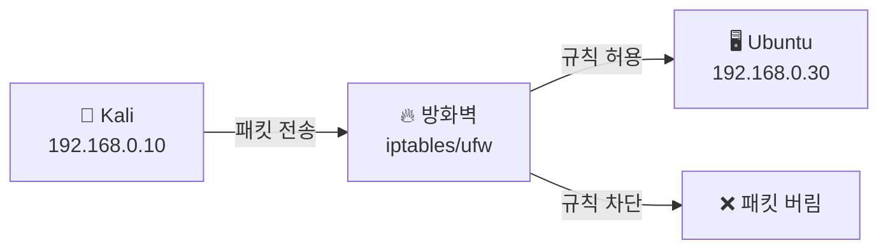
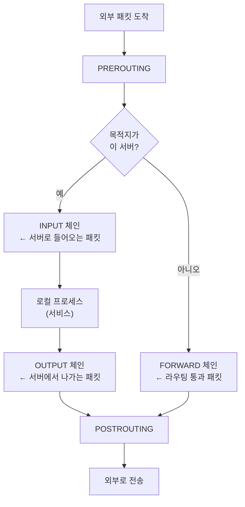
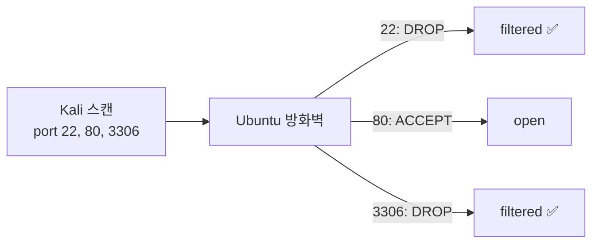
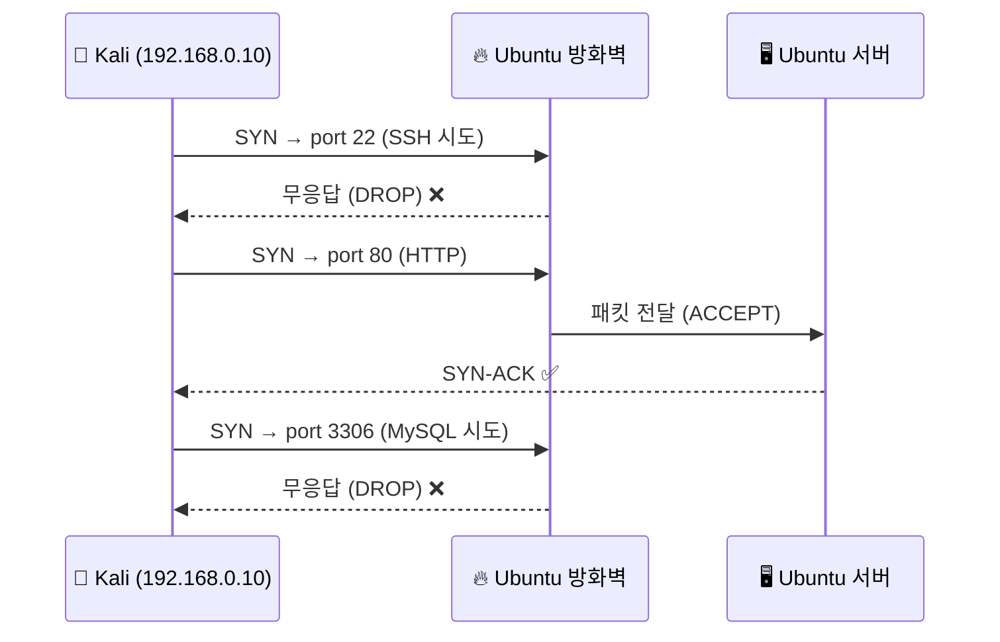

# 방화벽 설정 — iptables & ufw

---

## 실습 환경

| 역할 | OS | IP |
|------|----|----|
| 공격자 | Kali Linux | `192.168.0.10` |
| 피해자/서버 | Ubuntu | `192.168.0.30` |

---

## Part 1. 방화벽이란?

### 1.1 방화벽(Firewall)의 역할

방화벽은 네트워크 트래픽을 **허용(ACCEPT)** 또는 **차단(DROP/REJECT)** 하는 보안 장치다.
리눅스에서는 커널 레벨의 **Netfilter** 프레임워크 위에 `iptables`와 `ufw`가 동작한다.



### 1.2 패킷 필터링 흐름

리눅스 Netfilter는 패킷이 이동하는 경로에 따라 다른 체인(Chain)을 적용한다.



### 1.3 iptables vs ufw 비교

| 항목 | iptables | ufw |
|------|----------|-----|
| 수준 | 저수준 (세밀한 제어) | 고수준 (간편한 인터페이스) |
| 문법 | 복잡함 | 직관적 |
| 영구 적용 | `iptables-save` 필요 | 자동 영구 적용 |
| 적합한 상황 | 복잡한 규칙, 고급 설정 | 빠른 설정, 학습용 |

> `ufw`는 내부적으로 `iptables`를 사용한다. 둘 중 하나만 사용하는 것을 권장한다.
{: .prompt-warning }

---

## Part 2. iptables 기초

### 2.1 iptables 구조

| 구성 요소 | 설명 |
|-----------|------|
| **테이블(Table)** | filter, nat, mangle 등 — 일반적으로 `filter` 사용 |
| **체인(Chain)** | INPUT, OUTPUT, FORWARD |
| **규칙(Rule)** | 조건 + 액션으로 구성 |
| **타겟(Target)** | ACCEPT, DROP, REJECT, LOG |

### 2.2 기본 명령어 구조

```bash
sudo iptables -[옵션] [체인] [조건] -j [타겟]
```

| 옵션 | 의미 |
|------|------|
| `-A` | 규칙 추가 (Append) |
| `-I` | 규칙 삽입 (Insert, 맨 앞) |
| `-D` | 규칙 삭제 (Delete) |
| `-L` | 규칙 목록 조회 (List) |
| `-F` | 모든 규칙 초기화 (Flush) |
| `-n` | IP를 숫자로 표시 (DNS 조회 없음) |
| `-v` | 상세 정보 출력 |

### 2.3 타겟(Target) 차이

| 타겟 | 동작 | 클라이언트 반응 |
|------|------|-----------------|
| `ACCEPT` | 패킷 허용 | 정상 통신 |
| `DROP` | 패킷 무시 (응답 없음) | 타임아웃 |
| `REJECT` | 패킷 거부 (오류 응답) | 즉시 연결 거부 메시지 |
| `LOG` | 로그만 기록, 통과 | 정상 통신 + 로그 |

---

## Part 3. 실습 — iptables로 방화벽 설정 (Ubuntu)

### 3.1 현재 규칙 확인

```bash
# 현재 iptables 규칙 확인
sudo iptables -L -n -v

# filter 테이블만 확인
sudo iptables -t filter -L -n -v
```

초기 상태 출력 예시:
```
Chain INPUT (policy ACCEPT)
target  prot  opt  source    destination

Chain FORWARD (policy ACCEPT)
target  prot  opt  source    destination

Chain OUTPUT (policy ACCEPT)
target  prot  opt  source    destination
```

> 기본 정책(policy)이 `ACCEPT` → 모든 트래픽 허용 상태
{: .prompt-info }

### 3.2 특정 포트 차단

```bash
# Kali(192.168.0.10)에서 오는 SSH(22) 접속 차단
sudo iptables -A INPUT -s 192.168.0.10 -p tcp --dport 22 -j DROP

# 모든 IP에서 MySQL(3306) 접근 차단
sudo iptables -A INPUT -p tcp --dport 3306 -j DROP

# HTTP(80)는 허용 유지 (확인용)
sudo iptables -A INPUT -p tcp --dport 80 -j ACCEPT
```

### 3.3 Kali에서 방어 효과 확인

Ubuntu에서 규칙을 적용한 후, Kali에서 재스캔한다.

```bash
# Kali에서 실행
sudo nmap -sS -p 22,80,3306 192.168.0.30
```



예상 결과:
```
PORT     STATE    SERVICE
22/tcp   filtered ssh        ← DROP 적용됨
80/tcp   open     http
3306/tcp filtered mysql      ← DROP 적용됨
```

### 3.4 특정 IP만 SSH 허용

```bash
# 기존 SSH 차단 규칙 삭제
sudo iptables -D INPUT -s 192.168.0.10 -p tcp --dport 22 -j DROP

# 관리자 IP(192.168.0.1)만 SSH 허용, 나머지 차단
sudo iptables -A INPUT -s 192.168.0.1 -p tcp --dport 22 -j ACCEPT
sudo iptables -A INPUT -p tcp --dport 22 -j DROP
```

> **규칙 순서가 중요하다.** iptables는 위에서 아래로 규칙을 적용하고, 첫 번째 일치 규칙에서 처리를 멈춘다.
{: .prompt-warning }

### 3.5 로그 기록 설정

```bash
# DROP 전에 로그를 남기는 규칙 추가
sudo iptables -A INPUT -p tcp --dport 3306 -j LOG --log-prefix "[FW-BLOCK] " --log-level 4
sudo iptables -A INPUT -p tcp --dport 3306 -j DROP
```

```bash
# 로그 확인
sudo dmesg | grep "FW-BLOCK"
# 또는
sudo tail -f /var/log/kern.log | grep "FW-BLOCK"
```

### 3.6 규칙 영구 저장

`iptables` 규칙은 재부팅 시 초기화된다. 영구 적용하려면 저장이 필요하다.

```bash
# 패키지 설치
sudo apt install iptables-persistent -y

# 규칙 저장
sudo netfilter-persistent save

# 저장 파일 확인
cat /etc/iptables/rules.v4
```

---

## Part 4. 실습 — ufw로 방화벽 설정 (Ubuntu)

`ufw`는 더 간단한 명령어로 iptables 규칙을 관리한다.

### 4.1 ufw 활성화

```bash
# ufw 상태 확인
sudo ufw status

# ufw 활성화
sudo ufw enable

# 비활성화
sudo ufw disable
```

### 4.2 기본 정책 설정

```bash
# 기본: 들어오는 트래픽 모두 차단
sudo ufw default deny incoming

# 기본: 나가는 트래픽 모두 허용
sudo ufw default allow outgoing
```

### 4.3 포트 허용/차단

```bash
# SSH 허용 (22번 포트)
sudo ufw allow 22/tcp

# HTTP, HTTPS 허용
sudo ufw allow 80/tcp
sudo ufw allow 443/tcp

# MySQL은 차단 (기본 deny이므로 별도 허용 없음)
# 명시적으로 차단하려면:
sudo ufw deny 3306/tcp
```

### 4.4 특정 IP만 허용

```bash
# 특정 IP에서만 SSH 허용
sudo ufw allow from 192.168.0.1 to any port 22

# 특정 대역에서만 MySQL 허용
sudo ufw allow from 192.168.0.0/24 to any port 3306
```

### 4.5 규칙 확인 및 삭제

```bash
# 규칙 목록 (번호 포함)
sudo ufw status numbered

# 번호로 규칙 삭제
sudo ufw delete 3

# 규칙 내용으로 삭제
sudo ufw delete allow 80/tcp
```

### 4.6 Kali에서 ufw 방어 효과 확인

```bash
# Kali에서 재스캔
sudo nmap -sS -p 22,80,3306 192.168.0.30
```

---

## Part 5. 전체 시나리오 흐름



---

## 정리

| 명령어 | 설명 |
|--------|------|
| `sudo iptables -L -n -v` | 현재 규칙 확인 |
| `sudo iptables -A INPUT -p tcp --dport 3306 -j DROP` | MySQL 차단 |
| `sudo iptables -F` | 모든 규칙 초기화 |
| `sudo netfilter-persistent save` | 규칙 영구 저장 |
| `sudo ufw enable` | ufw 활성화 |
| `sudo ufw default deny incoming` | 기본 차단 정책 |
| `sudo ufw allow 80/tcp` | HTTP 허용 |
| `sudo ufw status numbered` | 규칙 목록 확인 |

다음 시간에는 **8-2 과제**에서 방화벽 규칙을 직접 설계하고, Kali로 우회를 시도해 방어 효과를 검증합니다.
