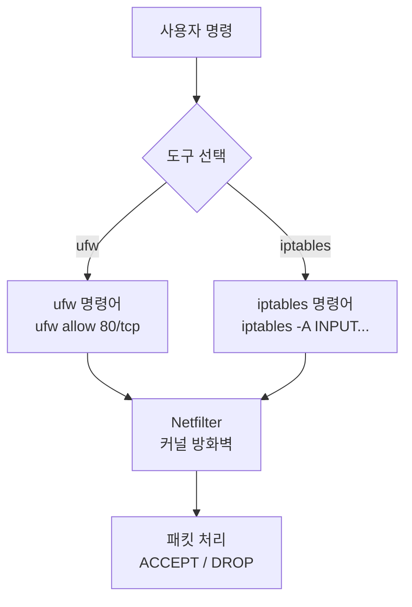
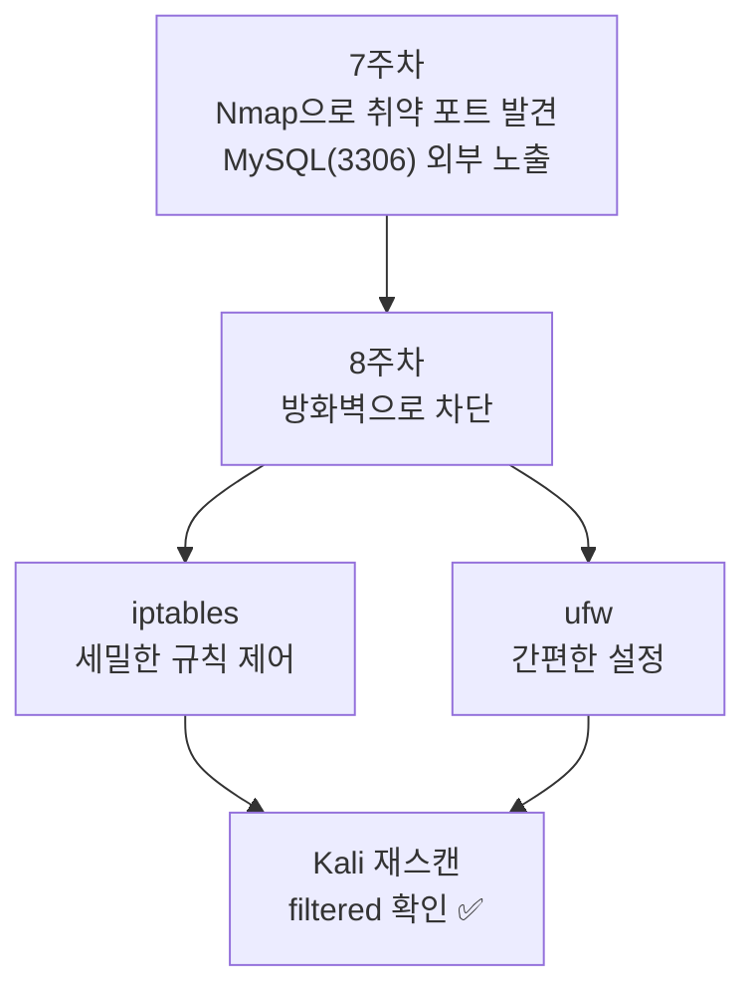

# 방화벽 — 과제 & 정리

---

## 실습 환경

| 역할 | OS | IP |
|------|----|----|
| 공격자 | Kali Linux | `192.168.0.10` |
| 피해자/서버 | Ubuntu | `192.168.0.30` |

---

## Part 1. 과제 — 방화벽 규칙 설계 및 검증

### 과제 1-1. 시나리오 기반 규칙 설계

아래 보안 요구사항을 읽고 Ubuntu에 iptables 또는 ufw 규칙을 직접 작성하라.

**보안 요구사항:**

| 번호 | 요구사항 |
|------|----------|
| ① | SSH(22)는 관리자 PC(`192.168.0.1`)에서만 접근 허용 |
| ② | 웹 서버(80, 443)는 모든 IP에서 접근 허용 |
| ③ | MySQL(3306)은 외부 접근 완전 차단 |
| ④ | 그 외 모든 인바운드 트래픽은 차단 |

**ufw로 구현 (빈칸 채우기):**

```bash
# 기본 정책 설정
sudo ufw default __________ incoming
sudo ufw default allow outgoing

# ① SSH: 관리자만 허용
sudo ufw allow from __________ to any port __________

# ② 웹 서버 허용
sudo ufw allow __________/tcp
sudo ufw allow __________/tcp

# ③ MySQL 명시적 차단
sudo ufw deny __________/tcp

# ufw 활성화
sudo ufw enable
```

**정답:**

```bash
sudo ufw default deny incoming
sudo ufw default allow outgoing
sudo ufw allow from 192.168.0.1 to any port 22
sudo ufw allow 80/tcp
sudo ufw allow 443/tcp
sudo ufw deny 3306/tcp
sudo ufw enable
```

---

### 과제 1-2. 방화벽 효과 검증

과제 1-1 규칙을 적용한 후 Kali에서 아래 스캔을 수행하고 결과표를 완성하라.

```bash
# Kali에서 실행
sudo nmap -sS -p 22,80,443,3306 192.168.0.30
```

**결과표 (실제 결과로 채울 것):**

| 포트 | 예상 상태 | 실제 Nmap 결과 | 일치 여부 |
|------|-----------|----------------|-----------|
| 22/tcp | filtered | | |
| 80/tcp | open | | |
| 443/tcp | open 또는 closed | | |
| 3306/tcp | filtered | | |

> **참고:** 443이 `closed`로 나오는 것은 정상 — ufw가 허용했지만 실제로 HTTPS 서비스가 실행 중이지 않기 때문.
{: .prompt-info }

---

### 과제 1-3. iptables로 동일한 규칙 구현

ufw 대신 iptables 명령어로 동일한 보안 요구사항을 구현하라.

```bash
# 기존 규칙 초기화
sudo iptables -F

# ① SSH: 관리자만 허용, 나머지 차단
sudo iptables -A INPUT -s 192.168.0.1 -p tcp --dport 22 -j __________
sudo iptables -A INPUT -p tcp --dport 22 -j __________

# ② 웹 서버 허용
sudo iptables -A INPUT -p tcp --dport 80 -j __________
sudo iptables -A INPUT -p tcp --dport 443 -j __________

# ③ MySQL 차단
sudo iptables -A INPUT -p tcp --dport 3306 -j __________

# ④ 기본 정책 변경: 나머지 차단
sudo iptables -P INPUT __________
```

**정답:**

```bash
sudo iptables -F
sudo iptables -A INPUT -s 192.168.0.1 -p tcp --dport 22 -j ACCEPT
sudo iptables -A INPUT -p tcp --dport 22 -j DROP
sudo iptables -A INPUT -p tcp --dport 80 -j ACCEPT
sudo iptables -A INPUT -p tcp --dport 443 -j ACCEPT
sudo iptables -A INPUT -p tcp --dport 3306 -j DROP
sudo iptables -P INPUT DROP
```

> **주의:** `-P INPUT DROP` 설정 전에 SSH 허용 규칙이 먼저 들어가 있어야 한다. 순서 실수 시 서버에 접속 불가!
{: .prompt-danger }

---

### 과제 1-4. 규칙 순서 오류 분석

아래 iptables 규칙에서 **잘못된 점**을 찾아 수정하라.

```bash
# 잘못된 규칙 예시
sudo iptables -A INPUT -p tcp --dport 22 -j DROP        # (1)
sudo iptables -A INPUT -s 192.168.0.1 -p tcp --dport 22 -j ACCEPT  # (2)
```

**문제점:** `(1)` 규칙이 먼저 적용되어 관리자(`192.168.0.1`)도 SSH 접근이 차단됨.

**수정 방법:**

```bash
# ACCEPT를 먼저, DROP을 나중에
sudo iptables -A INPUT -s 192.168.0.1 -p tcp --dport 22 -j ACCEPT  # ← 먼저
sudo iptables -A INPUT -p tcp --dport 22 -j DROP                    # ← 나중에
```

---

## Part 2. iptables vs ufw 심화 비교



### iptables 장단점

| 장점 | 단점 |
|------|------|
| 세밀한 패킷 제어 가능 | 문법이 복잡함 |
| 고급 NAT, 마스커레이딩 지원 | 재부팅 시 규칙 초기화 (별도 저장 필요) |
| 스크립트로 자동화 용이 | 실수 시 서버 접속 불가 위험 |

### ufw 장단점

| 장점 | 단점 |
|------|------|
| 직관적인 명령어 | 복잡한 규칙 표현 한계 |
| 규칙 자동 영구 저장 | 고급 NAT 설정 어려움 |
| 초보자도 빠르게 설정 가능 | iptables와 동시 사용 시 충돌 가능 |

---

## Part 3. 트러블슈팅 — 자주 발생하는 실수

### 실수 1. SSH 잠김 (Lock-out)

기본 정책을 DROP으로 변경하기 전에 SSH 허용 규칙을 추가하지 않은 경우.

**예방 방법:**
```bash
# 반드시 SSH 허용 먼저!
sudo iptables -A INPUT -p tcp --dport 22 -j ACCEPT
# 그 다음 기본 정책 변경
sudo iptables -P INPUT DROP
```

### 실수 2. ufw와 iptables 동시 사용

두 도구를 동시에 사용하면 규칙이 충돌할 수 있다.

```bash
# ufw 사용 시 iptables 직접 수정 금지
# iptables 사용 시 ufw 비활성화
sudo ufw disable
```

### 실수 3. loopback 인터페이스 차단

기본 정책을 DROP으로 변경하면 로컬(`127.0.0.1`) 통신도 차단됨.

```bash
# loopback 허용 규칙 추가 (반드시 포함!)
sudo iptables -A INPUT -i lo -j ACCEPT
sudo iptables -A OUTPUT -o lo -j ACCEPT
```

### 실수 4. 기존 연결 끊김

기본 정책 DROP 변경 시 이미 연결된 세션도 끊길 수 있음.

```bash
# 기존 연결(ESTABLISHED, RELATED) 허용
sudo iptables -A INPUT -m state --state ESTABLISHED,RELATED -j ACCEPT
```

---

## Part 4. 셀프체크

### 객관식

**Q1.** iptables에서 패킷을 조용히 버리는(응답 없음) 타겟은?

- ① ACCEPT
- **② DROP**
- ③ REJECT
- ④ LOG

**Q2.** ufw에서 들어오는 모든 트래픽을 기본 차단하는 명령어는?

- ① `sudo ufw deny all`
- ② `sudo ufw block incoming`
- **③ `sudo ufw default deny incoming`**
- ④ `sudo ufw disable`

**Q3.** iptables 규칙에서 `ESTABLISHED,RELATED` 상태를 허용하는 이유는?

- ① 새로운 연결을 빠르게 수락하기 위해
- **② 이미 맺어진 연결이 끊기지 않도록 하기 위해**
- ③ UDP 트래픽을 허용하기 위해
- ④ 로그를 남기기 위해

**Q4.** iptables에서 `INPUT` 체인에 규칙을 **맨 앞에** 삽입하는 옵션은?

- ① `-A`
- ② `-D`
- **③ `-I`**
- ④ `-F`

---

### 단답형

**Q5.** iptables 규칙을 재부팅 후에도 유지하려면 어떤 명령어를 사용하는가?
→ `______`

**Q6.** ufw에서 현재 설정된 규칙을 번호와 함께 확인하는 명령어는?
→ `______`

**Q7.** iptables에서 `loopback` 인터페이스를 허용하는 규칙을 작성하시오.
→ `______`

---

### 정답

| 문제 | 정답 |
|------|------|
| Q1 | ② DROP |
| Q2 | ③ |
| Q3 | ② |
| Q4 | ③ `-I` |
| Q5 | `sudo netfilter-persistent save` |
| Q6 | `sudo ufw status numbered` |
| Q7 | `sudo iptables -A INPUT -i lo -j ACCEPT` |

---

## 8주차 정리



**핵심 교훈:**
1. 방화벽은 **최소 권한 원칙(Least Privilege)** — 필요한 것만 허용.
2. 규칙 **순서**가 결과를 결정한다 (위에서 아래로 적용).
3. 기본 정책 변경 전 **SSH 허용 규칙**을 반드시 먼저 추가.

**다음 주 예고:** 9주차에서는 Ubuntu에 **DVWA**를 설치하고, Kali의 **Burp Suite**로 SQL Injection과 XSS 공격을 실습합니다.
