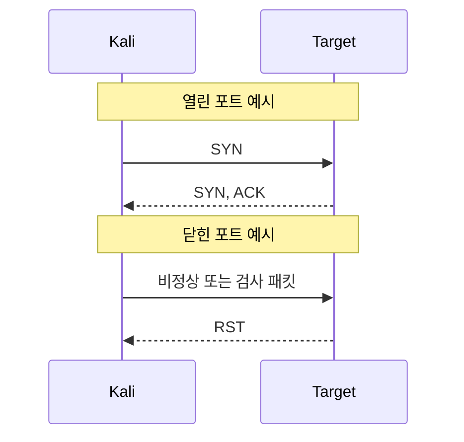

## 실습 목표

이번 실습에서는 Nmap의 대표적인 스캐닝 기법을 직접 수행하고, 각 기법이 네트워크에서 어떤 모습으로 보이는지 확인한다.

다루는 스캐닝 기법은 다음과 같다.

1. TCP connect() scan
2. SYN scan
3. FIN scan
4. NULL scan
5. X-mas tree scan
6. TCP fragmentation

각 항목은 다음 순서로 학습한다.

1. 스캔 방식의 원리 이해
2. Kali Linux에서 공격 명령 실행
3. Wireshark로 패킷 특징 확인
4. 방어자 관점에서 대응 방법 정리

> **주의**
> 본 실습은 허가된 실습망에서만 수행한다.
> 외부 네트워크 또는 허가받지 않은 시스템을 대상으로 스캔을 수행하면 안 된다.
{: .prompt-danger }

---

## 실습 환경

| 구분 | 운영체제 | IP 주소 | 역할 |
|------|----------|---------|------|
| 공격자 | Kali Linux | 192.168.0.10 | Nmap 스캔 수행 |
| 대상 서버 | Ubuntu | 192.168.0.30 | SSH, Apache 등 서비스 운영 |

---

## 사전 준비

### 1. Kali에서 Nmap 확인

```bash
nmap --version
```

예상 화면:

```text
Nmap version 7.94SVN ( https://nmap.org )
Platform: x86_64-pc-linux-gnu
Compiled with: liblua libpcap openssl
```

### 2. Ubuntu에서 열려 있는 포트 확인

```bash
sudo ss -tlnp
```

예시:

```text
LISTEN 0 128 0.0.0.0:2222 0.0.0.0:* users:(("sshd",pid=...,fd=...))
LISTEN 0 511 0.0.0.0:80   0.0.0.0:* users:(("apache2",pid=...,fd=...))
```

### 3. Ubuntu에서 패킷 캡처 시작

인터페이스 이름을 먼저 확인한다.

```bash
ip link show
```

예상 화면:

```text
2: ens33: <BROADCAST,MULTICAST,UP,LOWER_UP> mtu 1500 qdisc fq_codel state UP mode DEFAULT group default
    link/ether 00:0c:29:aa:bb:cc brd ff:ff:ff:ff:ff:ff
```

예를 들어 인터페이스 이름이 `ens33` 이라면 다음과 같이 캡처를 시작한다.

```bash
sudo tcpdump -i ens33 -nn host 192.168.0.10 -w /tmp/nmap_scans.pcap
```

예상 화면:

```text
tcpdump: listening on ens33, link-type EN10MB (Ethernet), snapshot length 262144 bytes
```

실습이 끝난 뒤 `Ctrl+C`로 종료한다.

### 4. Wireshark 분석 준비

캡처 파일을 열거나 Ubuntu에서 직접 Wireshark를 실행한다.

```bash
wireshark /tmp/nmap_scans.pcap &
```

예상 화면:

```text
[1] 3241
```

---

## 스캔 결과 해석의 기본 원리

TCP 기반 스캔에서 대상 포트가 열린 경우와 닫힌 경우는 보통 다음처럼 구분된다.



핵심은 다음과 같다.

- 열린 포트는 연결을 받아들이는 방향으로 응답한다.
- 닫힌 포트는 보통 `RST`로 거부한다.
- 필터링된 포트는 응답이 없거나 방화벽에 의해 차단된 패턴을 보인다.

---

## Part 1. TCP connect() scan

### 1-1. 원리

TCP connect() scan은 운영체제의 일반 소켓 `connect()` 호출을 이용해 완전한 TCP 연결을 시도하는 방식이다.

즉, 3-way handshake를 끝까지 수행한다.

- 열린 포트: `SYN -> SYN/ACK -> ACK`
- 닫힌 포트: `RST`

Nmap 옵션:

```bash
nmap -sT 192.168.0.30
```

예상 화면:

```text
Starting Nmap 7.94SVN at 2026-03-26 10:10 KST
Nmap scan report for 192.168.0.30
Host is up (0.0012s latency).
Not shown: 998 closed tcp ports (conn-refused)
PORT     STATE SERVICE
80/tcp   open  http
2222/tcp open  EtherNetIP-1
Nmap done: 1 IP address (1 host up) scanned in 1.30 seconds
```

### 1-2. 공격 방법

특정 포트만 확인:

```bash
nmap -sT -p 80,2222 192.168.0.30
```

예상 화면:

```text
Starting Nmap 7.94SVN at 2026-03-26 10:12 KST
Nmap scan report for 192.168.0.30
Host is up (0.0010s latency).

PORT     STATE SERVICE
80/tcp   open  http
2222/tcp open  EtherNetIP-1
```

전체 포트 확인:

```bash
nmap -sT -p- 192.168.0.30
```

예상 화면:

```text
Starting Nmap 7.94SVN at 2026-03-26 10:13 KST
Nmap scan report for 192.168.0.30
Host is up (0.0013s latency).
Not shown: 65533 closed tcp ports (conn-refused)
PORT     STATE SERVICE
80/tcp   open  http
2222/tcp open  EtherNetIP-1
```

### 1-3. Wireshark로 확인하는 방법

추천 필터:

```text
ip.addr == 192.168.0.10 && tcp
```

또는 연결 성립만 보고 싶다면:

```text
tcp.flags.syn == 1 || tcp.flags.ack == 1 || tcp.flags.reset == 1
```

확인 포인트:

- 열린 포트에서 `SYN`, `SYN/ACK`, `ACK`가 모두 보이는가
- 그 뒤 바로 `RST` 또는 `FIN`으로 연결 종료가 보이는가
- 닫힌 포트에서는 `RST` 응답이 오는가

### 1-4. 방어 방법

- 불필요한 서비스 중지
- 방화벽으로 허용 포트만 개방
- IDS/IPS에서 짧은 시간 내 다수 포트 연결 시도 탐지
- 서버 로그에서 비정상적인 대량 연결 시도 점검

Ubuntu 예시:

```bash
sudo ufw default deny incoming
sudo ufw allow 2222/tcp
sudo ufw allow 80/tcp
sudo ufw enable
```

예상 화면:

```text
Default incoming policy changed to 'deny'
Rules updated
Rule added
Rule added
Command may disrupt existing ssh connections. Proceed with operation (y|n)? y
Firewall is active and enabled on system startup
```

---

## Part 2. SYN scan

### 2-1. 원리

SYN scan은 흔히 반개방 스캔이라고 부르며, 완전한 연결을 만들기 전에 열린 포트를 판별한다.

- 열린 포트: `SYN/ACK` 수신 후 공격자는 보통 `RST` 전송
- 닫힌 포트: `RST`

Nmap 옵션:

```bash
sudo nmap -sS 192.168.0.30
```

예상 화면:

```text
Starting Nmap 7.94SVN at 2026-03-26 10:20 KST
Nmap scan report for 192.168.0.30
Host is up (0.00098s latency).
Not shown: 998 closed tcp ports (reset)
PORT     STATE SERVICE
80/tcp   open  http
2222/tcp open  EtherNetIP-1
```

> `-sS`는 raw packet 사용 때문에 보통 root 권한이 필요하다.
{: .prompt-tip }

### 2-2. 공격 방법

```bash
sudo nmap -sS -p 80,2222 192.168.0.30
```

예상 화면:

```text
Starting Nmap 7.94SVN at 2026-03-26 10:21 KST
Nmap scan report for 192.168.0.30
Host is up (0.00090s latency).

PORT     STATE SERVICE
80/tcp   open  http
2222/tcp open  EtherNetIP-1
```

속도 조절 예시:

```bash
sudo nmap -sS -T3 -p 1-1024 192.168.0.30
```

예상 화면:

```text
Starting Nmap 7.94SVN at 2026-03-26 10:22 KST
Nmap scan report for 192.168.0.30
Host is up (0.0011s latency).
Not shown: 1023 closed tcp ports
PORT   STATE SERVICE
80/tcp open  http
```

### 2-3. Wireshark로 확인하는 방법

추천 필터:

```text
ip.addr == 192.168.0.10 && tcp
```

SYN 패킷 중심 필터:

```text
tcp.flags.syn == 1 && tcp.flags.ack == 0
```

열린 포트 응답 확인:

```text
tcp.flags.syn == 1 && tcp.flags.ack == 1
```

확인 포인트:

- Kali가 SYN만 보내는가
- 열린 포트는 `SYN/ACK`로 응답하는가
- 이후 정상적인 `ACK` 대신 `RST`가 보여 연결이 끝나는가

### 2-4. 방어 방법

- 방화벽에서 비정상 SYN 빈도 제한
- SYN scan 탐지 규칙을 IDS/IPS에 적용
- `recent`, `connlimit`, `hashlimit` 같은 iptables 기반 제어 사용
- 외부 노출 포트 최소화

예시:

```bash
sudo iptables -A INPUT -p tcp --syn -m recent --name synscan --set
sudo iptables -A INPUT -p tcp --syn -m recent --name synscan --update --seconds 10 --hitcount 20 -j DROP
```

예상 화면:

```text
# 정상 적용 시 별도 출력 없음
```

---

## Part 3. FIN scan

### 3-1. 원리

FIN scan은 SYN 대신 FIN 플래그가 켜진 패킷을 보내 포트 상태를 판별하는 방식이다.

일반적인 RFC 동작 기준:

- 열린 포트: 응답 없음
- 닫힌 포트: `RST`

Nmap 옵션:

```bash
sudo nmap -sF 192.168.0.30
```

예상 화면:

```text
Starting Nmap 7.94SVN at 2026-03-26 10:30 KST
Nmap scan report for 192.168.0.30
Host is up (0.0010s latency).
Not shown: 998 closed tcp ports (reset)
PORT     STATE         SERVICE
80/tcp   open|filtered http
2222/tcp open|filtered EtherNetIP-1
```

> Windows 계열은 RFC와 다르게 동작하는 경우가 있어 결과 해석이 제한될 수 있다.
{: .prompt-warning }

### 3-2. 공격 방법

```bash
sudo nmap -sF -p 80,2222 192.168.0.30
```

예상 화면:

```text
Starting Nmap 7.94SVN at 2026-03-26 10:31 KST
Nmap scan report for 192.168.0.30
Host is up.

PORT     STATE         SERVICE
80/tcp   open|filtered http
2222/tcp open|filtered EtherNetIP-1
```

### 3-3. Wireshark로 확인하는 방법

FIN 패킷 필터:

```text
tcp.flags.fin == 1 && tcp.flags.syn == 0 && tcp.flags.push == 0 && tcp.flags.urg == 0
```

RST 응답 확인:

```text
tcp.flags.reset == 1
```

확인 포인트:

- 공격자 패킷에 FIN만 설정되어 있는가
- 닫힌 포트에서만 RST가 오는가
- 열린 포트는 무응답으로 보이는가

### 3-4. 방어 방법

- 비정상 TCP flag 조합 탐지
- 정상 세션 없이 들어오는 FIN 패킷 차단
- IDS에서 FIN scan 시그니처 활성화

예시:

```bash
sudo iptables -A INPUT -p tcp --tcp-flags ALL FIN -j DROP
```

예상 화면:

```text
# 정상 적용 시 별도 출력 없음
```

---

## Part 4. NULL scan

### 4-1. 원리

NULL scan은 TCP 플래그를 아무것도 세우지 않은 상태로 패킷을 보내 포트를 확인한다.

RFC 기준 동작:

- 열린 포트: 응답 없음
- 닫힌 포트: `RST`

Nmap 옵션:

```bash
sudo nmap -sN 192.168.0.30
```

예상 화면:

```text
Starting Nmap 7.94SVN at 2026-03-26 10:40 KST
Nmap scan report for 192.168.0.30
Host is up.
Not shown: 998 closed tcp ports (reset)
PORT     STATE         SERVICE
80/tcp   open|filtered http
2222/tcp open|filtered EtherNetIP-1
```

### 4-2. 공격 방법

```bash
sudo nmap -sN -p 80,2222 192.168.0.30
```

예상 화면:

```text
PORT     STATE         SERVICE
80/tcp   open|filtered http
2222/tcp open|filtered EtherNetIP-1
```

### 4-3. Wireshark로 확인하는 방법

완전히 비어 있는 TCP flag 확인:

```text
tcp.flags == 0x000
```

확인 포인트:

- SYN, ACK, FIN, RST, PSH, URG가 모두 꺼져 있는가
- 닫힌 포트에서만 RST가 돌아오는가
- 방화벽이 있으면 응답이 사라져 `open|filtered`처럼 해석될 수 있는가

### 4-4. 방어 방법

- 플래그가 비정상인 TCP 패킷 차단
- 상태 기반 방화벽 사용
- 인터넷 경계에서 이상 패킷 필터링

예시:

```bash
sudo iptables -A INPUT -p tcp --tcp-flags ALL NONE -j DROP
```

예상 화면:

```text
# 정상 적용 시 별도 출력 없음
```

---

## Part 5. X-mas tree scan

### 5-1. 원리

X-mas tree scan은 여러 TCP 플래그를 동시에 켜서 보내는 기법이다. 일반적으로 `FIN`, `PSH`, `URG`가 함께 설정된다.

이름 그대로 패킷에 여러 플래그가 켜져 있어 트리 장식처럼 보인다고 해서 붙은 이름이다.

RFC 기준 동작:

- 열린 포트: 응답 없음
- 닫힌 포트: `RST`

Nmap 옵션:

```bash
sudo nmap -sX 192.168.0.30
```

예상 화면:

```text
Starting Nmap 7.94SVN at 2026-03-26 10:50 KST
Nmap scan report for 192.168.0.30
Host is up.
Not shown: 998 closed tcp ports (reset)
PORT     STATE         SERVICE
80/tcp   open|filtered http
2222/tcp open|filtered EtherNetIP-1
```

### 5-2. 공격 방법

```bash
sudo nmap -sX -p 80,2222 192.168.0.30
```

예상 화면:

```text
PORT     STATE         SERVICE
80/tcp   open|filtered http
2222/tcp open|filtered EtherNetIP-1
```

### 5-3. Wireshark로 확인하는 방법

추천 필터:

```text
tcp.flags.fin == 1 && tcp.flags.push == 1 && tcp.flags.urg == 1
```

확인 포인트:

- FIN, PSH, URG가 동시에 켜져 있는가
- 닫힌 포트에서 `RST`가 보이는가
- 열린 포트는 무응답인가

### 5-4. 방어 방법

- 비정상 플래그 조합 차단
- IDS에서 Xmas scan 탐지 룰 활성화
- 외부에서 접근 가능한 포트 축소

예시:

```bash
sudo iptables -A INPUT -p tcp --tcp-flags ALL FIN,PSH,URG -j DROP
```

예상 화면:

```text
# 정상 적용 시 별도 출력 없음
```

---

## Part 6. TCP fragmentation scan

### 6-1. 원리

TCP fragmentation은 스캔 패킷을 작은 조각으로 나누어 전송해 단순 필터링 장비나 오래된 탐지 로직을 우회하려는 방식이다.

Nmap 옵션:

```bash
sudo nmap -f 192.168.0.30
```

예상 화면:

```text
Starting Nmap 7.94SVN at 2026-03-26 11:00 KST
Nmap scan report for 192.168.0.30
Host is up (0.0011s latency).
Not shown: 998 closed tcp ports
PORT     STATE SERVICE
80/tcp   open  http
2222/tcp open  EtherNetIP-1
```

또는 더 작은 단위 지정:

```bash
sudo nmap --mtu 8 192.168.0.30
```

예상 화면:

```text
Starting Nmap 7.94SVN at 2026-03-26 11:01 KST
Nmap scan report for 192.168.0.30
Host is up.
PORT     STATE SERVICE
80/tcp   open  http
2222/tcp open  EtherNetIP-1
```

### 6-2. 공격 방법

SYN scan과 함께 사용하는 예시:

```bash
sudo nmap -sS -f -p 80,2222 192.168.0.30
```

예상 화면:

```text
PORT     STATE SERVICE
80/tcp   open  http
2222/tcp open  EtherNetIP-1
```

조각 크기 지정 예시:

```bash
sudo nmap -sS --mtu 8 -p 80,2222 192.168.0.30
```

예상 화면:

```text
PORT     STATE SERVICE
80/tcp   open  http
2222/tcp open  EtherNetIP-1
```

### 6-3. Wireshark로 확인하는 방법

IP 조각화 확인 필터:

```text
ip.flags.mf == 1 || ip.frag_offset > 0
```

확인 포인트:

- 하나의 스캔 패킷이 여러 IP fragment로 나뉘는가
- `More Fragments` 플래그가 보이는가
- 재조립이 필요한 형태로 전달되는가

### 6-4. 방어 방법

- 조각화 패킷 재조립 기능이 있는 방화벽/IPS 사용
- 비정상적으로 작은 fragment 차단
- 경계 장비에서 fragment 기반 우회 탐지 활성화
- 커널과 보안 장비 최신화

Linux 방어 관점 체크:

```bash
sudo sysctl net.ipv4.ipfrag_high_thresh
sudo sysctl net.ipv4.ipfrag_low_thresh
```

예상 화면:

```text
net.ipv4.ipfrag_high_thresh = 4194304
net.ipv4.ipfrag_low_thresh = 3145728
```

추가로 UFW만으로 세밀한 fragment 제어는 제한적이므로, iptables/nftables 또는 전용 IPS가 더 적합하다.

---

## Part 7. 실습 후 공통 분석

모든 스캔을 수행한 뒤 다음 항목을 비교 정리한다.

| 스캔 방식 | 열린 포트 응답 | 닫힌 포트 응답 | Wireshark 특징 | 방어 핵심 |
|------|------|------|------|------|
| TCP connect() | 3-way handshake 완료 | RST | 연결 성립 흔적 뚜렷 | 허용 포트 최소화 |
| SYN scan | SYN/ACK 후 RST | RST | 반개방 패턴 | SYN 빈도 제한 |
| FIN scan | 무응답 | RST | FIN 단독 플래그 | 비정상 flag 차단 |
| NULL scan | 무응답 | RST | flag 없음 | NONE flag 차단 |
| X-mas tree scan | 무응답 | RST | FIN+PSH+URG | 이상 flag 조합 차단 |
| Fragmentation | 조각화된 응답 | 조각화 가능 | IP fragment | 재조립 기반 탐지 |

---

## Part 8. 학생 실습 체크리스트

| 항목 | 완료 여부 |
|------|------|
| `-sT` 스캔을 수행했다 | |
| `-sS` 스캔을 수행했다 | |
| `-sF` 스캔을 수행했다 | |
| `-sN` 스캔을 수행했다 | |
| `-sX` 스캔을 수행했다 | |
| `-f` 또는 `--mtu` 스캔을 수행했다 | |
| Wireshark에서 각 스캔 패턴을 확인했다 | |
| UFW 또는 iptables로 방어 규칙을 검토했다 | |

---

## 확인 문제

**Q1.** 완전한 TCP 연결을 성립시키는 스캔 방식은 무엇인가?

- SYN scan
- TCP connect() scan
- NULL scan
- X-mas tree scan

---

**Q2.** `FIN`, `PSH`, `URG` 플래그가 동시에 켜진 스캔 방식은 무엇인가?

- NULL scan
- SYN scan
- X-mas tree scan
- TCP fragmentation

---

**Q3.** 다음 중 IP 조각화를 이용해 탐지를 어렵게 하려는 스캔 방식은 무엇인가?

- TCP connect() scan
- FIN scan
- TCP fragmentation
- NULL scan

---

## 한 줄 정리

**스캐닝 기법은 단순한 포트 확인이 아니라, 응답 방식과 패킷 형태를 바꿔 가며 대상의 상태를 파악하고 방어 체계를 시험하는 정찰 기술이다.**
