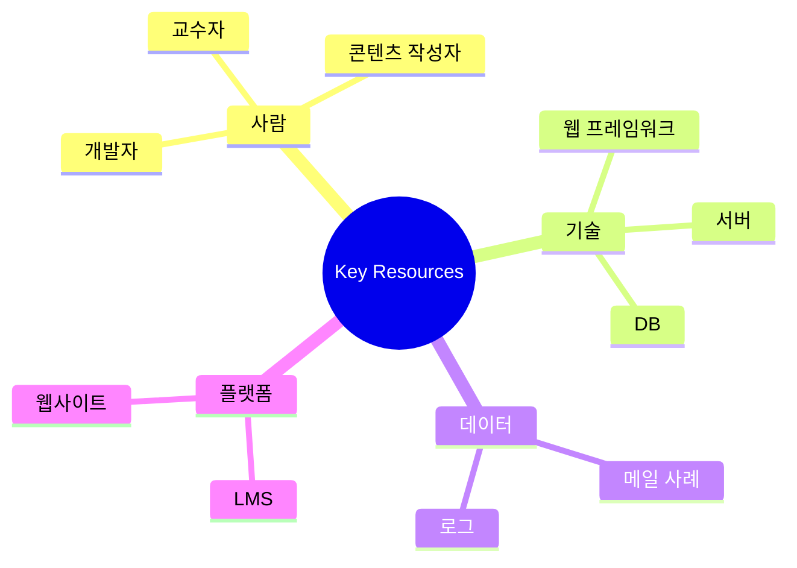
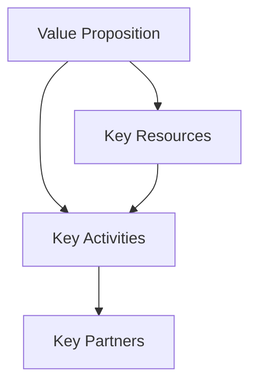

# 13부. Key Resources, Key Activities, Key Partners
---
## 1. 왜 이 세 칸이 중요한가?

앞선 칸들이 "누구를 위해 왜 필요한가"를 설명했다면, 이 세 칸은 "그걸 실제로 어떻게 굴릴 것인가"를 설명함.

즉, 이 부분은 프로젝트의 실행 구조에 가까움.

| 칸 | 질문 |
| --- | --- |
| **Key Resources** | 무엇이 있어야 하는가? |
| **Key Activities** | 무엇을 해야 하는가? |
| **Key Partners** | 누구의 도움이 필요한가? |

많은 학생 프로젝트가 좋은 아이디어를 가지고도 실제 구현 단계에서 막히는 이유는, 이 세 칸을 충분히 생각하지 않았기 때문임.

---

## 2. Key Resources란?

Key Resources는 프로젝트를 만들고 운영하기 위해 필요한 핵심 자원임.

학생들은 자원을 보통 "컴퓨터"나 "서버"처럼 기술 요소로만 생각하기 쉽지만, 실제로는 훨씬 넓게 봐야 함.

자원은 아래처럼 나눠 볼 수 있음.

- 사람
- 기술
- 데이터
- 시간
- 플랫폼
- 콘텐츠

예:

- 피싱 메일 사례 데이터
- 웹 구현이 가능한 팀원
- 교수자의 피드백 시간
- 학교 LMS 접근 권한
- 교육용 콘텐츠 자료



---

## 3. Key Activities란?

Key Activities는 프로젝트가 가치 제안을 실제로 만들기 위해 반드시 해야 하는 핵심 활동임.

여기서 중요한 점은 "할 수 있는 일"이 아니라 "반드시 해야 하는 일"을 적는 것임.

예:

- 피싱 메일 사례 수집
- 교육용 콘텐츠 제작
- 퀴즈 설계
- 웹 페이지 구현
- 결과 피드백 기능 구성

만약 이 활동이 빠지면 가치 제안이 무너진다면, 그것은 Key Activity일 가능성이 큼.

---

## 4. Key Partners란?

Key Partners는 프로젝트를 성공적으로 운영하기 위해 협력이 필요한 사람이나 조직을 의미함.

학생 프로젝트는 혼자 모든 것을 해결하기 어려운 경우가 많기 때문에, 파트너 개념이 특히 중요함.

예:

- 교수자
- 학교 전산팀
- 외부 API 제공자
- 콘텐츠 제공 기관
- 팀 외부 멘토

이 파트너를 생각하면, 내가 직접 다 해야 하는 것과 도움을 받아야 하는 것을 구분할 수 있음.

---

## 5. 세 칸은 어떻게 연결되는가?



예를 들어 가치 제안이 "학생이 피싱 메일을 더 잘 구분하도록 돕는다"라면,

- Resources: 사례 데이터, 웹 개발 역량, 콘텐츠
- Activities: 사례 수집, 학습 콘텐츠 제작, 구현
- Partners: 교수자, 학교 전산팀

으로 연결될 수 있음.

---

## 6. 학생이 자주 하는 실수

### 실수 1. Resources를 너무 좁게 보기

예:

- 노트북만 있으면 된다
- 코딩만 하면 된다

하지만 실제로는 데이터, 시간, 콘텐츠, 피드백도 모두 자원임.

### 실수 2. Activities를 기능 목록으로만 쓰기

예:

- 로그인 만들기
- 버튼 만들기
- 화면 만들기

이건 개발 작업일 수는 있지만, 프로젝트의 핵심 활동인지 다시 생각해야 함.

### 실수 3. Partners를 아예 비워 두기

학생 프로젝트에서도 협력 대상은 거의 항상 있음.

- 자료를 제공해 줄 사람
- 검토를 도와줄 사람
- 접근 권한을 가진 사람

---

## 7. 예시로 보기

주제: `대학생을 위한 피싱 메일 판별 학습 서비스`

| 칸 | 예시 |
| --- | --- |
| Key Resources | 피싱 사례 데이터, 콘텐츠 작성 시간, 웹 개발 역량 |
| Key Activities | 사례 수집, 학습 콘텐츠 작성, 퀴즈 구현, 결과 피드백 |
| Key Partners | 교수자, 학교 전산팀, 보안 자료 제공처 |

이 예시를 보면, 프로젝트가 단순히 웹 페이지를 만드는 것이 아니라, **콘텐츠와 데이터가 함께 필요한 교육 서비스**라는 점이 보임.

---

## 8. 짧은 활동

아래 문장을 완성해 보자.

```text
우리 프로젝트가 돌아가려면 반드시 필요한 자원 3가지는:
1.
2.
3.

반드시 해야 하는 핵심 활동 3가지는:
1.
2.
3.

도움이 필요한 파트너 2가지는:
1.
2.
```

이 활동은 추상적인 아이디어를 실행 가능한 구조로 바꾸는 데 매우 효과적임.

---

## 9. 마무리

Key Resources, Key Activities, Key Partners는 프로젝트의 "실행 뼈대"를 만드는 칸임.

다음 장에서는 지금까지 배운 내용을 공통 예제로 한 번 실제로 채워봄.

