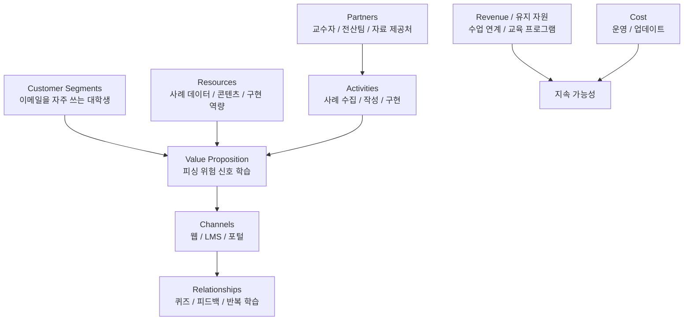

# 14부. BMC 예제 실습 - 피싱 메일 판별 학습 서비스
---
## 1. 실습 목표

이번 장의 목표는 학생들이 하나의 공통 예제를 기준으로 BMC를 실제로 채워보는 것임.

이번 예시는 아래와 같음.

> **대학생을 위한 피싱 메일 판별 학습 서비스**

이 주제를 고른 이유는 다음과 같음.

- 정보보안과 연결됨
- 학생들이 실제로 접할 수 있는 상황임
- 고객, 가치, 채널, 운영 구조를 모두 떠올리기 쉬움

---

## 2. 먼저 브레인스토밍하기

처음부터 BMC 칸을 채우기 전에, 생각나는 내용을 자유롭게 적어보는 것이 좋음.

예:

- 학생들은 피싱 메일을 진짜 메일로 착각할 수 있음
- 위험 신호를 잘 모르고 클릭할 수 있음
- 사례 중심으로 배우면 더 잘 이해할 수 있음
- 퀴즈 형태면 참여가 쉬울 수 있음
- 학교 LMS와 연결하면 수업에서 쓰기 좋을 것 같음
- 콘텐츠를 계속 업데이트해야 할 수도 있음

> 💡 **포인트**  
> 브레인스토밍은 정답을 적는 단계가 아니라, BMC에 들어갈 재료를 모으는 단계임.
{: .prompt-tip }

---

## 3. 생각을 BMC 칸으로 옮기기

이제 위 생각을 BMC 칸으로 나눠 볼 수 있음.

| BMC 칸 | 예시 내용 |
| --- | --- |
| Customer Segments | 이메일과 메시지를 자주 사용하는 대학생 |
| Value Proposition | 피싱 메일의 위험 신호를 더 쉽게 구분하도록 돕는다 |
| Channels | 웹 학습 페이지, LMS, 학교 포털 |
| Customer Relationships | 반복 퀴즈, 즉시 피드백, 학기별 학습 |
| Revenue Streams | 수업 연계 운영, 학교 보안 교육 프로그램 |
| Key Resources | 사례 데이터, 콘텐츠, 웹 구현 역량 |
| Key Activities | 사례 수집, 학습 콘텐츠 작성, 퀴즈 구현 |
| Key Partners | 교수자, 학교 전산팀, 자료 제공처 |
| Cost Structure | 콘텐츠 업데이트 시간, 운영 부담 |



---

## 4. 왜 이런 답이 나오는가?

### Customer Segments

"대학생"이라고만 쓰는 대신, 이메일과 메시지를 자주 사용하는 학생으로 조금 더 구체화함. 그래야 문제 상황이 더 선명해짐.

### Value Proposition

단순히 "보안 교육 서비스"가 아니라, 피싱 메일의 위험 신호를 더 쉽게 구분하도록 돕는다고 적음. 이러면 학생이 얻는 가치가 보임.

### Channels

학생이 실제로 접근 가능한 경로를 떠올려 웹, LMS, 포털을 적음. 앱보다 구현 부담이 낮고 현실적일 수 있음.

### Customer Relationships

보안은 한 번 듣고 끝나는 내용보다 반복 학습이 중요하므로 퀴즈와 피드백이 적절함.

---

## 5. 학생이 놓치기 쉬운 부분

### 놓치기 쉬운 점 1. 문제를 너무 일반적으로 쓰기

- 보안이 중요하다

이 문장은 너무 넓음.

더 좋은 표현:

- 학생이 피싱 메일을 구분하지 못해 링크를 누를 위험이 있다

### 놓치기 쉬운 점 2. 채널을 이상적으로만 쓰기

- 모바일 앱

가능은 하지만, 실제 팀이 구현할 수 있는지와 고객 접근성을 같이 봐야 함.

### 놓치기 쉬운 점 3. 비용을 적지 않기

학생 프로젝트에서는 시간과 운영 부담이 가장 큰 비용일 수 있음.

---

## 6. 활동지

```text
프로젝트:

1. Customer Segments:

2. Value Proposition:

3. Channels:

4. Customer Relationships:

5. Revenue Streams:

6. Key Resources:

7. Key Activities:

8. Key Partners:

9. Cost Structure:
```

---

## 7. 발표용 한 줄 정리

아래 문장을 완성해 보자.

```text
우리 프로젝트는 [고객]이 [문제]를 해결하도록 돕는 [가치]를 제공하며,
[채널]을 통해 전달되고, [운영 방식]으로 유지된다.
```

예:

```text
우리 프로젝트는 대학생이 피싱 메일을 더 잘 구분하도록 돕는 학습 가치를 제공하며,
웹과 LMS를 통해 전달되고, 수업 연계형 교육 서비스로 운영된다.
```

---

## 8. 마무리

공통 예제를 따라 채워보면 BMC의 각 칸이 훨씬 덜 추상적으로 느껴짐.

다음 장에서는 이 과정을 자신의 프로젝트에 직접 적용함.

