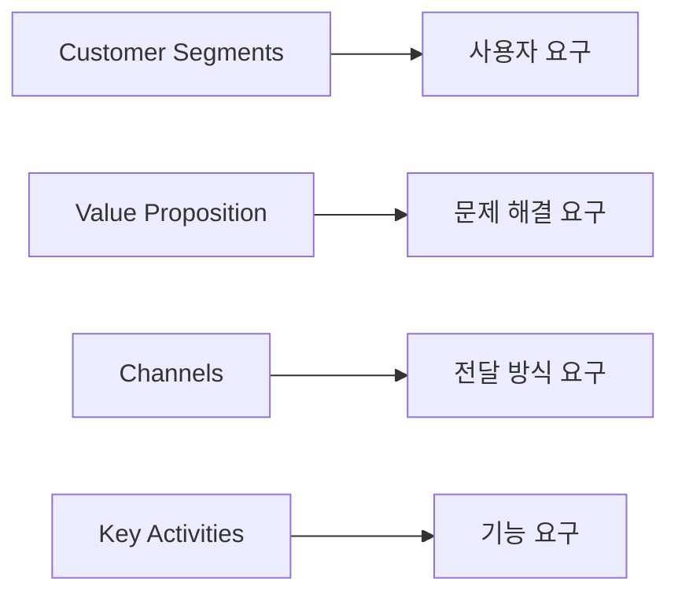

# 17부. BMC에서 요구사항 도출하기
---
## 1. 왜 이 단계가 필요한가?

BMC는 프로젝트의 방향을 잡는 도구이고, 요구사항은 실제로 무엇을 만들지 정하는 도구임.

즉,

- BMC는 "왜 이 프로젝트가 필요한가"를 설명하고
- 요구사항은 "그래서 무엇을 만들어야 하는가"를 설명함

학생 프로젝트에서는 이 두 단계가 자주 분리되지 않고 섞여 버리는데, 그러면 아이디어도 흐리고 기능도 흔들리게 됨.

---

## 2. BMC와 요구사항의 차이

| 구분 | BMC | 요구사항 |
| --- | --- | --- |
| 질문 | 왜 필요한가 | 무엇을 만들어야 하는가 |
| 대상 | 기획 방향 | 실제 기능 / 행동 |
| 형태 | 구조적 요약 | 기능 문장 / 조건 |

예:

- BMC: 피싱 메일을 더 잘 구분하도록 돕는다
- 요구사항: 사용자는 메일 사례를 보고 정상/피싱 여부를 판단해 볼 수 있어야 한다

---

## 3. 어떻게 연결되는가?

| BMC 칸 | 요구사항으로 바뀌는 예 |
| --- | --- |
| Customer Segments | 어떤 사용자를 고려한 설계가 필요한가 |
| Value Proposition | 어떤 문제를 해결하는 기능이 필요한가 |
| Channels | 웹, 앱, LMS 중 무엇으로 제공할 것인가 |
| Customer Relationships | 반복 사용, 피드백, 알림이 필요한가 |
| Key Activities | 실제로 구현해야 할 핵심 기능은 무엇인가 |



---

## 4. 예시

주제: `대학생을 위한 피싱 메일 판별 학습 서비스`

| BMC 내용 | 요구사항 예시 |
| --- | --- |
| 대학생이 주요 고객 | 사용자는 쉬운 설명과 학생 눈높이의 예시를 볼 수 있어야 한다 |
| 피싱 메일 구분을 돕는다 | 사용자는 사례를 보고 정상/피싱 여부를 판단해 볼 수 있어야 한다 |
| 웹/LMS로 제공 | 사용자는 웹 브라우저 또는 LMS를 통해 학습 콘텐츠에 접근할 수 있어야 한다 |
| 반복 학습 관계 | 사용자는 퀴즈 결과와 피드백을 받을 수 있어야 한다 |

이렇게 보면 BMC가 요구사항의 출발점이 된다는 점을 쉽게 이해할 수 있음.

---

## 5. 요구사항 문장으로 바꾸는 법

학생 프로젝트에서는 아래 형식이 비교적 쓰기 쉬움.

```text
사용자는 ______ 할 수 있어야 한다.
시스템은 ______ 제공해야 한다.
사용자는 ______ 확인할 수 있어야 한다.
```

예:

- 사용자는 피싱 메일 사례를 보고 위험 여부를 판단할 수 있어야 한다.
- 시스템은 메일의 의심 요소를 설명해 주어야 한다.
- 사용자는 퀴즈 결과와 피드백을 확인할 수 있어야 한다.

---

## 6. 학생이 자주 하는 실수

### 실수 1. 가치 제안을 그대로 요구사항이라고 쓰기

예:

- 피싱 메일을 더 잘 구분하도록 돕는다

이 문장은 방향 설명이지, 아직 기능 요구사항은 아님.

### 실수 2. 요구사항이 너무 구현 상세로만 내려가기

예:

- 버튼 색은 파란색이어야 한다

이건 나중 단계의 UI 결정일 수 있음. 먼저는 사용자 행동과 시스템 역할을 정리하는 편이 좋음.

### 실수 3. 고객을 잊고 기능만 나열하기

요구사항은 BMC에서 출발해야 하므로, 고객과 가치가 보이지 않는 기능 나열은 방향을 잃기 쉬움.

---

## 7. 짧은 활동

자신의 프로젝트에서 아래를 적어보자.

```text
BMC에서 정한 고객:
BMC에서 정한 가치:

이것을 바탕으로 나온 요구사항:
1.
2.
3.
```

이 활동은 BMC와 실제 기능 설계를 연결하는 가장 기본적인 연습임.

---

## 8. 마무리

Business Model Canvas는 기획의 시작점이고, 요구사항은 실행의 출발점임.

즉, BMC가 "왜"를 정리한다면, 요구사항은 "무엇"을 정리하는 단계라고 볼 수 있음.

