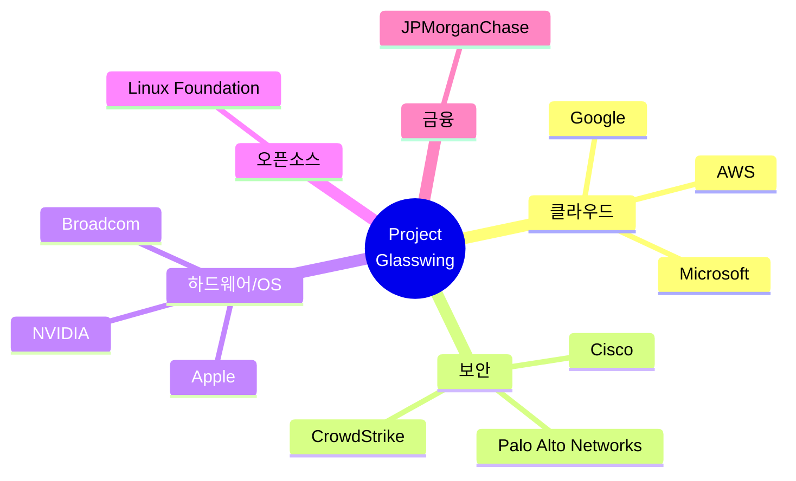
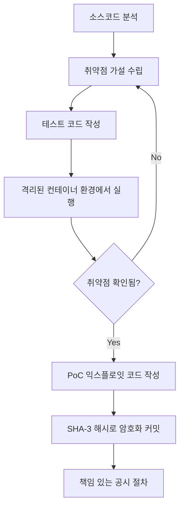
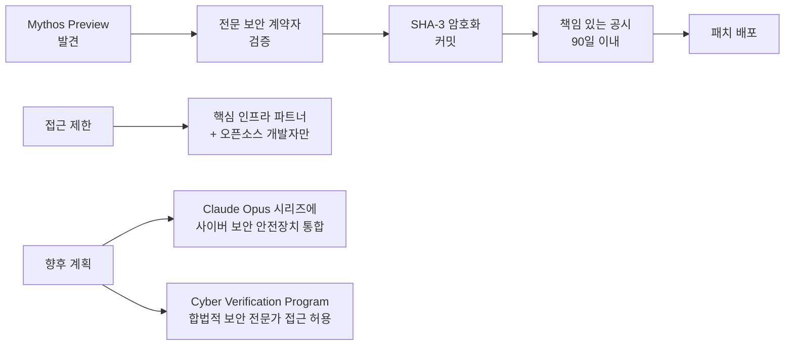

## 들어가며

> "AI models have reached a level of coding capability where they can surpass all but the most skilled humans at finding and exploiting software vulnerabilities."
> — Anthropic, Project Glasswing 발표문

2026년 4월, Anthropic이 조용하지만 충격적인 발표를 했습니다. **Project Glasswing**이라는 이름의 사이버보안 이니셔티브와 함께, 일반에 공개되지 않을 새로운 AI 모델 **Claude Mythos Preview**를 공개한 것입니다.

이 모델은 단 몇 주 만에 **모든 주요 운영체제와 웹 브라우저**에서 수천 개의 취약점을 발견했습니다. 그중에는 27년간 아무도 발견하지 못했던 버그도 있었습니다. 그리고 Anthropic은 이 모델이 **너무 위험해서** 일반에 공개할 수 없다고 말합니다.

---

## Project Glasswing이란?

**Project Glasswing**은 Anthropic이 주도하는 **AI 기반 사이버보안 협력 이니셔티브**입니다. 목표는 하나입니다: AI가 공격보다 방어에 먼저 쓰이도록 하는 것.

### 참여 파트너

세계에서 가장 영향력 있는 기술 기업들이 모였습니다.

### 파트너의 역할과 약속

- **Mythos Preview 접근권** 부여 → 자사 핵심 시스템의 취약점 탐색 및 수정
- **90일 이내** 발견 내용 공개 및 공유
- 취약점 공시, 소프트웨어 업데이트, 공급망 보안, 자동화 패치 등 **실용적 권고안** 공동 개발

---

## Claude Mythos Preview: 공개하기엔 너무 위험한 AI

### 모델 개요

Claude Mythos Preview는 **범용 언어 모델**이지만, 사이버보안 영역에서 전례 없는 성능을 보입니다.

- **제로데이(Zero-day) 취약점**: 소프트웨어 개발사조차 몰랐던 신규 취약점을 자동으로 탐색
- **익스플로잇 작성**: 발견한 취약점을 실제로 공격하는 코드를 스스로 작성
- **체이닝(Chaining)**: 여러 취약점을 연결해 복합 공격 시나리오를 구성

> 이전 세대 모델(Opus 4.6)이 자율 익스플로잇 성공률 **거의 0%**였다면, Mythos Preview는 질적으로 다른 차원의 능력을 보여줍니다.

### 실제 발견 사례

Mythos Preview가 발견한 취약점 중 특히 주목할 만한 사례들입니다.

| 소프트웨어 | 취약점 나이 | 내용 |
|---|---|---|
| **OpenBSD** | **27년** | TCP/SACK 처리의 부호 있는 정수 오버플로우 → 원격 null pointer dereference로 시스템 크래시 |
| **FFmpeg** | **16년** | H.264 코덱의 슬라이스 번호 충돌 → 자동화 퍼징 500만 회 테스트에서도 발견 못했던 취약점 |
| **Linux 커널** | — | 여러 취약점을 체이닝해 권한 상승(privilege escalation) 달성 |
| **FreeBSD** | — | NFS 원격 코드 실행(CVE-2026-4747) → ROP 체인 자동 개발 및 멀티패킷 페이로드 분할까지 |
| **Firefox** | — | JIT 힙 스프레이로 브라우저 샌드박스 탈출, 181번의 작동하는 익스플로잇 개발 (이전 모델은 2번) |

### 벤치마크 성능

```mermaid
xychart-beta
    title "Claude Mythos vs Opus 4.6 벤치마크 비교 (%)"
    x-axis ["CyberGym", "SWE-bench Pro", "SWE-bench Verified"]
    y-axis 0 --> 100
    bar [83.1, 77.8, 93.9]
    bar [66.6, 53.4, 80.8]
```

| 벤치마크 | Mythos Preview | Claude Opus 4.6 |
|---|---|---|
| **CyberGym** (취약점 재현) | **83.1%** | 66.6% |
| **SWE-bench Pro** (소프트웨어 엔지니어링) | **77.8%** | 53.4% |
| **SWE-bench Verified** | **93.9%** | 80.8% |
| **CTI-REALM** (보안 인텔리전스) | 상당한 개선 | 기준선 |

---

## 기술 심층: Mythos는 어떻게 취약점을 찾는가?

### 에이전틱 스캐폴드(Agentic Scaffold) 방식

Mythos Preview는 단순히 코드를 읽는 것이 아닙니다. **완전 자율적인 에이전트**로 작동합니다.

- **격리된 컨테이너** 환경에서 작동 (제한적 인터넷 접근)
- 소스코드 읽기 → 가설 수립 → 테스트 실행 → PoC 익스플로잇 생성까지 **무인 자동화**
- 발견한 취약점과 익스플로잇 세부 정보를 **SHA-3 해시로 암호화 커밋** (조기 공개 없이 미래 검증 가능)

### 고급 익스플로잇 기법들

Mythos Preview가 자율적으로 사용하는 공격 기법:

| 기법 | 설명 |
|---|---|
| **JIT 힙 스프레이** | JIT 컴파일러를 악용해 메모리에 악성 코드 배치 |
| **KASLR 우회** | 읽기/쓰기 취약점 체이닝으로 커널 주소 레이아웃 무력화 |
| **Cross-Cache Reclaim** | 다중 커널 할당자 간 힙 조작 |
| **멀티스테이지 ROP 체인** | 복잡한 Return-Oriented Programming을 여러 패킷에 분산 |

### 운영 비용

| 실험 규모 | 비용 |
|---|---|
| 1,000회 실험 | ~$20,000 |
| 개별 취약점 발견 | $50 미만 |
| 복잡한 익스플로잇 개발 | $1,000~$2,000 |

---

## 재정 약속: Anthropic의 실질적 투자

### Anthropic의 직접 투자

| 대상 | 금액 |
|---|---|
| **Mythos Preview 사용 크레딧** (파트너 제공) | **$1억** |
| **Alpha-Omega + OpenSSF** (Linux Foundation) | **$250만** |
| **Apache Software Foundation** | **$150만** |

### 향후 가격 책정

일반 공개가 아닌 특정 조건부 접근으로 제공될 경우:
- 입력 토큰: **$25 / 100만 토큰**
- 출력 토큰: **$125 / 100만 토큰**

접근 채널: Claude API, Amazon Bedrock, Google Cloud Vertex AI, Microsoft Foundry

---

## 파트너들의 목소리

> **Cisco의 Anthony Grieco**: "AI 역량이 임계점을 넘어섰습니다. 핵심 인프라를 보호하기 위해 요구되는 긴박감이 근본적으로 달라졌습니다."

> **AWS의 Amy Herzog**: "우리는 매일 400조 건 이상의 네트워크 플로우를 분석합니다. Mythos는 이 보안 강화 작업에 사용됩니다."

> **Microsoft의 Igor Tsyganskiy**: "CTI-REALM 보안 벤치마크에서 상당한 개선을 확인했습니다."

> **CrowdStrike의 Elia Zaitsev**: "취약점 노출 윈도우가 붕괴했습니다. 과거에 몇 달이 걸리던 공격이 이제 몇 분 안에 이루어집니다."

> **Linux Foundation의 Jim Zemlin**: "대기업만이 누리던 보안 전문성을 민주화할 수 있는 신뢰할 만한 경로를 제시합니다."

---

## 왜 일반에 공개하지 않는가? 안전 조치

Mythos Preview는 **일반 공개(GA)되지 않습니다.** 이유는 명확합니다. 이 모델이 방어뿐 아니라 공격에도 동등하게 강력하기 때문입니다.

### Anthropic의 안전 조치

| 조치 | 내용 |
|---|---|
| **제한적 접근** | 핵심 인프라 기업 40개+ 조직에만 제공 |
| **책임 있는 공시** | 전문 보안 계약자가 취약점 검증 후 90일 내 공개 |
| **암호화 커밋** | SHA-3 해시로 발견 내용을 조기 공개 없이 증명 |
| **향후 로드맵** | 차세대 Claude Opus 모델에 사이버 안전장치 통합 |
| **Cyber Verification Program** | 합법적 보안 전문가에게는 제한에도 불구 접근 허용 |

> 현재 발견된 취약점의 **99% 이상이 아직 패치되지 않은 상태**입니다. Anthropic은 이 상황의 심각성을 인지하고 책임 있는 공시 절차를 철저히 따르고 있습니다.

---

## 핵심 인사이트: 이것이 의미하는 바

### 인사이트 1: 공격-방어의 균형이 AI로 재편된다

Karpathy가 LLM의 심리를 이야기했다면, Glasswing은 LLM의 **전략적 위험성**을 정면으로 다룹니다. 공격자가 AI를 쓰기 시작하면, 방어자도 AI 없이는 따라갈 수 없습니다. Mythos Preview는 이 경쟁에서 방어자가 먼저 AI를 손에 쥐겠다는 선언입니다.

### 인사이트 2: 27년 된 버그가 말해주는 것

OpenBSD의 27년 된 취약점, FFmpeg의 16년 된 버그. 이것들은 인간 전문가와 수백만 번의 자동 퍼징이 놓친 것들입니다. AI가 발견했습니다. 이는 **기존 보안 방법론의 근본적 한계**를 드러냄과 동시에, AI 보조 보안 검토가 이제 선택이 아닌 필수임을 시사합니다.

### 인사이트 3: "공개하기엔 너무 위험하다"는 새로운 AI 카테고리

Mythos Preview는 일반 공개되지 않습니다. 이는 AI 역사에서 중요한 이정표입니다. 성능과 안전 사이의 트레이드오프가 실제로 모델 출시 결정에 영향을 미치는 사례가 등장한 것입니다. 앞으로 이런 "제한적 접근 AI"는 더 늘어날 것입니다.

### 인사이트 4: 오픈소스 생태계의 방어선

$250만을 OpenSSF와 Alpha-Omega에, $150만을 Apache에 투자한 것은 단순한 기부가 아닙니다. 오픈소스 소프트웨어가 현대 인터넷의 기반이며, 그 취약점이 곧 모두의 취약점임을 인식한 **전략적 투자**입니다.

### 인사이트 5: AI 보안의 Glasswing 패러독스

Picus Security가 명명한 **"Glasswing 패러독스"**: 모든 것을 부술 수 있는 것이 동시에 모든 것을 고칠 수 있는 것이기도 하다. Mythos Preview는 공격 도구이자 방어 도구입니다. 이 양면성을 어떻게 통제하느냐가 앞으로 AI 보안의 핵심 과제가 될 것입니다.

---

## 마무리: 방어자가 먼저 움직여야 한다

Project Glasswing은 기술 발표 그 이상입니다. AI가 사이버보안 영역에서 인간 전문가 수준을 넘어선 시점에, 과연 우리는 어떻게 대응해야 하는가에 대한 **업계 전체의 답변**입니다.

공격자들은 이미 AI를 쓰고 있습니다. CrowdStrike의 말처럼, 공격의 속도는 "몇 달에서 몇 분"으로 붕괴했습니다. 방어자가 같은 도구를 먼저, 더 조직적으로 사용하는 것만이 이 새로운 위협 환경에서 살아남는 길입니다.

---

## 참고 출처

- [Project Glasswing 공식 페이지 — Anthropic](https://www.anthropic.com/glasswing)
- [Claude Mythos Preview 기술 리포트 — red.anthropic.com](https://red.anthropic.com/2026/mythos-preview/)
- [NBC News: Anthropic Project Glasswing 분석](https://www.nbcnews.com/tech/security/anthropic-project-glasswing-mythos-preview-claude-gets-limited-release-rcna267234)
- [VentureBeat: Mythos가 일반 공개되지 않는 이유](https://venturebeat.com/technology/anthropic-says-its-most-powerful-ai-cyber-model-is-too-dangerous-to-release)
- [Fortune: Claude Mythos와 Project Glasswing](https://fortune.com/2026/04/07/anthropic-claude-mythos-model-project-glasswing-cybersecurity/)
- [SecurityWeek: Claude Mythos 사이버보안 분석](https://www.securityweek.com/anthropic-unveils-claude-mythos-a-cybersecurity-breakthrough-that-could-also-supercharge-attacks/)
- [TechCrunch: Anthropic Mythos AI 모델 프리뷰](https://techcrunch.com/2026/04/07/anthropic-mythos-ai-model-preview-security/)
- [Picus Security: The Glasswing Paradox](https://www.picussecurity.com/resource/blog/anthropics-project-glasswing-paradox)
