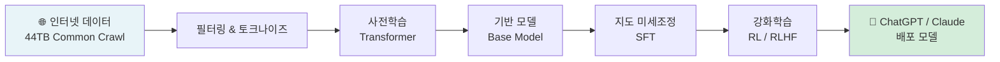
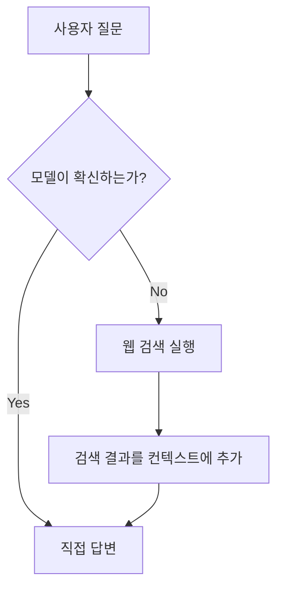

## 들어가며

> "LLMs are a fundamentally new kind of computer. They don't run code—they run thought."
> — Andrej Karpathy

2025년 2월, Andrej Karpathy가 3시간 31분짜리 강의를 YouTube에 공개했습니다. 제목은 **"Deep Dive into LLMs like ChatGPT"**. Tesla AI 전 디렉터이자 OpenAI 공동 창업자인 그가, LLM이 어떻게 만들어지고 작동하는지 **일반 청중을 위해** 처음부터 끝까지 풀어낸 강의입니다.

단순한 개론이 아닙니다. 사전학습 데이터 파이프라인부터 RLHF까지, 현존하는 LLM 강의 중 가장 체계적이고 밀도 높은 내용을 담고 있습니다. ChatGPT를 쓰는 사람이라면 누구나 봐야 할 강의라고 해도 과언이 아닙니다.

---

## 강의 영상



---

## 강의 전체 구조

이 강의는 크게 세 파트로 나뉩니다.

| 파트 | 주제 | 핵심 질문 |
|---|---|---|
| **Part 1** | 사전학습 (Pretraining) | LLM은 어떻게 세상을 배우는가? |
| **Part 2** | 지도 미세조정 (SFT) & LLM 심리학 | 기반 모델은 어떻게 어시스턴트가 되는가? |
| **Part 3** | 강화학습 (RL / RLHF) | 모델은 어떻게 인간의 기대를 넘어서는가? |



---

## Part 1: 사전학습(Pretraining) — LLM이 세상을 배우는 방법

### 1-1. 데이터: 인터넷을 통째로 먹는다

사전학습의 시작은 **방대한 텍스트 수집**입니다. Common Crawl이 크롤링한 수십억 개의 웹페이지가 원재료입니다. 하지만 그냥 쓸 수 없습니다. 다음 과정을 거칩니다.

| 단계 | 작업 | 목적 |
|---|---|---|
| URL 필터링 | 악성/스팸 도메인 제거 | 품질 보장 |
| HTML 추출 | 텍스트만 분리 | 노이즈 제거 |
| 언어 필터링 | 목표 언어 집중 | 효율 향상 |
| 중복 제거 | 반복 콘텐츠 삭제 | 다양성 확보 |
| PII 제거 | 개인정보 제거 | 프라이버시 |

최종 결과물인 **FineWeb** 같은 고품질 데이터셋은 약 **44테라바이트** 규모입니다.

### 1-2. 토크나이즈: 텍스트를 숫자로

컴퓨터는 텍스트를 직접 처리할 수 없습니다. **Byte Pair Encoding(BPE)**으로 텍스트를 토큰으로 변환합니다.

- 자주 등장하는 바이트 쌍을 반복적으로 합쳐 새 토큰 생성
- GPT-4 기준 어휘 크기: 약 **100,277개 토큰**
- 단어 → 토큰 → 정수 인덱스로 변환

> 예: `"ChatGPT"` → `["Chat", "G", "PT"]` → `[9693, 38, 2418]`

### 1-3. Transformer: 다음 토큰 예측으로 세상을 배우다

Transformer 신경망은 단 하나의 목표를 반복합니다: **다음 토큰을 예측하라.**

- 컨텍스트 윈도우(수천 개의 토큰)를 받아 다음 토큰의 확률 분포를 출력
- 수십억 개의 파라미터가 역전파(backpropagation)로 조정됨
- 수조 개의 토큰을 학습하면서 언어 패턴과 세계 지식을 흡수

### 1-4. 추론: 확률로 생각하는 기계

학습이 끝난 모델은 **확률 분포에서 샘플링**해 텍스트를 생성합니다. 결정론적이지 않습니다. 같은 입력에 다른 출력이 나오는 이유가 여기에 있습니다. 이 확률적 특성이 창의성의 원천이기도 하지만, **환각(hallucination)**의 씨앗이기도 합니다.

### 1-5. 학습 비용의 민주화

| 시점 | 모델 | 학습 비용 |
|---|---|---|
| 2019년 | GPT-2 원본 | ~$40,000 |
| 2025년 | GPT-2 재현 (llm.c) | ~$672 |
| 최적화 후 | GPT-2 재현 | ~$100 목표 |

Karpathy는 자신이 직접 만든 **llm.c**로 GPT-2를 672달러에 재현했습니다. 2019년 대비 60분의 1 수준으로 비용이 떨어진 것입니다.

> 기반 모델은 결국 **"비싼 자동완성 시스템"**입니다. 세상을 압축해 담았지만, 사람과 대화하는 어시스턴트가 되려면 추가 과정이 필요합니다.

---

## Part 2: 지도 미세조정(SFT) & LLM 심리학

### 2-1. 기반 모델 → 어시스턴트로

기반 모델 단계에서는 사전학습 데이터를 그대로 따라합니다. 이를 어시스턴트로 변환하려면 **대화 데이터셋**으로 미세조정합니다.

```
<|im_start|>user
파이썬에서 리스트를 정렬하는 방법은?
<|im_end|>
<|im_start|>assistant
list.sort() 또는 sorted(list)를 사용합니다...
<|im_end|>
```

특수 토큰(`<|im_start|>`, `<|im_end|>`)이 역할(user/assistant)을 구분합니다. 사전학습 때는 없던 이 토큰들이 SFT에서 처음 등장합니다.

### 2-2. 환각(Hallucination): LLM의 원죄

환각은 LLM이 **자신 있게 틀린 정보를 생성**하는 현상입니다. 원인은 명확합니다.

- 모델은 항상 답을 내놓도록 훈련됩니다
- 불확실한 상황에서도 "모른다"고 하면 패널티를 받는 구조
- 결과: 틀렸어도 자신감 있게 답하는 습관이 형성

**완화 방법 (Meta 접근법)**:
1. 학습 데이터에서 스니펫 추출
2. 사실 기반 질문 생성
3. 모델 응답을 원본과 비교 평가
4. 불확실할 때 "모른다"고 답하도록 재훈련

### 2-3. 토큰으로 생각하기 (Thinking in Tokens)

> "Models need tokens to think."

LLM은 토큰을 생성하면서 생각합니다. 한 번에 답을 내놓으면 정확도가 떨어집니다. 단계별로 나눠 생각하게 하면(Chain-of-Thought) 성능이 크게 향상됩니다.

```
❌ "12 × 17은?" → "204" (한 토큰으로 즉답 → 오류 가능)
✅ "12 × 17은?" → "12 × 10 = 120, 12 × 7 = 84, 합산하면 204" (단계별 → 정확)
```

### 2-4. Jagged Intelligence (들쑥날쑥한 지능)

LLM은 놀랍도록 불균형한 능력을 보입니다.

| 잘하는 것 | 못하는 것 |
|---|---|
| 복잡한 코드 작성 | 단어의 철자 개수 세기 |
| 법률 문서 분석 | 간단한 나눗셈 |
| 다국어 번역 | 문자열 역순 출력 |
| 시 창작 | "r이 몇 개?" 세기 |

이 불균형은 **토큰 단위 처리 방식** 때문입니다. 문자 수준의 연산은 토큰화 과정에서 정보가 손실됩니다.

### 2-5. 툴 사용: 환각을 줄이는 실용적 해법

모델은 웹 검색이나 코드 실행을 도구로 활용하도록 학습할 수 있습니다.



불확실한 것을 지어내는 대신 외부 도구로 검색해 컨텍스트에 추가합니다. 환각을 근본적으로 줄이는 구조입니다.

---

## Part 3: 강화학습(RL / RLHF) — 인간의 한계를 넘어서

### 3-1. 강화학습: 시행착오로 스스로 성장

SFT는 인간의 시범을 모방합니다. RL은 다릅니다.

- 모델이 여러 해법을 시도
- 정답과 비교해 맞으면 유지, 틀리면 폐기
- **인간 개입 없이** 대규모로 반복

이 방식은 인간이 직접 레이블링한 데이터의 품질 상한을 넘어설 수 있습니다.

### 3-2. DeepSeek-R1: "아하 모먼트"의 창발

DeepSeek이 공개한 RL 기법의 핵심 발견은 **창발적 전략**입니다.

모델은 RL 과정에서 훈련 데이터에 없던 전략을 스스로 발견합니다. 특히 복잡한 수학 문제를 풀 때, 학습 중 자신의 추론을 되돌아보는 **자기 검증(self-verification)** 행동이 자연스럽게 나타났습니다.

Karpathy는 이를 **"아하 모먼트"**라고 부릅니다. 인간이 가르치지 않았는데 모델 스스로 발견한 통찰입니다.

### 3-3. AlphaGo의 교훈: AI는 인간을 넘어설 수 있다

```
AlphaGo의 37번째 수(Move 37)
→ 인간이 1만 번 중 1번 선택할 법한 수
→ 결국 최선의 수로 판명
```

Karpathy는 DeepSeek-R1의 창발적 추론 전략을 AlphaGo의 Move 37에 비유합니다. RL로 학습한 LLM은 인간이 설계하지 않은 전략을 발견하고, 그것이 최적일 수 있습니다.

### 3-4. RLHF: 주관적 영역을 정복하다

수학 문제처럼 정답이 명확한 경우 RL이 쉽습니다. 하지만 "재미있는 농담", "좋은 시"처럼 정답이 없는 영역은?

**RLHF(Reinforcement Learning from Human Feedback)**:
1. 모델이 여러 응답 생성
2. 인간이 선호 순위 평가
3. **보상 모델(Reward Model)**이 인간 선호를 학습
4. 보상 모델이 심판 역할로 RL 진행

| 장점 | 한계 |
|---|---|
| 주관적 품질 향상 | 보상 모델은 시뮬레이션일 뿐 |
| 대규모로 확장 가능 | 적대적 예시로 속을 수 있음 |
| 인간 평가 비용 절감 | 수백 번 이상 반복 시 과최적화 |

---

## 핵심 인사이트

### 인사이트 1: LLM은 심리적 존재다

Karpathy는 LLM을 **"심리적 존재(psychological entity)"**로 다뤄야 한다고 말합니다. 모델이 어떤 맥락에서 자신감을 갖는지, 어디서 불확실해지는지를 이해하면 훨씬 효과적으로 활용할 수 있습니다. LLM과의 상호작용은 프로그래밍이 아니라 커뮤니케이션에 가깝습니다.

### 인사이트 2: 학습 비용 민주화의 의미

GPT-2 수준의 모델을 $672로 재현할 수 있다는 것은, AI 연구가 더 이상 빅테크만의 영역이 아님을 의미합니다. 개인 연구자, 스타트업, 심지어 학생도 LLM 실험이 가능한 시대가 왔습니다.

### 인사이트 3: 추론 모델의 등장은 필연적이다

SFT만으로는 인간 전문가의 수준을 모방하는 데 그칩니다. RL이 더해지면 모델은 인간이 명시하지 않은 전략을 스스로 발견합니다. DeepSeek-R1, OpenAI o1/o3가 이 방향입니다. 앞으로 RL 기반 추론 모델이 LLM의 주류가 될 것입니다.

### 인사이트 4: 언제 LLM을 믿고 언제 검증해야 하는가

```
신뢰해도 되는 경우:
✅ 잘 알려진 사실 (검증 가능한 영역)
✅ 코드 작성 (직접 실행으로 검증)
✅ 요약 / 재구성 (원본 대조 가능)

반드시 검증해야 하는 경우:
⚠️ 특정 날짜/수치/출처 인용
⚠️ 의료/법률 판단
⚠️ 최신 정보 (학습 컷오프 이후)
```

### 인사이트 5: 미래는 멀티모달 에이전트

Karpathy는 LLM의 다음 단계를 이렇게 전망합니다:
- **멀티모달**: 텍스트, 오디오, 이미지를 동시에 처리
- **에이전트**: 장기 작업을 자율적으로 수행
- **컴퓨터 사용**: 소프트웨어와 직접 상호작용
- **테스트 타임 훈련**: 실시간으로 새로운 정보를 학습

---

## 마무리: 실용적 활용 가이드

이 강의의 진짜 가치는 LLM을 **블랙박스에서 이해 가능한 시스템**으로 바꿔준다는 점입니다. 작동 원리를 알면 활용이 달라집니다.

**지금 바로 시작할 수 있는 것들:**

| 목적 | 추천 도구 |
|---|---|
| 최신 모델 순위 확인 | LM Arena (Chatbot Arena) |
| 프로프라이어터리 모델 사용 | OpenAI, Google Gemini, Anthropic Claude |
| 오픈 가중치 모델 사용 | DeepSeek, Meta Llama |
| 로컬 실행 | Ollama, LM Studio |
| 기반 모델 직접 실험 | Hyperbolic |

---

> Karpathy의 강의는 단순한 기술 설명이 아닙니다. LLM이라는 새로운 종류의 컴퓨터를 어떻게 이해하고, 어떻게 한계를 다루고, 어떻게 활용해야 하는지에 대한 **사용 설명서**입니다. 3시간 31분이 결코 길지 않게 느껴질 것입니다.
