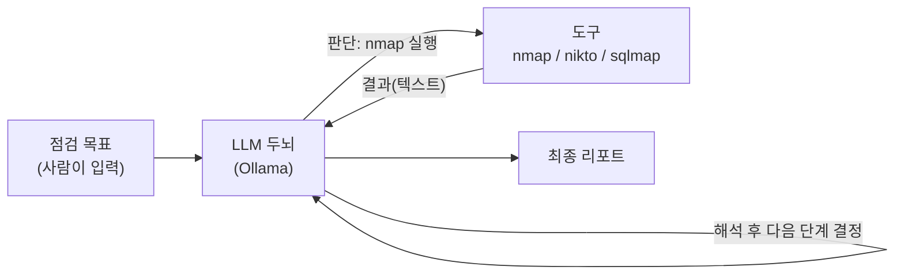
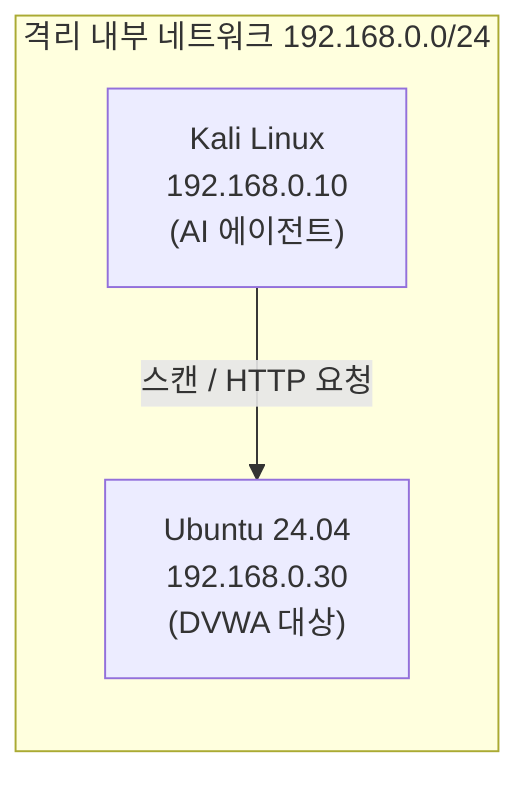

# AI로 웹 취약점 점검 자동화하기 — 시리즈 시작

앞선 **[Web Security Lab]** 시리즈에서는 DVWA를 대상으로 SQL Injection, XSS, Command Injection 같은 취약점을 **사람이 직접 손으로** 점검했다.  
이번 **[AI 보안 자동화 Lab]** 시리즈에서는 그 작업을 **AI 에이전트(AI Agent)**가 스스로 판단해서 수행하도록 만든다.

작은 부품 하나에서 출발해, 매 강의마다 "이전에 만든 것 + 새 부품 하나"를 더해 가며, 마지막에는 **스스로 점검하고 리포트까지 쓰는 자율 에이전트**를 완성한다.

> **🎯 이 시리즈를 왜 하나요?**  
> 한마디로 **"공격을 알아야 잘 막을 수 있기 때문"**이에요. 요즘은 공격자도 AI를 써서 빠르게 약점을 찾아요. 그래서 우리도 그 방법을 직접 만들어 보면서 *"내 서버라면 어디를 먼저 막아야 할까?"*를 몸으로 익히는 거예요. 걱정 마세요 — 어려운 부분은 강의마다 하나씩, 천천히 같이 풀어 갈 거예요.
{: .prompt-info }

이 포스트에서는 다음을 다룬다.

1. 왜 지금, AI로 점검을 자동화하는가 (2026년의 맥락)
2. AI 에이전트란 무엇인가 (그리고 무엇이 *아닌지*)
3. 도구(Tool)란 무엇인가
4. 우리가 만들 도구의 전체 그림
5. 실습 환경 구성 (VirtualBox 격리 랩)
6. 어떤 LLM을 쓸 것인가 — "작게 검증, 크게 확장"
7. 윤리·법적 전제와 방어자의 사전 조건
8. 전체 로드맵 (13강)

---

## 1. 왜 지금, AI로 점검을 자동화하는가 (2026)

먼저 가장 중요한 질문부터 짚는다. **"왜 굳이 점검을 자동화하는가?"**  
2026년 현재의 보안 환경을 보면 답이 분명해진다.

**① 공격자가 이미 자동화·AI를 쓰고 있다.**  
과거 정찰→취약점 분석→공격은 숙련된 사람의 수작업이었다. 지금은 공격자도 LLM과 자동화 도구로 **정찰과 초기 침투를 대량·고속으로** 수행한다. 새 취약점이 공개되면 **수 시간 내**에 인터넷 전역에서 자동 스캐닝이 관측된다. 방어자가 사람 손으로만 점검하면 이 속도를 따라갈 수 없다.

**② 웹 애플리케이션은 여전히 가장 흔한 침해 경로다.**  
클라우드·API·마이크로서비스가 늘면서 **공격 표면(attack surface)**은 오히려 커졌다. OWASP Top 10의 주제(인젝션, 인증 실패, 접근통제 결함 등)는 2026년에도 그대로 유효하다. 점검해야 할 대상이 많아질수록, 사람만으로는 **반복 점검을 자주 돌릴 수 없다.**

**③ "한 번 점검"이 아니라 "계속 점검"이 표준이 됐다.**  
코드는 매일 배포된다(DevSecOps/CI·CD). 어제 안전했던 앱이 오늘 배포로 취약해질 수 있다. 그래서 점검은 **연 1회 이벤트가 아니라 상시 반복 작업**이어야 한다. 반복 작업이야말로 자동화가 가장 빛나는 영역이다.

**④ 규제·컴플라이언스가 정기 점검을 요구한다.**  
개인정보·금융·의료 등 다수 영역에서 **정기 취약점 점검과 그 기록(증적)**을 의무화한다. 자동화는 점검뿐 아니라 **로그·리포트라는 증적 생산**까지 함께 해결한다.

> **이 시리즈의 입장**: AI 자동화는 사람을 대체하는 것이 아니라, **사람이 넓게·자주 점검하도록 돕는 보조 도구**다. AI가 빠르게 1차로 훑고, 사람이 깊게 검증·판단한다. 공격자가 자동화로 무장한 시대에, **방어자도 같은 무기를 이해하고 있어야** 한다.
{: .prompt-info }

---

## 2. AI 에이전트란 무엇인가

"AI가 해킹한다"고 하면 영화처럼 AI가 키보드를 두드려 시스템을 뚫는 장면을 떠올리기 쉽다.  
실제로 우리가 만드는 것은 훨씬 단순하고 명확하다.

> **AI 에이전트 = LLM(두뇌) + 도구 호출(손발)**
{: .prompt-info }

- **LLM(두뇌)**: 상황을 읽고 "다음에 무엇을 할지" 판단한다. 직접 공격하지 못한다. 글자만 출력할 뿐이다.
- **도구(손발)**: 실제 작업은 Kali에 이미 깔려 있는 보안 도구(`nmap`, `nikto`, `sqlmap` 등)가 한다.

즉 AI는 **"어떤 도구를 어떤 인자로 실행할지" 결정하고, 그 결과를 해석**하는 역할이다.  
실제 스캔·요청은 우리가 잘 아는 기존 도구가 그대로 수행한다.



우리는 결국 이 그림의 **화살표 하나하나를 코드로 연결**하는 작업을 한다.

---

## 3. 도구(Tool)란 무엇인가

이 시리즈의 핵심 단어가 **도구(Tool)**다. 처음 보는 개념이니 분명히 짚고 간다.

LLM 자체는 **글자를 생성하는 능력**만 있다. 인터넷에 접속하거나, 포트를 스캔하거나, 파일을 읽는 능력은 **없다.** 그래서 LLM에게 바깥세상과 상호작용할 **손발**을 붙여 주는데, 그 손발 하나하나를 **도구(Tool)**라고 부른다.

> **도구(Tool)** = LLM이 호출할 수 있는 **하나의 기능**.  
> 예) "이 IP를 포트 스캔하는 기능", "이 URL에 HTTP 요청을 보내는 기능".  
> 각 도구는 (1) **이름**, (2) **설명**(언제 쓰는지), (3) **필요한 입력**을 갖는다.
{: .prompt-info }

도구가 동작하는 방식의 핵심은 다음 한 문장이다.

> **LLM은 도구를 "직접 실행"하지 않는다. "이 도구를 이렇게 실행해 달라"는 요청(지시서)만 만든다. 실제 실행은 항상 우리 코드가 한다.**
{: .prompt-warning }

이 구조가 **보안적으로 매우 중요**하다. 통제권이 항상 사람(우리 코드)에게 있기 때문이다. LLM이 위험한 도구를 부르려 해도, 우리 코드가 **허락한 도구만, 검사한 뒤에** 실행한다. 이 "도구 호출(Tool Calling)" 메커니즘은 04강에서 코드로 직접 만든다.

요즘은 이 도구 연결을 표준화한 **MCP(Model Context Protocol)**도 널리 쓰인다. 우리 점검 도구를 MCP로 패키징해 다른 AI 클라이언트에서 재사용하는 법은 10강에서 다룬다.

---

## 4. 우리가 만들 도구의 전체 그림

최종 결과물은 다음 한 줄 명령에 반응하는 프로그램이다.

```text
$ python agent.py "192.168.0.30 의 DVWA를 점검하고 리포트를 써줘"
```

그러면 에이전트가 스스로:

1. **정찰** — 어떤 포트가 열려 있고 어떤 웹 기술을 쓰는지 파악 (`nmap`, `whatweb`)
2. **탐색** — 숨은 경로/페이지 찾기 (`gobuster`)
3. **스캔** — 알려진 웹 취약점 점검 (`nikto`)
4. **검증** — SQL Injection / XSS / Command Injection 실제 시도 (`sqlmap`, 직접 요청)
5. **리포트** — 발견 내용을 Markdown 문서로 정리

이 전부를 한 번에 만들지 않는다. **강의마다 한 단계씩** 붙여 나간다.

---

## 5. 실습 환경 — VirtualBox 격리 랩

모든 실습은 **VirtualBox 안에서, 외부 인터넷과 분리된 내부 네트워크**에서만 진행한다.  
이렇게 하면 실수로라도 외부 시스템을 건드릴 수 없다.

| 역할 | OS | IP 주소 | 용도 |
|---|---|---|---|
| 공격자(에이전트) 머신 | Kali Linux | **192.168.0.10** | LLM + 보안 도구 + 우리가 만들 코드 |
| 점검 대상 서버 | Ubuntu 24.04 LTS | **192.168.0.30** | Apache2 + PHP + MariaDB + DVWA |



> 이전 **[Web Security Lab] 00. DVWA 실습 환경 구축** 포스트에서 만든 환경을 그대로 재사용한다.  
> 아직 환경이 없다면 그 포스트를 먼저 따라 해 DVWA가 `http://192.168.0.30/DVWA` 에서 열리는지 확인한다.  
> (이 시리즈는 대상 서버를 **Ubuntu 24.04**로 가정한다.)
{: .prompt-tip }

---

## 6. 어떤 LLM을 쓸 것인가 — "작게 검증, 크게 확장"

핵심 원칙은 이것이다.

> **처음에는 가장 작은 모델로 "구조가 동작하는지"만 검증한다.  
> 구조가 완성되면, 모델만 좋은 것으로 바꿔 끼우면 된다.**
{: .prompt-info }

우리가 만드는 것은 **모델 교체가 자유로운 구조**다. 모델은 부품일 뿐이다.  
그래서 검증 단계에서는 가벼운 **작은 모델**로 빠르게 확인하고, 성능이 필요하면 더 큰 모델로 교체한다.

| 단계 | 모델 | 크기(대략) | 용도 |
|---|---|---|---|
| 검증용(소형) | `qwen2.5:0.5b` ~ `qwen2.5:3b` | 0.4 ~ 2 GB | 구조가 도는지 빠르게 확인 |
| 실사용(범용) | `qwen2.5:7b`, `llama3.1:8b` | 5 ~ 8 GB | 판단 품질이 필요할 때 |
| 보안 특화 | `whiterabbitneo`, `dolphin-mistral` | 4 ~ 8 GB | 범용 모델이 거부하는 점검 작업 수행 |

**왜 보안 특화 모델이 필요한가?**  
범용 모델에게 "SQL Injection 페이로드를 만들어줘"라고 하면 안전 정책 때문에 **거부(refusal)**하는 경우가 많다. 실습 랩에서조차 작업을 멈춰버린다.  
보안 특화 모델은 이런 점검 작업을 수행하도록 튜닝되어 있어, **승인된 랩 환경**에서 막힘 없이 쓸 수 있다. 이 차이는 02강과 08강에서 직접 비교한다.

> 보안 특화·무검열(uncensored) 모델은 **격리된 실습 랩에서만** 사용한다.  
> 이런 모델을 외부 대상에 쓰는 것은 이 시리즈의 목적이 아니며, 법적 책임은 사용자에게 있다.
{: .prompt-warning }

---

## 7. 윤리·법적 전제와 방어자의 사전 조건

### 7.1 윤리·법적 전제

> 자동화 점검 도구는 **본인이 소유했거나 명시적 점검 동의를 받은 대상**에만 사용한다.  
> 이 시리즈의 모든 실습은 **VirtualBox 내부의 본인 소유 DVWA(192.168.0.30)** 한 대만을 대상으로 한다.  
> 동의 없이 타인의 시스템에 자동 점검 도구를 실행하는 것은 **정보통신망법 위반**이며 처벌 대상이다.
{: .prompt-danger }

자동화 도구는 사람보다 훨씬 빠르고 많은 요청을 보낸다. 그래서 **"실수의 규모"도 크다.**  
그만큼 9강에서 다룰 **안전장치(가드레일)**를 처음부터 의식하며 만든다.

### 7.2 방어자의 사전 조건 (Blue Team Prerequisites)

이 시리즈는 공격(점검) 자동화를 만들지만, **목적은 방어**다. 공격을 자동화해 보는 이유는, 방어자가 **그 공격이 어떤 흔적을 남기는지** 알아야 막을 수 있기 때문이다.  
그래서 점검 대상 서버(192.168.0.30)에는 다음과 같은 **방어자의 사전 조건**이 갖춰져 있어야 한다. 이것이 갖춰져야 12강에서 "자동 공격하면 이렇게 된다"를 **로그로 직접 관찰**할 수 있다.

| 사전 조건 | 이유 |
|---|---|
| 웹 서버 **접근 로그** 활성화 (`/var/log/apache2/access.log`) | 스캔·공격 요청을 기록 |
| 웹 서버 **에러 로그** 활성화 (`error.log`) | 비정상 요청·오류 흔적 |
| 시스템 **시각 동기화**(NTP) | 공격 시각과 로그 시각 대조 |
| (선택) **WAF/IDS** 또는 로그 수집기 | 탐지·경보 실습 |

> 각 취약점 강의(06~08)에서도 해당 취약점에 대한 **방어자의 사전 조건**을 항목별로 명시한다. 공격 실습이 끝나면 항상 "방어자라면 무엇을 준비하고, 무엇을 봤어야 하는가"로 마무리한다.
{: .prompt-tip }

---

## 8. 전체 로드맵 (13강)

| 강의 | 제목 | 핵심 |
|---|---|---|
| **00** | 시리즈 개요 (이 포스트) | 전체 그림, 왜 자동화하는가 |
| **01** | 랩 준비 & 연결 확인 | 환경 점검, Python 준비 |
| **02** | Ollama 설치 & 작은 LLM 실행 | 로컬 LLM 구동, 보안 모델 |
| **03** | Python으로 LLM에게 말 걸기 | LLM API 호출 |
| **04** | 첫 도구 연결 — AI가 nmap 호출 | **Tool Calling(도구 호출)** |
| **05** | 정찰 자동화 | 도구 여러 개 + 결과 구조화 |
| **06** | 웹 취약점 스캔 | nikto 통합, 우선순위 선별 |
| **07** | SQL Injection 자동 점검 | sqlmap 연동 |
| **08** | XSS / Command Injection | 페이로드 생성·검증 |
| **09** | 자율 에이전트 + 가드레일 | 자율 루프, 안전장치 |
| **10** | 자동 리포트 + MCP 패키징 | 리포트 생성, 재사용 |
| **11** | 오케스트레이션 & 실행 로그 | 파이프라인 지휘, 점검 로그 |
| **12** | 자동 공격의 흔적 — 보안 로그와 방어자 탐지 | **"자동 공격하면 이렇게 된다"**, Blue Team |
| **13** | Red Team / Blue Team / Purple Team | 실전 맥락과 책임 |

> 05~10이 **공격(점검) 자동화**라면, 11~13은 그것을 **방어와 실전 운영의 맥락**에 놓는다. 공격을 만들 줄 아는 사람이, 그 공격이 로그에 어떻게 남고 어떻게 탐지되는지까지 알아야 진짜 보안 전문가다.
{: .prompt-info }

---

## 9. 다음 강의 예고

다음 **01강**에서는 본격적인 코딩에 들어가기 전에,  
- 두 가상머신(Kali ↔ Ubuntu)이 제대로 통신하는지 확인하고,
- 앞으로 코드를 작성할 **Python 작업 환경**을 Kali에 준비한다.

작은 것부터, 하나씩. 그럼 시작해 보자.
