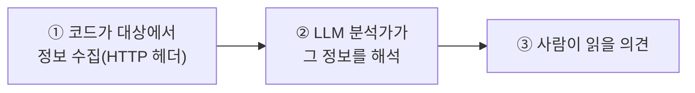
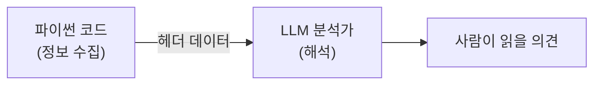

# 파이썬으로 LLM에게 말 걸기

지난 02강에서 우리는 두뇌(Ollama + 모델)를 Kali에 설치했다.  
하지만 지금까지는 터미널에 `ollama run`을 쳐서 **사람이 직접** 말을 걸었다.

> 자동화란 무엇인가? **사람이 반복하던 일을 프로그램이 대신하는 것**이다.  
> 따라서 우리의 첫걸음은, 사람 대신 **우리가 만든 파이썬 프로그램이 LLM에게 말을 걸게** 하는 것이다.
{: .prompt-info }

이번 강의는 이 시리즈에서 **처음으로 진짜 코드를 한 줄씩 작성**하는 시간이다.  
서두르지 말고, 코드 블록 아래의 **"한 줄씩 뜯어보기"**를 꼭 같이 읽자.

다룰 내용:

1. 준비 — 라이브러리란 무엇인가
2. LLM에게 첫 질문 보내기 (코드 해부)
3. 대화의 구조 — 역할(role) 이해하기
4. 모델에게 "성격"을 부여하기 (system 메시지)
5. 실전 — 대상 서버 정보를 LLM에게 해석시키기

---

## 1. 준비 — 라이브러리란 무엇인가

먼저 01강에서 만든 작업 폴더로 가서 가상환경을 켠다.

```bash
cd ~/ai-pentest-lab
source venv/bin/activate
```

> 프롬프트 맨 앞에 `(venv)`가 보여야 한다. 안 보이면 위 두 줄을 다시 실행한다.  
> 이 시리즈의 모든 코딩은 **항상 이 상태에서** 시작한다.
{: .prompt-tip }

이제 **라이브러리(library)**를 하나 설치한다.

```bash
pip install ollama
```

> **라이브러리란?**  
> 남이 미리 만들어 둔 **편리한 도구 모음**이다. 우리가 직접 "Ollama 서버에 HTTP 요청을 보내고, 응답 JSON을 해석하는" 복잡한 코드를 짤 필요 없이, `ollama` 라이브러리가 그 일을 대신해 준다.  
> `pip`은 파이썬 라이브러리를 설치하는 프로그램이고, `pip install 이름` 형식으로 쓴다.
{: .prompt-info }

---

## 2. LLM에게 첫 질문 보내기

텍스트 편집기로 `ask.py`라는 파일을 만든다.

```bash
nano ask.py
```

아래 내용을 그대로 입력하고 저장한다(`Ctrl+O` → `Enter` → `Ctrl+X`).

```python
# ask.py — 파이썬으로 LLM에게 질문하기
import ollama

response = ollama.chat(
    model="qwen2.5:3b",
    messages=[
        {"role": "user", "content": "포트 스캔이 뭔지 한 문장으로 설명해줘."}
    ],
)

print(response["message"]["content"])
```

실행한다.

```bash
python3 ask.py
```

**예상 결과** (문장은 매번 조금씩 다르다):

```text
포트 스캔은 대상 시스템에서 어떤 포트가 열려 있는지 확인해 실행 중인
서비스를 파악하는 정찰 기법입니다.
```

### 한 줄씩 뜯어보기

이 짧은 코드 안에 중요한 개념이 여러 개 들어 있다. 천천히 보자.

```python
import ollama
```
- **`import`**는 "이 라이브러리를 가져와 쓰겠다"는 선언이다. 방금 `pip install`로 깐 `ollama`를 불러온다.

```python
response = ollama.chat( ... )
```
- **`ollama.chat(...)`** 은 "ollama 라이브러리의 `chat`이라는 기능을 실행하라"는 뜻이다. 이게 실제로 LLM에게 질문을 보내는 부분이다.
- **`response = ...`** 는 그 결과(LLM의 답변)를 `response`라는 **상자(변수)**에 담는다는 뜻이다. `=`는 수학의 "같다"가 아니라 **"오른쪽 결과를 왼쪽 상자에 넣어라"**라는 명령이다.

```python
    model="qwen2.5:3b",
```
- 어떤 모델에게 물을지 지정한다. 02강에서 받은 모델 이름과 **정확히** 같아야 한다.

```python
    messages=[
        {"role": "user", "content": "포트 스캔이 뭔지 한 문장으로 설명해줘."}
    ],
```
- **`messages`** 는 LLM에게 보내는 대화 내용이다. 잠깐 새 문법 두 개를 짚자.
  - **`[ ... ]` 대괄호 = 리스트(list)**: 여러 개를 순서대로 담는 상자. 지금은 메시지가 하나뿐이라 안에 항목이 하나다.
  - **`{ "키": "값" }` 중괄호 = 딕셔너리(dictionary)**: "이름표(키)에 값을 붙여" 정보를 담는 상자. 여기서는 `role`(누가 말했나)과 `content`(무슨 말인가) 두 정보를 묶었다.
- 즉 이 줄의 뜻은 **"`user`(사용자)가 '포트 스캔이 뭐야'라고 말했다"** 한 건을 LLM에게 전달하는 것이다.

```python
print(response["message"]["content"])
```
- **`print(...)`** 는 괄호 안의 값을 화면에 출력한다.
- **`response["message"]["content"]`** — LLM의 답변은 여러 정보가 딕셔너리로 겹겹이 들어 있다. 그중에서 우리가 원하는 **실제 답변 글자**만 꺼내는 과정이다.
  - `response["message"]` → 응답 중 "메시지" 부분을 꺼낸다.
  - 다시 그 안에서 `["content"]` → "내용(글자)" 부분을 꺼낸다.
  - 딕셔너리에서 값을 꺼낼 때 **`["키이름"]`** 을 쓴다고 기억하자.

> **흔한 오류 ①**: `ollama._types.ResponseError: model 'qwen2.5:3b' not found`  
> → 모델을 안 받았다는 뜻이다. `ollama pull qwen2.5:3b`로 먼저 내려받자.  
> **흔한 오류 ②**: `ConnectionError` / 응답이 멈춤  
> → Ollama 서버가 안 켜진 것이다. 다른 터미널에서 `ollama serve`를 실행해 두자.
{: .prompt-warning }

---

## 3. 대화의 구조 — 역할(role) 이해하기

방금 메시지에 `"role": "user"`가 있었다. 이 **역할(role)**이 LLM 대화의 핵심 개념이다.

사람의 대화를 떠올려 보자. 누가 말했는지 알아야 대화가 이어진다. LLM도 똑같다.  
역할은 세 가지가 있다.

| 역할 | 누구인가 | 비유 |
|---|---|---|
| `system` | 모델에게 주는 **지침·성격** | 배우에게 주는 **배역 설명서** |
| `user` | 사람(또는 우리 코드)의 질문 | **관객의 질문** |
| `assistant` | 모델의 답변 | **배우의 대사** |

핵심은 **`system`** 이다. 영화 촬영 전에 배우에게 "당신은 냉정한 형사 역입니다"라고 일러두면, 모든 대사가 그 배역에 맞게 나온다.  
마찬가지로 LLM에게 `system` 메시지로 **"너는 보안 분석가다"**라고 일러두면, 이후 답변이 전부 그 관점으로 일관되게 나온다.

> **왜 중요한가?**  
> 우리가 만들 것은 "포트 스캔이 뭐야?" 같은 잡담 봇이 아니라 **보안 점검 에이전트**다.  
> 모델이 매번 보안 분석가처럼 일관되게 답하게 하려면, 그 "배역"을 `system`으로 고정해야 한다.
{: .prompt-info }

---

## 4. 모델에게 "성격"을 부여하기

이제 모델을 **웹 보안 점검 분석가**로 설정해 보자. `analyst.py` 파일을 만든다.

```python
# analyst.py — 보안 분석가 역할을 부여한 LLM 호출
import ollama

SYSTEM_PROMPT = """너는 웹 모의해킹 실습을 돕는 보안 점검 분석가다.
- 대상은 격리된 실습 랩(192.168.0.30)의 DVWA뿐이다.
- 답변은 간결하게 하고, 근거가 되는 관찰 사실을 함께 제시한다.
- 모르는 것은 추측하지 말고 모른다고 말한다."""

def ask_analyst(question):
    response = ollama.chat(
        model="qwen2.5:3b",
        messages=[
            {"role": "system", "content": SYSTEM_PROMPT},
            {"role": "user", "content": question},
        ],
    )
    return response["message"]["content"]

if __name__ == "__main__":
    answer = ask_analyst("Apache 2.4.58 서버를 봤을 때 점검에서 가장 먼저 확인할 것은?")
    print(answer)
```

실행한다.

```bash
python3 analyst.py
```

**예상 결과** (요지):

```text
가장 먼저 노출된 버전 정보와 활성 모듈, 디렉터리 인덱싱 노출 여부,
그리고 호스팅 중인 애플리케이션(DVWA)의 로그인 경로를 확인해야 합니다.
```

### 한 줄씩 뜯어보기

이번엔 두 가지 새 개념이 등장했다. **변수에 긴 글 담기**와 **함수 만들기**다.

```python
SYSTEM_PROMPT = """ ... 여러 줄 ... """
```
- 따옴표 세 개(`"""`)로 감싸면 **여러 줄짜리 긴 글**을 변수에 담을 수 있다.
- 이렇게 배역 설명서를 변수 하나에 넣어 두면, 나중에 재사용하거나 수정하기 편하다.

```python
def ask_analyst(question):
    ...
    return response["message"]["content"]
```
- **`def`** 는 **함수(function)를 정의**하는 키워드다. 함수란 **"이름 붙인 작업 묶음"**이다.
- 비유하자면, "분석가에게 질문하기"라는 작업을 `ask_analyst`라는 이름의 **버튼**으로 만든 것이다. 이제 이 버튼을 누를 때마다 같은 작업이 실행된다.
- 괄호 안의 **`question`** 은 버튼을 누를 때 **건네주는 값**(여기선 질문)이다. 이걸 **매개변수(parameter)**라고 부른다.
- **`return`** 은 함수가 작업을 끝내고 **결과를 돌려주는** 것이다. 여기선 LLM의 답변 글자를 돌려준다.

```python
if __name__ == "__main__":
    answer = ask_analyst("...")
    print(answer)
```
- **`if __name__ == "__main__":`** 은 파이썬의 관용구다. 지금은 **"이 파일을 직접 실행할 때만 아래를 돌려라"**는 뜻으로만 이해하면 충분하다. (나중에 이 파일을 다른 파일이 불러 쓸 때 아래 부분이 멋대로 실행되는 걸 막아 준다.)
- **`answer = ask_analyst("...")`** — 우리가 만든 함수 버튼을 누르고, 돌려받은 답을 `answer` 상자에 담는다.
- 함수를 한 번 만들어 두면, 질문만 바꿔 가며 **몇 번이고 재사용**할 수 있다. 이것이 자동화의 출발점이다.

---

## 5. 실전 — 대상 서버 정보를 LLM에게 해석시키기

지금까지는 LLM에게 "글로 된 질문"만 던졌다. 이제 **보안 점검다운** 일을 해 보자.  
01강에서 만든 `check_target.py`(대상에 요청을 보내 응답을 받는 부품)와, 이번 강의의 분석가를 **연결**한다.

흐름은 이렇다.



`interpret_headers.py` 파일을 만든다.

```python
# interpret_headers.py — 대상 서버 헤더를 수집해 LLM에게 해석시키기
import requests
import ollama

TARGET = "http://192.168.0.30/DVWA/login.php"

SYSTEM_PROMPT = """너는 웹 보안 점검 분석가다. 대상은 실습 랩 192.168.0.30의 DVWA다.
주어진 HTTP 응답 헤더를 보고 (1) 파악되는 기술 스택, (2) 정보 노출 위험,
(3) 다음 점검 단계를 각각 한 줄로 제시하라."""

# ── ① 코드가 대상에서 정보 수집 ─────────────────────────
resp = requests.get(TARGET, timeout=5)
headers_text = ""
for key, value in resp.headers.items():
    headers_text = headers_text + f"{key}: {value}\n"

print("[*] 수집한 응답 헤더:")
print(headers_text)

# ── ② LLM 분석가가 해석 ────────────────────────────────
result = ollama.chat(
    model="qwen2.5:3b",
    messages=[
        {"role": "system", "content": SYSTEM_PROMPT},
        {"role": "user", "content": f"다음 HTTP 응답 헤더를 분석하라:\n{headers_text}"},
    ],
)

print("[*] 분석가 의견:")
print(result["message"]["content"])
```

실행한다.

```bash
python3 interpret_headers.py
```

**예상 결과** (요지):

```text
[*] 수집한 응답 헤더:
Server: Apache/2.4.58 (Ubuntu)
X-Powered-By: PHP/8.x
Set-Cookie: PHPSESSID=...; path=/

[*] 분석가 의견:
(1) 기술 스택: Apache 2.4.58 + PHP 기반 웹앱(DVWA), 세션은 PHPSESSID 쿠키 사용
(2) 정보 노출: Server·X-Powered-By 헤더로 서버와 언어 버전이 그대로 노출됨
(3) 다음 단계: 디렉터리 탐색과 로그인 폼의 입력값 검증(SQLi/XSS) 점검
```

### 한 줄씩 뜯어보기

```python
resp = requests.get(TARGET, timeout=5)
```
- **`requests.get(...)`** 은 대상 주소로 HTTP **GET 요청**을 보내고 응답을 받아 온다. 브라우저 주소창에 URL을 치는 것과 같은 일을, 코드로 하는 것이다.
- **`timeout=5`** 는 "5초 안에 응답이 없으면 포기하라"는 안전장치다. 이게 없으면 대상이 멈췄을 때 우리 프로그램도 영원히 멈춘다.

```python
for key, value in resp.headers.items():
    headers_text = headers_text + f"{key}: {value}\n"
```
- **`for ... in ...:`** 은 **반복문**이다. "여러 개를 하나씩 꺼내 같은 작업을 반복하라"는 뜻이다.
- 응답 헤더는 `Server: Apache...`, `X-Powered-By: PHP...`처럼 **이름:값** 쌍이 여러 개다. 이걸 하나씩 꺼내(`key`, `value`) 한 줄씩 글자로 이어 붙인다.
- **`f"{key}: {value}\n"`** — 앞에 `f`가 붙은 문자열을 **f-문자열**이라 한다. 중괄호 `{ }` 안에 변수를 넣으면 그 값으로 채워진다. `\n`은 "줄 바꿈"이다.

```python
{"role": "user", "content": f"다음 HTTP 응답 헤더를 분석하라:\n{headers_text}"},
```
- 수집한 헤더 글자(`headers_text`)를 질문에 끼워 넣어 LLM에게 전달한다. **코드가 모은 실제 데이터**를 LLM에게 넘기는 순간이다.

> **점검 인사이트 — 정보 노출(Information Disclosure)**  
> `Server: Apache/2.4.58`, `X-Powered-By: PHP/8.x` 같은 헤더는, 공격자에게 **"어떤 소프트웨어의 어떤 버전을 노릴지"** 알려주는 첫 단서다.  
> 정확한 버전을 알면 그 버전의 **알려진 취약점(CVE)**을 검색해 곧장 공략할 수 있기 때문이다.  
> 그래서 실제 운영 서버에서는 이 헤더를 숨기는 것(`ServerTokens Prod`, PHP의 `expose_php = Off`)이 기본 방어다.  
> 우리는 지금 **공격자의 관점에서 이 단서를 자동으로 수집·해석**하는 흐름을 만든 것이다. 방어를 이해하려면 먼저 공격자가 무엇을 보는지 알아야 한다.
{: .prompt-info }

---

## 6. 정리 — 우리가 만든 것



이 **"수집 → 해석"** 패턴이 앞으로 모든 강의의 뼈대가 된다.  
다만 한 가지 한계가 있다. **지금은 LLM이 직접 도구를 고르지 못한다.** 우리가 코드에 "헤더를 수집하라"고 미리 박아 넣은 일만 한다.  
진짜 에이전트라면, "정보가 더 필요하면 스스로 포트 스캔을 돌리는" 판단까지 해야 한다. 그 한계를 다음 강의에서 깬다.

---

## 7. 다음 강의 예고

다음 **04강**에서는 LLM이 스스로 도구를 고르게 하는 **Tool Calling(도구 호출)**을 배운다. AI가 알아서 `nmap`을 실행하도록 만든다.
