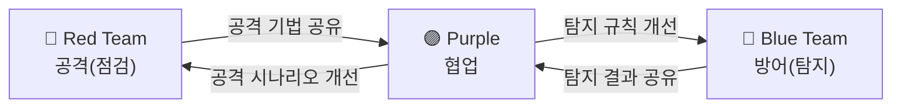
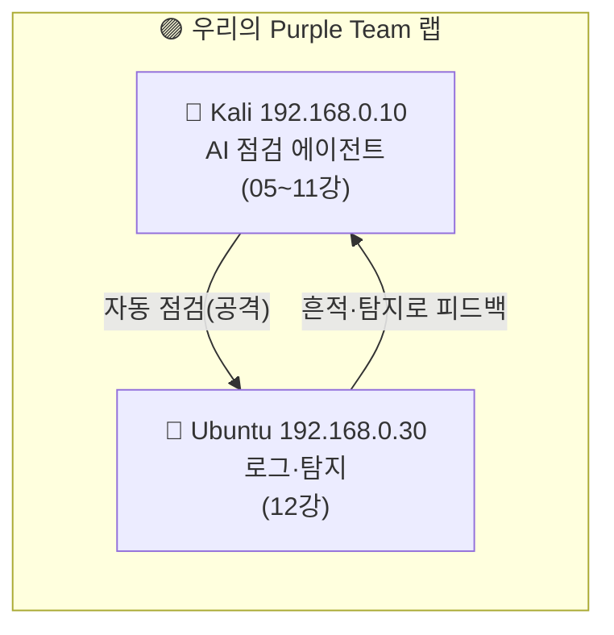

# Red Team · Blue Team · Purple Team (시리즈 마무리)

12개 강의에 걸쳐 우리는 **AI가 스스로 점검하는 도구**를 만들고(05~11), 그 점검이 **방어 로그에 어떻게 남는지**(12)까지 봤다.  
마지막 강의는 코드가 아니라 **맥락**이다. 우리가 만든 이 도구가 실제 보안 조직에서 **어디에 위치하고, 어떤 규칙 아래 쓰여야 하는가**를 정리하며 시리즈를 마친다.

> **🎯 우리가 지금 왜 이걸 하나요?**  
> 마지막으로, 우리가 만든 도구가 **실제 보안 현장 어디에 쓰이는지** 큰 그림을 그려 봐요. 똑같은 기술도 *"누가, 어떤 규칙 아래, 무슨 목적으로"* 쓰느냐에 따라 정당한 점검이 되기도 하고 불법이 되기도 해요. 기술만큼 중요한 **책임과 맥락**을 정리하면서, 여러분이 "도구를 돌리는 사람"을 넘어 "공격과 방어를 함께 사고하는 사람"으로 성장하는 걸로 시리즈를 마무리합니다.
{: .prompt-info }

다룰 내용:

1. Red / Blue / Purple Team이란
2. 우리가 만든 에이전트는 어느 팀의 도구인가
3. 2026년, AI와 Red Teaming
4. Rules of Engagement — 책임 있는 사용의 규칙
5. 우리 랩은 작은 Purple Team이었다
6. 마무리 — 무엇을 배웠고, 어디로 갈 것인가

---

## 1. Red / Blue / Purple Team이란

보안 운영은 흔히 **공격과 방어, 두 역할**로 나뉜다. 거기에 둘을 잇는 세 번째 역할이 있다.

| 팀 | 역할 | 한 문장 |
|---|---|---|
| 🔴 **Red Team** | 공격 시뮬레이션 | "실제 공격자처럼 행동해 약점을 증명한다" |
| 🔵 **Blue Team** | 방어·탐지·대응 | "공격을 탐지하고 막고 복구한다" |
| 🟣 **Purple Team** | 둘의 협업 | "Red의 공격과 Blue의 탐지를 한자리에서 맞춰 본다" |

> **핵심 오해 정정**: Red Team은 "해커"가 아니라 **방어를 검증하기 위해 고용된 내부/계약 전문가**다. 목적은 시스템을 망치는 게 아니라, **방어가 실제로 작동하는지 증명**하는 것이다. 그래서 항상 **사전 승인과 범위 합의** 아래 움직인다.
{: .prompt-info }

---

## 2. 우리가 만든 에이전트는 어느 팀의 도구인가

우리가 05~11강에서 만든 자동 점검 에이전트는 **Red Team의 자동화 보조 도구**다.

- 정찰·스캔·취약점 검증·리포트는 모두 **Red Team의 전형적 작업 흐름**이다.
- AI는 이 작업을 **더 빠르고 넓게** 수행하도록 돕는다. 다만 **판단과 책임은 사람(Red Team 운영자)**에게 있다.

동시에, 12강에서 본 **로그 분석기**는 **Blue Team의 도구**다.

- 같은 "수집→LLM 해석" 구조가, 입력을 공격 대상으로 두면 Red, 방어 로그로 두면 Blue가 된다.
- 그래서 이 시리즈는 사실 **양쪽 팀의 도구를 모두** 만든 셈이다.

> **2026년의 현실**: 보안 인력은 늘 부족하다. AI 에이전트는 Red Team의 반복 정찰·스캔을, Blue Team의 1차 로그 분류를 자동화해 **사람이 고차원 판단에 집중**하게 한다. AI는 "주니어 분석가 군단"에 가깝다 — 빠르지만 감독이 필요하다.
{: .prompt-info }

---

## 3. 2026년, AI와 Red Teaming

AI는 Red Teaming을 두 방향으로 바꾸고 있다.

**① AI로 하는 Red Teaming** (우리가 만든 것)  
LLM 에이전트가 정찰·취약점 탐지·페이로드 생성을 자동화한다. 자율 공격 에이전트 연구가 활발하지만, 현재 신뢰할 수 있는 수준은 **"사람의 감독을 받는 보조"**다. 환각·오탐 때문에, 사람 검증 없는 완전 자율 공격은 위험하고 무책임하다.

**② AI를 향한 Red Teaming** (새로운 분야)  
LLM 자체가 공격 대상이 됐다. **프롬프트 인젝션, 탈옥(jailbreak), 데이터 유출, 도구 오·남용** 등 AI 시스템의 취약점을 점검하는 "AI Red Teaming"이 2026년 핵심 직무로 떠올랐다. 우리가 9강에서 만든 가드레일(화이트리스트·사람 승인)은 바로 이런 AI 오·남용을 막는 장치였다.

> **흥미로운 순환**: 우리는 AI로 웹을 점검했지만(①), 그 AI 에이전트 자체도 점검 대상이다(②). "도구에게 위험한 일을 시키도록 속일 수 있는가?"를 묻는 것 — 보안의 사고방식은 어디에나 적용된다.
{: .prompt-tip }

---

## 4. Rules of Engagement — 책임 있는 사용의 규칙

Red Team 활동에는 반드시 **교전 규칙(Rules of Engagement, RoE)**이 따른다. 자동화 도구를 쓸수록 이 규칙은 더 엄격해야 한다. 우리가 시리즈 내내 코드로 강제한 것들이 사실 RoE였다.

| RoE 항목 | 우리 구현 (강의) |
|---|---|
| **범위(Scope)**: 허가된 대상만 | 대상 화이트리스트 `192.168.0.30` (04·09강) |
| **사전 승인(Authorization)**: 서면 동의 | 격리 랩 = 본인 소유 (00강) |
| **금지 행위**: 파괴적 작업 제한 | 위험 옵션 사람 승인 (09강) |
| **증적(Evidence)**: 모든 행위 기록 | 감사 로그·실행 로그 (09·11강) |
| **시간/속도 제한**: 서비스 영향 최소화 | timeout·단계 제한 (04·09강) |

> **법적 경계 (다시 강조)**  
> 동의 없는 시스템에 대한 자동 점검은 **정보통신망법 위반**이며 형사처벌 대상이다. RoE 없는 점검은 점검이 아니라 **공격**이다.  
> 이 시리즈의 모든 기법은 **본인 소유 격리 랩 또는 명시적 서면 허가를 받은 대상**에서만 사용한다. 도구의 힘이 클수록, 사용자의 책임도 크다.
{: .prompt-danger }

---

## 5. 우리 랩은 작은 Purple Team이었다

돌이켜 보면, 이 시리즈의 실습 구조 자체가 **Purple Team 훈련**이었다.

- **Red(Kali)**: 자동으로 점검(공격)한다.
- **Blue(Ubuntu)**: 그 흔적을 로그로 관찰하고 탐지 규칙을 만든다.
- **Purple(둘을 함께 봄)**: 같은 사람이 양쪽을 오가며, **"이 공격은 이렇게 탐지된다"**를 학습한다.

> **Purple Team의 가치**: 공격을 아는 사람이 방어를 설계할 때 가장 강하다. "이 페이로드는 로그의 이 패턴으로 남고, 이 규칙으로 탐지된다"를 직접 연결해 본 사람은, 실무에서 **공격과 방어를 한 머릿속에서** 다룰 수 있다. 그것이 이 시리즈가 노린 진짜 학습 목표다.
{: .prompt-info }

---

## 6. 마무리 — 무엇을 배웠고, 어디로 갈 것인가

이 시리즈에서 우리는:

- 로컬 LLM(Ollama)을 깔고, 파이썬으로 **AI에게 도구를 쥐여 주는 법**(Tool Calling)을 배웠다.
- 정찰→스캔→검증→리포트로 이어지는 **자동 점검 파이프라인**을 단계별로 조립했다.
- **가드레일·오케스트레이션·로깅**으로 자동화를 안전하고 재현 가능하게 만들었다.
- 그 공격이 **방어 로그에 남기는 흔적**을 보고, **Red·Blue·Purple**의 맥락에서 도구의 자리를 이해했다.

**다음으로 나아갈 길:**

| 방향 | 내용 |
|---|---|
| 도구 확장 | `nuclei`, `ffuf`, `wpscan` 등 통합, CVE 데이터베이스 RAG 결합 |
| 대상 확장 | OWASP Juice Shop, WebGoat 등 다른 취약 앱 |
| Blue 심화 | SIEM(예: Wazuh, ELK)에 로그 연동, 탐지 규칙 자동화 |
| AI 보안 | 우리 에이전트 자체에 대한 프롬프트 인젝션·오·남용 점검 |

> 마지막으로 — 이 모든 기법은 **방어를 더 잘하기 위해** 배운 것이다. 공격을 이해하는 것은 목적이 아니라 **더 나은 방어를 설계하기 위한 수단**이다. 그리고 그 힘은 언제나 **허가된 범위 안에서, 책임과 함께** 쓰여야 한다.
{: .prompt-danger }

긴 여정을 함께한 당신은 이제 단순히 도구를 돌리는 사람이 아니라, **공격과 방어를 함께 사고하고, 자동화를 안전하게 설계할 줄 아는 사람**이다.  
이것으로 **[AI 보안 자동화 Lab]** 시리즈를 마친다.
