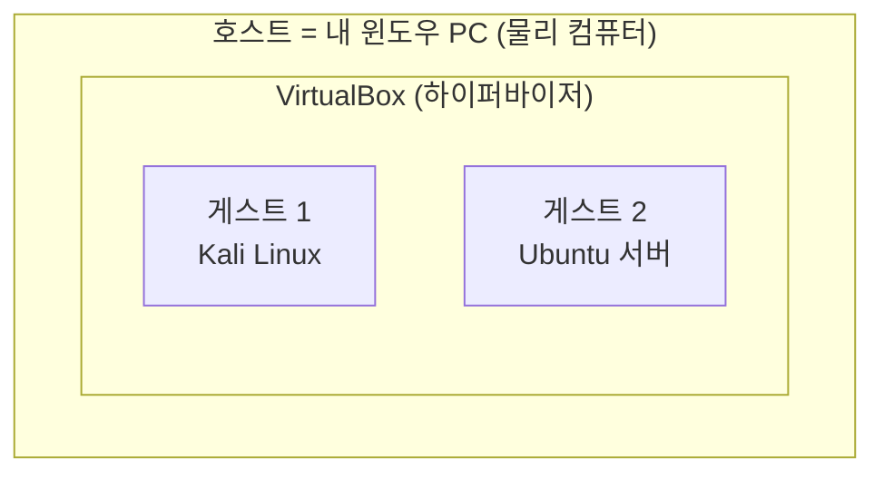
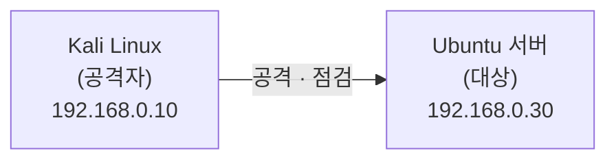
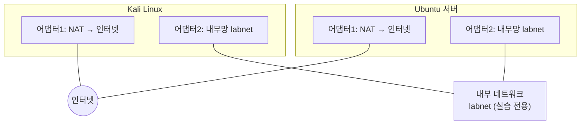
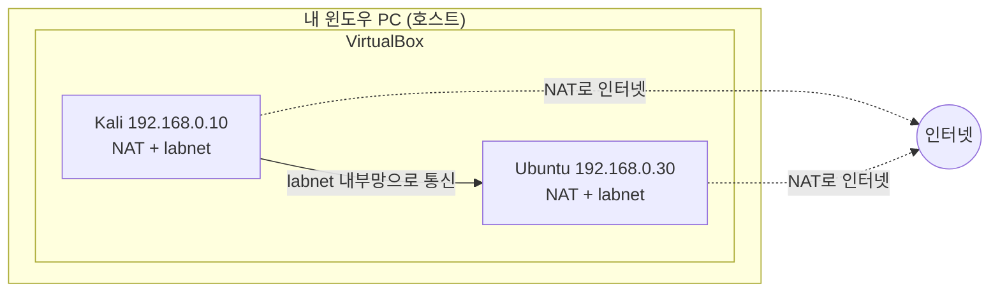

> 이 글은 **순수 이론** 입니다. 설치는 다음 글(01-2, 01-3)에서 직접 합니다.  
> 여기서는 "왜 가상머신을 쓰고, 두 대가 어떻게 통신하는지" 개념만 확실히 잡습니다.
{: .prompt-info }

## 1. 왜 "가상머신"이 필요할까

### 1.1 공격 실습의 딜레마

우리는 이 과목에서 **실제 공격**(비밀번호 가로채기, 웹사이트 해킹 등)을 직접 해 봅니다.  
그런데 이런 실습을 **내가 매일 쓰는 윈도우 PC에서 직접** 하면 두 가지 문제가 생깁니다.

1. **위험하다** — 공격 도구를 잘못 쓰면 내 PC가 망가지거나, 실수로 외부를 공격해 **법적 문제**가 될 수 있다.
2. **환경이 다 다르다** — 친구는 윈도우 11, 나는 윈도우 10… 화면도 명령어도 제각각이라 같이 배우기 어렵다.

> 그래서 우리는 **"진짜 PC 안에 가짜 PC를 여러 대 만들어"** 그 안에서만 실습합니다.  
> 이 "가짜 PC"가 바로 **가상머신(Virtual Machine, VM)** 입니다.
{: .prompt-tip }

### 1.2 가상머신이란

**가상머신(VM)** 은 소프트웨어로 만든 "컴퓨터 흉내내기"입니다.  
실제 컴퓨터처럼 운영체제(리눅스 등)가 깔리고, 부팅되고, 인터넷도 됩니다. 단지 **물리적 본체가 없을 뿐**입니다.

| 용어 | 뜻 | 우리 실습에서 |
|---|---|---|
| **호스트(Host)** | 진짜 내 컴퓨터 | 내 **윈도우 PC** |
| **게스트(Guest)** | 호스트 안에 만든 가상 컴퓨터 | **Kali, Ubuntu** 가상머신 |
| **하이퍼바이저** | 가상머신을 만들고 돌리는 프로그램 | **VirtualBox**(무료) |



### 1.3 가상머신을 쓰면 좋은 점

- **격리(Isolation)**: 게스트 안에서 무슨 일이 일어나도 **호스트(내 윈도우)는 안전**하다. 마치 "방음실 안에서 떠드는 것"과 같다.
- **동일 환경**: 모두가 똑같은 Kali·Ubuntu를 쓰므로 **교재와 화면이 100% 일치**한다.
- **스냅샷(Snapshot)**: 특정 시점을 **사진 찍듯 저장**해 두고, 문제가 생기면 그 시점으로 **즉시 되돌릴 수 있다.** (실습 중 가장 든든한 안전장치)

---

## 2. 우리가 만들 두 대의 가상머신

이 과목은 **공격하는 쪽**과 **공격당하는 쪽**을 나눠서 실습합니다. 그래서 VM이 **2대** 필요합니다.

| 가상머신 | 역할 | 비유 | 핵심 도구 |
|---|---|---|---|
| **Kali Linux** | 공격자·점검자 | 보안 점검자의 노트북 | Wireshark, Burp Suite, sqlmap, nmap |
| **Ubuntu 서버** | 공격 대상(서비스 운영) | 지켜야 할 회사 서버 | FTP·DNS·웹·DB 서비스 |



- **Kali Linux**: 보안 도구 수백 개가 미리 설치된 리눅스. 우리가 "공격"을 실행하는 곳.
- **Ubuntu 서버**: 회사 서버처럼 FTP·메일·웹·DNS를 올려 두고, Kali가 그곳을 공격·점검한다.

> 핵심 그림: **"한 윈도우 PC 안에서, Kali가 Ubuntu를 공격한다."**  
> 둘 다 가짜(가상) 컴퓨터이므로 바깥세상에는 아무 영향이 없다.
{: .prompt-tip }

---

## 3. 네트워크 기초 — 두 컴퓨터는 어떻게 "통신"할까

가상머신 2대가 서로 공격·점검을 하려면 **서로 대화(통신)** 할 수 있어야 합니다. 이를 위한 최소 개념만 짚습니다.

### 3.1 IP 주소 — 컴퓨터의 "주소"

네트워크에서 각 컴퓨터는 **IP 주소** 라는 고유 번호로 서로를 찾습니다. **택배의 집 주소**와 같습니다.

```
192.168.0.10   ← Kali (공격자)
192.168.0.30   ← Ubuntu (대상)
```

- `192.168.0.x` 처럼 시작하는 주소는 **집·학교 내부에서만 쓰는 사설(내부) 주소**입니다. (인터넷 전체에 공개된 주소가 아님)
- 우리는 Kali에 `.10`, Ubuntu에 `.30` 을 **고정**으로 줄 겁니다. 주소가 매번 바뀌면 서로 못 찾기 때문입니다.

### 3.2 서브넷 — 같은 "동네"에 있어야 통신된다

두 컴퓨터가 통신하려면 **같은 네트워크(같은 동네)** 에 있어야 합니다.  
`192.168.0.10` 과 `192.168.0.30` 은 앞부분(`192.168.0`)이 같으므로 **같은 동네**입니다. 그래서 서로 통신할 수 있습니다.

> 비유: 같은 아파트 단지(`192.168.0`) 안의 1001호(`.10`)와 1003호(`.30`)는 서로 쉽게 오갈 수 있다.
{: .prompt-tip }

### 3.3 네트워크 어댑터 두 개 — "인터넷용"과 "실습용"

각 가상머신에는 **랜카드(네트워크 어댑터)** 를 **2개** 달 겁니다. 역할이 다르기 때문입니다.

| 어댑터 | 종류 | 용도 | 비유 |
|---|---|---|---|
| **어댑터 1** | NAT | 인터넷 연결 (프로그램 설치·업데이트) | 바깥세상으로 나가는 현관문 |
| **어댑터 2** | 내부 네트워크(Internal Network) | Kali ↔ Ubuntu 실습 통신 | 단지 안에서만 쓰는 통로 |



- **NAT(어댑터1)**: 가상머신이 인터넷에 나가 프로그램을 받을 수 있게 해 준다.
- **내부 네트워크(어댑터2)**: 같은 이름(`labnet`)으로 묶인 가상머신끼리만 통신하는 **격리된 실습용 통로**. 공격 트래픽이 바깥으로 새지 않는다.

> **왜 굳이 두 개?** 인터넷(NAT)만 있으면 두 VM이 서로 못 찾고, 내부망만 있으면 프로그램 설치를 못 한다.  
> 그래서 **"인터넷용 1개 + 실습통신용 1개"** 를 함께 둔다.
{: .prompt-warning }

### 3.4 통신이 되는지 확인하는 법 — ping

설정이 끝나면 **`ping`** 이라는 명령으로 "상대 컴퓨터가 대답하는지"를 확인합니다.  
`ping`은 **"거기 있니?" 하고 신호를 보내 메아리를 받는** 명령입니다.

```bash
ping 192.168.0.30      # Kali에서 Ubuntu에게 "거기 있니?"
```

대답이 돌아오면 두 VM이 같은 내부망에서 잘 연결된 것입니다. (실제 명령은 01-3 실습에서)

---

## 4. 이번 카테고리에서 만들 최종 그림



이 환경을 **한 번** 만들어 두면, 이후 모든 실습(FTP·메일·DNS·웹·DB…)은 **이 두 대 안에서** 똑같이 진행됩니다. **학기 내내 환경은 바뀌지 않습니다.**

---

## 5. 핵심 정리

- **가상머신(VM)**: 진짜 PC(호스트) 안에 만든 가짜 PC(게스트). 안전하게 격리되고, 스냅샷으로 되돌릴 수 있다.
- **VirtualBox**: 가상머신을 만들어 주는 무료 프로그램(하이퍼바이저).
- **두 대 구성**: **Kali(공격자, .10)** 와 **Ubuntu(대상, .30)**.
- **네트워크**: 같은 내부망(`labnet`)에 두면 둘이 통신, NAT로 인터넷 연결. 어댑터를 **2개** 단다.
- **확인**: `ping` 으로 서로 통신되는지 점검.

> 다음 글(**01-2. VirtualBox와 가상머신 설치**)부터 이 개념을 **직접 손으로** 만듭니다.
{: .prompt-info }
