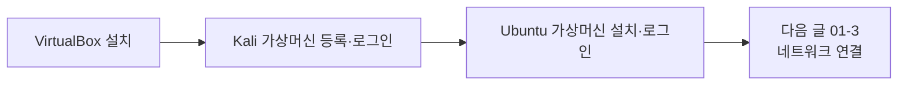

> 이 글은 **실습** 입니다. 개념은 앞 글(**01-1. 가상머신과 네트워크의 이해**)에서 먼저 읽고 오세요.  
> 여기서는 윈도우 PC에 **VirtualBox → Kali → Ubuntu** 순서로 직접 설치합니다.
{: .prompt-info }

## 0. 실습 목표와 준비물

**목표**: 내 윈도우 PC에 가상머신 2대(**Kali**, **Ubuntu**)를 올린다.

**준비물 점검**

- [ ] 윈도우 PC, RAM **8GB 이상** (VM 2대를 동시에 켜기 위함)
- [ ] 여유 디스크 **40GB 이상**
- [ ] 인터넷 연결

> 설치 파일이 크므로(수 GB) **유선/안정된 와이파이**에서 진행하세요.
{: .prompt-tip }

---

## 1. VirtualBox 설치 (호스트 = 윈도우)

VirtualBox는 가상머신을 만들어 주는 **무료** 프로그램입니다.

1. [VirtualBox 공식 사이트](https://www.virtualbox.org/) 접속 → **[Download VirtualBox]** 클릭
2. **Windows hosts** 항목의 설치 파일(`.exe`)을 받는다.
3. 받은 파일을 실행하고 **모두 기본값(Next)** 으로 설치한다.
   - 설치 중 "네트워크 기능을 잠시 끊는다"는 안내가 나오면 **Yes** 로 진행한다.
4. 설치가 끝나면 **VirtualBox 관리자(Manager)** 창이 열린다. 이 창에서 앞으로 가상머신을 관리한다.

> 윈도우에서 "가상화(Virtualization)"가 꺼져 있으면 나중에 64비트 VM이 안 켜질 수 있다.  
> 그럴 때는 PC를 켤 때 **BIOS/UEFI** 에 들어가 **VT-x(또는 SVM)** 를 **Enable** 로 바꿔야 한다. (대부분은 기본 켜짐)
{: .prompt-warning }

---

## 2. Kali Linux 설치 — "미리 만들어진 이미지"로 쉽게 (권장)

Kali는 직접 OS를 설치하지 않고, **칼리가 배포하는 VirtualBox용 이미지**를 가져오는 방식이 가장 쉽습니다. 모든 보안 도구가 미리 깔린 상태로 시작합니다.

1. [Kali 다운로드 페이지](https://www.kali.org/get-kali/) → **[Virtual Machines]** 선택
2. **VirtualBox** 항목의 `.7z` 파일을 받는다.
3. [7-Zip](https://www.7-zip.org/) 을 설치한 뒤, 받은 `.7z` 파일을 **압축 해제**한다. → `.vbox` 파일과 `.vdi`(디스크) 파일이 나온다.
4. VirtualBox 관리자에서 상단 메뉴 **[추가(Add)]** 클릭 → 방금 나온 **`.vbox` 파일**을 선택한다.
5. 목록에 **Kali Linux** 가상머신이 등록된다.
6. Kali를 선택하고 **[시작(Start)]** → 로그인 화면에서 기본 계정으로 로그인:

   | 항목 | 값 |
   |---|---|
   | 아이디 | `kali` |
   | 비밀번호 | `kali` |

> 처음 부팅은 1~2분 걸릴 수 있다. 검은 화면이 잠깐 지속돼도 정상이다.
{: .prompt-tip }

---

## 3. Ubuntu 서버 설치 — 공격 대상 서버

Ubuntu는 우리가 FTP·웹·DNS 같은 서비스를 올릴 **대상 서버**입니다. 직접 설치합니다.

### 3.1 설치 이미지(ISO) 받기

1. [Ubuntu Server 다운로드](https://ubuntu.com/download/server) 에서 **22.04 LTS** ISO 파일을 받는다.
   - "LTS"는 장기 지원 버전이라는 뜻으로, 실습에 안정적이다.

### 3.2 가상머신 새로 만들기

1. VirtualBox 관리자에서 **[새로 만들기(New)]** 클릭
2. 다음과 같이 설정한다.

   | 항목 | 값 |
   |---|---|
   | 이름 | `DVWA-Ubuntu` (원하는 이름 가능) |
   | 종류 | Linux |
   | 버전 | Ubuntu (64-bit) |
   | 메모리(RAM) | `2048` MB |
   | 디스크 | 새로 만들기 → `25` GB |

3. 만들어진 VM을 선택 → **[설정] → [저장소(Storage)]** → 비어 있는 광학 드라이브(CD 모양)에 **위에서 받은 ISO** 를 넣는다.
4. **[시작]** 을 눌러 설치를 시작한다.

### 3.3 Ubuntu 설치 진행 (화면 안내 따라가기)

설치 마법사가 한국어/영어로 단계별로 묻습니다. 핵심만 짚으면:

- 언어·키보드: 기본값으로 진행
- 네트워크: 일단 기본값(나중에 01-3에서 다시 설정)
- 사용자 만들기: **사용자명 `dvwa`**(원하는 이름 가능), 비밀번호는 기억하기 쉬운 것으로
- **Install OpenSSH server**: **체크함** (나중에 원격 접속용)
- 설치 완료 후 **재부팅(Reboot)**

> 재부팅 시 "설치 미디어를 제거하라"는 메시지가 나오면, VirtualBox 메뉴에서 ISO를 빼고 엔터를 누른다.  
> (설정 → 저장소에서 광학 드라이브를 "비우기" 해도 된다.)
{: .prompt-tip }

설치가 끝나면 로그인 프롬프트가 뜹니다. 앞서 만든 `dvwa` 계정으로 로그인합니다.

---

## 4. 여기까지 확인 (체크리스트)

- [ ] VirtualBox 관리자에 **Kali** 와 **Ubuntu** 두 VM이 보인다.
- [ ] Kali에 `kali` / `kali` 로 로그인된다.
- [ ] Ubuntu에 내가 만든 계정으로 로그인된다.

> ⭐ **스냅샷 찍어 두기(강력 추천)**  
> 각 VM을 끈 상태에서 VirtualBox 메뉴 **[스냅샷] → [찍기]** 로 "**설치 직후**" 상태를 저장해 두세요.  
> 실습 중 망가지면 이 시점으로 **즉시 복구**할 수 있습니다.
{: .prompt-tip }

---

## 5. 다음 글

두 VM이 만들어졌지만, 아직 **서로 통신은 안 됩니다.**  
다음 글 **01-3. 두 가상머신을 같은 내부망으로 연결하기** 에서 어댑터 2개 설정 + 고정 IP를 주고, `ping` 으로 통신을 확인합니다.
