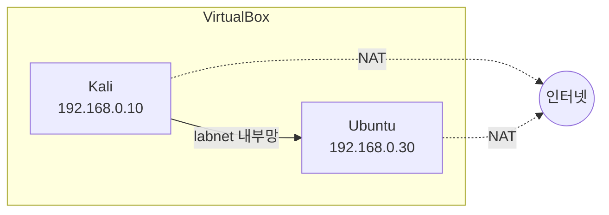

> 이 글은 **실습** 입니다. 앞 글에서 만든 **Kali·Ubuntu 두 VM** 이 준비돼 있어야 합니다.  
> 목표: 두 VM이 **같은 내부망에서 서로 통신** 하고, **동시에 인터넷** 도 되게 만든다.
{: .prompt-info }

## 0. 오늘의 목표 그림



각 VM에 **어댑터 2개**(NAT + 내부망 `labnet`)를 달고, **고정 IP**(Kali `.10`, Ubuntu `.30`)를 줍니다.

---

## 1. 두 VM 모두 어댑터 2개 설정 (VM은 꺼 둔 상태에서)

각 VM(Kali, Ubuntu)에 대해 **똑같이** 반복합니다.

1. VirtualBox 관리자에서 VM 선택 → **[설정] → [네트워크]**
2. **어댑터 1** 탭:
   - "네트워크 어댑터 사용하기" 체크
   - 연결 방식: **NAT**
3. **어댑터 2** 탭:
   - "네트워크 어댑터 사용하기" 체크
   - 연결 방식: **내부 네트워크(Internal Network)**
   - 이름: **`labnet`** 이라고 직접 입력

> ⚠️ **가장 흔한 실수**: 두 VM의 내부 네트워크 이름은 **글자 하나까지 똑같이 `labnet`** 이어야 한다.  
> 한쪽이 `labnet`, 다른 쪽이 `Labnet` 이면 서로 통신되지 않는다.
{: .prompt-warning }

설정 후 두 VM을 모두 **켭니다(시작)**.

---

## 2. Kali에 고정 IP `192.168.0.10` 주기

Kali 터미널을 열고 아래를 입력합니다. (복사-붙여넣기 가능)

```bash
# 두 번째(내부망) 랜카드 이름을 자동으로 찾아 labnet 연결을 만든다
IFACE2=$(ls /sys/class/net | grep -v lo | sed -n '2p')
sudo nmcli con add type ethernet ifname "$IFACE2" con-name labnet ip4 192.168.0.10/24
sudo nmcli con up labnet

# 확인: 아래 줄이 나오면 성공
ip addr | grep 192.168.0.10
```

- `sudo` 는 "관리자 권한으로 실행"이라는 뜻이다. 비밀번호를 물으면 `kali` 를 입력한다.
- 마지막 줄에서 `192.168.0.10` 이 보이면 IP가 잘 들어간 것이다.

> 명령이 길어 보이지만, 하는 일은 단순하다: **"내부망 랜카드에 `.10` 주소를 고정으로 붙여라."**
{: .prompt-tip }

---

## 3. Ubuntu에 고정 IP `192.168.0.30` 주기

Ubuntu는 `netplan` 이라는 설정 파일로 IP를 정합니다. 터미널에 아래를 입력합니다.

```bash
# 1번 랜카드(NAT)와 2번 랜카드(내부망) 이름을 자동으로 찾는다
IF_NAT=$(ls /sys/class/net | grep -v lo | sed -n '1p')
IF_LAB=$(ls /sys/class/net | grep -v lo | sed -n '2p')

# 기존 설정을 정리하고 새 설정 파일을 만든다
sudo rm -f /etc/netplan/00-installer-config.yaml /etc/netplan/50-cloud-init.yaml
sudo tee /etc/netplan/99-lab.yaml > /dev/null <<EOF
network:
  version: 2
  ethernets:
    $IF_NAT:
      dhcp4: true
    $IF_LAB:
      dhcp4: false
      addresses: [192.168.0.30/24]
EOF

# 권한 설정 후 적용
sudo chmod 600 /etc/netplan/99-lab.yaml
sudo netplan apply

# 확인: 아래 줄이 나오면 성공
ip addr | grep 192.168.0.30
```

- `dhcp4: true`(어댑터1) = 인터넷용 주소는 자동으로 받는다.
- `addresses: [192.168.0.30/24]`(어댑터2) = 내부망 주소는 `.30` 으로 **고정**한다.

> `<<EOF ... EOF` 는 "여러 줄을 한 번에 파일로 써넣는" 방법이다. 그대로 복사해 붙여 넣으면 된다.
{: .prompt-tip }

---

## 4. 통신 확인 — 이번 단계의 핵심

설정이 끝났으면 두 VM이 **서로 통신되는지** + **인터넷이 되는지** 를 `ping` 으로 확인합니다.  
(`Ctrl + C` 로 ping을 멈출 수 있습니다.)

```bash
# === Kali에서 실행 ===
ping -c 3 192.168.0.30     # Ubuntu가 대답하면 → 내부망 연결 성공
ping -c 3 8.8.8.8          # 구글 DNS가 대답하면 → 인터넷(NAT) 정상
```

```bash
# === Ubuntu에서 실행 ===
ping -c 3 192.168.0.10     # Kali가 대답하면 → 내부망 연결 성공
ping -c 3 8.8.8.8          # 인터넷 정상 → 앞으로 apt로 프로그램 설치 가능
```

### 최종 체크리스트

- [ ] Kali → Ubuntu `ping` 성공
- [ ] Ubuntu → Kali `ping` 성공
- [ ] 두 VM 모두 인터넷(`8.8.8.8`) `ping` 성공

> 위 4가지가 모두 성공하면 **실습 환경 구축 완료** 입니다. 이 환경을 학기 내내 그대로 씁니다. 🎉
{: .prompt-tip }

---

## 5. 잘 안 될 때 (자주 묻는 문제)

| 증상 | 점검할 것 |
|---|---|
| 내부망 ping이 안 됨 | 두 VM의 어댑터 2 내부 네트워크 이름이 **모두 `labnet`** 인지 확인 |
| IP가 안 보임 | `.10` / `.30` 명령을 다시 실행, 오타 확인 |
| 인터넷이 안 됨 | 어댑터 1이 **NAT** 인지 확인 |
| 명령이 "권한 거부" | 앞에 `sudo` 를 붙였는지 확인 |

> 그래도 안 되면 **설치 직후 스냅샷**으로 되돌린 뒤 1번부터 다시 차근차근 진행하세요.
{: .prompt-warning }

---

## 6. 다음 카테고리

실습 환경이 완성됐습니다. 다음은 **02. FTP 보안** — 파일 전송 서비스의 동작 원리(이론)부터, Ubuntu에 FTP 서버를 올리고 Kali로 **비밀번호가 평문으로 새는 장면**을 직접 확인하는 실습까지 진행합니다.
