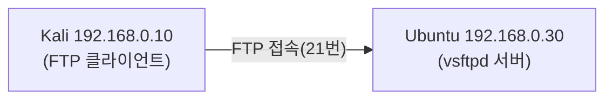

> 이 글은 **실습** 입니다. 개념은 앞 글(**02-1. FTP 보안 이론**)을 먼저 읽으세요.  
> 목표: **Ubuntu(192.168.0.30)** 에 FTP 서버(vsftpd)를 올리고, **Kali(192.168.0.10)** 에서 접속해 본다.
{: .prompt-info }

## 0. 오늘의 그림



> 모든 서버 설정 명령은 **Ubuntu** 에서, 접속 테스트는 **Kali** 에서 실행합니다. 어느 쪽에서 치는지 항상 확인하세요.
{: .prompt-warning }

---

## 1. (Ubuntu) vsftpd 설치

`vsftpd` 는 리눅스에서 가장 널리 쓰는 FTP 서버 프로그램입니다. (very secure FTP daemon)

```bash
# === Ubuntu에서 실행 ===
sudo apt update
sudo apt install -y vsftpd

# 서비스 시작 + 부팅 시 자동 실행 등록
sudo systemctl enable --now vsftpd

# 동작 확인 (active (running) 이면 정상)
sudo systemctl status vsftpd
```

> `status` 화면에서 빠져나오려면 `q` 를 누릅니다.
{: .prompt-tip }

---

## 2. (Ubuntu) 접속할 FTP 사용자 만들기

실습에 쓸 전용 계정 **`ftpuser`** 를 만듭니다. 비밀번호는 **`ftppass123`** 으로 정합니다. (다음 실습에서 이 비밀번호가 평문으로 새는 것을 확인합니다.)

```bash
# === Ubuntu에서 실행 ===
sudo adduser ftpuser
```

- 비밀번호를 물으면 **`ftppass123`** 을 두 번 입력한다.
- 이름·전화번호 등 추가 정보는 그냥 **엔터** 로 넘긴다.

---

## 3. (Ubuntu) vsftpd 설정

설정 파일은 **`/etc/vsftpd.conf`** 입니다. 먼저 **백업**하고 편집합니다.

```bash
# === Ubuntu에서 실행 ===
sudo cp /etc/vsftpd.conf /etc/vsftpd.conf.bak
sudo nano /etc/vsftpd.conf
```

아래 항목들을 찾아 **이 값과 일치하도록** 수정합니다. (없으면 파일 맨 아래에 추가)

```ini
listen=YES
listen_ipv6=NO

anonymous_enable=NO      # 익명 접속 차단
local_enable=YES         # 시스템 계정으로 로그인 허용
write_enable=YES         # 업로드(쓰기) 허용

chroot_local_user=YES        # 사용자를 자기 홈 폴더에 가둠(보안)
allow_writeable_chroot=YES   # (실습 편의) 홈이 쓰기 가능해도 동작하게

xferlog_enable=YES                 # 전송 로그 기록
xferlog_file=/var/log/vsftpd.log   # 로그 파일 위치

pam_service_name=vsftpd
```

> ⚠️ `listen` 과 `listen_ipv6` 는 **둘 다 YES이면 안 됩니다.** 우리는 IPv4만 쓰므로 `listen=YES`, `listen_ipv6=NO` 로 둡니다.  
> ⚠️ `chroot_local_user=YES` 만 켜고 `allow_writeable_chroot=YES` 를 빼면 `500 OOPS ... writable root` 오류로 로그인이 막힙니다. 두 줄을 **함께** 둡니다.
{: .prompt-warning }

저장(`Ctrl+O`, 엔터) 후 종료(`Ctrl+X`)하고, 설정을 반영하기 위해 **재시작**합니다.

```bash
# === Ubuntu에서 실행 ===
sudo systemctl restart vsftpd
```

---

## 4. (Ubuntu) ftpusers 접속 거부 명단 확인

`/etc/ftpusers` 에 적힌 계정은 **FTP 로그인이 거부** 됩니다. (이론 5.1 복습)

```bash
# === Ubuntu에서 실행 ===
cat /etc/ftpusers
```

- 목록에 `root` 가 들어 있는 것을 확인한다 → **root로는 FTP 접속이 막힌다.**
- 특정 계정을 추가로 막고 싶으면 이 파일에 그 계정 이름을 한 줄 적으면 된다.

> 다시 강조: ftpusers는 **거부 명단(blacklist)** 입니다. 여기 있으면 막히고, 없으면 (다른 설정이 허용하는 한) 접속됩니다.
{: .prompt-tip }

---

## 5. (Kali) FTP로 접속해 보기

이제 **Kali** 에서 서버로 접속합니다. FTP 클라이언트가 없으면 설치합니다.

```bash
# === Kali에서 실행 ===
sudo apt install -y ftp        # 이미 있으면 생략됨

ftp 192.168.0.30
```

접속하면 아이디·비밀번호를 묻습니다.

```
Name (192.168.0.30): ftpuser
Password: ftppass123          ← 화면에는 안 보이지만 입력됨
```

`230 Login successful.` 가 나오면 성공입니다. FTP 프롬프트에서 기본 명령을 써 봅니다.

```bash
ls            # 서버의 파일 목록
pwd           # 현재 위치
put 파일명     # 파일 업로드 (write_enable 덕분에 가능)
get 파일명     # 파일 다운로드
bye           # 접속 종료
```

> 업로드 테스트: Kali에서 `ftp` 접속 전에 `echo hello > test.txt` 로 파일을 만들고, 접속 후 `put test.txt` 를 해 봅니다.
{: .prompt-tip }

---

## 6. (Ubuntu) 전송 로그(xferlog) 확인

Kali에서 파일을 올리고/내린 뒤, **Ubuntu** 에서 전송 기록을 봅니다.

```bash
# === Ubuntu에서 실행 ===
sudo tail -f /var/log/vsftpd.log
```

- 누가(`ftpuser`) 언제 어떤 파일을 전송했는지 기록이 남습니다.
- 빠져나오려면 `Ctrl + C`.

---

## 7. 체크리스트

- [ ] (Ubuntu) `systemctl status vsftpd` 가 **running**
- [ ] (Ubuntu) `ftpuser` 계정 생성 완료
- [ ] (Kali) `ftp 192.168.0.30` 로 `ftpuser` 로그인 성공(`230`)
- [ ] (Kali) `put` / `get` 으로 파일 전송 성공
- [ ] (Ubuntu) `/var/log/vsftpd.log` 에 전송 기록 확인

> ⭐ 실습 후 **스냅샷** 을 한 번 찍어 두면, 다음 실습(02-3)을 깨끗한 상태에서 시작할 수 있습니다.
{: .prompt-tip }

---

## 8. 다음 글

서버가 동작합니다. 다음 글 **02-3. 평문 FTP의 위험 — 비밀번호 가로채기** 에서 Kali의 와이어샤크로 이 `ftpuser` / `ftppass123` 가 **네트워크에 평문으로 흐르는 것**을 직접 잡아내고, **SFTP** 로 바꾸면 어떻게 달라지는지 비교합니다.
