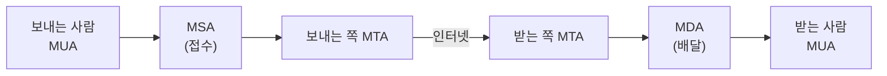
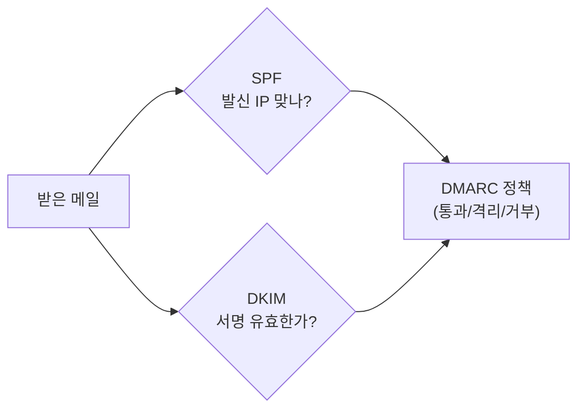
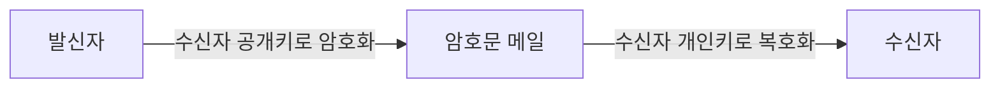

> 이 글은 **순수 이론** 입니다. 메일을 직접 보내고 SPF·GPG를 다루는 실습은 다음 글(03-2, 03-3)에서 합니다.
{: .prompt-info }

## 1. 이메일은 어떻게 전달될까

우리가 "보내기"를 누르면 메일은 여러 **중계 서버**를 거쳐 상대에게 도착합니다. 이 과정을 이해하려면 등장인물(구성요소)을 먼저 알아야 합니다.

### 1.1 메일 구성요소

| 약어 | 이름 | 역할 | 예시 |
|---|---|---|---|
| **MUA** | Mail User Agent | 사용자가 메일을 **쓰고 읽는** 프로그램 | Outlook, Thunderbird, 웹메일 |
| **MSA** | Mail Submission Agent | MUA가 보낸 메일을 **접수** | (메일 서버의 접수 창구) |
| **MTA** | Mail Transfer Agent | 메일을 **다른 서버로 전달** | Postfix, sendmail |
| **MDA** | Mail Delivery Agent | 최종 수신자 **사서함에 배달** | Dovecot, procmail |

> 비유: **MUA**(편지 쓰는 사람) → **MSA**(우체통) → **MTA**(우체국·트럭) → **MDA**(집배원) → **MUA**(편지 읽는 사람)
{: .prompt-tip }

### 1.2 전달 과정 한눈에

- **보낼 때**는 **SMTP** 프로토콜을 사용한다. (MUA→MTA, MTA→MTA)
- **받을(가져올) 때**는 **POP3** 또는 **IMAP** 프로토콜을 사용한다. (MDA의 사서함 → MUA)

---

## 2. 메일 프로토콜과 포트 번호 (시험 단골)

| 프로토콜 | 용도 | 평문 포트 | 암호화(SSL/TLS) 포트 |
|---|---|---|---|
| **SMTP** | 메일 **보내기** | **25** (서버 간), **587**(제출) | **465** (SMTPS) |
| **POP3** | 메일 **가져오기**(내려받고 서버에서 삭제) | **110** | **995** (POP3S) |
| **IMAP** | 메일 **가져오기**(서버에 보관·동기화) | **143** | **993** (IMAPS) |

> 포트 번호 암기가 시험에 자주 나옵니다: **SMTP 25 / POP3 110 / IMAP 143**, 그리고 암호화 버전 **465·995·993**.
{: .prompt-warning }

### 2.1 POP3 vs IMAP

| 구분 | POP3 | IMAP |
|---|---|---|
| 메일 저장 위치 | 내 기기로 **내려받음**(서버에서 삭제) | **서버에 보관**(여러 기기 동기화) |
| 여러 기기 사용 | 불편 | 편리(읽음 상태까지 동기화) |
| 오늘날 | 적게 씀 | 주로 씀(스마트폰·PC 함께 쓰는 환경) |

---

## 3. 메일의 보안 문제

### 3.1 평문 전송

기본 SMTP·POP3·IMAP은 **암호화가 없어**, 중간에서 엿보면 메일 내용·비밀번호가 노출됩니다. (FTP와 같은 약점)  
→ 해결책: **SSL/TLS**(465·995·993) 또는 **STARTTLS**(평문 연결을 중간에 암호화로 전환)를 사용합니다.

### 3.2 발신자 위조 (스푸핑)

SMTP는 원래 **보내는 사람 주소를 마음대로 적을 수 있게** 설계되었습니다.  
그래서 `MAIL FROM` 에 남의 주소를 적어 **"~인 척" 보내는 위조**가 가능합니다. → 스팸·피싱의 근본 원인.

### 3.3 메일 위협의 종류

| 종류 | 설명 |
|---|---|
| **스팸(Spam)** | 수신자가 원치 않는 대량 광고 메일 |
| **악성 메일(Phishing 등)** | 가짜 링크·첨부로 정보 탈취·악성코드 유포 |
| **웜(Worm) 메일** | 첨부 실행 시 스스로 복제·전파되는 악성코드 |

---

## 4. 스팸·위조를 막는 3가지 — SPF, DKIM, DMARC

발신자 위조를 막기 위해 **도메인 소유자가 DNS에 "정당한 발신 정보"를 공개**하는 기술입니다.

| 기술 | 무엇을 검증하나 | 한 줄 설명 |
|---|---|---|
| **SPF** | **발신 IP** | "이 도메인 메일은 이 IP들에서만 보낸다"를 DNS에 공개 |
| **DKIM** | **전자서명** | 메일에 도메인의 디지털 서명을 붙여 위·변조 확인 |
| **DMARC** | SPF·DKIM **결과 처리 정책** | "SPF/DKIM 실패 메일은 거부/격리하라"는 정책 + 리포트 |

> 실습(03-3)에서 실제 도메인의 **SPF 레코드를 `dig` 로 직접 조회** 해 봅니다.
{: .prompt-tip }

---

## 5. 메일 암호화 — PGP

**PGP(Pretty Good Privacy)** 는 이메일 내용 자체를 **암호화·전자서명** 하는 대표 기술입니다. (오픈소스 구현이 **GPG**)

### 5.1 PGP가 제공하는 것

| 보안 목표 | PGP 방식 | 효과 |
|---|---|---|
| **기밀성** | 수신자의 **공개키로 암호화** | 수신자만 열 수 있음 |
| **무결성·인증** | 발신자의 **개인키로 전자서명** | 위조·변조 확인, 발신자 증명 |

### 5.2 공개키 암호의 기본 원리

- 모든 사용자는 **공개키(자물쇠)** 와 **개인키(열쇠)** 한 쌍을 가진다.
- **암호화**: 받는 사람의 **공개키**로 잠근다 → 받는 사람의 **개인키**로만 열린다. (기밀성)
- **서명**: 보내는 사람의 **개인키**로 서명 → 보내는 사람의 **공개키**로 검증. (인증·무결성)

> PGP는 **하이브리드 방식**입니다: 본문은 빠른 **대칭키**로 암호화하고, 그 대칭키만 수신자의 **공개키**로 암호화해 함께 보냅니다. (속도 + 보안 둘 다 확보)
{: .prompt-tip }

---

## 6. 핵심 정리

- **구성요소**: MUA(작성/읽기) → MSA(접수) → MTA(전달) → MDA(배달).
- **프로토콜·포트**: 보내기 **SMTP 25/587**, 가져오기 **POP3 110 / IMAP 143**, 암호화 **465/995/993**.
- **POP3 vs IMAP**: 내려받아 삭제(POP3) vs 서버 보관·동기화(IMAP).
- **약점**: 평문 전송 + **발신자 위조** → 스팸·피싱.
- **위조 방지**: **SPF**(발신 IP), **DKIM**(서명), **DMARC**(정책).
- **메일 암호화**: **PGP/GPG** — 공개키로 기밀성, 개인키 서명으로 인증·무결성.

> 다음 글(**03-2. SMTP 프로토콜 직접 체험**)에서 메일이 전달되는 과정을 명령으로 직접 따라가 봅니다.
{: .prompt-info }
