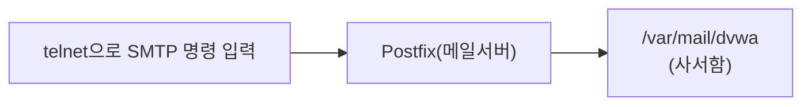

> 이 글은 **실습** 입니다. 개념은 앞 글(**03-1. 메일 보안 이론**)을 먼저 읽으세요.  
> 메일 서버 전체를 운영하는 것은 1학년에겐 과하므로(🔴 데모), 여기서는 **로컬에서 SMTP 명령을 손으로 입력**해 메일이 전달되는 과정을 체험합니다.  
> 이 실습은 전부 **Ubuntu(192.168.0.30)** 한 대에서 진행합니다.
{: .prompt-info }

## 0. 목표



SMTP 명령(`MAIL FROM`, `RCPT TO`, `DATA`)을 직접 쳐서 `dvwa` 사용자에게 메일을 넣고, 도착한 메일의 **헤더**를 분석합니다.

---

## 1. (Ubuntu) 메일 서버(Postfix)와 도구 설치

```bash
# === Ubuntu에서 실행 ===
sudo apt update
sudo apt install -y postfix mailutils telnet
```

설치 중 **파란 설정 화면** 이 나오면:

- "General type of mail configuration" → **Local only** 선택 (인터넷 없이 이 컴퓨터 안에서만 메일을 다룸)
- "System mail name" → 기본값 그대로 두고 엔터

> **Local only** 로 두는 이유: 외부와 메일을 주고받는 진짜 메일 서버는 설정이 복잡하고 위험합니다(🔴).  
> 우리는 "SMTP 명령이 어떻게 동작하는지"만 볼 것이므로 **내 컴퓨터 안에서만** 돌립니다.
{: .prompt-warning }

서비스가 켜져 있는지 확인합니다.

```bash
# === Ubuntu에서 실행 ===
sudo systemctl status postfix     # active (running) 이면 정상 (q로 빠져나옴)
```

---

## 2. (Ubuntu) SMTP 명령으로 메일 보내기

`telnet` 으로 메일 서버(25번 포트)에 직접 접속해, **사람이 SMTP 명령을 한 줄씩** 입력합니다.

```bash
# === Ubuntu에서 실행 ===
telnet localhost 25
```

접속되면 `220 ...` 인사가 나옵니다. 이제 아래를 **한 줄씩** 입력합니다. (서버 응답 코드를 함께 표시)

```
ehlo localhost
                      → 250 응답들
mail from:<prof@localhost>
                      → 250 OK
rcpt to:<dvwa@localhost>
                      → 250 OK
data
                      → 354 (이제 본문을 입력하라)
Subject: SMTP 실습 메일

안녕하세요, 이것은 직접 보낸 테스트 메일입니다.
.
                      → 250 메일 큐에 저장됨 (마지막 줄의 점 . 이 "본문 끝" 신호)
quit
```

> **핵심**: `DATA` 다음에 본문을 쓰고, **마침표(`.`) 한 글자만 있는 줄** 로 본문을 끝냅니다.  
> `MAIL FROM` 에 아무 주소나 적을 수 있다는 점에 주목하세요 — 이것이 **발신자 위조(스푸핑)** 가 가능한 이유입니다(이론 3.2).
{: .prompt-warning }

---

## 3. (Ubuntu) 도착한 메일 확인

`dvwa` 사용자의 사서함에 메일이 도착했는지 봅니다.

```bash
# === Ubuntu에서 실행 ===
mail        # mailutils 메일 읽기 (목록에서 번호 입력 → 본문, q로 종료)
```

또는 사서함 파일을 직접 봅니다.

```bash
# === Ubuntu에서 실행 ===
cat /var/mail/dvwa
```

---

## 4. (Ubuntu) 메일 헤더 분석

`cat /var/mail/dvwa` 출력의 **위쪽 헤더** 를 봅니다. 주요 항목의 뜻은 다음과 같습니다.

| 헤더 | 의미 |
|---|---|
| `Return-Path` | 반송 주소 (실제 발신지) |
| `Received` | 메일이 거쳐 간 서버 기록 (**아래에서 위로** 읽음) |
| `From` | 표시되는 보낸 사람 (위조 가능) |
| `To` | 받는 사람 |
| `Subject` | 제목 |
| `Message-ID` | 메일 고유 번호 |

> **수사 포인트**: `From` 은 속일 수 있지만, `Received` 기록과 `Return-Path` 를 따라가면 **진짜 발신 경로**를 추적할 수 있습니다. 스팸·피싱 분석의 출발점입니다.
{: .prompt-tip }

---

## 5. 체크리스트

- [ ] Postfix가 **Local only** 로 설치되어 running
- [ ] `telnet localhost 25` 로 SMTP 명령을 직접 입력해 메일 전송 성공(`250`)
- [ ] `mail` 또는 `cat /var/mail/dvwa` 로 도착 메일 확인
- [ ] 헤더에서 `From` · `Received` · `Return-Path` 를 구분해 설명할 수 있음
- [ ] `MAIL FROM` 을 임의로 적을 수 있다는 점(스푸핑)을 이해함

---

## 6. 다음 글

메일이 어떻게 전달되는지 직접 봤습니다. 다음 글 **03-3. SPF 조회와 GPG 메일 암호화** 에서는 발신자 위조를 막는 **SPF 레코드를 `dig` 로 조회** 하고, **GPG로 메시지를 암호화·서명** 해 봅니다.
