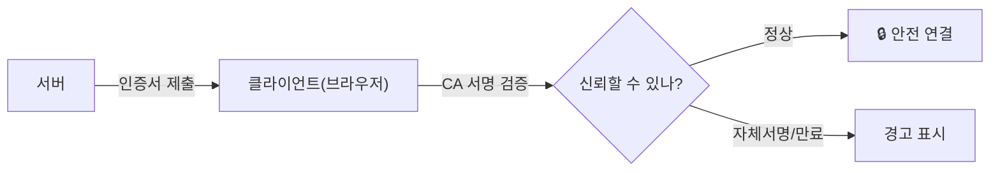
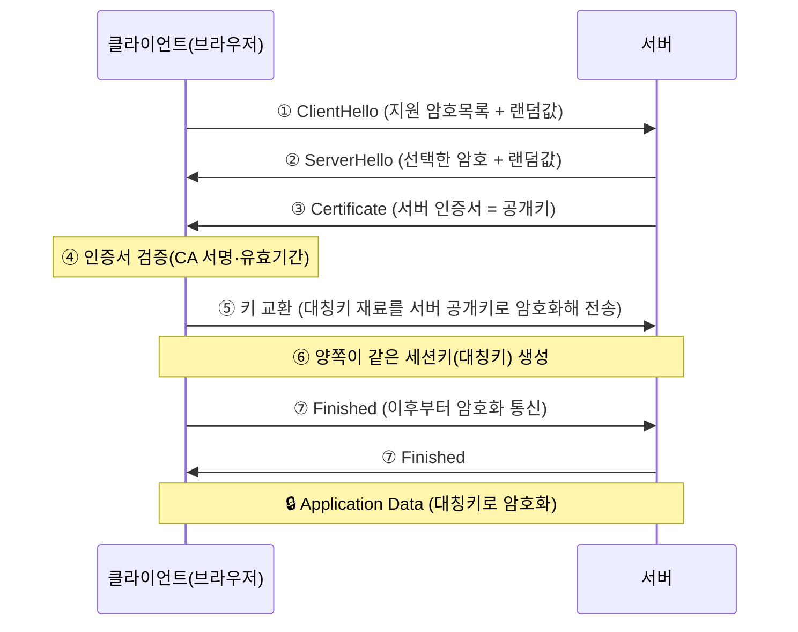

> 이 글은 **순수 이론** 입니다. 인증서 생성·HTTPS 구성·핸드셰이크 캡처 실습은 다음 글(06-2, 06-3)에서 합니다.
{: .prompt-info }

## 1. 왜 SSL/TLS인가

02장에서 본 것처럼, **평문 통신(FTP·HTTP)** 은 같은 네트워크의 공격자가 그대로 엿볼 수 있습니다.  
**SSL/TLS** 는 이 통신을 **암호화** 해, 중간에서 가로채도 내용을 읽지 못하게 만드는 기술입니다.

> **HTTPS = HTTP + TLS**. 주소창의 자물쇠(🔒)가 바로 TLS가 적용됐다는 표시입니다. 포트는 **443번**.
{: .prompt-tip }

### 1.1 SSL과 TLS의 관계

| 이름 | 설명 |
|---|---|
| **SSL** | 옛날 규약(SSL 2.0/3.0) — **현재는 취약해 사용 금지** |
| **TLS** | SSL의 후속·개선판. 현재 **TLS 1.2 / 1.3** 사용 |

> 흔히 "SSL"이라 부르지만 **실제로 쓰는 건 TLS** 입니다. (이름만 관습적으로 SSL이라 함)
{: .prompt-warning }

---

## 2. SSL/TLS가 제공하는 3가지

| 보안 목표 | 방법 | 효과 |
|---|---|---|
| **기밀성** | 대칭키 **암호화** | 가로채도 내용을 못 읽음 |
| **무결성** | **MAC**(메시지 인증 코드) | 중간에서 변조되면 탐지 |
| **인증** | **인증서(Certificate)** | 접속한 서버가 진짜인지 확인 |

---

## 3. 핵심 재료 — 대칭키·공개키·인증서

### 3.1 대칭키 vs 공개키 (하이브리드)

| 구분 | 대칭키 | 공개키 |
|---|---|---|
| 키 | 하나(암복호화 같은 키) | 한 쌍(공개키·개인키) |
| 속도 | **빠름** | 느림 |
| 문제 | "키를 어떻게 안전하게 전달?" | 느려서 대용량엔 부적합 |

> TLS는 둘의 장점을 합칩니다(**하이브리드**): **공개키로 "대칭키"를 안전하게 전달** 하고, 실제 데이터는 **빠른 대칭키** 로 암호화합니다.
{: .prompt-tip }

### 3.2 인증서와 CA

**인증서(Certificate)** 는 "이 공개키는 진짜 이 도메인의 것"임을 **신뢰기관(CA)** 이 보증한 전자 신분증입니다.

| 인증서에 담긴 것 | 의미 |
|---|---|
| 주체(Subject) | 도메인 이름(예: `ubuntu.lab.local`) |
| 공개키 | 서버의 공개키 |
| 발급자(Issuer) | 보증한 CA |
| 유효기간 | 시작·만료일 |
| CA의 전자서명 | 위조 방지 |

> **자체서명(self-signed) 인증서** 는 CA의 보증 없이 스스로 만든 것이라, 브라우저가 **경고** 를 띄웁니다. 실습(06-2)에서 이 경고를 직접 보게 됩니다. (실서비스는 공인 CA 인증서를 씁니다)
{: .prompt-warning }

---

## 4. TLS Handshake — 가장 중요

암호화 통신을 시작하기 전, 클라이언트와 서버가 **"어떻게 암호화할지 합의하고 키를 나누는"** 과정이 **Handshake** 입니다. (TLS 1.2 기준 단순화)

| 단계 | 하는 일 |
|---|---|
| **ClientHello** | 클라이언트가 "이런 암호 쓸 수 있어" + 랜덤값 전송 |
| **ServerHello** | 서버가 "그럼 이걸로 하자" + 랜덤값 전송 |
| **Certificate** | 서버가 **인증서(공개키)** 제출 |
| **인증서 검증** | 클라이언트가 CA 서명·도메인·유효기간 확인 |
| **키 교환** | 대칭키 재료를 **서버 공개키로 암호화** 해 안전하게 전달 |
| **세션키 생성** | 양쪽 랜덤값+재료로 같은 **대칭키** 를 각자 계산 |
| **Finished** | 이후 통신은 **대칭키로 암호화** |

> 핵심 한 줄: **"공개키로 대칭키를 안전하게 나눈 뒤, 빠른 대칭키로 본 통신을 암호화한다."**  
> (TLS 1.3은 이 과정을 더 줄여 빠르고 안전하게 개선했습니다.)
{: .prompt-tip }

---

## 5. SSL/TLS 관련 위협

| 위협 | 설명 |
|---|---|
| **자체서명·만료 인증서** | 신뢰 불가 → 중간자 공격(MITM)에 취약, 경고 무시 습관이 위험 |
| **다운그레이드 공격** | 약한 옛 버전(SSL 3.0 등)으로 끌어내려 깨뜨림 |
| **약한 암호군(Cipher)** | 취약한 알고리즘 사용 시 복호화 위험 |
| **Heartbleed 등 구현 버그** | 라이브러리 취약점으로 메모리(키·세션) 유출 (개념) |

> 방어: **TLS 1.2 이상 사용**, 약한 cipher·옛 버전 비활성화, **공인 CA 인증서 + 자동 갱신**, 라이브러리 최신화. (06-3 실습에서 `testssl.sh` 로 점검)
{: .prompt-tip }

---

## 6. 핵심 정리

- **SSL/TLS**: 통신을 암호화(기밀성)+변조탐지(무결성)+서버확인(인증). **HTTPS=HTTP+TLS(443)**.
- **하이브리드**: **공개키로 대칭키를 전달**, 본 통신은 **대칭키**.
- **인증서**: 도메인·공개키·CA서명·유효기간. **자체서명은 경고**(공인 CA 권장).
- **Handshake**: ClientHello → ServerHello → Certificate → 인증서 검증 → 키 교환 → Finished.
- **위협**: 자체서명·만료, 다운그레이드, 약한 cipher, 구현 버그 → TLS1.2+·최신화로 방어.

> 다음 글(**06-2. openssl 인증서 생성과 HTTPS 구성**)에서 인증서를 직접 만들고 HTTPS 서버를 올립니다.
{: .prompt-info }
