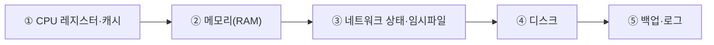
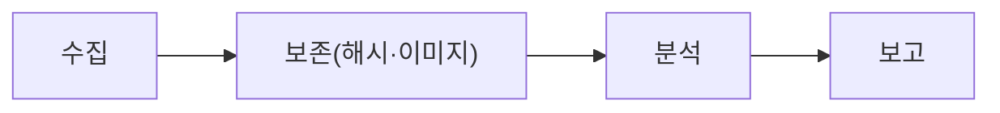
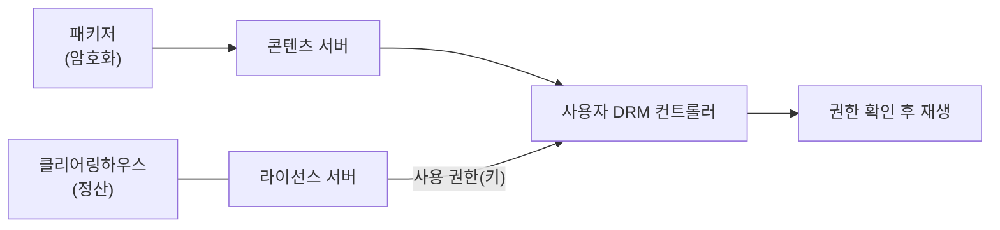

> 이 글은 **순수 이론** 입니다. 동적분석(strace)·포렌식 기초 실습은 다음 글(09-2, 09-3)에서 합니다.  
> 메모리 포렌식(Volatility)은 1학년에 과하므로 **데모(🔴)** 로만 다룹니다.
{: .prompt-info }

## 1. 동적분석 — 실행하면서 관찰하기

08장의 **정적분석(SAST)** 이 "코드를 안 돌리고" 검사했다면, **동적분석(DAST)** 은 프로그램을 **실제로 실행하면서** 행동을 관찰합니다.

| 구분 | 정적분석 | 동적분석 |
|---|---|---|
| 실행 | 안 함 | **함** |
| 보는 것 | 소스코드 패턴 | 실제 동작(시스템콜·네트워크·파일 접근) |
| 도구 | semgrep, bandit | **strace/ltrace**, 디버거, 퍼저, OWASP ZAP |

### 1.1 대표 기법

| 기법 | 설명 |
|---|---|
| **시스템콜 추적** | 프로그램이 OS에 어떤 요청(파일 열기·네트워크 등)을 하는지 관찰 (`strace`) |
| **퍼징(Fuzzing)** | 무작위·비정상 입력을 잔뜩 넣어 **충돌·예외** 를 유발해 버그 발견 |
| **디버깅** | 실행을 멈춰 가며 메모리·변수 상태 점검 |

> 정적·동적분석은 **상호 보완** 입니다. 둘 다 써야 사각지대가 줄어듭니다. (09-2에서 `strace` 로 동적분석을 체험)
{: .prompt-tip }

---

## 2. 디지털 포렌식 — 증거를 다루는 과학

**디지털 포렌식(Digital Forensics)** 은 사고가 났을 때, 디지털 증거를 **법적으로 인정받을 수 있게** 수집·분석하는 절차입니다.

### 2.1 포렌식의 4대 원칙 (시험 단골)

| 원칙 | 설명 |
|---|---|
| **무결성** | 증거가 **변경되지 않았음** 을 보장 (해시값으로 확인) |
| **연계보관성(Chain of Custody)** | 증거를 **누가·언제·어떻게** 다뤘는지 빠짐없이 기록 |
| **재현성** | 같은 절차로 분석하면 **같은 결과** 가 나와야 함 |
| **정당성·신속성** | 적법한 절차로, 휘발성 증거는 **빠르게** 확보 |

> 핵심: **무결성(안 바뀜) + 연계보관성(이력 추적)**. 이 둘이 무너지면 증거 능력을 잃습니다.
{: .prompt-warning }

### 2.2 증거 수집 순서 — 휘발성이 큰 것부터

전원을 끄면 사라지는 **휘발성 데이터** 부터 먼저 확보합니다.

| 단계 | 예 | 특징 |
|---|---|---|
| 휘발성 ↑ | 메모리(RAM), 네트워크 연결 | 전원 끄면 **사라짐** → 먼저 수집 |
| 휘발성 ↓ | 디스크, 백업 | 비교적 오래 남음 → 나중에 |

### 2.3 포렌식 절차와 도구

| 도구 | 용도 |
|---|---|
| **FTK Imager / dd** | 디스크를 **그대로 복제(이미지)** |
| **Autopsy** | 디스크 이미지에서 파일·흔적 분석(GUI) |
| **Volatility** | **메모리(RAM) 이미지** 분석 (🔴 데모) |
| **sha256sum / strings / exiftool** | 무결성 해시·문자열·메타데이터 추출 (09-3에서 실습) |

---

## 3. DRM — 콘텐츠 저작권 보호

**DRM(Digital Rights Management)** 은 음악·전자책·영상 같은 디지털 콘텐츠를 **허가받은 사람만** 쓰도록 통제하는 기술입니다. (불법 복제 방지)

### 3.1 DRM 구성요소 (시험 단골)

| 구성요소 | 역할 |
|---|---|
| **콘텐츠 패키저(Packager)** | 원본 콘텐츠를 **암호화·포장** |
| **콘텐츠 서버** | 포장된 콘텐츠를 **배포** |
| **라이선스 서버(License Server)** | 사용 권한(키·이용 조건)을 발급 |
| **클리어링하우스(Clearing House)** | 결제·이용내역 정산·관리 |
| **DRM 컨트롤러(클라이언트)** | 사용자 기기에서 **권한 확인 후 복호화·재생** |

> 핵심 흐름: **콘텐츠는 암호화해 배포**하고, **재생 권한(키)은 라이선스 서버가 따로 발급** 합니다. 그래서 파일만 복사해도 **권한이 없으면 못 엽니다.**
{: .prompt-tip }

---

## 4. 핵심 정리

- **동적분석**: 실행하며 관찰(시스템콜·퍼징·디버깅). 정적분석과 **상호 보완**.
- **포렌식 원칙**: **무결성·연계보관성**·재현성·정당성. 증거는 **휘발성 큰 것(메모리)부터** 수집.
- **포렌식 절차**: 수집→보존(해시·이미지)→분석→보고. 도구: dd/FTK, Autopsy, **Volatility(메모리, 🔴)**.
- **DRM 구성요소**: **패키저·콘텐츠서버·라이선스서버·클리어링하우스·DRM컨트롤러**. 콘텐츠는 암호화, 권한은 라이선스 서버가 발급.

> 다음 글(**09-2. strace로 동적분석 체험**)에서 프로그램의 실제 행동을 들여다봅니다.
{: .prompt-info }
