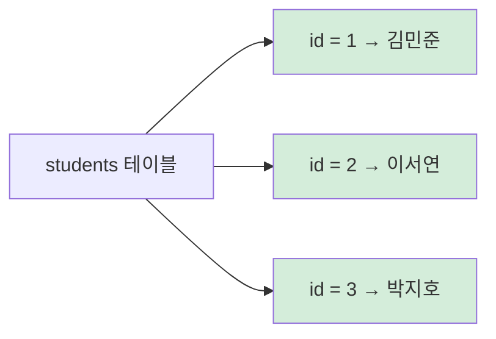
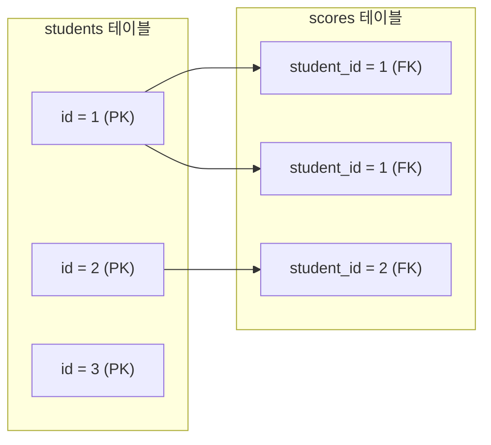
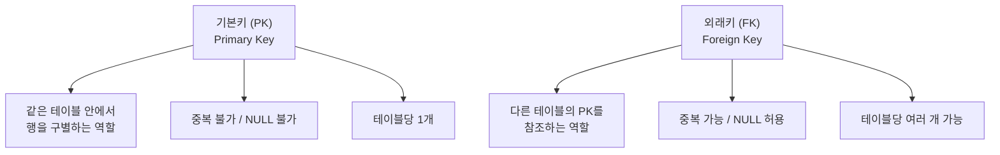
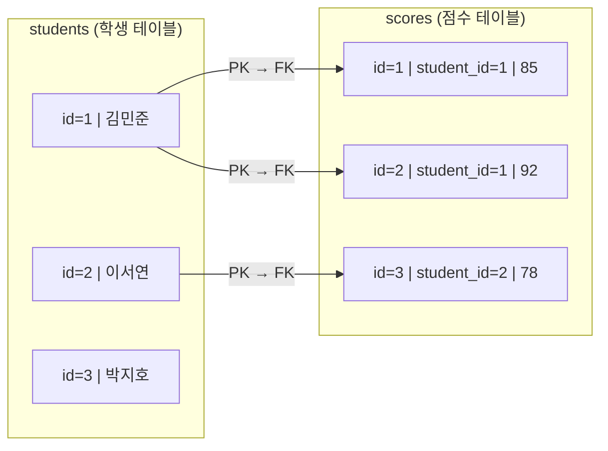
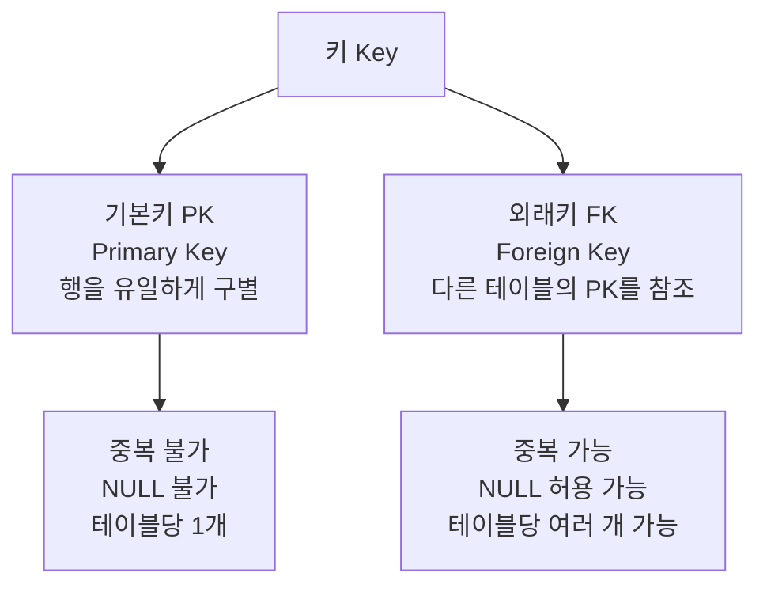
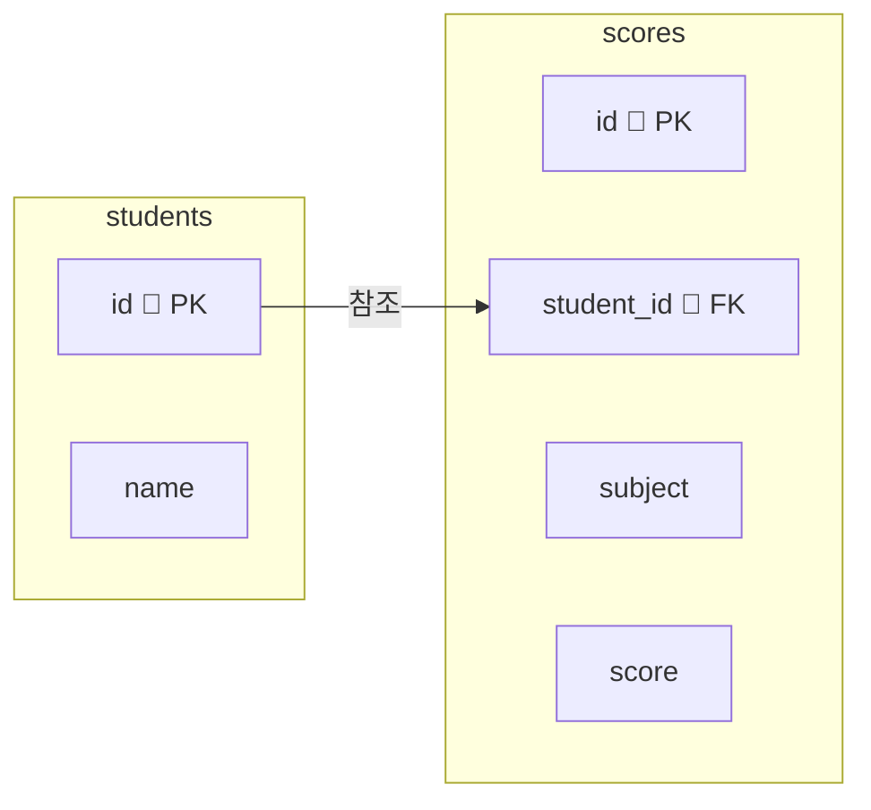

# 6-1 키(Key)와 제약조건

---

## 1부. 이론

### 1-1. 왜 키(Key)가 필요한가?

데이터베이스에서는 같은 이름을 가진 사람이 여러 명 있을 수 있다.  
예를 들어 학생 테이블에 '김민준'이 두 명이라면, 누가 누구인지 구분이 안 된다.

> 마치 반에서 이름이 같은 학생이 두 명일 때, 출석번호로 구분하는 것과 같다.  
> 데이터베이스에서 그 **출석번호 역할**을 하는 것이 바로 **키(Key)**이다.
{: .prompt-tip }

키(Key)는 **테이블에서 각 행(row)을 구별하거나, 테이블 사이를 연결하는 데 사용하는 칼럼**이다.

---

### 1-2. 기본키 (Primary Key, PK)

기본키(Primary Key, PK)는 **테이블 안에서 각 행을 유일하게 식별하는 칼럼**이다.



기본키의 3가지 필수 조건:

| 조건 | 의미 | 예시 |
|---|---|---|
| **유일성** | 같은 값이 두 번 나오면 안 됨 | id = 1 이 두 행이면 오류 |
| **NOT NULL** | 반드시 값이 있어야 함 | id가 비어 있으면 오류 |
| **불변성** | 한 번 정해지면 바꾸지 않는 것이 원칙 | id를 나중에 바꾸면 연결이 끊어짐 |

> 기본키로는 보통 **자동으로 증가하는 번호(`AUTO_INCREMENT`)**를 사용한다.  
> 이름, 이메일 같은 값은 나중에 바뀔 수 있어서 기본키로 적합하지 않다.
{: .prompt-info }

**기본키 지정 방법:**

```sql
CREATE TABLE students (
  id    INT         PRIMARY KEY AUTO_INCREMENT,
  name  VARCHAR(20) NOT NULL
);
```

---

### 1-3. 외래키 (Foreign Key, FK)

외래키(Foreign Key, FK)는 **다른 테이블의 기본키를 가리키는 칼럼**이다.  
두 테이블을 연결하는 다리 역할을 한다.

예를 들어 학생(students) 테이블과 점수(scores) 테이블이 있다고 하자.  
점수 테이블에는 어느 학생의 점수인지를 나타내는 칼럼이 필요하다.  
이때 students 테이블의 기본키(id)를 scores 테이블에서 외래키로 참조한다.



> 외래키는 **반드시 참조 대상 테이블의 기본키에 존재하는 값만** 입력할 수 있다.  
> 없는 학생 번호를 scores 테이블에 넣으려 하면 오류가 발생한다.
{: .prompt-warning }

**외래키 지정 방법:**

```sql
CREATE TABLE scores (
  id         INT  PRIMARY KEY AUTO_INCREMENT,
  student_id INT,
  score      INT,
  FOREIGN KEY (student_id) REFERENCES students(id)
);
```

- `FOREIGN KEY (student_id)` : 이 테이블의 `student_id` 칼럼이 외래키임을 선언
- `REFERENCES students(id)` : `students` 테이블의 `id` 칼럼을 참조함

---

### 1-4. 기본키 vs 외래키 한눈에 비교



---

### 1-5. 제약조건 (Constraint)

제약조건(Constraint)은 **칼럼에 저장할 수 있는 값의 규칙**이다.  
잘못된 데이터가 들어오는 것을 데이터베이스가 자동으로 막아준다.

| 제약조건 | 의미 | 예시 |
|---|---|---|
| `PRIMARY KEY` | 기본키 지정. 유일하고 NULL 불가 | `id INT PRIMARY KEY` |
| `AUTO_INCREMENT` | 행이 추가될 때 번호를 자동으로 1씩 증가 | `id INT AUTO_INCREMENT` |
| `NOT NULL` | NULL(빈 값) 저장 불가 | `name VARCHAR(20) NOT NULL` |
| `UNIQUE` | 같은 값 중복 불가 (NULL은 허용) | `email VARCHAR(50) UNIQUE` |
| `DEFAULT` | 값을 입력하지 않으면 기본값 자동 삽입 | `point INT DEFAULT 0` |
| `FOREIGN KEY` | 다른 테이블의 PK를 참조하는 외래키 지정 | `FOREIGN KEY (sid) REFERENCES students(id)` |

---

### 1-6. AUTO_INCREMENT 자세히 보기

`AUTO_INCREMENT`는 데이터를 넣을 때 **id 번호를 자동으로 부여**해주는 기능이다.  
직접 번호를 쓰지 않아도 1, 2, 3, 4 … 순서로 자동으로 채워진다.

```sql
-- id를 생략하고 INSERT하면 자동으로 번호가 붙음
INSERT INTO students (name) VALUES ('김민준');  -- id = 1 자동 부여
INSERT INTO students (name) VALUES ('이서연');  -- id = 2 자동 부여
INSERT INTO students (name) VALUES ('박지호');  -- id = 3 자동 부여
```

> `AUTO_INCREMENT`는 항상 `PRIMARY KEY`와 함께 쓴다.  
> 숫자형(`INT`) 칼럼에만 사용할 수 있다.
{: .prompt-info }

---

### 1-7. 두 테이블이 연결되는 구조

기본키와 외래키로 두 테이블을 연결하면 아래처럼 데이터가 이어진다.



- 김민준(id=1)은 점수가 85점, 92점 — 두 행이 연결됨
- 이서연(id=2)은 점수가 78점 — 한 행이 연결됨
- 박지호(id=3)는 아직 점수가 없음 — 연결된 행 없음

이처럼 한 학생이 여러 점수를 가질 수 있는 구조를 **일대다(1:N) 관계**라고 한다.

---

## 2부. 실습

> 아래 SQL을 MySQL 워크벤치에서 **위에서부터 순서대로** 실행한다.
{: .prompt-tip }

---

### STEP 1. 데이터베이스 만들기

```sql
CREATE DATABASE key_db;
USE key_db;
```

---

### STEP 2. 학생 테이블 만들기 (기본키 포함)

```sql
CREATE TABLE students (
  id    INT          PRIMARY KEY AUTO_INCREMENT,
  name  VARCHAR(20)  NOT NULL
);
```

칼럼 설명:

| 칼럼 | 자료형 | 제약조건 | 의미 |
|---|---|---|---|
| `id` | INT | PRIMARY KEY, AUTO_INCREMENT | 학생 번호 (자동 증가) |
| `name` | VARCHAR(20) | NOT NULL | 학생 이름 (빈 값 불가) |

> `id`는 직접 입력하지 않아도 자동으로 1, 2, 3 … 이 붙는다.
{: .prompt-info }

---

### STEP 3. 점수 테이블 만들기 (외래키 포함)

```sql
CREATE TABLE scores (
  id         INT  PRIMARY KEY AUTO_INCREMENT,
  student_id INT  NOT NULL,
  subject    VARCHAR(20) NOT NULL,
  score      INT  NOT NULL,
  FOREIGN KEY (student_id) REFERENCES students(id)
);
```

칼럼 설명:

| 칼럼 | 자료형 | 제약조건 | 의미 |
|---|---|---|---|
| `id` | INT | PRIMARY KEY, AUTO_INCREMENT | 점수 번호 (자동 증가) |
| `student_id` | INT | NOT NULL, **FOREIGN KEY** | 어느 학생의 점수인지 (students.id 참조) |
| `subject` | VARCHAR(20) | NOT NULL | 과목 이름 |
| `score` | INT | NOT NULL | 점수 |

> `FOREIGN KEY (student_id) REFERENCES students(id)` 는  
> "student_id 칼럼은 students 테이블의 id 칼럼을 가리킨다"는 선언이다.
{: .prompt-info }

---

### STEP 4. 테이블 구조 확인

두 테이블이 제대로 만들어졌는지 확인한다.

```sql
DESC students;
DESC scores;
```

---

### STEP 5. 학생 데이터 넣기

`id`는 `AUTO_INCREMENT`이므로 생략하고 `name`만 넣는다.

```sql
INSERT INTO students (name) VALUES ('김민준');
INSERT INTO students (name) VALUES ('이서연');
INSERT INTO students (name) VALUES ('박지호');
```

확인:

```sql
SELECT * FROM students;
```

결과:

```
id | name
 1 | 김민준
 2 | 이서연
 3 | 박지호
```

> id가 자동으로 1, 2, 3이 붙은 것을 확인할 수 있다. ✅
{: .prompt-info }

---

### STEP 6. 점수 데이터 넣기

`student_id`에 앞에서 확인한 학생 번호를 입력한다.

```sql
INSERT INTO scores (student_id, subject, score) VALUES (1, '국어', 85);
INSERT INTO scores (student_id, subject, score) VALUES (1, '수학', 92);
INSERT INTO scores (student_id, subject, score) VALUES (2, '국어', 78);
INSERT INTO scores (student_id, subject, score) VALUES (2, '수학', 88);
INSERT INTO scores (student_id, subject, score) VALUES (3, '국어', 95);
INSERT INTO scores (student_id, subject, score) VALUES (3, '수학', 71);
```

확인:

```sql
SELECT * FROM scores;
```

결과:

```
id | student_id | subject | score
 1 |     1      |  국어   |  85
 2 |     1      |  수학   |  92
 3 |     2      |  국어   |  78
 4 |     2      |  수학   |  88
 5 |     3      |  국어   |  95
 6 |     3      |  수학   |  71
```

---

### STEP 7. 외래키 제약조건 확인하기

외래키가 제대로 작동하는지 확인해본다.  
**존재하지 않는 학생 번호(id=99)**로 점수를 넣어보자.

```sql
INSERT INTO scores (student_id, subject, score) VALUES (99, '영어', 80);
```

> 아래와 같은 오류가 발생한다.
{: .prompt-danger }

```
ERROR 1452: Cannot add or update a child row:
a foreign key constraint fails
```

오류 메시지 해석:  
"students 테이블에 id=99인 학생이 없기 때문에, scores에 넣을 수 없다."

이것이 바로 **외래키 제약조건의 핵심**이다.  
존재하지 않는 학생의 점수를 실수로 넣는 것을 데이터베이스가 자동으로 막아준다.

---

### STEP 8. 키로 연결해서 조회하기

두 테이블을 키로 연결하면 **학생 이름과 점수를 함께 조회**할 수 있다.

```sql
SELECT students.name    AS 학생이름,
       scores.subject   AS 과목,
       scores.score     AS 점수
FROM scores, students
WHERE scores.student_id = students.id;
```

> `FROM scores, students` 처럼 **사용하는 두 테이블을 모두 적고**, `WHERE`절에서 두 테이블의 키를 같다고 연결하면 두 테이블의 데이터를 함께 볼 수 있다.  
> (이것이 나중에 배울 JOIN의 기초 원리이기도 하다.)
{: .prompt-tip }

결과:

```
학생이름 | 과목 | 점수
김민준   | 국어 |  85
김민준   | 수학 |  92
이서연   | 국어 |  78
이서연   | 수학 |  88
박지호   | 국어 |  95
박지호   | 수학 |  71
```

---

### STEP 9. 특정 학생 점수만 조회하기

김민준(id=1)의 점수만 보고 싶다면:

```sql
SELECT students.name   AS 학생이름,
       scores.subject  AS 과목,
       scores.score    AS 점수
FROM scores, students
WHERE scores.student_id = students.id
  AND students.id = 1;
```

---

## 3부. 정리

### 키 개념 요약



---

### 제약조건 요약

| 제약조건 | 역할 | 함께 쓰는 대상 |
|---|---|---|
| `PRIMARY KEY` | 행을 유일하게 식별 | 모든 테이블의 id 칼럼 |
| `AUTO_INCREMENT` | 번호 자동 증가 | PK와 함께 사용 |
| `NOT NULL` | 빈 값 금지 | 반드시 값이 필요한 칼럼 |
| `UNIQUE` | 중복 값 금지 | 이메일, 전화번호 등 |
| `DEFAULT` | 기본값 자동 입력 | 초기값이 필요한 칼럼 |
| `FOREIGN KEY` | 다른 테이블과 연결 | 참조 관계가 있는 칼럼 |

---

### 두 테이블 연결 구조 복습



- `students.id` (PK) ← `scores.student_id` (FK) 로 연결
- 한 학생(students)은 여러 점수(scores)를 가질 수 있음 → **1:N 관계**

---

> 다음 글(6-2)에서는 테이블 3개 이상을 연결하는 구조(관계 설계)를 배운다.
{: .prompt-info }
