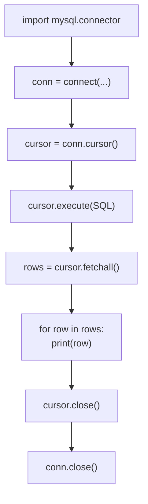

# 6-3 파이썬으로 두 테이블 다루기

6-1에서 만든 `key_db`(학생-점수),  
6-2에서 만든 `library_db`(도서-대출)를  
파이썬 코드로 직접 다뤄본다.

> 파이썬으로 MySQL에 접속하는 방법은 4-3에서 이미 배웠다.  
> 이번에는 **외래키로 연결된 테이블 2개**를 다루는 것이 핵심이다.
{: .prompt-tip }

---

## 1부. 준비

### 1-1. 라이브러리 설치 확인

아직 설치하지 않았다면 아래 명령어를 터미널에서 실행한다.

```bash
pip install mysql-connector-python
```

---

### 1-2. 파이썬에서 MySQL 연결 기본 구조 복습

```python
import mysql.connector

conn = mysql.connector.connect(
    host="localhost",      # DB 서버 주소
    user="root",           # DB 계정
    password="비밀번호",   # 본인 비밀번호로 변경
    database="DB이름",     # 사용할 DB
    charset="utf8mb4"      # 한글 처리
)

cursor = conn.cursor()     # SQL 실행 도구 생성

# --- SQL 실행 ---

cursor.close()             # cursor 닫기
conn.close()               # 연결 닫기
```

> `cursor`는 SQL을 실행하는 도구이고, `conn`은 MySQL 서버와의 연결이다.  
> 사용이 끝나면 반드시 `close()`로 닫아야 한다.
{: .prompt-info }

---

## 2부. 실습 A — key_db (학생-점수)

> 6-1에서 만든 `key_db`와 `students`, `scores` 테이블을 사용한다.  
> 아직 만들지 않았다면 6-1 실습을 먼저 진행한다.
{: .prompt-warning }

---

### 파일명: `step6_3_students.py`

코드를 **3단계**로 나눠서 이해하자.

---

#### 단계 1 — DB 연결

```python
import mysql.connector

# MySQL 서버에 접속한다
conn = mysql.connector.connect(
    host="localhost",
    user="root",
    password="비밀번호",   # ← 본인 비밀번호로 변경
    database="key_db",     # 6-1에서 만든 DB
    charset="utf8mb4"
)

cursor = conn.cursor()
print("DB 연결 성공!")
```

---

#### 단계 2 — 학생 목록 조회 (students 테이블)

```python
# students 테이블 전체 조회
print("\n[학생 목록]")
cursor.execute("SELECT id, name FROM students")

rows = cursor.fetchall()          # 결과를 한꺼번에 가져온다
for row in rows:
    print(f"  번호: {row[0]}, 이름: {row[1]}")
```

실행 결과:

```
[학생 목록]
  번호: 1, 이름: 김민준
  번호: 2, 이름: 이서연
  번호: 3, 이름: 박지호
```

---

#### 단계 3 — 점수 목록 조회 (두 테이블 연결)

```python
# students와 scores를 키로 연결해서 조회
print("\n[학생별 점수]")
sql = """
SELECT students.name, scores.subject, scores.score
FROM scores, students
WHERE scores.student_id = students.id
"""
cursor.execute(sql)

rows = cursor.fetchall()
for row in rows:
    # row[0]=학생이름, row[1]=과목, row[2]=점수
    print(f"  {row[0]} | {row[1]} | {row[2]}점")

cursor.close()
conn.close()
```

실행 결과:

```
[학생별 점수]
  김민준 | 국어 | 85점
  김민준 | 수학 | 92점
  이서연 | 국어 | 78점
  이서연 | 수학 | 88점
  박지호 | 국어 | 95점
  박지호 | 수학 | 71점
```

---

### 전체 코드 한번에 보기

파일명: `step6_3_students.py`

```python
import mysql.connector

# ① DB 연결
conn = mysql.connector.connect(
    host="localhost",
    user="root",
    password="비밀번호",
    database="key_db",
    charset="utf8mb4"
)
cursor = conn.cursor()
print("DB 연결 성공!")

# ② 학생 목록 조회
print("\n[학생 목록]")
cursor.execute("SELECT id, name FROM students")
for row in cursor.fetchall():
    print(f"  번호: {row[0]}, 이름: {row[1]}")

# ③ 두 테이블 연결해서 점수 조회
print("\n[학생별 점수]")
sql = """
SELECT students.name, scores.subject, scores.score
FROM scores, students
WHERE scores.student_id = students.id
"""
cursor.execute(sql)
for row in cursor.fetchall():
    print(f"  {row[0]} | {row[1]} | {row[2]}점")

# ④ 연결 종료
cursor.close()
conn.close()
print("\n프로그램 종료")
```

---

### 실행

```bash
python step6_3_students.py
```

---

## 3부. 실습 B — library_db (도서-대출)

> 6-2에서 만든 `library_db`와 `books`, `rentals` 테이블을 사용한다.
{: .prompt-warning }

---

### 파일명: `step6_3_library.py`

이번에는 **input()으로 책 번호를 입력받아** 해당 책의 대출 기록을 조회한다.

```python
import mysql.connector

# ① DB 연결
conn = mysql.connector.connect(
    host="localhost",
    user="root",
    password="비밀번호",   # ← 본인 비밀번호로 변경
    database="library_db", # 6-2에서 만든 DB
    charset="utf8mb4"
)
cursor = conn.cursor()

# ② 도서 목록 먼저 출력 (어떤 책이 있는지 안내)
print("=== 도서 대출 조회 프로그램 ===")
print("\n[보유 도서 목록]")

cursor.execute("SELECT id, title, author FROM books")
for row in cursor.fetchall():
    # row[0]=id, row[1]=제목, row[2]=저자
    print(f"  {row[0]}번. {row[1]} ({row[2]})")

# ③ 조회할 책 번호 입력받기
print()
book_id = input("조회할 책 번호를 입력하세요: ").strip()

# ④ 숫자 입력인지 확인
if not book_id.isdigit():
    print("숫자로 입력해야 합니다.")
else:
    # ⑤ 해당 책의 대출 기록 조회 (두 테이블 연결)
    sql = """
    SELECT books.title, rentals.member, rentals.rdate
    FROM rentals, books
    WHERE rentals.book_id = books.id
      AND books.id = %s
    """
    # %s 자리에 book_id 값을 안전하게 넣는다
    cursor.execute(sql, (int(book_id),))
    rows = cursor.fetchall()

    if rows:
        print(f"\n[대출 기록]")
        for row in rows:
            # row[0]=책제목, row[1]=대출자, row[2]=대출일
            print(f"  책: {row[0]} | 대출자: {row[1]} | 날짜: {row[2]}")
    else:
        print("\n대출 기록이 없거나 존재하지 않는 책 번호입니다.")

# ⑥ 연결 종료
cursor.close()
conn.close()
print("\n프로그램 종료")
```

---

### 실행

```bash
python step6_3_library.py
```

---

### 실행 예시

책 번호 `1`을 입력한 경우:

```
=== 도서 대출 조회 프로그램 ===

[보유 도서 목록]
  1번. 어린왕자 (생텍쥐페리)
  2번. 해리포터 (J.K.롤링)
  3번. 1984 (조지오웰)
  4번. 데미안 (헤르만헤세)

조회할 책 번호를 입력하세요: 1

[대출 기록]
  책: 어린왕자 | 대출자: 김민준 | 날짜: 2026-03-01
  책: 어린왕자 | 대출자: 박지호 | 날짜: 2026-03-05

프로그램 종료
```

존재하지 않는 번호 `99`를 입력한 경우:

```
조회할 책 번호를 입력하세요: 99

대출 기록이 없거나 존재하지 않는 책 번호입니다.
```

> 파이썬에서는 외래키 오류가 발생하지 않는다.  
> 없는 번호를 입력해도 그냥 결과가 0건으로 나온다.  
> 외래키 제약조건은 **INSERT할 때만** 작동한다.
{: .prompt-info }

---

## 4부. 코드 핵심 포인트 정리

### fetchall() vs fetchone()

| 메서드 | 동작 | 사용 시점 |
|---|---|---|
| `cursor.fetchall()` | 결과 전체를 리스트로 가져옴 | 여러 행이 나올 때 |
| `cursor.fetchone()` | 결과 첫 번째 행만 가져옴 | 결과가 1개일 때 |

```python
# fetchall 사용 예
rows = cursor.fetchall()
for row in rows:
    print(row)

# fetchone 사용 예
row = cursor.fetchone()
if row:
    print(row)
```

---

### %s 바인딩 — 값을 안전하게 넣는 방법

SQL 안에 변수를 직접 넣으면 보안 문제가 생길 수 있다.  
`%s`를 사용해서 값을 분리해서 넣어야 한다.

```python
# ❌ 잘못된 방법 — 변수를 문자열로 직접 붙임
cursor.execute("SELECT * FROM books WHERE id = " + book_id)

# ✅ 올바른 방법 — %s로 분리해서 안전하게 넣음
cursor.execute("SELECT * FROM books WHERE id = %s", (book_id,))
```

> `(book_id,)` 처럼 **튜플 형태**로 넘겨야 한다.  
> 값이 하나여도 쉼표(`,`)를 반드시 붙인다.
{: .prompt-warning }

---

### 두 테이블 연결 SQL 구조 복습

```python
sql = """
SELECT 테이블A.칼럼, 테이블B.칼럼
FROM 테이블B, 테이블A
WHERE 테이블B.외래키 = 테이블A.기본키
"""
cursor.execute(sql)
```


---

## 5부. 전체 흐름 정리



| 단계 | 코드 | 역할 |
|---|---|---|
| 연결 | `connect(...)` | MySQL 서버에 접속 |
| 도구 생성 | `conn.cursor()` | SQL 실행 도구 만들기 |
| SQL 실행 | `cursor.execute(sql)` | 쿼리 전송 |
| 결과 받기 | `cursor.fetchall()` | 전체 결과 가져오기 |
| 종료 | `cursor.close()` / `conn.close()` | 연결 정리 |

---

> 다음 글(6-4)에서는 파이썬으로 데이터를 **직접 INSERT**하고 **삭제**하는 방법을 배운다.
{: .prompt-info }
