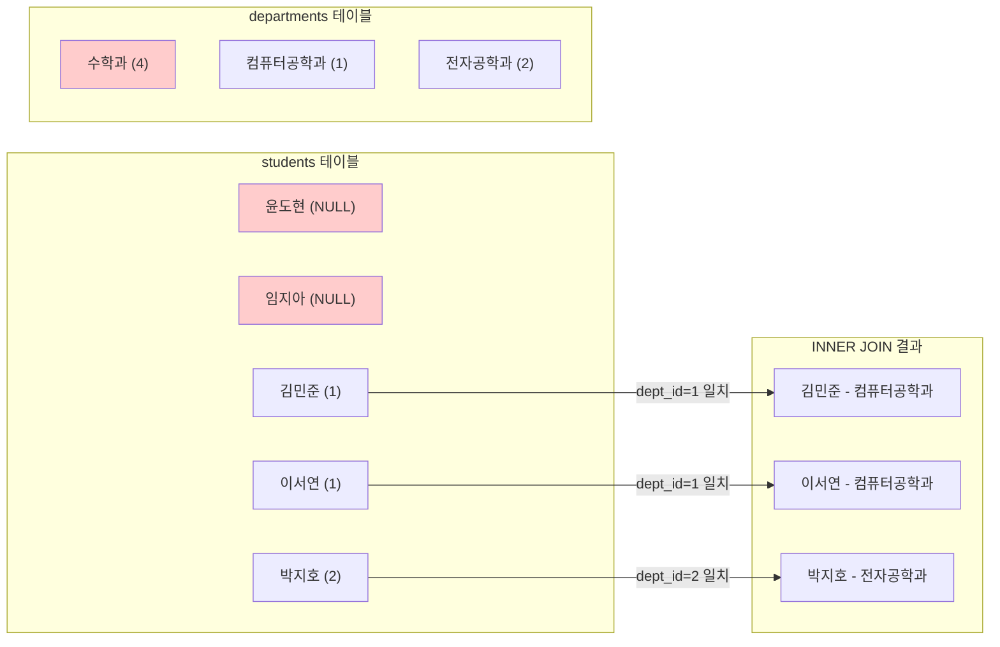
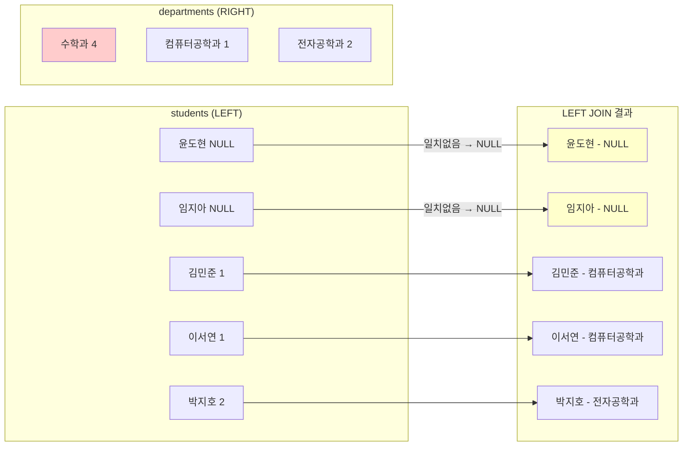
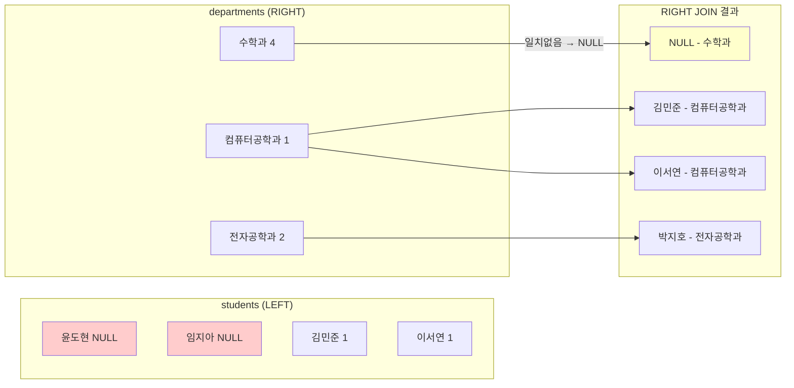
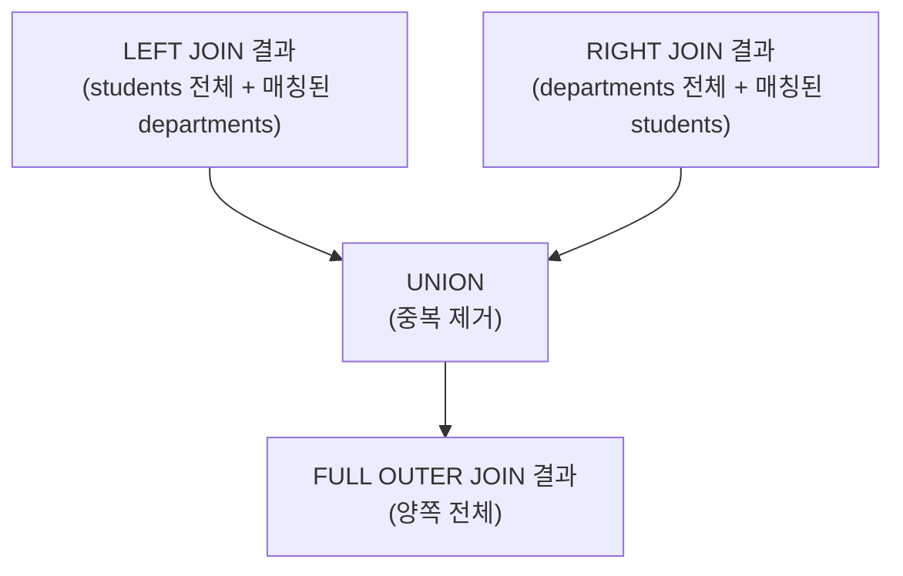
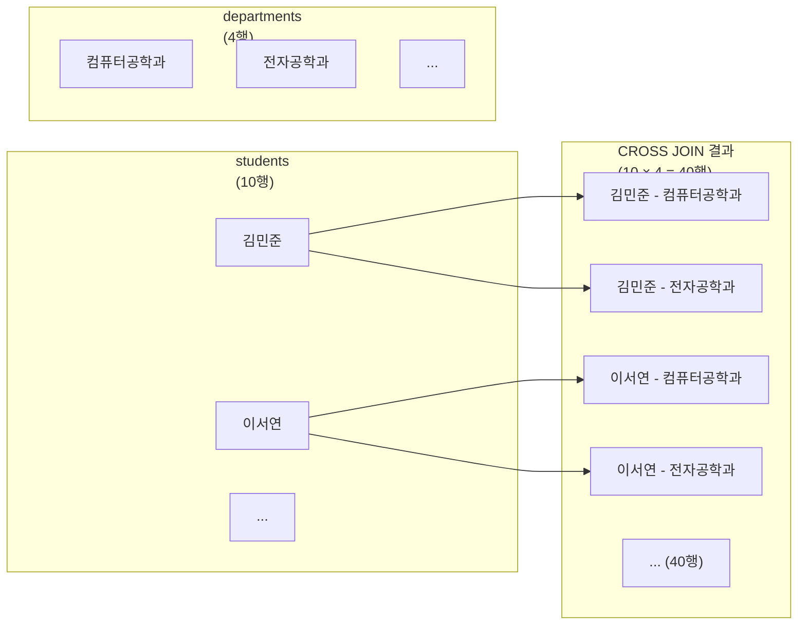
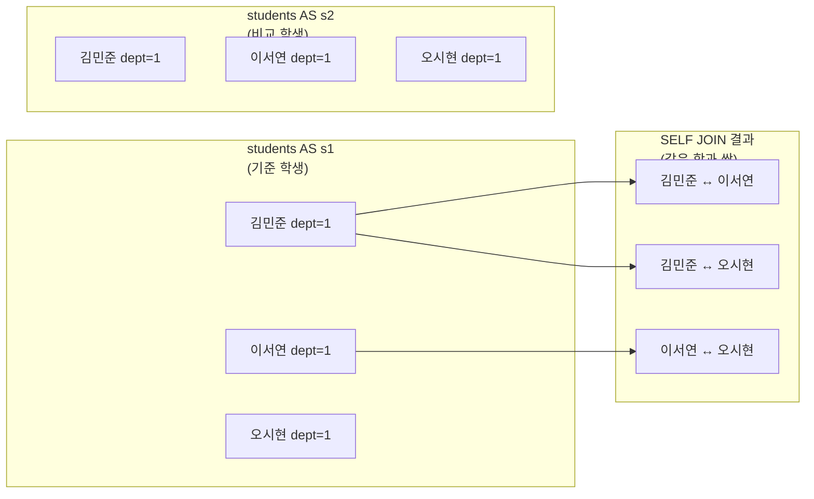

# [11주차] MySQL JOIN - 테이블 조인의 모든 것

> 💡 **이번 강의 학습 목표**
> - 관계형 데이터베이스에서 JOIN이 필요한 이유를 이해한다.
> - INNER JOIN, LEFT OUTER JOIN, RIGHT OUTER JOIN, FULL OUTER JOIN, CROSS JOIN, SELF JOIN의 차이를 설명할 수 있다.
> - MySQL Workbench를 통해 각 JOIN 형태를 직접 실습한다.
> - 다양한 조건과 결합한 JOIN 쿼리를 작성할 수 있다.
{: .prompt-tip }

---

## 1. 준비 사항

> ⚠️ 실습 전 MySQL Workbench가 설치되어 있어야 합니다. Workbench를 열고 로컬 서버에 연결한 상태에서 시작하세요.
{: .prompt-warning }

---

## 2. 실습 데이터베이스 만들기

### 2-1. 데이터베이스 생성

MySQL Workbench의 **Query 창**에 아래 SQL을 입력하고 실행(⚡ 번개 버튼 또는 `Ctrl+Enter`)합니다.

```sql
-- 데이터베이스가 이미 있으면 삭제 후 새로 만들기
DROP DATABASE IF EXISTS JOIN_STUDY;
CREATE DATABASE JOIN_STUDY;

-- 방금 만든 데이터베이스 사용
USE JOIN_STUDY;
```

> 💡 `USE JOIN_STUDY;` 를 실행해야 이후 쿼리가 이 데이터베이스에 적용됩니다. 항상 먼저 실행하세요!
{: .prompt-tip }

---

### 2-2. 테이블 생성

실습에는 **학과(departments)** 테이블과 **학생(students)** 테이블 두 개를 사용합니다.

#### departments 테이블

```sql
CREATE TABLE departments (
    dept_id   INT          PRIMARY KEY,
    dept_name VARCHAR(50)  NOT NULL,
    building  VARCHAR(50)  NOT NULL
);
```

| 컬럼 | 타입 | 설명 |
|------|------|------|
| dept_id | INT (기본키) | 학과 고유 번호 |
| dept_name | VARCHAR(50) | 학과 이름 |
| building | VARCHAR(50) | 건물 이름 |

#### students 테이블

```sql
CREATE TABLE students (
    student_id INT          PRIMARY KEY AUTO_INCREMENT,
    name       VARCHAR(50)  NOT NULL,
    dept_id    INT          NULL,
    grade      INT          NOT NULL
);
```

| 컬럼 | 타입 | 설명 |
|------|------|------|
| student_id | INT (기본키, 자동증가) | 학생 고유 번호 |
| name | VARCHAR(50) | 학생 이름 |
| dept_id | INT (NULL 허용) | 소속 학과 번호 (없으면 NULL) |
| grade | INT | 학년 (1~4) |

> 💡 `dept_id`를 NULL 허용으로 설정한 이유: 아직 학과가 배정되지 않은 학생을 표현하기 위해서입니다. OUTER JOIN을 실습할 때 이 학생들이 나타납니다.
{: .prompt-tip }

---

### 2-3. 데이터 입력 (INSERT)

#### 학과 데이터

```sql
INSERT INTO departments (dept_id, dept_name, building) VALUES
(1, '컴퓨터공학과', 'A동'),
(2, '전자공학과',   'B동'),
(3, '경영학과',     'C동'),
(4, '수학과',       'D동');
```

#### 학생 데이터

```sql
INSERT INTO students (name, dept_id, grade) VALUES
('김민준', 1, 1),    -- 컴퓨터공학과 1학년
('이서연', 1, 2),    -- 컴퓨터공학과 2학년
('박지호', 2, 1),    -- 전자공학과 1학년
('최수아', 2, 3),    -- 전자공학과 3학년
('정우진', 3, 2),    -- 경영학과 2학년
('한예린', 3, 4),    -- 경영학과 4학년
('오시현', 1, 3),    -- 컴퓨터공학과 3학년
('윤도현', NULL, 1), -- 학과 미배정 1학년
('임지아', NULL, 2), -- 학과 미배정 2학년
('강태양', 2, 2);    -- 전자공학과 2학년
```

> 💡 `수학과(dept_id=4)`에는 학생이 없고, `윤도현`과 `임지아`는 학과가 NULL입니다. 이 상태를 확인하며 JOIN의 차이를 배웁니다.
{: .prompt-info }

#### 데이터 확인

```sql
SELECT * FROM departments;
SELECT * FROM students;
```

**departments 결과:**

| dept_id | dept_name | building |
|---------|-----------|----------|
| 1 | 컴퓨터공학과 | A동 |
| 2 | 전자공학과 | B동 |
| 3 | 경영학과 | C동 |
| 4 | 수학과 | D동 |

**students 결과:**

| student_id | name | dept_id | grade |
|------------|------|---------|-------|
| 1 | 김민준 | 1 | 1 |
| 2 | 이서연 | 1 | 2 |
| 3 | 박지호 | 2 | 1 |
| 4 | 최수아 | 2 | 3 |
| 5 | 정우진 | 3 | 2 |
| 6 | 한예린 | 3 | 4 |
| 7 | 오시현 | 1 | 3 |
| 8 | 윤도현 | NULL | 1 |
| 9 | 임지아 | NULL | 2 |
| 10 | 강태양 | 2 | 2 |

---

## 3. JOIN이란 무엇인가?

**JOIN**이란 두 개 이상의 테이블을 **공통된 값(키)**을 기준으로 연결하여 하나의 결과로 만드는 SQL 명령입니다.

예를 들어, 학생 이름과 소속 학과 이름을 함께 보고 싶다면 `students` 테이블과 `departments` 테이블을 `dept_id`를 기준으로 연결해야 합니다.

---

## 4. JOIN 종류와 다이어그램

MySQL에서 사용하는 JOIN의 종류와 각각의 개념을 다이어그램으로 확인합니다.

### 4-1. INNER JOIN

두 테이블에서 **공통으로 일치하는 행만** 반환합니다. 한쪽에만 있는 데이터는 제외됩니다.



> 핵심: **양쪽 모두** 값이 있어야 결과에 포함됩니다.
{: .prompt-info }

**언제 사용하나요?**
- 두 테이블에 모두 존재하는 데이터만 보고 싶을 때 사용합니다.
- 학생과 학과처럼 정상적으로 연결된 데이터만 조회할 때 가장 많이 사용합니다.
- 미배정 학생이나 학생이 없는 학과처럼 매칭되지 않는 행은 제외하고 싶을 때 적합합니다.

---

### 4-2. LEFT OUTER JOIN

**왼쪽 테이블(A)의 모든 행**을 반환합니다. 오른쪽 테이블(B)에 일치하는 값이 없으면 NULL로 채웁니다.



> 핵심: **왼쪽 테이블은 무조건 전부** 나옵니다. 오른쪽에 맞는 게 없으면 NULL.
{: .prompt-info }

**언제 사용하나요?**
- 왼쪽 테이블을 기준으로 전체 목록을 빠짐없이 보여주고 싶을 때 사용합니다.
- 학생 전체를 보여주면서 학과가 없는 학생도 같이 확인하고 싶을 때 적합합니다.
- 왼쪽에는 있지만 오른쪽에는 없는 데이터를 찾을 때 자주 사용합니다.

---

### 4-3. RIGHT OUTER JOIN

**오른쪽 테이블(B)의 모든 행**을 반환합니다. 왼쪽 테이블(A)에 일치하는 값이 없으면 NULL로 채웁니다.



> 핵심: **오른쪽 테이블은 무조건 전부** 나옵니다. 왼쪽에 맞는 게 없으면 NULL.
{: .prompt-info }

**언제 사용하나요?**
- 오른쪽 테이블을 기준으로 전체를 보고 싶을 때 사용합니다.
- 모든 학과를 보여주면서 학생이 없는 학과도 포함하고 싶을 때 적합합니다.
- 다만 실무에서는 RIGHT JOIN 대신 테이블 위치를 바꾼 LEFT JOIN을 더 많이 사용합니다.

---

### 4-4. FULL OUTER JOIN

**양쪽 테이블의 모든 행**을 반환합니다. 즉, 한쪽에만 있는 행도 모두 포함합니다.



> 핵심: 양쪽 어느 테이블에 있든 **모두** 결과에 포함됩니다.
{: .prompt-info }

**언제 사용하나요?**
- 두 테이블의 전체 데이터를 한 번에 비교하고 싶을 때 사용합니다.
- 학생은 있는데 학과가 없는 경우와 학과는 있는데 학생이 없는 경우를 동시에 보고 싶을 때 유용합니다.
- MySQL은 FULL OUTER JOIN 문법을 직접 지원하지 않으므로, 이 강의에서는 개념 이해까지만 해도 충분합니다.

---

### 4-5. CROSS JOIN

두 테이블의 **모든 행을 서로 조합**합니다. 조건 없이 곱셈처럼 동작합니다. (students 10명 × departments 4개 = 40행)



> ⚠️ CROSS JOIN은 데이터가 많을수록 결과 행 수가 폭발적으로 증가합니다. 실무에서는 신중하게 사용해야 합니다.
{: .prompt-warning }

**언제 사용하나요?**
- 가능한 모든 조합을 만들어야 할 때 사용합니다.
- 예를 들어 모든 학생-모든 과목 조합, 모든 날짜-모든 상품 조합을 만들 때 유용합니다.
- 일반적인 조회에서는 잘 쓰지 않으며, 행 수가 급격히 커질 수 있어 주의해야 합니다.

---

### 4-6. SELF JOIN

**같은 테이블을 자기 자신과 조인**합니다. 별칭(alias)을 다르게 붙여 두 개의 테이블처럼 사용합니다.



> 핵심: 같은 테이블을 두 번 사용하므로 반드시 별칭(AS)을 붙여야 합니다.
{: .prompt-info }

**언제 사용하나요?**
- 같은 테이블 안의 행끼리 서로 비교해야 할 때 사용합니다.
- 같은 학과 학생끼리 짝을 만들거나, 같은 학년 학생끼리 비교할 때 적합합니다.
- 직원과 관리자처럼 자기 자신을 참조하는 구조를 조회할 때도 자주 사용합니다.

---

## 5. 실습 예제 (총 20개)

> 💡 각 예제의 SQL을 Workbench에 직접 입력하고 실행해보세요. 예상 결과와 비교해 확인합니다.
{: .prompt-tip }

---

### 예제 1: 학생과 학과 기본 연결 (INNER JOIN)

**설명:** 학생 이름과 소속 학과 이름을 함께 조회합니다. 학과가 없는 학생(윤도현, 임지아)과 학생이 없는 학과(수학과)는 제외됩니다.

```sql
USE JOIN_STUDY;

SELECT students.name, departments.dept_name
FROM students
INNER JOIN departments ON students.dept_id = departments.dept_id
ORDER BY students.student_id;
```

**🔗 JOIN 연결 구조:**

```
students 테이블              departments 테이블
─────────────────────────    ──────────────────────
student_id │ name   │dept_id  dept_id │ dept_name
───────────┼────────┼───────  ────────┼─────────────
    1      │ 김민준 │   1   ──→   1   │ 컴퓨터공학과
    2      │ 이서연 │   1   ──→   1   │ 컴퓨터공학과
    3      │ 박지호 │   2   ──→   2   │ 전자공학과
    8      │ 윤도현 │  NULL ──✗  (없음, 제외됨)
    -      │   -    │   4   (수학과 학생 없음, 제외됨)
```

- **연결 기준:** `students.dept_id = departments.dept_id`
- `students`의 `dept_id`와 `departments`의 `dept_id`가 **같은 숫자**인 행끼리만 연결됩니다.
- `dept_id = NULL`인 윤도현·임지아는 어떤 학과와도 일치하지 않으므로 INNER JOIN에서 **제외**됩니다.
- `departments`의 `dept_id = 4`(수학과)에 해당하는 학생이 없으므로 수학과도 **제외**됩니다.

**📝 SQL 라인별 설명:**

| 구문 | 설명 |
|------|------|
| `SELECT students.name, departments.dept_name` | `students` 테이블에서 `name`, `departments` 테이블에서 `dept_name`을 가져옵니다. `테이블명.컬럼명` 형식으로 어느 테이블의 컬럼인지 명확히 표시합니다 |
| `FROM students` | 데이터를 가져올 기준(왼쪽) 테이블을 `students`로 지정합니다 |
| `INNER JOIN departments` | `departments` 테이블을 INNER JOIN으로 연결합니다. 양쪽에 일치하는 행만 결과에 포함됩니다 |
| `ON students.dept_id = departments.dept_id` | JOIN의 연결 조건입니다. 두 테이블에서 `dept_id` 값이 같은 행끼리 연결합니다 |
| `ORDER BY students.student_id` | 결과를 `student_id` 기준 오름차순(1→10)으로 정렬합니다 |

**예상 결과:**

| name | dept_name |
|------|-----------|
| 김민준 | 컴퓨터공학과 |
| 이서연 | 컴퓨터공학과 |
| 박지호 | 전자공학과 |
| 최수아 | 전자공학과 |
| 정우진 | 경영학과 |
| 한예린 | 경영학과 |
| 오시현 | 컴퓨터공학과 |
| 강태양 | 전자공학과 |

> 학과 미배정 학생 2명(윤도현, 임지아)과 수학과는 결과에 없습니다.
{: .prompt-info }

---

### 예제 2: 특정 학과 학생 조회 (INNER JOIN + WHERE)

**설명:** 컴퓨터공학과 학생만 조회합니다. JOIN으로 두 테이블을 먼저 연결한 뒤, WHERE로 원하는 학과만 필터링합니다.

```sql
SELECT students.name, departments.dept_name
FROM students
INNER JOIN departments ON students.dept_id = departments.dept_id
WHERE departments.dept_name = '컴퓨터공학과';
```

**🔗 JOIN 연결 구조:**

```
처리 순서: ① INNER JOIN 실행 → ② WHERE 필터링

① INNER JOIN: students.dept_id = departments.dept_id 로 8행 연결

② WHERE departments.dept_name = '컴퓨터공학과' 적용
   ─────────────────────────────────────────────
   김민준(dept_id=1, 컴퓨터공학과) → ✅ 통과
   이서연(dept_id=1, 컴퓨터공학과) → ✅ 통과
   박지호(dept_id=2, 전자공학과)   → ✗ 제외
   오시현(dept_id=1, 컴퓨터공학과) → ✅ 통과

최종: 3행
```

- JOIN은 모든 일치 행을 먼저 합친 뒤, WHERE가 그 결과를 필터링하는 순서로 동작합니다.
- JOIN된 **오른쪽 테이블의 컬럼**(`departments.dept_name`)으로도 자유롭게 필터링할 수 있습니다.

**📝 SQL 라인별 설명:**

| 구문 | 설명 |
|------|------|
| `SELECT students.name, departments.dept_name` | 학생 이름과 학과명을 선택합니다 |
| `FROM students` | 기준 테이블을 `students`로 지정합니다 |
| `INNER JOIN departments ON students.dept_id = departments.dept_id` | `dept_id`가 같은 행끼리 두 테이블을 연결합니다 |
| `WHERE departments.dept_name = '컴퓨터공학과'` | JOIN 결과 중 학과명이 정확히 `'컴퓨터공학과'`인 행만 남깁니다. 문자열 비교이므로 작은따옴표로 감쌉니다 |

**예상 결과:**

| name | dept_name |
|------|-----------|
| 김민준 | 컴퓨터공학과 |
| 이서연 | 컴퓨터공학과 |
| 오시현 | 컴퓨터공학과 |

---

### 예제 3: 별칭(Alias) 사용하기 (INNER JOIN AS)

**설명:** 테이블 이름이 길 때 `AS`로 짧게 별칭을 붙여 사용합니다. `students`를 `s`, `departments`를 `d`로 줄입니다. 결과는 예제 1과 동일하지만 코드가 훨씬 간결해집니다.

```sql
SELECT s.name, d.dept_name, d.building
FROM students AS s
INNER JOIN departments AS d ON s.dept_id = d.dept_id;
```

**🔗 JOIN 연결 구조:**

```
students AS s                departments AS d
─────────────────────────    ──────────────────────────
s.dept_id  ────────────────→  d.dept_id
   1       ────────────────→     1   (컴퓨터공학과, A동)
   2       ────────────────→     2   (전자공학과,   B동)
   3       ────────────────→     3   (경영학과,     C동)
```

- `AS s`, `AS d`는 각각 `students`, `departments` 테이블의 별칭(줄임 이름)입니다.
- 별칭을 붙이면 이후 모든 곳에서 `s.컬럼명`, `d.컬럼명`처럼 짧게 쓸 수 있습니다.
- `AS`는 생략 가능하여 `FROM students s`처럼 써도 됩니다.

**📝 SQL 라인별 설명:**

| 구문 | 설명 |
|------|------|
| `SELECT s.name, d.dept_name, d.building` | 별칭 `s`(students)에서 name, 별칭 `d`(departments)에서 dept_name과 building을 가져옵니다 |
| `FROM students AS s` | `students` 테이블을 `s`라는 별칭으로 정의합니다. 이후부터 `s`로 참조할 수 있습니다 |
| `INNER JOIN departments AS d` | `departments` 테이블을 `d`라는 별칭으로 정의하여 INNER JOIN합니다 |
| `ON s.dept_id = d.dept_id` | 별칭을 사용하여 연결 조건을 간결하게 표현합니다. 의미는 예제 1과 동일합니다 |

**예상 결과:**

| name | dept_name | building |
|------|-----------|----------|
| 김민준 | 컴퓨터공학과 | A동 |
| 이서연 | 컴퓨터공학과 | A동 |
| 박지호 | 전자공학과 | B동 |
| 최수아 | 전자공학과 | B동 |
| 정우진 | 경영학과 | C동 |
| 한예린 | 경영학과 | C동 |
| 오시현 | 컴퓨터공학과 | A동 |
| 강태양 | 전자공학과 | B동 |

> 💡 이후 예제에서는 모두 별칭(s, d)을 사용합니다.
{: .prompt-tip }

---

### 예제 4: 학생 ID, 이름, 학과, 건물, 학년 모두 조회 (INNER JOIN 다중 컬럼)

**설명:** 두 테이블에서 여러 컬럼을 동시에 선택합니다. SELECT에 원하는 컬럼을 원하는 순서로 나열하면 됩니다.

```sql
SELECT s.student_id, s.name, d.dept_name, d.building, s.grade
FROM students AS s
INNER JOIN departments AS d ON s.dept_id = d.dept_id
ORDER BY s.student_id;
```

**🔗 JOIN 연결 구조:**

```
students (s)                         departments (d)
──────────────────────────────       ──────────────────────────
s.student_id │ s.name  │ s.dept_id → d.dept_id │ d.dept_name  │ d.building
─────────────┼─────────┼──────────   ──────────┼──────────────┼───────────
      1      │ 김민준  │    1      ──→    1     │ 컴퓨터공학과 │   A동
      2      │ 이서연  │    1      ──→    1     │ 컴퓨터공학과 │   A동
      3      │ 박지호  │    2      ──→    2     │ 전자공학과   │   B동
```

- `s.student_id`, `s.name`, `s.grade`는 **왼쪽(students)** 테이블의 컬럼입니다.
- `d.dept_name`, `d.building`은 **오른쪽(departments)** 테이블의 컬럼입니다.
- JOIN 후에는 두 테이블의 컬럼을 **자유롭게 섞어** SELECT할 수 있습니다.

**📝 SQL 라인별 설명:**

| 구문 | 설명 |
|------|------|
| `SELECT s.student_id, s.name, d.dept_name, d.building, s.grade` | 두 테이블에서 5개 컬럼을 선택합니다. `s.` 앞에 붙으면 students 컬럼, `d.` 앞에 붙으면 departments 컬럼입니다 |
| `FROM students AS s` | 기준 테이블 students를 s로 별칭 지정합니다 |
| `INNER JOIN departments AS d ON s.dept_id = d.dept_id` | dept_id가 같은 행끼리 연결합니다. 학과 미배정 학생과 수학과는 제외됩니다 |
| `ORDER BY s.student_id` | student_id 오름차순(1, 2, 3...)으로 정렬합니다. 학과 없는 학생(8번, 9번)은 JOIN에서 제외되어 나타나지 않습니다 |

**예상 결과:**

| student_id | name | dept_name | building | grade |
|------------|------|-----------|----------|-------|
| 1 | 김민준 | 컴퓨터공학과 | A동 | 1 |
| 2 | 이서연 | 컴퓨터공학과 | A동 | 2 |
| 3 | 박지호 | 전자공학과 | B동 | 1 |
| 4 | 최수아 | 전자공학과 | B동 | 3 |
| 5 | 정우진 | 경영학과 | C동 | 2 |
| 6 | 한예린 | 경영학과 | C동 | 4 |
| 7 | 오시현 | 컴퓨터공학과 | A동 | 3 |
| 10 | 강태양 | 전자공학과 | B동 | 2 |

---

### 예제 5: 학과 미배정 학생도 포함하기 (LEFT JOIN)

**설명:** INNER JOIN과 달리 LEFT JOIN은 왼쪽 테이블(students)의 모든 행을 반드시 포함합니다. 학과가 없는 학생(윤도현, 임지아)도 결과에 나타나며, 그들의 학과 정보는 NULL로 표시됩니다.

```sql
SELECT s.name, d.dept_name
FROM students AS s
LEFT JOIN departments AS d ON s.dept_id = d.dept_id;
```

**🔗 JOIN 연결 구조:**

```
students (s) ← 왼쪽, 무조건 전부 출력
────────────────────────────────────────────────
s.name  │ s.dept_id │  →  d.dept_name (결과)
────────┼───────────┼─────────────────────────────
김민준  │     1     ──→  컴퓨터공학과  ✅ 일치
이서연  │     1     ──→  컴퓨터공학과  ✅ 일치
박지호  │     2     ──→  전자공학과    ✅ 일치
윤도현  │    NULL   ──→  (없음)        ⚠️ NULL로 채움
임지아  │    NULL   ──→  (없음)        ⚠️ NULL로 채움
강태양  │     2     ──→  전자공학과    ✅ 일치
```

- LEFT JOIN은 왼쪽 테이블(students)을 기준으로 **모든 행을 먼저 확보**합니다.
- 오른쪽(departments)에서 일치하는 행을 찾아 붙이고, 없으면 NULL로 채웁니다.
- `수학과(dept_id=4)`는 오른쪽 테이블에는 있지만, 왼쪽(students)에서 요청하지 않았으므로 **제외**됩니다.

**📝 SQL 라인별 설명:**

| 구문 | 설명 |
|------|------|
| `SELECT s.name, d.dept_name` | 학생 이름과 학과명을 선택합니다. `d.dept_name`은 일치하는 학과가 없으면 NULL이 됩니다 |
| `FROM students AS s` | 기준(왼쪽) 테이블을 students로 지정합니다. LEFT JOIN에서 이 테이블은 무조건 전체 출력됩니다 |
| `LEFT JOIN departments AS d` | departments를 오른쪽 테이블로 연결합니다. 왼쪽에 있는 모든 행은 오른쪽 일치 여부와 관계없이 출력됩니다 |
| `ON s.dept_id = d.dept_id` | 연결 조건입니다. dept_id가 같으면 학과 정보를 가져오고, 없으면 NULL을 채웁니다 |

**예상 결과:**

| name | dept_name |
|------|-----------|
| 김민준 | 컴퓨터공학과 |
| 이서연 | 컴퓨터공학과 |
| 박지호 | 전자공학과 |
| 최수아 | 전자공학과 |
| 정우진 | 경영학과 |
| 한예린 | 경영학과 |
| 오시현 | 컴퓨터공학과 |
| 윤도현 | NULL |
| 임지아 | NULL |
| 강태양 | 전자공학과 |

> LEFT JOIN이므로 왼쪽 테이블(students)의 모든 10개 행이 나옵니다.
{: .prompt-info }

---

### 예제 6: 학과 미배정 학생만 찾기 (LEFT JOIN + IS NULL)

**설명:** LEFT JOIN 결과에서 오른쪽 테이블 값이 NULL인 행, 즉 "왼쪽에만 존재하는 데이터"를 찾는 패턴입니다. 학과가 없는 학생만 필터링합니다.

```sql
SELECT s.name, s.grade
FROM students AS s
LEFT JOIN departments AS d ON s.dept_id = d.dept_id
WHERE d.dept_id IS NULL;
```

**🔗 JOIN 연결 구조:**

```
① LEFT JOIN 실행: students 전체 + 일치하는 departments
   s.name  │ s.dept_id │ d.dept_id │ d.dept_name
   ────────┼───────────┼───────────┼────────────
   김민준  │     1     │     1     │ 컴퓨터공학과
   ...
   윤도현  │    NULL   │    NULL   │ NULL       ← d.dept_id = NULL
   임지아  │    NULL   │    NULL   │ NULL       ← d.dept_id = NULL

② WHERE d.dept_id IS NULL 필터 적용
   → d.dept_id가 NULL인 행만 남김 = 학과 미배정 학생만
```

- `WHERE d.dept_id IS NULL`은 JOIN 후에도 오른쪽 테이블의 값이 채워지지 않은 행을 찾습니다.
- `= NULL`이 아니라 반드시 `IS NULL`을 사용해야 합니다. MySQL에서 NULL은 `=`로 비교할 수 없습니다.

**📝 SQL 라인별 설명:**

| 구문 | 설명 |
|------|------|
| `SELECT s.name, s.grade` | 학생 이름과 학년을 선택합니다. 학과 정보가 없는 학생이므로 학과 컬럼은 포함하지 않습니다 |
| `FROM students AS s` | 왼쪽 기준 테이블입니다. 전체 학생이 출발점입니다 |
| `LEFT JOIN departments AS d ON s.dept_id = d.dept_id` | 학과 정보를 연결합니다. 학과가 없으면 d의 모든 컬럼이 NULL이 됩니다 |
| `WHERE d.dept_id IS NULL` | d.dept_id가 NULL인 행, 즉 학과와 연결되지 않은 학생만 남깁니다. `IS NULL`은 "값이 없다"를 확인하는 특수 비교 연산자입니다 |

**예상 결과:**

| name | grade |
|------|-------|
| 윤도현 | 1 |
| 임지아 | 2 |

> 💡 `WHERE d.dept_id IS NULL` 패턴은 "왼쪽에만 있고 오른쪽에는 없는 데이터"를 찾을 때 자주 사용합니다.
{: .prompt-tip }

---

### 예제 7: 학과 기준으로 학생 조회 (RIGHT JOIN)

**설명:** RIGHT JOIN은 오른쪽 테이블(departments)을 기준으로 모든 행을 포함합니다. 학생이 한 명도 없는 수학과도 결과에 나타납니다.

```sql
SELECT s.name, d.dept_name
FROM students AS s
RIGHT JOIN departments AS d ON s.dept_id = d.dept_id;
```

**🔗 JOIN 연결 구조:**

```
departments (d) ← 오른쪽, 무조건 전부 출력
────────────────────────────────────────────────
d.dept_id │ d.dept_name  │  ←  s.name (결과)
──────────┼──────────────┼──────────────────────────
    1     │ 컴퓨터공학과 ← 김민준, 이서연, 오시현  ✅ 일치
    2     │ 전자공학과   ← 박지호, 최수아, 강태양  ✅ 일치
    3     │ 경영학과     ← 정우진, 한예린          ✅ 일치
    4     │ 수학과       ← (없음)                  ⚠️ s.name = NULL
```

- RIGHT JOIN은 오른쪽 테이블(departments)을 기준으로 **모든 행을 먼저 확보**합니다.
- 왼쪽(students)에서 일치하는 학생을 찾아 붙이고, 없으면 NULL로 채웁니다.
- 학과 미배정 학생(윤도현, 임지아)은 오른쪽 기준에서 요청하지 않으므로 **제외**됩니다.

**📝 SQL 라인별 설명:**

| 구문 | 설명 |
|------|------|
| `SELECT s.name, d.dept_name` | 학생 이름과 학과명을 선택합니다. 학생이 없는 학과의 경우 s.name은 NULL이 됩니다 |
| `FROM students AS s` | students가 왼쪽이지만, RIGHT JOIN이므로 오른쪽 departments가 기준입니다 |
| `RIGHT JOIN departments AS d` | 오른쪽 departments의 모든 행이 무조건 출력됩니다. 왼쪽(students)에서 일치하는 학생이 없으면 NULL을 채웁니다 |
| `ON s.dept_id = d.dept_id` | 연결 조건입니다. d의 dept_id를 기준으로 s에서 같은 dept_id를 가진 학생을 찾습니다 |

**예상 결과:**

| name | dept_name |
|------|-----------|
| 김민준 | 컴퓨터공학과 |
| 이서연 | 컴퓨터공학과 |
| 오시현 | 컴퓨터공학과 |
| 박지호 | 전자공학과 |
| 최수아 | 전자공학과 |
| 강태양 | 전자공학과 |
| 정우진 | 경영학과 |
| 한예린 | 경영학과 |
| NULL | 수학과 |

> 수학과는 학생이 없지만 RIGHT JOIN이므로 결과에 포함됩니다.
{: .prompt-info }

---

### 예제 8: 학생 없는 학과 찾기 (RIGHT JOIN + IS NULL)

**설명:** RIGHT JOIN 결과에서 왼쪽 테이블 값이 NULL인 행, 즉 "오른쪽에만 존재하는 데이터"를 찾는 패턴입니다. 학생이 한 명도 없는 학과를 찾습니다.

```sql
SELECT d.dept_name, d.building
FROM students AS s
RIGHT JOIN departments AS d ON s.dept_id = d.dept_id
WHERE s.student_id IS NULL;
```

**🔗 JOIN 연결 구조:**

```
① RIGHT JOIN 실행: departments 전체 + 일치하는 students
   d.dept_name   │ d.dept_id → s.dept_id │ s.student_id
   ──────────────┼────────────────────────┼────────────
   컴퓨터공학과  │     1     →     1      │   1, 2, 7
   전자공학과    │     2     →     2      │   3, 4, 10
   경영학과      │     3     →     3      │   5, 6
   수학과        │     4     →    NULL    │   NULL   ← s.student_id = NULL

② WHERE s.student_id IS NULL 필터 적용
   → 학생이 없는 학과(수학과)만 남김
```

- `WHERE s.student_id IS NULL`은 왼쪽 테이블(students)에서 일치하는 학생을 찾지 못한 학과를 찾습니다.
- 예제 6의 `WHERE d.dept_id IS NULL`과 방향이 반대인 동일한 패턴입니다.

**📝 SQL 라인별 설명:**

| 구문 | 설명 |
|------|------|
| `SELECT d.dept_name, d.building` | 학과 이름과 건물만 선택합니다. 학생이 없는 학과를 출력할 것이므로 학생 컬럼은 포함하지 않습니다 |
| `FROM students AS s` | 왼쪽 테이블을 students로 지정합니다. 학생이 없는 학과를 찾으려면 students에서 NULL 여부를 확인해야 합니다 |
| `RIGHT JOIN departments AS d ON s.dept_id = d.dept_id` | departments를 기준으로 모든 학과를 포함합니다. 학생이 없는 학과는 s의 컬럼이 모두 NULL이 됩니다 |
| `WHERE s.student_id IS NULL` | 왼쪽(students)에서 일치하는 행이 없는 경우, 즉 학생이 없는 학과만 필터링합니다 |

**예상 결과:**

| dept_name | building |
|-----------|----------|
| 수학과 | D동 |

---

### 예제 9: 전체 데이터 합치기 (FULL OUTER JOIN = UNION)

**설명:** MySQL은 FULL OUTER JOIN을 직접 지원하지 않습니다. LEFT JOIN 결과와 RIGHT JOIN 결과를 `UNION`으로 합쳐 동일한 효과를 냅니다. 학과 미배정 학생과 학생 없는 학과 **모두** 결과에 포함됩니다.

```sql
-- ① 왼쪽 기준: 학과 미배정 학생 포함
SELECT s.name, d.dept_name
FROM students AS s
LEFT JOIN departments AS d ON s.dept_id = d.dept_id

UNION

-- ② 오른쪽 기준: 학생 없는 학과 포함
SELECT s.name, d.dept_name
FROM students AS s
RIGHT JOIN departments AS d ON s.dept_id = d.dept_id;
```

**🔗 JOIN 연결 구조:**

```
① LEFT JOIN 결과 (10행)
   students 전체 포함 → 윤도현(NULL), 임지아(NULL) 포함
   수학과는 왼쪽 기준이 아니므로 미포함

② RIGHT JOIN 결과 (9행)
   departments 전체 포함 → 수학과(NULL) 포함
   윤도현, 임지아는 오른쪽 기준이 아니므로 미포함

③ UNION: 두 결과를 합치고 완전히 동일한 중복 행 제거
   최종: 윤도현(NULL) + 임지아(NULL) + 수학과(NULL) 모두 포함
   총 11행
```

- `UNION`은 두 SELECT 결과를 합치면서 **완전히 동일한 중복 행을 자동으로 제거**합니다.
- 두 SELECT의 컬럼 수와 타입이 반드시 일치해야 합니다.
- 중복을 제거하지 않고 모두 보고 싶다면 `UNION ALL`을 사용합니다.

**📝 SQL 라인별 설명:**

| 구문 | 설명 |
|------|------|
| 첫 번째 `SELECT ... LEFT JOIN` | students 전체 + 일치하는 departments. 학과 없는 학생도 포함됩니다 |
| `UNION` | 두 SELECT 결과를 위아래로 합칩니다. 컬럼 수와 타입이 일치해야 합니다. 완전히 동일한 중복 행은 자동 제거됩니다 |
| 두 번째 `SELECT ... RIGHT JOIN` | departments 전체 + 일치하는 students. 학생 없는 학과도 포함됩니다 |

**예상 결과:**

| name | dept_name |
|------|-----------|
| 김민준 | 컴퓨터공학과 |
| 이서연 | 컴퓨터공학과 |
| 박지호 | 전자공학과 |
| 최수아 | 전자공학과 |
| 정우진 | 경영학과 |
| 한예린 | 경영학과 |
| 오시현 | 컴퓨터공학과 |
| 윤도현 | NULL |
| 임지아 | NULL |
| 강태양 | 전자공학과 |
| NULL | 수학과 |

> 💡 이 방식은 학습용 예제에서는 충분합니다. "양쪽 데이터를 모두 모아 본다"는 개념으로 이해하세요.
{: .prompt-tip }

---

### 예제 10: 학과별 학생 수 집계 (INNER JOIN + GROUP BY)

**설명:** JOIN으로 두 테이블을 연결한 뒤, GROUP BY로 학과별로 묶어 학생 수를 집계합니다.

```sql
SELECT d.dept_name, COUNT(s.student_id) AS 학생수
FROM students AS s
INNER JOIN departments AS d ON s.dept_id = d.dept_id
GROUP BY d.dept_name;
```

**🔗 JOIN 연결 구조:**

```
① INNER JOIN 실행: 학과 있는 8명 연결
   name    │ dept_name
   ────────┼─────────────
   김민준  │ 컴퓨터공학과
   이서연  │ 컴퓨터공학과
   오시현  │ 컴퓨터공학과
   박지호  │ 전자공학과
   최수아  │ 전자공학과
   강태양  │ 전자공학과
   정우진  │ 경영학과
   한예린  │ 경영학과

② GROUP BY d.dept_name: 학과별 그룹화
   컴퓨터공학과 그룹 → COUNT(student_id) = 3
   전자공학과   그룹 → COUNT(student_id) = 3
   경영학과     그룹 → COUNT(student_id) = 2
```

- INNER JOIN이므로 학과 미배정 학생과 수학과는 집계에서 자동 제외됩니다.
- `COUNT(s.student_id)`는 `student_id`가 NULL이 아닌 행의 수만 셉니다.

**📝 SQL 라인별 설명:**

| 구문 | 설명 |
|------|------|
| `SELECT d.dept_name, COUNT(s.student_id) AS 학생수` | 학과명과 학생 수를 선택합니다. `COUNT(s.student_id)`는 해당 학과의 학생 수를 세고, `AS 학생수`로 컬럼 이름을 지정합니다 |
| `FROM students AS s` | 학생 테이블을 기준으로 시작합니다 |
| `INNER JOIN departments AS d ON s.dept_id = d.dept_id` | 학과 정보를 연결합니다. 이 과정에서 학과 없는 학생은 제외됩니다 |
| `GROUP BY d.dept_name` | 같은 학과명을 가진 행들을 하나의 그룹으로 묶습니다. 그룹별로 COUNT가 별도로 계산됩니다 |

**예상 결과:**

| dept_name | 학생수 |
|-----------|--------|
| 컴퓨터공학과 | 3 |
| 전자공학과 | 3 |
| 경영학과 | 2 |

---

### 예제 11: 학과별 평균 학년 (INNER JOIN + AVG)

**설명:** JOIN 후 GROUP BY로 학과별로 묶고, AVG 함수로 각 학과 학생들의 평균 학년을 계산합니다.

```sql
SELECT d.dept_name, AVG(s.grade) AS 평균학년
FROM students AS s
INNER JOIN departments AS d ON s.dept_id = d.dept_id
GROUP BY d.dept_name;
```

**🔗 JOIN 연결 구조:**

```
① INNER JOIN + GROUP BY 진행 과정

컴퓨터공학과 그룹: 김민준(1학년) + 이서연(2학년) + 오시현(3학년)
                   → AVG(1, 2, 3) = 6 ÷ 3 = 2.0000

전자공학과 그룹:   박지호(1학년) + 최수아(3학년) + 강태양(2학년)
                   → AVG(1, 3, 2) = 6 ÷ 3 = 2.0000

경영학과 그룹:     정우진(2학년) + 한예린(4학년)
                   → AVG(2, 4) = 6 ÷ 2 = 3.0000
```

- `AVG(s.grade)`는 같은 그룹 내 `grade` 값들의 합을 개수로 나눈 평균을 계산합니다.
- MySQL은 기본적으로 소수점 4자리까지 표시합니다 (예: 2.0000).

**📝 SQL 라인별 설명:**

| 구문 | 설명 |
|------|------|
| `SELECT d.dept_name, AVG(s.grade) AS 평균학년` | 학과명과 해당 학과 학생들의 평균 학년을 선택합니다. `AVG()`는 그룹 내 평균을 계산하는 집계 함수입니다 |
| `FROM students AS s` | 학생 테이블(학년 정보 포함)을 기준으로 시작합니다 |
| `INNER JOIN departments AS d ON s.dept_id = d.dept_id` | 학과 정보를 연결합니다 |
| `GROUP BY d.dept_name` | 학과별로 묶어서 각 학과의 AVG를 별도로 계산합니다 |

**예상 결과:**

| dept_name | 평균학년 |
|-----------|----------|
| 컴퓨터공학과 | 2.0000 |
| 전자공학과 | 2.0000 |
| 경영학과 | 3.0000 |

---

### 예제 12: 학생 수 많은 학과 순으로 정렬 (JOIN + GROUP BY + ORDER BY)

**설명:** 예제 10의 학과별 학생 수 집계에 `ORDER BY`를 추가하여 학생이 많은 학과를 먼저 보여줍니다.

```sql
SELECT d.dept_name, COUNT(s.student_id) AS 학생수
FROM students AS s
INNER JOIN departments AS d ON s.dept_id = d.dept_id
GROUP BY d.dept_name
ORDER BY 학생수 DESC;
```

**🔗 JOIN 연결 구조:**

```
처리 순서: ① INNER JOIN → ② GROUP BY 집계 → ③ ORDER BY 정렬

② GROUP BY 집계 결과:
   컴퓨터공학과: 3명
   전자공학과:   3명
   경영학과:     2명

③ ORDER BY 학생수 DESC (내림차순):
   3명 학과 먼저(컴퓨터공학과, 전자공학과), 2명 학과 나중(경영학과)
```

- `ORDER BY 학생수 DESC`에서 `학생수`는 `AS 학생수`로 지정한 별칭입니다. MySQL에서는 SELECT의 AS 별칭을 ORDER BY에서 재사용할 수 있습니다.
- `DESC`는 내림차순(큰 값 먼저)입니다. 기본값은 `ASC`(오름차순)입니다.

**📝 SQL 라인별 설명:**

| 구문 | 설명 |
|------|------|
| `SELECT d.dept_name, COUNT(s.student_id) AS 학생수` | 학과명과 학생 수를 선택합니다. `AS 학생수`로 지정한 별칭을 ORDER BY에서 재사용합니다 |
| `FROM students AS s INNER JOIN departments AS d ON s.dept_id = d.dept_id` | 두 테이블을 dept_id로 연결합니다 |
| `GROUP BY d.dept_name` | 학과별로 그룹을 나눕니다 |
| `ORDER BY 학생수 DESC` | 집계 결과(학생수)를 기준으로 내림차순 정렬합니다. `DESC`를 `ASC`로 바꾸면 적은 순서가 먼저 나옵니다 |

**예상 결과:**

| dept_name | 학생수 |
|-----------|--------|
| 컴퓨터공학과 | 3 |
| 전자공학과 | 3 |
| 경영학과 | 2 |

---

### 예제 13: 특정 건물 학생 조회 (JOIN + WHERE 건물 조건)

**설명:** JOIN 덕분에 `students` 테이블에 없는 `building` 컬럼으로도 필터링할 수 있습니다. A동에 위치한 학과 소속 학생을 조회합니다.

```sql
SELECT s.name, d.dept_name, d.building
FROM students AS s
INNER JOIN departments AS d ON s.dept_id = d.dept_id
WHERE d.building = 'A동';
```

**🔗 JOIN 연결 구조:**

```
JOIN으로 building 컬럼이 students 결과에 연결됨
────────────────────────────────────────────────────
students(s)             →  departments(d)
s.name  │ s.dept_id        d.dept_name   │ d.building │ WHERE 통과
────────┼──────────────     ─────────────┼────────────┼──────────
김민준  │    1          →   컴퓨터공학과 │   A동      │ ✅ 통과
이서연  │    1          →   컴퓨터공학과 │   A동      │ ✅ 통과
박지호  │    2          →   전자공학과   │   B동      │ ✗ 제외
정우진  │    3          →   경영학과     │   C동      │ ✗ 제외
오시현  │    1          →   컴퓨터공학과 │   A동      │ ✅ 통과
```

- `students` 테이블 단독으로는 학생이 어느 건물에 있는지 알 수 없습니다.
- JOIN을 통해 `departments.building`이 연결되어 **건물 조건으로 학생을 필터링**할 수 있게 됩니다.

**📝 SQL 라인별 설명:**

| 구문 | 설명 |
|------|------|
| `SELECT s.name, d.dept_name, d.building` | 학생 이름, 학과명, 건물을 선택합니다 |
| `FROM students AS s` | 학생 테이블을 기준으로 시작합니다 |
| `INNER JOIN departments AS d ON s.dept_id = d.dept_id` | 학과 테이블을 연결합니다. 이 JOIN으로 students에 building 정보가 붙습니다 |
| `WHERE d.building = 'A동'` | JOIN된 departments의 building 컬럼 기준으로 A동 소속만 필터링합니다. students 테이블 단독으로는 이 조건을 사용할 수 없습니다 |

**예상 결과:**

| name | dept_name | building |
|------|-----------|----------|
| 김민준 | 컴퓨터공학과 | A동 |
| 이서연 | 컴퓨터공학과 | A동 |
| 오시현 | 컴퓨터공학과 | A동 |

---

### 예제 14: 2학년 이상 학생과 학과 조회 (JOIN + WHERE 학년 조건)

**설명:** JOIN 후 왼쪽 테이블(students)의 컬럼인 `grade`로 필터링합니다. 2학년 이상인 학생의 이름, 학년, 학과명을 조회합니다.

```sql
SELECT s.name, s.grade, d.dept_name
FROM students AS s
INNER JOIN departments AS d ON s.dept_id = d.dept_id
WHERE s.grade >= 2
ORDER BY s.grade;
```

**🔗 JOIN 연결 구조:**

```
① INNER JOIN 실행: 학과 있는 8명만 연결

② WHERE s.grade >= 2 필터 적용
   s.name  │ s.grade │ 통과 여부
   ────────┼─────────┼──────────
   김민준  │    1    │ ✗ 제외 (1 < 2)
   이서연  │    2    │ ✅ 통과
   박지호  │    1    │ ✗ 제외
   최수아  │    3    │ ✅ 통과
   정우진  │    2    │ ✅ 통과
   한예린  │    4    │ ✅ 통과
   오시현  │    3    │ ✅ 통과
   강태양  │    2    │ ✅ 통과

③ ORDER BY s.grade: 2학년 → 3학년 → 4학년 순 정렬
```

- WHERE 조건으로 JOIN 전 테이블(students)의 컬럼(`s.grade`)을 자유롭게 사용할 수 있습니다.
- `>=`는 "크거나 같다"를 의미합니다. `s.grade >= 2`는 2, 3, 4학년이 모두 포함됩니다.

**📝 SQL 라인별 설명:**

| 구문 | 설명 |
|------|------|
| `SELECT s.name, s.grade, d.dept_name` | 학생 이름, 학년, 학과명을 선택합니다 |
| `FROM students AS s INNER JOIN departments AS d ON s.dept_id = d.dept_id` | 두 테이블을 dept_id로 연결합니다 |
| `WHERE s.grade >= 2` | students의 grade가 2 이상인 학생만 남깁니다. 1학년은 제외됩니다 |
| `ORDER BY s.grade` | 학년 기준 오름차순(2 → 3 → 4)으로 정렬합니다. 같은 학년 내 순서는 보장되지 않습니다 |

**예상 결과:**

| name | grade | dept_name |
|------|-------|-----------|
| 이서연 | 2 | 컴퓨터공학과 |
| 정우진 | 2 | 경영학과 |
| 강태양 | 2 | 전자공학과 |
| 최수아 | 3 | 전자공학과 |
| 오시현 | 3 | 컴퓨터공학과 |
| 한예린 | 4 | 경영학과 |

---

### 예제 15: 모든 조합 출력 (CROSS JOIN)

**설명:** CROSS JOIN은 ON 조건 없이 두 테이블의 **모든 행을 서로 곱합니다**. 학생 10명 × 학과 4개 = 40행이 출력됩니다.

```sql
SELECT s.name, d.dept_name
FROM students AS s
CROSS JOIN departments AS d
ORDER BY s.name, d.dept_name;
```

**🔗 JOIN 연결 구조:**

```
CROSS JOIN = ON 조건 없는 완전 곱집합

students (10행) × departments (4행) = 40행
─────────────    ─────────────────
강태양           × 경영학과   → 강태양-경영학과
강태양           × 수학과     → 강태양-수학과
강태양           × 전자공학과 → 강태양-전자공학과
강태양           × 컴퓨터공학 → 강태양-컴퓨터공학과
김민준           × 경영학과   → 김민준-경영학과
...              (총 10 × 4 = 40행)

실제 소속과 관계없이 모든 조합이 생성됨
```

- CROSS JOIN은 `ON` 조건을 사용하지 않습니다. 조건 없이 모든 조합을 만들어냅니다.
- 학생 수 × 학과 수 = 10 × 4 = **40행**이 출력됩니다.
- 실제로 소속된 학과와 상관없이 모든 조합이 나옵니다.

**📝 SQL 라인별 설명:**

| 구문 | 설명 |
|------|------|
| `SELECT s.name, d.dept_name` | 학생 이름과 학과명을 선택합니다 |
| `FROM students AS s` | 왼쪽 테이블입니다 |
| `CROSS JOIN departments AS d` | 오른쪽 테이블을 CROSS JOIN합니다. `ON` 조건이 없으며, 왼쪽의 각 행과 오른쪽의 **모든** 행을 조합합니다 |
| `ORDER BY s.name, d.dept_name` | 학생 이름 기준 오름차순, 같은 이름이면 학과명 기준 오름차순으로 정렬합니다 |

**예상 결과 (일부):**

| name | dept_name |
|------|-----------|
| 강태양 | 경영학과 |
| 강태양 | 수학과 |
| 강태양 | 전자공학과 |
| 강태양 | 컴퓨터공학과 |
| 김민준 | 경영학과 |
| 김민준 | 수학과 |
| ... | ... |
| (총 40행) | |

> ⚠️ 실제로는 40행이 출력됩니다. 조건 없이 사용하면 데이터가 많을수록 결과가 매우 커집니다.
{: .prompt-warning }

---

### 예제 16: 같은 학과 학생 쌍 찾기 (SELF JOIN)

**설명:** `students` 테이블을 자기 자신과 INNER JOIN합니다. `s1`과 `s2`라는 두 개의 별칭을 붙여 "같은 학과에 속한 서로 다른 두 학생의 조합"을 구합니다.

```sql
SELECT s1.name AS 학생1, s2.name AS 학생2, s1.dept_id AS 공통학과ID
FROM students AS s1
INNER JOIN students AS s2
    ON s1.dept_id = s2.dept_id
    AND s1.student_id < s2.student_id
WHERE s1.dept_id IS NOT NULL
ORDER BY s1.dept_id;
```

**🔗 JOIN 연결 구조:**

```
같은 students 테이블을 s1(기준)과 s2(비교) 두 개로 바라봄

s1 (기준)          s2 (비교)          조건 통과 여부
──────────────     ──────────────     ─────────────────────────
이름   │ id │dept  이름   │ id │dept
───────┼────┼────  ───────┼────┼────
김민준 │  1 │ 1  ← 이서연 │  2 │ 1  → dept 같음 + id 1 < 2  ✅
김민준 │  1 │ 1  ← 오시현 │  7 │ 1  → dept 같음 + id 1 < 7  ✅
이서연 │  2 │ 1  ← 오시현 │  7 │ 1  → dept 같음 + id 2 < 7  ✅
이서연 │  2 │ 1  ← 김민준 │  1 │ 1  → id 2 > 1, 조건 불통과  ✗ (중복 방지)
```

- `s1.dept_id = s2.dept_id`: 같은 학과인 학생끼리만 짝을 만듭니다.
- `s1.student_id < s2.student_id`: ID가 작은 학생을 항상 왼쪽(s1)에 두어 중복 쌍을 방지합니다.
- `WHERE s1.dept_id IS NOT NULL`: 학과가 없는 학생끼리의 조합(윤도현-임지아)을 제외합니다.

**📝 SQL 라인별 설명:**

| 구문 | 설명 |
|------|------|
| `SELECT s1.name AS 학생1, s2.name AS 학생2, s1.dept_id AS 공통학과ID` | 두 학생의 이름과 공통 학과 ID를 선택합니다. AS로 결과 컬럼 이름을 지정합니다 |
| `FROM students AS s1` | 같은 students 테이블을 `s1`이라는 이름으로 첫 번째로 사용합니다 |
| `INNER JOIN students AS s2` | 같은 students 테이블을 `s2`라는 이름으로 두 번째로 사용합니다. SELF JOIN의 핵심입니다 |
| `ON s1.dept_id = s2.dept_id` | 두 학생의 학과가 같아야 연결됩니다 |
| `AND s1.student_id < s2.student_id` | 중복 쌍 방지 조건입니다. 항상 ID가 작은 학생이 s1, 큰 학생이 s2가 되도록 강제합니다 |
| `WHERE s1.dept_id IS NOT NULL` | 학과 없는 학생(NULL)끼리의 쌍은 제외합니다 |
| `ORDER BY s1.dept_id` | 학과 ID 순서(1→2→3)로 정렬합니다 |

**예상 결과:**

| 학생1 | 학생2 | 공통학과ID |
|-------|-------|-----------|
| 김민준 | 이서연 | 1 |
| 김민준 | 오시현 | 1 |
| 이서연 | 오시현 | 1 |
| 박지호 | 최수아 | 2 |
| 박지호 | 강태양 | 2 |
| 최수아 | 강태양 | 2 |
| 정우진 | 한예린 | 3 |

> 💡 `s1.student_id < s2.student_id` 조건이 없으면 (김민준, 이서연)과 (이서연, 김민준) 같은 중복 쌍이 모두 나옵니다.
{: .prompt-tip }

---

### 예제 17: 이름에 특정 글자 포함 (JOIN + LIKE)

**설명:** JOIN과 LIKE를 결합하여 이름에 특정 글자가 포함된 학생을 조회합니다. JOIN의 종류에 따라 결과가 달라지는 것도 함께 확인합니다.

```sql
-- INNER JOIN: 학과가 있는 학생 중에서만 검색
SELECT s.name, d.dept_name
FROM students AS s
INNER JOIN departments AS d ON s.dept_id = d.dept_id
WHERE s.name LIKE '%아%';
```

**🔗 JOIN 연결 구조:**

```
① INNER JOIN 실행: 학과 있는 8명만 연결
   (윤도현, 임지아는 이 단계에서 이미 제외됨)

② WHERE s.name LIKE '%아%' 필터
   이름에 '아' 포함 여부 확인:
   ─────────────────────────────────
   김민준 → '아' 없음 → ✗
   이서연 → '아' 없음 → ✗
   최수아 → '아' 있음 → ✅ (전자공학과)
   임지아 → INNER JOIN에서 이미 제외 ← 주의!

LIKE '%아%' 패턴:
   % = 앞뒤에 어떤 문자가 몇 개든 상관없음
   최수아 → '최수' + '아' → 일치 ✅
   임지아 → '임지' + '아' → 일치하지만 학과 없어 제외
```

- `LIKE '%아%'`에서 `%`는 "어떤 문자가 몇 개든 상관없음"을 의미합니다. 따라서 '아'가 앞, 중간, 뒤 어디에 있어도 일치합니다.
- INNER JOIN이므로 학과 없는 임지아는 이미 JOIN 단계에서 제외됩니다.

**📝 SQL 라인별 설명:**

| 구문 | 설명 |
|------|------|
| `FROM students AS s INNER JOIN departments AS d ON s.dept_id = d.dept_id` | 학과 없는 임지아는 이 JOIN 단계에서 제외됩니다 |
| `WHERE s.name LIKE '%아%'` | `%`는 와일드카드로 0개 이상의 임의 문자를 의미합니다. `'%아%'`는 이름 어디에든 '아'가 있으면 일치합니다 |

**예상 결과 (INNER JOIN):**

| name | dept_name |
|------|-----------|
| 최수아 | 전자공학과 |

> 💡 `임지아`는 dept_id가 NULL이므로 INNER JOIN에서는 나오지 않습니다. LEFT JOIN으로 변경하면 포함됩니다.
{: .prompt-tip }

```sql
-- LEFT JOIN으로 변경: 학과 없는 임지아도 포함
SELECT s.name, d.dept_name
FROM students AS s
LEFT JOIN departments AS d ON s.dept_id = d.dept_id
WHERE s.name LIKE '%아%';
```

**🔗 LEFT JOIN으로 바꿨을 때 차이:**

```
LEFT JOIN에서는 임지아도 students에 포함 → LIKE 조건 적용
   임지아(dept_id=NULL) → LEFT JOIN에서 포함 → '아' 있음 → ✅
   dept_name은 NULL로 표시됨
```

**예상 결과 (LEFT JOIN):**

| name | dept_name |
|------|-----------|
| 최수아 | 전자공학과 |
| 임지아 | NULL |

---

### 예제 18: 특정 학과들 학생 조회 (JOIN + IN)

**설명:** JOIN 후 `IN` 연산자를 사용하여 여러 학과 중 하나에 속하는 학생을 한 번에 조회합니다. `WHERE ... OR ...`보다 간결합니다.

```sql
SELECT s.name, d.dept_name
FROM students AS s
INNER JOIN departments AS d ON s.dept_id = d.dept_id
WHERE d.dept_name IN ('컴퓨터공학과', '전자공학과')
ORDER BY d.dept_name, s.name;
```

**🔗 JOIN 연결 구조:**

```
① INNER JOIN 실행: 8행 연결

② WHERE d.dept_name IN ('컴퓨터공학과', '전자공학과') 필터
   학과명         │ IN 목록 포함 여부
   ───────────────┼─────────────────
   컴퓨터공학과   │ ✅ 목록에 있음 → 통과
   전자공학과     │ ✅ 목록에 있음 → 통과
   경영학과       │ ✗  목록에 없음 → 제외

   IN ('컴퓨터공학과', '전자공학과')
   = WHERE d.dept_name = '컴퓨터공학과' OR d.dept_name = '전자공학과' 와 동일

③ ORDER BY d.dept_name, s.name
   전자공학과 먼저(가나다순), 같은 학과 내 이름 순 정렬
```

- `IN ('값1', '값2', ...)`는 `OR`를 간결하게 표현한 것입니다.
- `ORDER BY d.dept_name, s.name`: 1차 정렬은 학과명(가나다순), 같은 학과 내에서는 2차 정렬로 이름(가나다순)을 적용합니다.

**📝 SQL 라인별 설명:**

| 구문 | 설명 |
|------|------|
| `SELECT s.name, d.dept_name` | 학생 이름과 학과명을 선택합니다 |
| `FROM students AS s INNER JOIN departments AS d ON s.dept_id = d.dept_id` | 두 테이블을 dept_id로 연결합니다 |
| `WHERE d.dept_name IN ('컴퓨터공학과', '전자공학과')` | 학과명이 괄호 안의 목록 중 하나와 일치하는 행만 남깁니다. 목록에 없는 경영학과는 제외됩니다 |
| `ORDER BY d.dept_name, s.name` | 1차 정렬: 학과명 오름차순. 2차 정렬(같은 학과 내): 학생 이름 오름차순 |

**예상 결과:**

| name | dept_name |
|------|-----------|
| 강태양 | 전자공학과 |
| 박지호 | 전자공학과 |
| 최수아 | 전자공학과 |
| 김민준 | 컴퓨터공학과 |
| 오시현 | 컴퓨터공학과 |
| 이서연 | 컴퓨터공학과 |

---

### 예제 19: 세 가지 조건 복합 사용 (JOIN + WHERE + ORDER BY + LIMIT)

**설명:** B동이나 C동 소속이고 2학년 이상인 학생을 학년 순으로 최대 3명만 조회합니다. JOIN, WHERE, ORDER BY, LIMIT을 모두 함께 사용합니다.

```sql
SELECT s.name, s.grade, d.dept_name, d.building
FROM students AS s
INNER JOIN departments AS d ON s.dept_id = d.dept_id
WHERE d.building IN ('B동', 'C동')
  AND s.grade >= 2
ORDER BY s.grade ASC
LIMIT 3;
```

**🔗 JOIN 연결 구조:**

```
처리 순서: ① INNER JOIN → ② WHERE → ③ ORDER BY → ④ LIMIT

① INNER JOIN: 학과 있는 8명 연결 (학과 미배정 학생 제외)

② WHERE 두 조건 동시 적용 (AND → 모두 만족해야 통과):
   조건1: d.building IN ('B동','C동') → A동(컴공), D동(수학) 제외
   조건2: s.grade >= 2               → 1학년 제외

   s.name  │ d.building │ s.grade │ 통과
   ────────┼────────────┼─────────┼──────
   김민준  │   A동      │    1    │ ✗ (조건1+조건2 모두 실패)
   박지호  │   B동      │    1    │ ✗ (조건2 실패: 1학년)
   최수아  │   B동      │    3    │ ✅
   정우진  │   C동      │    2    │ ✅
   한예린  │   C동      │    4    │ ✅
   강태양  │   B동      │    2    │ ✅

③ ORDER BY s.grade ASC: 2학년(정우진,강태양), 3학년(최수아), 4학년(한예린)

④ LIMIT 3: 상위 3행만 → 정우진, 강태양, 최수아
```

- `AND`로 연결된 두 WHERE 조건은 **모두** 만족해야 합니다. 하나라도 실패하면 제외됩니다.
- `LIMIT 3`은 정렬된 결과에서 **위에서부터 3개 행만** 반환합니다.

**📝 SQL 라인별 설명:**

| 구문 | 설명 |
|------|------|
| `SELECT s.name, s.grade, d.dept_name, d.building` | 학생 이름, 학년, 학과명, 건물을 선택합니다 |
| `FROM students AS s INNER JOIN departments AS d ON s.dept_id = d.dept_id` | 두 테이블을 dept_id로 연결합니다 |
| `WHERE d.building IN ('B동', 'C동')` | 건물이 B동 또는 C동인 학과 소속 학생만 남깁니다 |
| `AND s.grade >= 2` | 추가로 2학년 이상인 학생만 남깁니다. `AND`이므로 위 건물 조건도 반드시 만족해야 합니다 |
| `ORDER BY s.grade ASC` | 학년 기준 오름차순 정렬합니다. `ASC`는 생략 가능하지만 명시적으로 적는 것이 좋습니다 |
| `LIMIT 3` | 정렬된 결과 중 첫 번째부터 3번째 행까지만 반환합니다 |

**예상 결과:**

| name | grade | dept_name | building |
|------|-------|-----------|----------|
| 정우진 | 2 | 경영학과 | C동 |
| 강태양 | 2 | 전자공학과 | B동 |
| 최수아 | 3 | 전자공학과 | B동 |

---

### 예제 20: 종합 - 학과별 학생 현황 리포트

**설명:** INNER JOIN, GROUP BY, 집계 함수(COUNT, MIN, MAX, AVG), ORDER BY를 모두 결합한 종합 예제입니다. 학과별 학생 수, 최저 학년, 최고 학년, 평균 학년을 한 번에 집계합니다.

```sql
SELECT
    d.dept_name            AS 학과명,
    d.building             AS 건물,
    COUNT(s.student_id)    AS 학생수,
    MIN(s.grade)           AS 최저학년,
    MAX(s.grade)           AS 최고학년,
    ROUND(AVG(s.grade), 1) AS 평균학년
FROM students AS s
INNER JOIN departments AS d ON s.dept_id = d.dept_id
GROUP BY d.dept_id, d.dept_name, d.building
ORDER BY 학생수 DESC;
```

**🔗 JOIN 연결 구조:**

```
① INNER JOIN: 학과 있는 8명 연결

② GROUP BY d.dept_id, d.dept_name, d.building
   학과별 3그룹으로 분류 후 각 집계 함수 적용:

   ┌─────────────────────────────────────────────────────────┐
   │ 컴퓨터공학과 (A동) 그룹: 김민준(1), 이서연(2), 오시현(3) │
   │   COUNT=3, MIN=1, MAX=3, AVG=2.0, ROUND(2.0,1)=2.0    │
   ├─────────────────────────────────────────────────────────┤
   │ 전자공학과 (B동) 그룹: 박지호(1), 최수아(3), 강태양(2)  │
   │   COUNT=3, MIN=1, MAX=3, AVG=2.0, ROUND(2.0,1)=2.0    │
   ├─────────────────────────────────────────────────────────┤
   │ 경영학과 (C동) 그룹: 정우진(2), 한예린(4)               │
   │   COUNT=2, MIN=2, MAX=4, AVG=3.0, ROUND(3.0,1)=3.0    │
   └─────────────────────────────────────────────────────────┘

③ ORDER BY 학생수 DESC: COUNT 3인 학과 먼저
```

- `GROUP BY d.dept_id, d.dept_name, d.building`: `dept_id`만 써도 되지만, SELECT에 dept_name과 building도 있으므로 GROUP BY에도 함께 명시합니다.
- `ROUND(AVG(s.grade), 1)`: AVG 결과를 소수점 1자리로 반올림합니다. 두 번째 인수 `1`이 소수점 자리수입니다.

**📝 SQL 라인별 설명:**

| 구문 | 설명 |
|------|------|
| `d.dept_name AS 학과명, d.building AS 건물` | 학과명과 건물을 가져오고 AS로 한국어 컬럼명을 지정합니다 |
| `COUNT(s.student_id) AS 학생수` | 그룹별 학생 수를 셉니다. `student_id`가 NULL인 행은 카운트하지 않습니다 |
| `MIN(s.grade) AS 최저학년` | 그룹 내 grade 값 중 가장 작은 값(최솟값)을 구합니다 |
| `MAX(s.grade) AS 최고학년` | 그룹 내 grade 값 중 가장 큰 값(최댓값)을 구합니다 |
| `ROUND(AVG(s.grade), 1) AS 평균학년` | 그룹 내 grade 평균을 계산하고 소수점 첫째 자리까지 반올림합니다 |
| `FROM students AS s INNER JOIN departments AS d ON s.dept_id = d.dept_id` | 두 테이블을 dept_id로 연결합니다 |
| `GROUP BY d.dept_id, d.dept_name, d.building` | 학과별로 그룹화합니다. SELECT에서 집계 함수 없이 사용된 모든 컬럼은 GROUP BY에 포함해야 합니다 |
| `ORDER BY 학생수 DESC` | SELECT에서 지정한 AS 별칭 '학생수' 기준으로 내림차순 정렬합니다 |

**예상 결과:**

| 학과명 | 건물 | 학생수 | 최저학년 | 최고학년 | 평균학년 |
|--------|------|--------|----------|----------|----------|
| 컴퓨터공학과 | A동 | 3 | 1 | 3 | 2.0 |
| 전자공학과 | B동 | 3 | 1 | 3 | 2.0 |
| 경영학과 | C동 | 2 | 2 | 4 | 3.0 |

---

## 6. 연습 문제

> 💡 아래 문제를 먼저 스스로 풀어보고, 그 다음에 답을 확인하세요!
{: .prompt-tip }

---

### 문제 1

**문제:** 학생 이름, 학과 이름, 건물을 조회하되, **경영학과** 학생만 출력하세요. 학생 이름 기준 오름차순 정렬하세요.

**힌트:** `INNER JOIN` + `WHERE` + `ORDER BY`

**답안:**

```sql
SELECT s.name, d.dept_name, d.building
FROM students AS s
INNER JOIN departments AS d ON s.dept_id = d.dept_id
WHERE d.dept_name = '경영학과'
ORDER BY s.name ASC;
```

**예상 결과:**

| name | dept_name | building |
|------|-----------|----------|
| 정우진 | 경영학과 | C동 |
| 한예린 | 경영학과 | C동 |

---

### 문제 2

**문제:** 전체 학생 목록(학과 미배정 포함)의 이름과 학과 이름을 출력하세요. 학과가 없는 학생은 학과 이름을 **'미배정'** 으로 표시하세요.

**힌트:** `LEFT JOIN` + `IFNULL()` 함수 사용

**답안:**

```sql
SELECT s.name, IFNULL(d.dept_name, '미배정') AS 학과명
FROM students AS s
LEFT JOIN departments AS d ON s.dept_id = d.dept_id
ORDER BY s.student_id;
```

**예상 결과:**

| name | 학과명 |
|------|--------|
| 김민준 | 컴퓨터공학과 |
| 이서연 | 컴퓨터공학과 |
| 박지호 | 전자공학과 |
| 최수아 | 전자공학과 |
| 정우진 | 경영학과 |
| 한예린 | 경영학과 |
| 오시현 | 컴퓨터공학과 |
| 윤도현 | 미배정 |
| 임지아 | 미배정 |
| 강태양 | 전자공학과 |

---

### 문제 3

**문제:** 학생이 **1명 이상** 있는 학과의 이름, 건물, 학생 수를 출력하세요. 학생 수 오름차순으로 정렬하세요.

**힌트:** `INNER JOIN` + `GROUP BY` + `HAVING` + `ORDER BY`

**답안:**

```sql
SELECT d.dept_name, d.building, COUNT(s.student_id) AS 학생수
FROM students AS s
INNER JOIN departments AS d ON s.dept_id = d.dept_id
GROUP BY d.dept_id, d.dept_name, d.building
HAVING COUNT(s.student_id) >= 1
ORDER BY 학생수 ASC;
```

**예상 결과:**

| dept_name | building | 학생수 |
|-----------|----------|--------|
| 경영학과 | C동 | 2 |
| 컴퓨터공학과 | A동 | 3 |
| 전자공학과 | B동 | 3 |

---

### 문제 4

**문제:** `students` 테이블을 SELF JOIN하여 **같은 학년**인 서로 다른 두 학생의 이름과 학년을 출력하세요. (중복 쌍 제외)

**힌트:** `SELF JOIN` + `s1.grade = s2.grade` + `s1.student_id < s2.student_id`

**답안:**

```sql
SELECT s1.name AS 학생1, s2.name AS 학생2, s1.grade AS 학년
FROM students AS s1
INNER JOIN students AS s2
    ON s1.grade = s2.grade
    AND s1.student_id < s2.student_id
ORDER BY s1.grade, s1.name;
```

**예상 결과:**

| 학생1 | 학생2 | 학년 |
|-------|-------|------|
| 김민준 | 박지호 | 1 |
| 김민준 | 윤도현 | 1 |
| 박지호 | 윤도현 | 1 |
| 이서연 | 정우진 | 2 |
| 이서연 | 강태양 | 2 |
| 이서연 | 임지아 | 2 |
| 정우진 | 강태양 | 2 |
| 정우진 | 임지아 | 2 |
| 강태양 | 임지아 | 2 |
| 최수아 | 오시현 | 3 |

---

### 문제 5 (종합)

**문제:** 모든 학과(학생이 없는 학과 포함)의 학과명, 건물, 학생 수를 출력하세요. 학생이 없는 학과는 학생 수를 **0**으로 표시하세요. 학생 수 내림차순으로 정렬하세요.

**힌트:** `RIGHT JOIN` + `COUNT()` + `GROUP BY` + `ORDER BY`

**답안:**

```sql
SELECT d.dept_name, d.building, COUNT(s.student_id) AS 학생수
FROM students AS s
RIGHT JOIN departments AS d ON s.dept_id = d.dept_id
GROUP BY d.dept_id, d.dept_name, d.building
ORDER BY 학생수 DESC;
```

**예상 결과:**

| dept_name | building | 학생수 |
|-----------|----------|--------|
| 컴퓨터공학과 | A동 | 3 |
| 전자공학과 | B동 | 3 |
| 경영학과 | C동 | 2 |
| 수학과 | D동 | 0 |

> 💡 `COUNT(s.student_id)`를 사용하면 NULL인 경우를 세지 않아 0이 됩니다. `COUNT(*)`를 사용하면 NULL 행도 1로 세어 1이 됩니다. 주의하세요!
{: .prompt-tip }

---

## 7. JOIN 정리표

| JOIN 종류 | 반환 데이터 | NULL 포함 여부 |
|-----------|-------------|----------------|
| INNER JOIN | 양쪽 모두 일치하는 행만 | 없음 |
| LEFT OUTER JOIN | 왼쪽 전체 + 오른쪽 일치 | 오른쪽 불일치 시 NULL |
| RIGHT OUTER JOIN | 오른쪽 전체 + 왼쪽 일치 | 왼쪽 불일치 시 NULL |
| FULL OUTER JOIN | 양쪽 전체 (UNION으로 구현) | 양쪽 모두 NULL 가능 |
| CROSS JOIN | 모든 조합 (행수 = A × B) | 없음 |
| SELF JOIN | 같은 테이블끼리 조인 | 조건에 따라 다름 |

---

## 8. 핵심 문법 요약

```sql
-- INNER JOIN
SELECT 컬럼 FROM 테이블A AS a
INNER JOIN 테이블B AS b ON a.키 = b.키;

-- LEFT OUTER JOIN
SELECT 컬럼 FROM 테이블A AS a
LEFT JOIN 테이블B AS b ON a.키 = b.키;

-- RIGHT OUTER JOIN
SELECT 컬럼 FROM 테이블A AS a
RIGHT JOIN 테이블B AS b ON a.키 = b.키;

-- FULL OUTER JOIN (MySQL용)
SELECT 컬럼 FROM 테이블A AS a LEFT JOIN 테이블B AS b ON a.키 = b.키
UNION
SELECT 컬럼 FROM 테이블A AS a RIGHT JOIN 테이블B AS b ON a.키 = b.키;

-- CROSS JOIN
SELECT 컬럼 FROM 테이블A AS a
CROSS JOIN 테이블B AS b;

-- SELF JOIN
SELECT 컬럼 FROM 테이블A AS a1
INNER JOIN 테이블A AS a2 ON a1.키 = a2.키;
```

> 💡 **다음 강의 예고:** 12주차에는 서브쿼리(Subquery)와 EXISTS, IN을 활용한 고급 조회를 학습합니다.
{: .prompt-tip }
